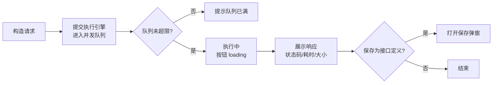

# 软件测试平台——快速调试页

**文档版本**：V1.0  
**日期**：2026-09-23  
**状态**：起草中

---

## 1. 快速调试页

**路由**：`/workspace/projects/api-testing?tab=debug`

### 1.1 页面布局

```
┌──────────────────────────────────────────────────────────────────┐
│  ┌─ 调试标签栏 ────────────────────────────────────────────────┐ │
│  │ [POST 用户登录 ×] [GET 获取用户 ×] [POST 创建订单 ×] [+]    │ │
│  └──────────────────────────────────────────────────────────────┘ │
├──────────────────────────────────┬───────────────────────────────┤
│  请求构造区                      │  响应查看区                    │
│  ┌────────────────────────────┐ │  ┌───────────────────────────┐ │
│  │ [POST ▾] [https://…/api/…]│ │  │ 状态码 [200]  耗时 230ms   │ │
│  │            [发送] [保存]   │ │  │ 大小 1.2KB                │ │
│  └────────────────────────────┘ │  └───────────────────────────┘ │
│  [Params] [Body] [Headers] [Auth]   [环境 ▾]   │  [Body] [Headers] [Cookies] │
│  ┌────────────────────────────┐ │  │  [Pretty|Raw|Preview] ▾JSON │ │
│  │ 请求头（键值对编辑器）       │ │  │  {  data: {  token: ✓    │ │
│  │ 启用│名称│值│描述│操作      │ │  │    "code": 200,           │ │
│  │ [✓]│Content-Type│…││删除   │ │  │    "data": {              │ │
│  │                          │ │  │      "token": "xxx"       │ │
│  │ 认证：[No Auth ▾]          │ │  │    }         （折叠+高亮）  │ │
│  └────────────────────────────┘ │  └───────────────────────────┘ │
│  ── 调试记录 ────────────────── │                               │
│  [搜索记录...]                  │  （URL 栏 [保存]=保存为接口）   │
│  │ 08-17 10:30 POST 登录 200  │  └───────────────────────────┘ │
│  │ 08-17 09:12 GET  用户 404  │                                │
│  │ （行内：重命名/删除）        │                                │
└──────────────────────────────────┴───────────────────────────────┘
```

- 页面顶部为**调试标签栏**：每个标签代表一个独立调试会话，标签显示请求方法图标 + 简短名称，右侧有关闭按钮；末尾 `+` 按钮新建空白标签。
- 标签栏下方为**请求构造区**（左）与**响应查看区**（右），各标签页独立维护自己的请求/响应状态。
- URL 栏右侧提供 **[发送]**（服务端执行）与 **[保存]**（保存为接口定义，见 1.6）；执行模式同为服务端执行（本地执行依赖本地代理客户端，暂缓）。
- 响应查看区结构对齐 Postman：顶部 [Body]/[Headers]/[Cookies] 页签，Body 内 Pretty/Raw/Preview 三态 + 格式类型选择，JSON 语法高亮与折叠（见 1.4）。

### 1.2 标签页管理

| 操作 | 触发方式 | 反馈 |
| ---- | ---- | ---- |
| 新建标签 | 点击标签栏末尾 `[+]` | 新增一个空白标签并自动激活；初始名称为「新建请求」；同时最多 10 个标签 |
| 切换标签 | 点击标签 | 切换到该标签的请求/响应状态；已激活标签高亮，其他标签恢复默认样式 |
| 关闭标签 | 点击标签右侧 `×` | 直接关闭并切换到相邻标签；最后一个标签关闭后自动创建空白标签 |
| 重命名标签 | 双击标签名称 | 标签名称进入编辑态（行内 input），回车或失焦保存；未命名标签在首次执行后自动以「方法 + URL 路径末段」命名 |
| 从接口定义跳转 | 接口列表行内 [调试] | 新建标签并预填该接口的方法、路径、请求头、请求体、Query、认证 |
| cURL 导入 | 在当前标签内导入 cURL | 解析结果填充当前激活标签的请求构造区 |

### 1.3 请求构造

| 操作 | 触发方式 | 反馈 |
| ---- | ---- | ---- |
| 选择方法 | 方法下拉 | GET/POST/PUT/PATCH/DELETE/OPTIONS/HEAD/CONNECT |
| 输入 URL | URL 输入框 | 支持完整 URL（含域名）或相对路径（使用环境默认 base_url 拼接）；输入 `$` 或 `${` 弹出变量自动补全；执行时对无 http/https 前缀且非 `/` 开头的 URL 自动补充 `http://` |
| 保存 | URL 栏 [保存] | 打开「保存为接口定义」弹窗（见 1.6）；未执行（无调试记录）或本地执行结果时按钮置灰并提示「请先发送请求」 |
| 参数页签 | 切换 [Params]/[Body]/[Headers]/[Auth] | 各页签独立编辑，切换保留已填内容；键值对编辑器默认一行空行，行内容输入后自动追加新空行；[Auth] 提供 Bearer Token / API Key 扩展 |
| 环境选择 | 参数页签行最右侧 | 环境下拉（相对路径拼接环境 base_url）+ 提示图标；缺省预选默认环境 |
| 请求体类型 | [Body] 页签 | 类型行：none / x-www-form-urlencoded / raw；x-www-form-urlencoded 为键值对编辑器；选择 raw 时类型行右侧同一行展示子类型选择器（Text/JSON/XML/HTML/JavaScript，缺省选中 JSON），选择 JSON/XML/HTML/JavaScript 子类型时自动注入对应 Content-Type 头（用户已手工设置时不覆盖）；切换类型保留各类型已填内容 |
| 认证配置 | [Auth] 页签 | 类型下拉置顶：No Auth / Bearer Token / API Key / Basic Auth / Digest Auth（Digest 暂不可用置灰）。Bearer Token 填 token；API Key 填 Key 名与值；Basic 填用户名/密码；密码、Token 类输入脱敏展示 |
| 请求头编辑 | [Headers] 页签 | Key 支持常用头名下拉选择与自定义输入；请求头支持描述列 |
| 设置 | URL 栏下方 | 跟随重定向暂缓 |
| 导入 cURL | 点击 [导入 cURL] | 打开 cURL 粘贴弹窗（见 1.5），解析成功后回填当前激活标签的请求构造区 |

### 1.4 执行与响应查看

| 操作 | 触发方式 | 反馈 |
| ---- | ---- | ---- |
| 发送（服务端） | 点击 [发送] | 按钮 loading + 禁用；执行完成展示响应；结果持久化为调试记录 |
| 执行被拒 | 并发队列满 | 弹窗提示「并发队列已满，请稍后重试」（见需求 3.11） |
| 响应页签 | 切换 [Body]/[Headers]/[Cookies] | Body 展示响应体，Headers 展示响应头键值表，Cookies 从响应头 `Set-Cookie` 解析展示（名称/值/属性） |
| Body 视图 | Body 内切换 [Pretty]/[Raw]/[Preview] | Pretty 按格式美化展示（JSON 语法高亮 + 可折叠节点 / 其他按文本）；Raw 展示原始文本；Preview 将 HTML 响应渲染为网页（iframe），其余类型同 Raw |
| 格式类型 | Body 类型下拉 | JSON/XML/HTML/Text/JavaScript，按响应头 Content-Type 自动检测；手动选择仅改变解析/展示方式，不改变实际响应 |
| 搜索响应体 | 搜索按钮或 `Ctrl+F` | 高亮全部匹配并显示 `n/m`；`Ctrl+G`/`Ctrl+Shift+G` 上一个/下一个；再次 `Ctrl+F` 聚焦搜索框 |
| 状态码 | 响应区顶部 | 按成功/失败着色；悬停显示状态码描述 |
| 耗时/大小 | 响应区顶部 | 与状态码同行展示；无分段耗时数据，悬停不展开细粒度（见详细设计 5.1） |
| 复制 | 响应区右上 [复制] | 复制当前视图（Pretty/Raw）响应体文本，成功打勾反馈 |
| 保存为接口定义 | URL 栏 [保存] | 打开保存弹窗（见 1.6）；仅服务端执行结果可保存，未执行/本地执行结果按钮置灰并提示 |

执行流程：



### 1.5 cURL 导入

```
┌──────────────────────────────────────────────┐
│  导入 cURL                                    │
│  ┌────────────────────────────────────────┐  │
│  │  curl -X POST https://staging.example… │  │
│  │  -H 'Content-Type: application/json'   │  │
│  │  -d '{"username":"admin"}'             │  │
│  └────────────────────────────────────────┘  │
│  （粘贴区，支持从 Chrome/Charles/Fiddler 导出）│
│  [取消]                        [解析并填充]   │
└──────────────────────────────────────────────┘
```

| 操作 | 触发方式 | 反馈 |
| ---- | ---- | ---- |
| 粘贴 cURL | 粘贴区粘贴命令 | 支持 Chrome/Charles/Fiddler 导出格式，同时兼容 Windows CMD 复制格式（`^` 续行符与 `^"` 转义引号，解析前自动归一化）；解析在浏览器本地完成，无后端接口 |
| 解析并填充 | 点击 [解析并填充] | 解析 method/URL/headers/body 并回填当前激活标签的请求构造区（见 `docs/04-detailed-design/30-quick-debug.md` 4.2）；解析成功弹窗自动关闭并提示「已回填当前标签」，失败弹窗内提示原因 |
| 安全说明 | 弹窗底部提示 | 「仅解析请求描述，不执行 cURL 命令本身，不执行其中任何脚本或文件引用」（见需求 3.1） |

### 1.6 保存为接口定义

> 入口：URL 栏右侧 [保存] 按钮（仅服务端执行成功、存在调试记录后可用）。

```
┌──────────────────────────────────────────────┐
│  保存为接口定义                                │
│  接口名称  [用户登录                    ]      │
│  归属方式  (●) 新建接口   ( ) 归属已有接口定义  │
│  所属模块  [用户模块 ▾]                       │
│  （归属已有时：接口选择器 [用户登录 ▾]）        │
│  [取消]                          [保存]       │
└──────────────────────────────────────────────┘
```

| 操作 | 触发方式 | 反馈 |
| ---- | ---- | ---- |
| 选择归属方式 | 单选新建/归属已有 | 新建显示所属模块下拉；归属已有显示接口选择器（按模块树浏览） |
| 保存 | 点击 [保存] | 名称必填校验 → 提交；成功 Toast + 提供 [查看接口]，确认后切换到「接口管理」Tab 并内联打开该接口编辑器；名称重复（1000017102）弹窗内提示 |

### 1.7 调试记录管理

历史记录作为页面级固定标签「历史记录」，位于标签栏末尾（`+` 按钮之前），不可关闭。点击标签切换为全宽历史记录视图；再次点击其他调试标签切换回调试视图。

```
标签栏：[用户登录 ×] [获取用户列表 ×] [历史记录] [+]
                                        ^^^^^^^^ 固定标签，不可关闭
```

| 操作 | 触发方式 | 反馈 |
| ---- | ---- | ---- |
| 切换到历史视图 | 点击「历史记录」标签 | 主内容区切换为全宽历史记录视图（搜索 + 按时间分组列表），左侧无模块树，右侧无响应面板 |
| 切换回调试视图 | 点击任意调试标签 | 主内容区恢复为请求构造 + 响应查看双栏布局 |
| 自动保存 | 每次服务端执行完成 | 自动将请求快照与响应结果保存为历史记录，列表顶部新增一条，无需用户操作 |
| 恢复请求 | 点击历史记录条目 | 自动创建新调试标签，回填该次请求的方法、URL、请求头、请求体、认证配置；新标签响应区同时展示该次响应结果；自动切换到新标签 |
| 搜索历史 | 搜索框输入 | 防抖 300ms，按接口名称/路径/方法模糊匹配；搜索框位于视图顶部，全宽展示 |
| 重命名历史 | 行内 [重命名] | 行内输入态，回车保存；自动保存的记录初始名称为「方法 + URL 路径末段」 |
| 删除历史 | 行内 [删除] | 二次确认；删除后不可恢复（错误码 1000017013 时提示记录不存在） |
| 快捷键 | `Ctrl+Shift+H` | 直接切换到「历史记录」标签（已在历史视图时聚焦搜索框） |
| 记录上限 | 超过 200 条时 | 自动淘汰最旧记录，保留最近 200 条 |

历史记录视图布局：

```
┌─────────────────────────────────────────────────────────────┐
│ [用户登录 ×] [获取用户列表 ×] [●历史记录] [+]              │
├─────────────────────────────────────────────────────────────┤
│ [搜索记录... Ctrl+Shift+H                        ]          │
│                                                             │
│ ── 今天 ──                                                  │
│ 10:30  POST  /api/auth/login         200  A  [重命名] [删除]│
│ 09:12  GET   /api/users?pageNo=1       404  A  [重命名] [删除]│
│ ── 昨天 ──                                                  │
│ 18:45  POST  /api/orders             200  A  [重命名] [删除]│
│ 15:20  GET   /api/products           200  A  [重命名] [删除]│
│                                                             │
└─────────────────────────────────────────────────────────────┘
```

### 1.8 页面状态

| 状态 | 表现 |
| ---- | ---- |
| 正常态 | 标签栏 + 请求构造区 + 响应查看区正常渲染；未执行时响应区为空占位「点击发送执行请求」 |
| 空态 | 无调试记录：记录列表展示「暂无调试记录，执行请求后自动保存」；未执行过：响应区引导占位 |
| 加载态 | 发送按钮 loading + 禁用；响应查看区加载中占位；cURL 解析中弹窗 loading |
| 错误态 | 执行失败：响应区展示失败原因（超时/连接失败/4xx/5xx）+ 状态码与耗时；解析失败：弹窗内原因 + [重试]；并发队列满：弹窗提示 |

---


