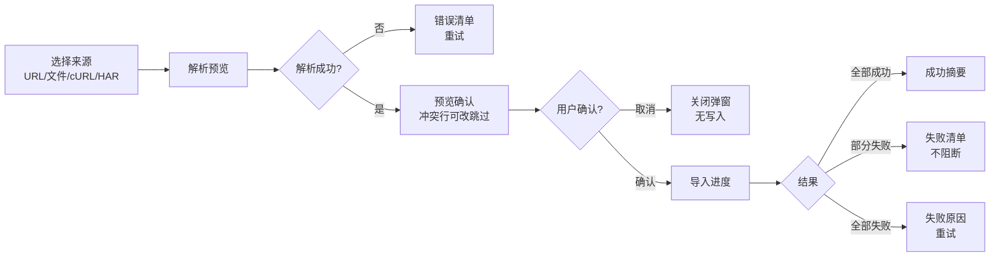

# 软件测试平台——导入功能

**文档版本**：V1.0  
**日期**：2026-09-23  
**状态**：起草中

---

## 3. 导入功能

**入口**：接口管理列表页 [导入] 按钮，打开导入弹窗（宽 720px）。

### 3.1 导入弹窗布局

```
┌──────────────────────────────────────────────────────────────┐
│  导入接口                                                      │
│  [Swagger URL] [cURL]                                        │
├──────────────────────────────────────────────────────────────┤
│  ┌─ Swagger URL ───────────────────────────────────────────┐ │
│  │  文档地址  [https://petstore.example.com/v2/swagger.json]│ │
│  │  （提示：导入策略下仅支持 http/https；`strict` 策略禁止内网地址）   │ │
│  │  [取消]                              [解析预览]           │ │
│  └─────────────────────────────────────────────────────────┘ │
│  ┌─ 预览确认（解析后展示）──────────────────────────────────┐ │
│  │  接口名称      │方法│路径            │操作      │冲突    │ │
│  │  用户登录      │POST│/api/auth/login │[新建]    │        │ │
│  │  用户注册      │POST│/api/auth/reg   │[更新]    │[冲突]  │ │
│  │  获取用户信息  │GET │/api/users/me   │[新建]    │        │ │
│  │  摘要：将新建 8 个 · 更新 3 个 · 跳过 1 个               │ │
│  │  [取消]                              [确认导入]           │ │
│  └─────────────────────────────────────────────────────────┘ │
│  ┌─ 导入进度（确认后展示）──────────────────────────────────┐ │
│  │  ▓▓▓▓▓▓░░░░ 正在导入… 12/16                              │ │
│  └─────────────────────────────────────────────────────────┘ │
└──────────────────────────────────────────────────────────────┘
```

### 3.2 各来源标签页

| 标签页 | 内容与交互 |
| ---- | ---- |
| Swagger URL | 文档地址输入框（格式自动识别 Swagger/OpenAPI，无需选择）；按 `docs/04-detailed-design/01-readme.md` 4.3 的 URL 安全策略校验：默认 `strict` 策略校验协议白名单（仅 http/https）与内网地址黑名单，内网部署切换 `intranet` 策略后放行内网地址但仅接受 swagger 文档特征路径，非法地址即时红字提示；URL 不可达（7012）弹窗内提示 |
| cURL | 多行粘贴区，粘贴 cURL 命令（单条或多条），前端 `curlParser` 解析为接口定义；解析失败条目在预览中标记；解析在浏览器本地完成，无后端解析接口 |

### 3.3 预览确认

| 操作 | 触发方式 | 反馈 |
| ---- | ---- | ---- |
| 解析预览 | 点击 [解析预览] | 弹窗内 loading → 展示预览表格（接口名称、方法、路径、操作、冲突标记）与摘要（新建/更新/跳过数量）；解析失败（7011）弹窗内错误清单 + [重试] |
| 冲突处理 | 预览表格 [冲突] 标记 | 冲突行（path+method 已存在）默认操作 [更新]；行内可改为 [跳过]；冲突行高亮并提示「已存在同名接口，将覆盖更新」 |
| 确认导入 | 点击 [确认导入] | 进入导入进度（见 3.4） |
| 取消 | 点击 [取消] | 直接关闭，不产生任何写入 |

### 3.4 导入进度与结果

| 阶段 | 表现 |
| ---- | ---- |
| 导入中 | 弹窗内进度条 + 文案「正在导入… N/M」；不可关闭弹窗（防误操作） |
| 全部成功 | 自动关闭导入弹窗，Toast 提示「导入完成：新建 12 · 更新 3 · 跳过 1」+ 列表自动刷新 |
| 部分失败 | 结果弹窗：黄色警示 + 摘要 + 失败清单表格（条目名、失败原因），提示「格式不兼容的条目已跳过，不阻断整体导入」（见需求 3.2）；[关闭] 后列表刷新 |
| 全部失败 | 结果弹窗：红色失败图标 + 失败原因 + [重试] |

导入流程：



### 3.5 页面状态

| 状态 | 表现 |
| ---- | ---- |
| 正常态 | 弹窗内当前标签页表单正常渲染；预览表格展示解析结果与冲突标记 |
| 空态 | 文件标签页未选择文件时上传区展示引导文案；cURL 标签页粘贴区为空时 [解析预览] 置灰 |
| 加载态 | 解析预览按钮 loading + 禁用；导入进度条实时更新；URL 拉取中弹窗内 loading |
| 错误态 | URL 不可达（7012）、解析失败（7011）、格式不支持（7010）均弹窗内明确中文提示 + [重试]；文件超限即时红字提示 |

---


