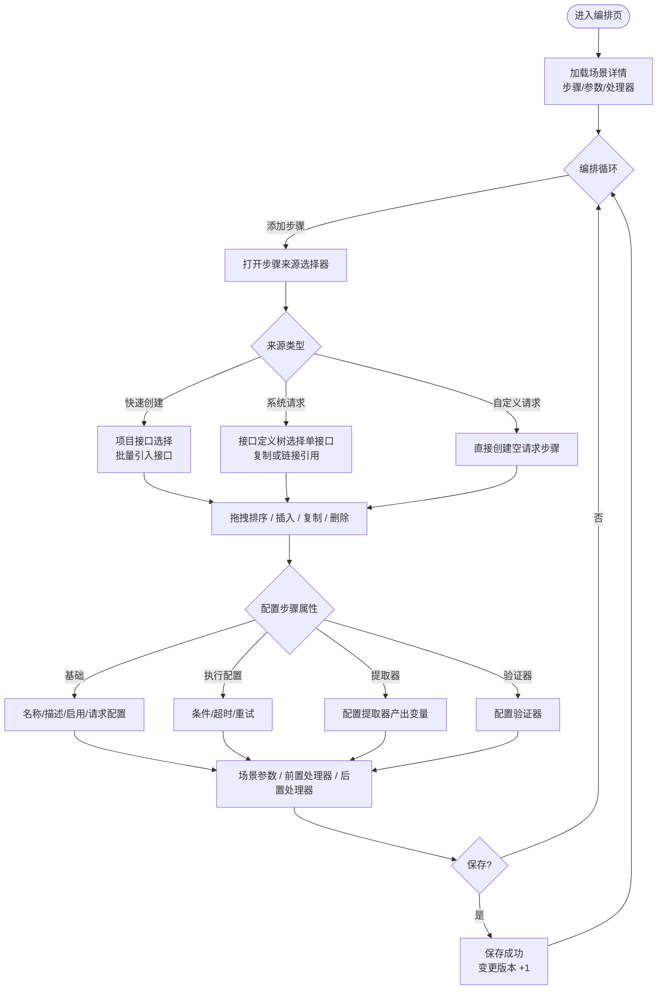

# 软件测试平台——（分册：场景编排页）

**文档版本**：V1.0  
**日期**：2026-09-23  
**状态**：起草中

---

## 3. 场景编排页

**路由**：`/workspace/projects/scenes/:sceneId/edit`

### 3.1 页面布局

布局为**顶部导航栏 + 左右双栏内联编排**（采纳交互原型）：顶部固定导航栏承载场景名徽章、默认环境与全局操作；主体为**左侧步骤卡片列表 + 右侧步骤内联详情面板**，两栏之间为**可拖拽分割条**调整宽度。操作与保存语义见 3.1.3。

```
┌──────────────────────────────────────────────────────────────────────────┐
│  ◀ 返回  │ 场景名徽章 │ 默认环境 [下拉] │ (新建态)[运行 ][保存草稿][创建]   │
│          │            │                │ (编辑态)[运行 ][导入][保存][删除]  │
├──────────────┬─────┬─────────────────────────────────────────────────────┤
│  步骤列表      │ ‖分割│  步骤 #1 详情（内联）                                 │
│  [+ 添加步骤]  │ ‖拖拽│  ─ 基本信息 ──────────────────────────────          │
│  1 [▶] 登录   │ ‖   │  名称 / 启用 / 请求配置（方法·URL）                    │
│  2 [▶] 下单   │ ‖   │  ┌ 前置处理 ┐ ┌ 验证器 ┐ ┌ 后置处理 ┐ ┌ 提取器 ┐         │
│  3 [▶] 清数据  │ ‖   │  （步骤编辑内联于右侧，随选中步骤切换）                 │
│              │ ‖   │                                                   │
│  ── 场景级 ──  │ ‖   │                                                   │
│  场景参数 /    │ ‖   │                                                   │
│  前置 / 后置   │ ‖   │                                                   │
├──────────────┴─────┴─────────────────────────────────────────────────────┤
│  底部状态栏：自动保存已开启 HH:mm:ss     · 未保存修改 N 处                   │
└──────────────────────────────────────────────────────────────────────────┘
```

- **左侧步骤列表**：垂直步骤卡片，支持添加、选中、拖拽排序、插入前、复制、启停、单步调试、删除（见 3.2）。选中卡片后其详情**内联渲染在右侧面板**，随选中步骤切换，不再使用抽屉弹窗。
- **右侧步骤详情面板**：步骤编辑内联于此（见 3.4，标签为 基础/执行配置/变量/验证器/提取器），随选中步骤切换，不再使用抽屉弹窗。
- **顶部导航栏**：左侧 `◀ 返回`；中间场景名徽章；右侧默认环境下拉与全局操作——新建态 `[运行 ] [保存草稿] [创建]`，编辑态 `[运行 ] [导入] [保存] [删除]`。`[创建]`/`[保存]` 使用主色调，`[删除]` 使用危险色并弹二次确认（删除成功返回列表）。关注、复制场景、创建定时任务仍在列表页行内/更多操作提供，但**场景执行入口回归编辑页顶部 [运行 ]**（见 3.6）。
- **优先级**：选项 P0/P1/P2/P3，新建场景缺省 P2；选项带优先级配色徽标（色值引用 `docs/05-interaction-design/03-visual-design.md` 4.2 的 `--color-priority-p*` 变量）。
- **分割条**位于左右两栏之间，可拖拽调整宽度（最小/最大宽度约束，见 3.6 保存时校验保证右栏可见）。
- 编辑态步骤变更走**自动保存**：修改后随焦点转移/步骤切换即时落库，底部状态栏显示「自动保存已开启 HH:mm:ss」；未保存修改累计时显示「未保存修改 N 处」（见 3.6）。

### 3.2 步骤列表操作

| 操作 | 触发方式 | 反馈 |
| ---- | ---- | ---- |
| 添加步骤 | 点击 [+ 添加步骤] | 打开步骤来源选择器（见 3.3），选择后插入到当前选中步骤之后（无选中时追加到末尾），步骤自动编号 |
| 展开/折叠步骤 | 点击卡片标题左侧 [▶]/[▼] | 展开后展示该步骤概要信息（方法、URL/数据源、验证器数、提取器数） |
| 选中步骤 | 点击步骤卡片 | 卡片高亮，右侧面板切换至该步骤的「步骤属性」并回显配置 |
| 编辑步骤属性 | 在右侧内联详情面板修改 | 面板内即时校验；编辑态修改自动保存，底部状态栏显示「自动保存已开启 HH:mm:ss」，未提交修改累计为「未保存修改 N 处」 |
| 排序 | 拖动卡片左侧拖拽手柄 | 拖拽过程中卡片浮起，松开后触发重排序，序号即时重排 |
| 插入步骤 | 卡片悬停浮现 [+ 在之前插入] | 打开步骤来源选择器，插入到该步骤之前 |
| 复制步骤 | 卡片悬停 [复制] | 在该步骤之后插入完全相同的副本（复制模式，与原步骤无关联） |
| 启用/禁用 | 卡片左侧启用开关 | 即时切换；禁用步骤置灰、不参与执行，序号保留 |
| 调试单步骤 | 卡片悬停 [执行] | 仅执行该步骤（使用当前环境配置），下方弹出单步骤执行结果浮层 |
| 删除步骤 | 卡片悬停 [删除] | 二次确认（引用源被删除的链接步骤仅提供此操作）；删除后后续步骤序号前移 |

### 3.3 步骤来源选择器（添加步骤弹窗）

```
┌──────────────────────────────────────────────────────────────┐
│  添加步骤                                                   │
│  ┌──────────┐ ┌──────────┐ ┌──────────┐                        │
│  │ 快速创建  │ │ 系统请求  │ │ 自定义请求│                        │
│  │ 批量引入  │ │ 从接口定义│ │ 手工构造  │                        │
│  └──────────┘ └──────────┘ └──────────┘                        │
│  ┌ 来源列表（随标签切换） ┬ 已选步骤（右侧）───────────────┐     │
│  │ 项目接口列表           │ [✓] 用户接口                  │     │
│  │   ├ 用户接口           │ [✓] 登录接口                  │     │
│  │   └ 登录接口           │                                 │     │
│  └───────────────────────┴─────────────────────────────────┘     │
│  导入模式   (●) 复制  ( ) 链接引用                                │
│  参数策略   [优先当前场景参数 ▾]                                  │
│  环境策略   [使用当前环境 ▾]                                     │
│  [取消]                                              [添加]      │
└──────────────────────────────────────────────────────────────┘
```

| 操作 | 触发方式 | 反馈 |
| ---- | ---- | ---- |
| 选择来源类型 | 切换顶部三个来源标签 | 「快速创建」展示项目接口列表，勾选后一键引入接口定义（批量创建）；「系统请求」展示接口定义树，勾选单个接口**仅导入该接口本身为一个步骤**；「自定义请求」隐藏选择器，确认后直接创建空请求步骤 |
| 勾选接口/步骤 | 勾选条目 | 实时回显到右侧已选列表，支持批量多选 |
| 选择导入模式 | 单选复制/链接引用 | 链接引用提示「步骤内容将跟随源更新，可独立调整启用状态与参数值」 |
| 选择参数策略 | [优先当前场景参数 ▾] | 下拉选项：优先当前场景参数 / 优先原接口参数 |
| 选择环境策略 | [使用当前环境 ▾] | 下拉选项：使用当前环境 / 使用原接口环境 |
| 添加 | 点击 [添加] | 关闭弹窗，按序插入步骤卡片；「快速创建」插入接口步骤并提示「已添加 N 个步骤」；链接引用步骤卡片带「链」标识，复制步骤无标识 |
| 链接引用源被删除 | 运行时检测 | 步骤置灰并标注「源已删除，使用快照」，仅保留 [移除] 操作（见 `docs/04-detailed-design/01-readme.md` 4.5） |

### 3.4 步骤属性面板

**基础标签**：

| 项 | 交互 |
| ---- | ---- |
| 步骤名称 | 输入框，必填，≤200 字符，失焦校验非空 |
| 步骤描述 | 多行输入框 |
| 类型与来源 | 只读标识：[http]/[jdbc]、[系统请求]/[自定义]/[复制]/[链接引用]；链接引用提供 [查看源] 跳转 |
| 启用开关 | 单步骤启用/禁用 |
| 请求配置区 | 按步骤类型渲染：http 显示方法、URL（支持变量引用）、请求头、Query、REST 参数、请求体、认证（No/Basic/Digest）；jdbc 显示数据源下拉 + SQL 编辑区 + 查询类型。链接引用步骤请求配置只读展示源内容 |

**执行配置标签**：

| 项 | 交互 |
| ---- | ---- |
| 条件表达式 | 输入框，为空表示总是执行；支持变量与内置函数，提供表达式帮助 |
| 请求超时（毫秒） | 数字输入，留空继承环境默认值 |
| 失败重试次数 | 数字输入 0–10，默认 0 |
| 失败规则 | 不再提供请求级/场景级失败规则配置；场景执行语义固定为「停止运行」（任一步骤失败即终止后续步骤） |

**变量标签**（步骤级变量编辑器）：

| 项 | 交互 |
| ---- | ---- |
| 变量列表 | 表格：变量名、值（支持变量引用与内置函数）、来源（手动/从接口导入）、描述；行内编辑/删除，支持排序 |
| 添加变量 | [+ 添加变量] 打开配置表单（变量名必填、值、描述），确认后加入列表 |
| 从接口导入 | [从接口导入] 打开接口变量选择器，勾选后按合并策略导入（保留已有手动变量），导入项带「接口」来源标识 |
| 提示 | 步骤级变量解析优先级高于场景参数（见 1.3） |

**提取器标签**：

| 项 | 交互 |
| ---- | ---- |
| 提取器列表 | 表格：类型（JSONPath/XPath/正则/边界/响应头/整响应/Groovy 脚本）、表达式、目标变量名、描述；行内编辑/删除 |
| 添加提取器 | [+ 添加提取器] 打开配置表单，类型切换联动表达式输入提示 |
| 从全局资产引入 | [从全局资产引入] 打开资产选择器，勾选后以**复制**方式引入（见需求 3.8） |

**验证器标签**：

| 项 | 交互 |
| ---- | ---- |
| 验证器列表 | 行卡片列表：启用开关 + 验证目标下拉（占位符）+ 比较条件下拉（占位符）+ 表达式输入 + 期望值输入 + 行内 [删除]；Tab 标签显示有效条数徽标 |
| 添加验证器 | [+ 添加验证器] 新建空行（开关默认开启），填写即生效 |
| 从全局资产引入 | [从全局资产引入] 打开资产选择器，勾选后以**复制**方式引入（见需求 3.9） |

### 3.5 场景级配置（左侧面板标签）

**场景参数标签**：

```
┌──────────────────────────────────────────────┐
│  场景参数                        [+ 添加参数] │
│  参数名       │值            │描述     │操作  │
│  username    │admin         │测试用户名│…    │
│  password    │${env:TEST_…} │密码     │…    │
│  （参数值支持变量引用与内置函数，如 ${random}│
│  、${timestamp()}，见 `docs/05-interaction-design/01-readme.md` 第 3 章引用帮助）│
└──────────────────────────────────────────────┘
```

- 场景参数即步骤间变量传递的数据源，`${参数名}` 引用；
- 默认环境为执行时预选环境，与列表页快速执行共享。

**前置处理器标签 / 后置处理器标签**：两个独立标签页，分别配置场景级前置处理器与后置处理器（数据模型共享 `type` 为 `pre`/`post` 的同一处理器列表，页面按类型拆分展示）。每条处理器含类型（http/jdbc）、名称、脚本配置摘要、启用开关；支持新增、编辑、删除、排序、从全局资产复制引入。http 处理器的 ref 下拉与 jdbc 数据源下拉均取**场景关联环境**（场景所选环境）的 http 配置 / 数据源；未选环境时下拉为空并提示先选择环境。处理器经右下角 `[保存处理器]` 提交（同场景变量标签的聚焦保存语义，不参与基础信息脏检查）。

### 3.6 保存、保存草稿与删除

| 操作 | 触发方式 | 反馈 |
| ---- | ---- | ---- |
| 编辑态自动保存 | 步骤/场景级配置修改后（焦点转移、切换步骤、切换标签即触发） | 即时落库；底部状态栏「自动保存已开启 HH:mm:ss」；乐观锁冲突（409）提示「场景已被他人修改，请刷新后重试」；累计未提交修改时显示「未保存修改 N 处」 |
| 手动保存 | 点击 [保存]（编辑态） | 全量校验（步骤名称非空、请求配置完整）→ 提交；成功 Toast + 状态栏「已保存 HH:mm:ss」 |
| 保存草稿 | 点击 [保存草稿]（新建态） | 仅将编排内容（步骤/场景参数/处理器）落为草稿，不发布场景；底部状态栏「草稿已保存 HH:mm:ss」 |
| 创建 | 点击 [创建]（新建态） | 全量校验 → 一次性创建；创建态未保存前步骤/参数以**本地草稿**形式编排，可先 `[运行 ]` 场景级校验（走草稿执行），确认后 [创建] 一并落库 |
| 删除 | 点击 [删除]（编辑态） | 二次确认「删除场景后不可恢复」→ 提交删除 → 返回列表；被定时任务引用时提示无法删除 |

- **场景执行入口回归编辑页顶部 [运行 ]**（采纳交互原型）：编辑态 `[运行 ]` 以当前页面实时配置触发场景执行（可变参数优先取页面当前值）；新建态未保存时 `[运行 ]` 走草稿执行，仅校验步骤、不落库、不产生执行记录。场景执行失败语义固定为「停止运行」：任一步骤失败，后续步骤不再执行并在报告中标记未执行（不再提供失败规则配置）。
- 关注、复制场景、创建定时任务仍在列表页行内/更多操作提供（见 2.x）；编辑页不再提供这些入口，但提供 [导入]（见 2.6 导入入口）以补充步骤到当前场景。
- 新建态可在创建前直接编排与试运行：步骤、场景变量、前置/后置处理器在创建页即可构建本地草稿，点击 [保存草稿] 落草稿、点击 [创建] 时随场景基础信息一同提交并正式落库。

### 3.7 步骤编排流程



### 3.8 页面状态

| 状态 | 表现 |
| ---- | ---- |
| 正常态 | 步骤卡片、属性面板、场景级标签正常渲染；底部状态栏实时显示步骤数与未保存标记 |
| 空态 | 场景无步骤：步骤列表区展示引导插图 + 「暂无步骤，点击上方添加步骤」；属性面板为空占位 |
| 加载态 | 进入页面整体骨架屏；保存/删除按钮 loading + 禁用；链接引用步骤刷新源时卡片角标加载动画 |
| 错误态 | 详情加载失败：全屏错误占位 + [重试]；保存失败：Toast 明确原因（校验错误定位首个错误项红字、乐观锁冲突 409） |

---


