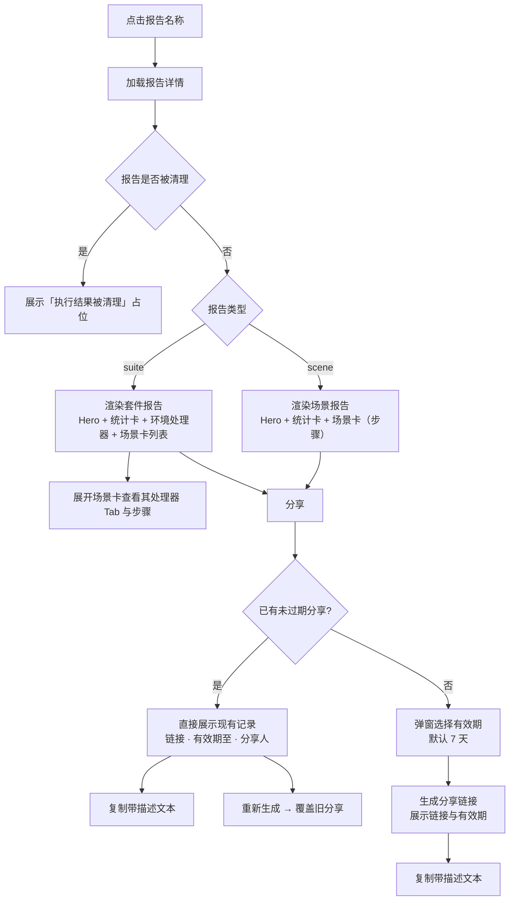

# 软件测试平台——（分册：报告详情页）

**文档版本**：V1.0  
**日期**：2026-09-23  
**状态**：起草中

> 本分册由《》按功能模块拆分而来。前言、引言、数据设计与公共约定见总览分册 `40-report-ui-overview.md`；原章节编号保持不变，分册-章节对照见总览分册。

---

### 2.2 报告详情页

**路由**：`/workspace/projects/reports/:id`

**页面结构（顶层往下）**：

```
┌──────────────────────────────────────────────────────────────┐
│  ╔═══ 顶部概览（渐变淡绿 Hero）════════════════ [分享] [关闭] ═╗ │
│  ║  登录流程-08-17  [✓ 执行成功]  [平台内执行]              ║ │
│  ║  环境：测试环境 · 执行时间：2026-08-17 10:30:00           ║ │
│  ║  总耗时：1.2 s · 场景 ID：xxxxxxxxxxxx                    ║ │
│  ╚══════════════════════════════════════════════════════════╝ │
├──────────────────────────────────────────────────────────────┤
│  执行概览（5 项统计卡）                                       │
│  ┌──────┐ ┌──────┐ ┌──────┐ ┌──────┐ ┌──────┐                │
│  │总步骤 │ │通过  │ │失败  │ │通过率 │ │总耗时 │                │
│  │  6   │ │ 6    │ │ 0    │ │100%  │ │1.2s  │                │
│  └──────┘ └──────┘ └──────┘ └──────┘ └──────┘                │
├──────────────────────────────────────────────────────────────┤
│  ▼ 场景卡（默认折叠）：登录流程  [通过]                       │
│    ID xxx · 执行时间 10:30:00     步骤6 通过6 失败0 耗时1.2s  │
│  ├─ 场景处理器 Tab：场景前置(1) / 场景后置(0)                 │
│  │    ▸ 处理器卡：HTTP 前置处理器 [GET] [成功]  请求URL        │
│  │      ↕ 折叠：请求头表 / Query / 响应体 / 提取器表          │
│  ├─ 测试步骤（6）  [全部展开/收起]                            │
│  │    ▸ 步骤卡（details）：1 登录  POST /login [通过] 320ms   │
│  │      ↕ 展开：请求块 / 响应块 / 验证器表 / 提取器表           │
└──────────────────────────────────────────────────────────────┘
```

**套件报告详情（两级）**：套件报告详情页的顶部概览与执行概览展示**套件级信息**（场景口径），正文为「环境处理器 Tab → 场景卡列表 → 场景步骤」，多场景自上而下平铺：

```
┌──────────────────────────────────────────────────────────────┐
│  ╔═══ 顶部概览（渐变淡绿）════════════════════ [分享] [关闭] ═══╗ │
│  ║  每日回归-08-17  [✗ 执行失败]  [定时任务]                ║ │
│  ║  环境：测试环境 · 触发时间：2026-08-17 02:00:00           ║ │
│  ║  总耗时：15.8 s · Task ID：xxxxxxxxxxxx                   ║ │
│  ╚══════════════════════════════════════════════════════════╝ │
│  执行概览：场景总数3 通过场景2 失败场景1 通过率66.7% 总耗时15.8s│
├──────────────────────────────────────────────────────────────┤
│  环境处理器（卡片）：任务前置(1) / 任务后置(1)                │
│  ▸ 处理器卡（同上，可折叠，展示提取器结果）                    │
├──────────────────────────────────────────────────────────────┤
│  场景卡 1：登录流程 [通过]  步骤6/通过6/失败0  1.2s  ▼ 折叠   │
│  ├─ 场景处理器 Tab → 步骤卡（与场景报告一致）                 │
│  场景卡 2：下单流程 [失败]  步骤3/通过2/失败1  1.8s  ▸ 展开    │
│  ├─ 场景处理器 Tab → 步骤卡                                   │
└──────────────────────────────────────────────────────────────┘
```

**报告详情流程**：



**顶部概览（Hero）**：

| 元素 | 内容 |
| ---- | ---- |
| 背景 | 渐变淡绿卡片，圆角 + 轻投影，与正文卡片层级区分 |
| 标题 | 报告名称（场景报告：场景名+时间戳；套件报告：任务名+时间戳） |
| 状态章 | 白底绿色发现章「✓ 执行成功 / ✗ 执行失败」，随报告状态变化 |
| 来源章 | 浅绿透明「定时任务 / 平台内执行」，取自套件 source 或执行方式 |
| 元信息 | 环境、执行/触发时间、总耗时、场景 ID / Task ID（等宽） |

**执行概览（统计卡，无头部栏，5 项）**：

| 卡片 | 口径 | 内容 |
| ---- | ---- | ---- |
| 场景报告 | 步骤口径 | 总步骤、通过、失败、通过率、总耗时 |
| 套件报告（未定位单场景） | 场景口径 | 场景总数、通过场景、失败场景、通过率、总耗时 |
| 套件定位单场景 | 步骤口径 | 同场景报告 |

每项统计卡左缘竖色条与数字同色（通过=绿、失败=红、中性=品牌绿/灰）。

**处理器 Tab**（环境级/场景级复用）：

| 元素 | 内容 |
| ---- | ---- |
| Tab 条 | 前置 / 后置，标签含数量角标（mono）与状态圆点（绿=成功、红=失败、灰=跳过/空） |
| 执行顺序提示 | 弱化等宽小字提示链路「任务前置 → 场景前置 → 步骤 → 场景后置 → 任务后置」，当前层级加粗，仅层级存在时展示 |
| 处理器卡 | 名称 + 方法 chip（GET/POST/PUT/DELETE）+ 状态徽标（成功/失败）+ 收起/展开章；折叠区含：请求头 kv 表格、Query/请求体/响应体（格式化 code）、提取器表格（引用名/字段/提取值/默认值/结果） |

**步骤卡**（details 折叠）：

| 区域 | 内容 |
| ---- | ---- |
| 头部摘要 | 序号、步骤名称、方法 chip、状态徽标、耗时；有验证器时附验证器数（失败红） |
| 请求块 | 第一行：方法 chip + URL；请求头 kv 表格、Query 参数、请求体（格式化 code），仅展示存在的数据 |
| 响应块 | 第一行：状态码 chip + 「HTTP/1.1 · Content-Type · 耗时」；响应体（格式化 code）、响应头 kv 表格 |
| 验证器表 | 字段、规则、期望值、实际值、结果（通过/失败），失败项红色高亮，含解析失败按失败处理 |
| 提取器表 | 引用名（品牌绿等宽）、字段、提取值、默认值、结果 |
| 错误信息 | 步骤 errorMessage 为非空时在区块末尾红色告警展示 |

**交互说明**：

| 操作 | 触发方式 | 反馈 |
| ---- | ---- | ---- |
| 进入详情 | 列表页点击报告名称 | 加载详情，按报告类型渲染，顶部展示 Hero 概览 |
| 展开/收起场景卡 | 点击场景卡头部 | 卡片整体收起/展开，章旋转；展开后展示处理器 Tab 与步骤区 |
| 切换处理器 Tab | 点击「场景前置/后置」Tab | 按当前层级展示对应处理器明细 |
| 折叠处理器卡 | 点击卡内折叠章 | 卡体折叠/展开（默认折叠） |
| 展开/收起步骤 | 点击步骤卡头部 | 展开请求块/响应块/验证器表/提取器表 |
| 全部展开/收起步骤 | 点击「全部展开/收起」 | 一次性展开/收起当前场景下所有步骤卡，按钮文字随状态切换 |
| 分享报告 | 点击 Hero 右上角 [分享] | 弹窗打开时：**已有未过期分享** → 直接展示现有记录（分享链接、有效期至、分享人）+ [复制]（复制内容为带描述文本：报告名称/分享链接/有效期至/分享人）；**无/已过期** → 两步式：弹窗选择有效期（默认 7 天，选项 1 / 7 / 30 / 90 天）→ [生成链接] → 同弹窗展示分享链接与「有效期至」，[复制链接] 一键复制。可 [重新生成] 覆盖旧分享（参照邀请链接创建流程，无全局开关） |
| 关闭报告 | 点击 Hero 右上角 [关闭] | 返回报告列表页 |
| 查看被清理报告 | 进入已清理报告 | 详情区展示「执行结果被清理」占位，保留报告元数据 |

> **复制内容**：[复制] 写入剪贴板的为带描述文本，包含报告名称、分享链接（完整 URL）、有效期至、分享人：

> ```
【测试报告分享】
报告名称：{报告名称}
分享链接：{完整 URL}
有效期至：{share_expires_at 本地时间}
分享人：{分享者}
```

**状态分支**：

| 状态 | 表现 |
| ---- | ---- |
| 正常态 | Hero + 执行概览 + 处理卡 + 场景卡完整展示 |
| 空态 | 报告无步骤数据：步骤区显示「无步骤数据」占位；报告被清理：展示「执行结果被清理」占位 |
| 加载态 | 详情骨架屏；场景卡内步骤区局部加载 |
| 错误态 | 加载失败：错误提示 + [重试]；分享生成失败：Toast 展示原因；报告不存在（已删除）：404 提示「报告不存在或已被删除」 |
| 权限不足 | 非执行者本人且非项目维护者：403 页面「无权限访问该报告」 |


