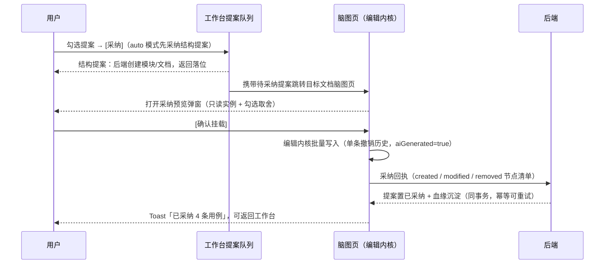

# 软件测试平台——AI 生成用例

**文档版本**：V1.0  
**日期**：2026-09-23  
**状态**：起草中

---

## 1. 用例设计阶段作业（US-AI-001）

**入口**：需求工作流条目工作台——条目推进到「用例设计 design」阶段时自动发起推进作业，或作业卡 [运行作业] 手动发起/重跑（交互见 `docs/05-interaction-design/52-ai-case-ui-pool.md` 1.3.2 / 1.3.3）；作业为异步任务，固定系统默认模型、不提供对话模型选择器。

### 1.1 发起作业弹窗

[运行作业]（或同类型作业已终态时的 [重跑作业]）打开落位选择弹窗（居中模态）：

```
┌──────────────────────────────────────────────────┐
│  ✨ 用例设计作业                             [×]  │
├──────────────────────────────────────────────────┤
│  落位方式                                        │
│  ◉ AI 自主规划模块与文档（采纳时确认落位）        │
│  ○ 指定已有用例文档  [选择文档…]                  │
│  ──────────────────────────────────────────────  │
│  附加需求文本（可选，仅本次作业使用，不入池）      │
│  [本次生成重点关注退款分支…            12/20000]  │
│                                                  │
│                          [取消] [开始生成]       │
└──────────────────────────────────────────────────┘
```

| 操作 | 触发方式 | 反馈 |
| ---- | ---- | ---- |
| 选择落位 | 单选 AI 自主 / 指定文档 | 选「指定文档」时 [选择文档…] 必选（项目用例文档选择器）；未选时 [开始生成] 置灰并内联提示 |
| 附加文本 | 粘贴补充需求 | 右下角实时 `n/20000` 计数，超限禁用 [开始生成] |
| 发起 | 点击 [开始生成] 或 `Ctrl/Cmd + Enter` | 校验通过 → 创建作业 → 弹窗关闭，工作台作业卡出现（进行中进度条 + [取消]）；同类型作业进行中时入口本就不可用（提示「已有进行中作业」） |
| AI 不可用 | 发起前 AI 关闭 | [开始生成] 禁用并悬浮提示「AI 不可用」 |

### 1.2 作业进行中

- 作业状态经工作台作业卡 **2 秒轮询**，终态停止；离开工作台/页面不中断，返回后依据任务状态恢复展示（任务状态即真相源）；
- [取消] 中断任务（已产出不保留）；失败展示原因 + [重试]；
- 作业成功 → 结果**同事务物化为提案**进入提案队列（结构 / 用例 / 澄清提案，同批次旧未处置提案被替代）；作业成功**不等于落库**——成功仅产出提案，采纳才写入文档。

### 1.3 提案采纳与挂载

勾选用例/结构提案 → [采纳]（单条）或 [批量采纳] → 打开**提案预览弹窗**（居中模态、置顶，宽 70% × 高 80% 视口）：

```
┌────────────────────────────────────────────────┐
│  ✨ 用例提案预览（4 条）                    ✕   │
├────────────────────────────────────────────────┤
│  ┌──────────────────────────────────────────┐  │
│  │  脑图（提案节点树，只读渲染）             │  │
│  │  ☑ 用例B [P0] [AI]  ← 修改自既有用例     │  │
│  │    前置条件… 步骤… 预期…（随用例级联）     │  │
│  │  ☑ 用例C [P1] [AI]  ← 新增               │  │
│  │  ☑ 用例D [AI]       ← 疑似失效（可勾除）  │  │
│  └──────────────────────────────────────────┘  │
│  已勾选 3/4 个用例      [关闭] [确认挂载]       │
└────────────────────────────────────────────────┘
```



| 操作 | 触发方式 | 反馈 |
| ---- | ---- | ---- |
| 勾选取舍 | 预览弹窗内点击勾选框 | **仅用例节点**带勾选框（☑ 默认勾选），前置/步骤/预期无勾选框、随所属用例级联（取消用例整组排除，恢复整组恢复）；疑似失效（stale）用例默认勾选，勾除即放弃删除 |
| 确认挂载 | 点击 [确认挂载] | 校验目标存在 → 经编辑内核批量写入（新增 = 创建、修改 = 更新既有节点、失效 = 删除既有节点，整批单条撤销历史）→ 提交采纳回执 → Toast 成功 → 关闭弹窗（可返回工作台继续处置剩余提案） |
| 目标根节点已被协同删除 | 确认时校验失败 | 提示「挂载目标已被删除，请重新选择」→ 弹出节点选择器重选，**不丢弃预览结果**，回执按新文档提交 |
| 回执失败 | 网络/并发错误 | 挂载**不回滚**（节点保留），Toast 提示重试；重复提交回执幂等（已采纳提案自动跳过并计数） |
| 关闭预览弹窗 | 遮罩 / ✕ / Esc | 仅关闭弹窗，提案保持待处置，可再次 [采纳] 打开 |
| 评审方案 / 计划方案提案 | 不适用本链路 | 在提案弹窗内表单编辑确认后由后端直接创建实例（`docs/05-interaction-design/52-ai-case-ui-pool.md` 1.3.3），不跳转、不挂载 |

- **预览纯本地**：预览树为前端本地快照（仅提案内容，文档既有数据不并入），不写编辑内核、不产生撤销历史、不广播、不落库；勾选状态随弹窗销毁丢弃；
- **自动标记与徽标**：挂载节点自动完成类型标记（用例/前置条件/执行步骤/预期结果）与优先级标记，携带「AI」徽标，无需手工标记；挂载走既有编辑通道，协同用户实时可见、整体可撤销。

### 1.4 状态分支

- **作业失败**：作业卡展示失败原因 + [重试]，提案区保持原状；结构校验失败给出可读的输出不合规提示；
- **AI 不可用**：[运行作业] 禁用（提示「AI 不可用」），已有提案仍可采纳；
- **落位文档被删**：结构提案采纳时后端按常规文档创建通道处理（复用既有模块/文档），指定文档模式作业发起时校验归属，失效文档需重新选择；
- **提案被他人先处置**：回执返回提案状态非法 Toast，队列自动刷新；
- **全部提案处置完毕**：提案队列呈空态，出口证据满足后 [推进] 亮起进入下一阶段。

---

## 修改记录

| 版本 | 日期 | 说明 |
| --- | --- | --- |
| V1.0 | 2026-09-29 | 补建修改记录：抽屉改为头部 → 内容区（整体滚动）→ 底部常驻操作行（阶段文案+已耗时、进行中徽标、关闭后台继续提示），必填校验内联红字、完成态结果卡片列表、会话恢复标识与 [新会话]、需求池计数与 [清空]、字数计数、挂载路径省略悬浮、Ctrl/Cmd+Enter 与焦点管理、尺寸可拖拽、Esc 关闭 |
| V1.0 | 2026-09-29 | 入口改为工具栏 ✨ 纯图标按钮，悬浮提示「AI 生成用例」 |
| V1.0 | 2026-09-29 | 操作行落位回调需求输入区正下方、右对齐随内容滚动（输出区随其后），不再吸底 |
| V1.0 | 2026-09-29 | 需求池标签收敛：标题超 5 字截断 + 悬浮完整标题，已选超 4 条仅平铺前 4 条并追加「+N」溢出指示 |
| V1.0 | 2026-09-30 | AI 生成用例完成态结果改为卡片样式（标题 + 优先级标签 + 步骤摘要，参考遗漏分析结果展示，只读无勾选框） |
| V1.0 | 2026-10-01 | 生成改为需求工作流用例设计阶段作业：脑图工具栏生成入口下线，SSE 生成抽屉改为发起作业弹窗 + 异步轮询，产出改为提案，本分册改为提案预览-采纳-挂载-回执链路 |

---
