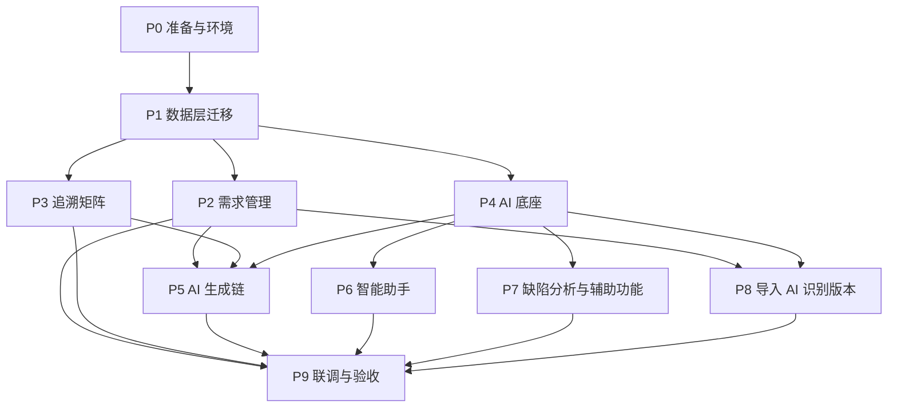

# 软件测试平台——AI 需求工作流开发方案与计划

**文档版本**：V1.0
**日期**：2026-10-03
**状态**：起草中

---

## 1. 引言

### 1.1 编写目的

将「需求管理 → AI 生成 → 追溯闭环 + 智能助手 + 缺陷分析 + 辅助功能」的文档链（需求、概要、详细、交互）转化为可执行的开发方案与阶段计划：明确总体实施策略、模块依赖与实施顺序、工作包清单、交付批次与验收门禁，作为开发排期、PR 审查与人工验收的共同依据。

### 1.2 范围

本计划覆盖以下交付内容：

1. **需求管理**：需求 CRUD、导入（Markdown / Word / 图片 ≤20MB）、拆分、属性与版本变更、变更记录；
2. **追溯矩阵**：追溯关系维护、覆盖率统计、影响分析及其页面；
3. **AI 底座**：AI 配置中心（模型、向量 API、场景提示词、用量、总开关）、AI 任务框架、向量与 RAG、重建引导；
4. **AI 场景**：生成链（六阶段）、智能助手、缺陷分析、辅助功能、导入 AI 识别文档级版本；
5. **横切内容**：全局导航与菜单注册、权限点接入、任务中心与任务详情、视觉规范落地。

不覆盖：本计划不描述功能行为、表结构、接口报文与页面交互细节，它们分别以需求、详细设计、交互设计文档为准。

**计划外独立任务登记——文件管理模块改造**：引入对象存储、设计泛化附件资源（不挂工作空间 / 项目，使用方以访问 URL 关联）与文件管理模块，并以 docker-compose 全家桶发行；统一覆盖需求导入源文件的存储与回看下载、需求详情（含图片）、既有缺陷附件与缺陷详情（含图片）的迁移改造。该任务随批次二实施（见 WP-2.0），其落地前需求导入（WP-2.2）与导入 AI 识别（WP-8.1）的端到端环节不验收。

### 1.3 基线文档

| 层 | 文档 | 用途 |
| ---- | ---- | ---- |
| 需求 | `docs/01-requirements/06-requirement-management/02-srs-requirement-management.md` | 需求管理功能行为与验收口径 |
| 需求 | `docs/01-requirements/07-ai-capability/02-srs-ai-capability.md` | AI 能力总册（底座与公共口径） |
| 需求 | `docs/01-requirements/07-ai-capability/03-srs-ai-generation.md` | 生成链需求 |
| 需求 | `docs/01-requirements/07-ai-capability/04-srs-ai-assistant.md` | 智能助手需求 |
| 需求 | `docs/01-requirements/07-ai-capability/05-srs-ai-defect-analysis.md` | 缺陷分析需求 |
| 需求 | `docs/01-requirements/07-ai-capability/06-srs-ai-assisted-features.md` | 辅助功能需求 |
| 概要 | `docs/02-high-level-design/06-requirement-management/02-hld-requirement-management.md` | 需求管理模块划分与数据概要 |
| 概要 | `docs/02-high-level-design/07-ai-capability/02-hld-ai-capability.md` | AI 能力模块划分与机制概要 |
| 概要 | `docs/02-high-level-design/04-hld-data-interface.md` | 数据与接口概要 |
| 详细 | `docs/04-detailed-design/06-requirement-management/02-requirement-management.md` | 需求管理 DDL 与接口 |
| 详细 | `docs/04-detailed-design/05-trace-matrix.md` | 追溯矩阵 DDL 与接口 |
| 详细 | `docs/04-detailed-design/07-ai-capability/02-ai-infra-overview.md` | AI 底座 DDL、任务框架与公共协议 |
| 详细 | `docs/04-detailed-design/07-ai-capability/03-ai-generation.md` | 生成链编排与接口 |
| 详细 | `docs/04-detailed-design/07-ai-capability/04-ai-assistant.md` | 助手会话、SSE 与确认执行 |
| 详细 | `docs/04-detailed-design/07-ai-capability/05-ai-defect-analysis.md` | 缺陷分析接口 |
| 详细 | `docs/04-detailed-design/07-ai-capability/06-ai-assisted-features.md` | 辅助功能接口 |
| 交互 | `docs/05-interaction-design/06-requirement-management/02-requirement-ui.md` | 需求管理页面行为 |
| 交互 | `docs/05-interaction-design/04-trace-matrix-ui.md` | 追溯矩阵页面行为 |
| 交互 | `docs/05-interaction-design/07-ai-capability/01-readme.md` | AI 能力交互分册入口 |
| 交互 | `docs/05-interaction-design/02-global-navigation.md` | 全局导航、菜单与助手入口 |
| 交互 | `docs/05-interaction-design/03-visual-design.md` | 视觉与 CSS 变量唯一来源 |

### 1.4 定义与缩写

| 术语 | 定义 |
| ---- | ---- |
| 生成链 | 需求到用例与追溯的六阶段 AI 生成：解析需求 → 生成模块结构 → 生成脑图文档 → 标记用例节点 → 填充用例属性 → 建立追溯边 |
| AI 底座 | 模型配置、任务框架、向量与 RAG、提示词与用量等平台级 AI 基础能力 |
| 阶段 / 工作包 | 计划的两级实施单元，编号分别为 P* 与 WP-*；本文只描述阶段与依赖，不排期、不给人天 |
| 交付批次 | 面向验收与合入的分组，一批对应一个可独立验收的范围 |
| SSE | Server-Sent Events，助手流式输出协议（唯一定义处为助手详细设计） |

## 2. 开发方案

### 2.1 总体实施策略

1. **文档驱动**：实现严格以 1.3 基线文档为唯一依据；发现实现与文档冲突时暂停，先由用户确认以哪边为准，再改文档或改代码，禁止静默偏离。
2. **数据先行、底座先行**：先交付数据库迁移（DDL 与索引），再做后端接口，最后按交互稿做前端；AI 场景功能统一排在 AI 底座之后。
3. **后端先行于前端**：接口经 springdoc 暴露 OpenAPI 后，前端按契约并行开发；API 变更先后端后前端。
4. **生成物人工确认**：所有 AI 生成物走「预览 → 人工确认 → 生效」，确认前不落业务数据。
5. **供给可配置、不锁定**：LLM 与向量供给经配置中心自由配置，代码中不硬编码任何供应商；开发环境准备至少一个兼容端点用于联调。
6. **提交粒度**：一个提交只做一件事（C7），前后端变更分属不同提交，严格目录隔离（只改本端目录）。

### 2.2 分支与协作

- **分支模型**：`master` ← `develop` ← `feature/*`（总则 `docs/00-spec/30-quality-delivery/02-workflow.md` 第 1 章）；当前工作分支 `feature/requirement-ai-workflow`，批次收口后向 `develop` 发 PR，不在本地直接合入。
- **提交规范**：`<emoji> <type>(<scope>): <description>`，scope 按业务域（如 `requirement`、`trace`、`ai`、`task`）。
- **门禁**：提交前运行本端验证脚本至 EXIT=0（文档端 `bash scripts/validate-docs.sh`，前端 / 后端各自脚本），覆盖率满足 C8。
- **跨端同步**：接口经 OpenAPI 分组同步（AI 相关分组 `ai`）；实时消息遵循 `docs/00-spec/20-contracts/03-realtime-protocol.md` 与 `docs/04-detailed-design/03-realtime-websocket.md`。

### 2.3 模块依赖与实施顺序

### 2.4 技术实施要点

按模块列出实施要点；细节一律以对应基线文档为准，本文不重复定义。

#### 2.4.1 数据层与迁移

- PostgreSQL 14+；需求表族、追溯表、AI 表族（任务、产物、会话消息、提示词、用量）DDL 见 `docs/04-detailed-design/06-requirement-management/02-requirement-management.md`、`docs/04-detailed-design/05-trace-matrix.md`、`docs/04-detailed-design/07-ai-capability/02-ai-infra-overview.md`；
- 符合 C5（`id` / `created_at` / `updated_at` / `is_deleted`、UUID 框架默认策略、无物理外键）与 C9（索引规范）；迁移说明随首个涉及数据库的提交交付；
- 向量依赖 pgvector 扩展，扩展可用性属环境前置（见 2.5）。

#### 2.4.2 需求管理

- 树形与列表 CRUD、拆分、属性变更（含自由文本版本字段）与变更记录；数据更新只更新传入字段（C11）；
- 导入支持 Markdown / Word / 图片，单文件 ≤20MB，超限明确拒绝；
- 业务异常统一 `ServiceExceptionUtil.get(ErrorCode)` 10 位错误码（C3）；工作空间 / 项目上下文经请求头传递，不出现在 URL（C4）；
- 权限点 `requirement:*`。

#### 2.4.3 追溯矩阵

- 追溯边按逻辑外键建索引（C9），覆盖率与影响分析为查询侧统计；
- 页面交互按 `docs/05-interaction-design/04-trace-matrix-ui.md`；权限点 `trace:view` / `trace/edit`。

#### 2.4.4 AI 底座

- 配置中心页头常驻全局项 + 左侧分组导航 + 子路由 `/admin/ai/{models,embedding,prompts,usage}`（`/admin/ai` 重定向默认分组），权限 `ai:admin`；
- 任务框架统一状态机 `pending / running / succeeded / failed / cancelled`，终态停止轮询，任务详情 2s 轮询；任务创建校验顺序为总开关 → 权限 → 类型 → 输入 → 可用模型；
- SSE 流式协议以 `docs/04-detailed-design/07-ai-capability/04-ai-assistant.md` 为唯一定义处，断线后按消息轮询补齐；
- 向量维度变更触发全量重建，重建走通用任务进度口径，期间维度输入只读；
- 密钥类字段不回明文，仅回 `keyConfigured` 标记；管理配置接口不携带工作空间 / 项目上下文头，任务与助手接口按需携带（C4）。

#### 2.4.5 AI 生成链

- 六阶段逐段任务化：解析需求 → 生成模块结构 → 生成脑图文档 → 标记用例节点 → 填充用例属性 → 建立追溯边；产物明细存 `ai_task.result`，确认记录落 `ai_artifact_confirm`；
- 预览 → 人工确认 → 生效；确认前不写入需求 / 用例 / 追溯业务数据；
- 脑图编辑复用既有脑图组件与 Yjs 协同（`docs/04-detailed-design/03-function-testing/08-mindmap-component.md`）。

#### 2.4.6 智能助手

- 会话与消息按用户归属隔离（唯一隔离维度为归属人）；
- 发送消息走 SSE 流式，断线标记中断并轮询补齐；意图解析产出变更预览，确认执行需 `ai:confirm` 权限并回执结果；
- 只读问答走限权检索，数据超权限范围时拒绝并说明。

#### 2.4.7 缺陷分析与辅助功能

- 趋势、总结、批量分类、重复检测均任务化，复用任务框架与状态口径；
- 辅助面板（用例补全、等级建议、计划排序）嵌入既有用例 / 计划页面，生成物同样人工确认后生效。

#### 2.4.8 前端与导航

- 菜单经路由注册表声明式注册（名称、图标、排序、分组、权限码），管理端设「AI 能力」分组，项目菜单「需求管理」居首，AI 助手悬浮球为平台级入口（`docs/05-interaction-design/02-global-navigation.md`）；
- Pinia store 分域装载：`aiAdmin` 仅管理端装载、离开管理模式即卸载；分组路由激活态由路由派生；
- 视觉只引用 `docs/05-interaction-design/03-visual-design.md` 的 CSS 变量，不自造颜色值；类型安全满足 C1（无 `any`）。

### 2.5 环境与依赖管控

| 项 | 要求 |
| ---- | ---- |
| 数据库 | PostgreSQL 14+，启用 pgvector 扩展（开发与生产一致） |
| LLM 供给 | 至少一个可连通的兼容端点 + 启用模型，经配置中心接入；供给故障可切换，不锁定供应商 |
| 实时通道 | 沿用既有 WebSocket / Yjs 服务；SSE 由后端按助手详细设计提供 |
| 构建与配置 | dev / prod profile 照旧；新增配置项随对应详细设计提交 |
| 依赖管控 | 尽量不新增外部依赖，确有必要时经团队讨论（总则第 5 节） |
| 新增外部依赖（已确认） | echarts（前端图表：用量分析趋势与 AI 场景可视化），经批次二裁决引入，登记于此 |
| 新增外部依赖（已确认） | Spring AI 2.0.x（后端：模型 / 向量调用的传输、序列化、重试与解析统一由框架执行，替换全部自实现 HTTP 调用），经批次二裁决引入，登记于此（WP-4.6） |

## 3. 开发计划

### 3.1 阶段划分

| 阶段 | 名称 | 内容概要 | 前置依赖 |
| ---- | ---- | ---- | ---- |
| P0 | 准备与环境 | 分支与基线同步、pgvector 与 LLM 端点连通 | — |
| P1 | 数据层迁移 | 需求、追溯、AI 三族 DDL 与索引迁移 | P0 |
| P2 | 需求管理 | CRUD / 属性 / 导入后端与前端 | P1（需求表族） |
| P3 | 追溯矩阵 | 追溯与覆盖率后端、矩阵前端 | P1（追溯表族） |
| P4 | AI 底座 | 配置中心、任务框架与 SSE、用量、任务中心前端 | P1（AI 表族） |
| P5 | AI 生成链 | 六阶段编排后端与生成预览确认前端 | P4、P2、P3 |
| P6 | 智能助手 | 会话 SSE、预览确认执行、悬浮球面板 | P4 |
| P7 | 缺陷分析与辅助功能 | 分析后端与页面、三个辅助面板 | P4、既有用例 / 计划模块 |
| P8 | 导入 AI 识别版本 | 导入文档级版本 AI 识别 | P4、P2 |
| P9 | 联调与验收 | 分批联调、权限与覆盖率校验、人工验收 | 各批次 |

### 3.2 工作包清单

| 编号 | 工作包 | 阶段 | 端 | 输入文档 | 依赖 | 完成判据 |
| ---- | ---- | ---- | ---- | ---- | ---- | ---- |
| WP-0.1 | 分支与基线同步 | P0 | 全 | `docs/00-spec/30-quality-delivery/02-workflow.md` | — | 工作区干净，feature 分支基于 develop 最新 |
| WP-0.2 | 环境准备（pgvector + LLM 端点） | P0 | 后端 | AI 底座详细设计环境章节 | — | 迁移可执行，配置中心连通性测试通过 |
| WP-1.1 | 需求管理 DDL 迁移 | P1 | 后端 | `docs/04-detailed-design/06-requirement-management/02-requirement-management.md` | WP-0.2 | 迁移执行成功，索引符合 C5 / C9 |
| WP-1.2 | 追溯矩阵 DDL 迁移 | P1 | 后端 | `docs/04-detailed-design/05-trace-matrix.md` | WP-0.2 | 同上 |
| WP-1.3 | AI 底座 DDL 迁移（含向量表） | P1 | 后端 | `docs/04-detailed-design/07-ai-capability/02-ai-infra-overview.md` | WP-0.2 | 同上，pgvector 向量列可用 |
| WP-2.1 | 需求 CRUD、属性与变更记录后端 | P2 | 后端 | 需求管理详设接口章节 | WP-1.1 | OpenAPI 暴露，10 位错误码，部分更新 |
| WP-2.0 | 文件管理模块（对象存储与泛化附件资源） | P2 | 全 | `docs/04-detailed-design/08-file-management/02-file-management.md`（随本包补建） | WP-0.2 | 附件上传 / 下载 / 删除与访问 URL 走通，docker-compose 含对象存储（SeaweedFS） |
| WP-2.2 | 需求导入后端（三类文件，含文档级版本识别） | P2 | 后端 | 需求管理详设导入章节 | WP-1.1、WP-4.2、WP-2.0 | 三类样例导入成功，任务 `result.documentMeta` 识别出版本或为 `null`，>20MB 拒绝 |
| WP-2.3 | 需求管理前端 | P2 | 前端 | `docs/05-interaction-design/06-requirement-management/02-requirement-ui.md` | WP-2.1、WP-2.2 | 状态分支齐全，C1 无 `any` |
| WP-3.1 | 追溯关系与覆盖率后端 | P3 | 后端 | 追溯矩阵详设接口章节 | WP-1.2 | CRUD 与统计接口通过，`trace:*` 校验生效，需求侧追溯委托（需求管理详设 3.12）与需求列表 / 详情 `coverageStatus` 填充补齐；`trace_edge` 影响处置字段组补列迁移、`impact_analysis` 处理器注册、评审 / 计划快照事务内写 `case_snapshot` 边 |
| WP-3.2 | 追溯矩阵前端 | P3 | 前端 | `docs/05-interaction-design/04-trace-matrix-ui.md`、`docs/05-interaction-design/03-function-testing/04-workspace-ui-test-case.md` | WP-3.1 | 覆盖率、影响分析交互达标，脑图「关联需求」经追溯边接通 |
| WP-4.1 | AI 配置与用量后端 | P4 | 后端 | `docs/04-detailed-design/07-ai-capability/02-ai-infra-overview.md` | WP-1.3 | `ai:admin` 生效，密钥不回明文 |
| WP-4.2 | AI 任务框架与 SSE 后端 | P4 | 后端 | AI 底座详设任务章节、助手详设 SSE 章节 | WP-1.3 | 状态机与轮询口径达标，OpenAPI 分组 `ai` |
| WP-4.3 | 配置中心前端（分组子路由） | P4 | 前端 | `docs/05-interaction-design/07-ai-capability/02-ai-admin-ui.md` | WP-4.1 | 分组导航、页头全局项与状态分支齐全 |
| WP-4.4 | 任务中心与任务详情前端 | P4 | 前端 | `docs/05-interaction-design/07-ai-capability/03-ai-task-ui.md` | WP-4.2 | 2s 轮询、终态停轮询 |
| WP-4.5 | 向量索引维护（`vector_reindex` 完整实现） | P4 | 后端 | AI 底座详设 4.4、3.6.1 | WP-4.1 | 全量重建任务执行通过；需求 / 用例 / 缺陷变更事件触发分块重嵌；读侧按项目 / 工作空间限权过滤 |
| WP-4.6 | AI 调用层迁移 Spring AI（替换全部自实现模型 / 向量 HTTP 调用） | P4 | 后端 | AI 底座详设 4.2、7 | WP-4.1、WP-4.5 | `service/ai` 内零自实现 HTTP 调用（传输 / 序列化 / 重试 / 解析由 Spring AI 2.0.x 执行），门面签名、逐次记账与 10 位错误码口径不变，`validate-backend` EXIT=0 |
| WP-5.1 | 生成链六阶段编排后端 | P5 | 后端 | `docs/04-detailed-design/07-ai-capability/03-ai-generation.md` | WP-4.2、WP-2.1、WP-3.1 | 六阶段任务化，产物明细存 `ai_task.result`、确认记录落 `ai_artifact_confirm` |
| WP-5.2 | 生成预览与确认前端 | P5 | 前端 | `docs/05-interaction-design/07-ai-capability/04-ai-generation-ui.md` | WP-5.1 | 人工确认前不落业务数据 |
| WP-6.1 | 助手会话与 SSE 后端 | P6 | 后端 | `docs/04-detailed-design/07-ai-capability/04-ai-assistant.md` | WP-4.2 | 流式、断线补齐、确认执行回执通过 |
| WP-6.2 | 助手面板与悬浮球前端 | P6 | 前端 | `docs/05-interaction-design/07-ai-capability/05-ai-assistant-ui.md` | WP-6.1 | 入口显隐随总开关与配置就绪态 |
| WP-7.1 | 缺陷分析后端 | P7 | 后端 | `docs/04-detailed-design/07-ai-capability/05-ai-defect-analysis.md` | WP-4.2 | 四类分析任务化并可下钻 |
| WP-7.2 | 缺陷分析前端 | P7 | 前端 | `docs/05-interaction-design/07-ai-capability/06-defect-analysis-ui.md` | WP-7.1 | 状态分支齐全 |
| WP-7.3 | 辅助功能前后端 | P7 | 全 | `docs/04-detailed-design/07-ai-capability/06-ai-assisted-features.md`、`docs/05-interaction-design/07-ai-capability/07-assisted-features-ui.md` | WP-4.2、既有用例 / 计划模块 | 三面板嵌入且确认后生效 |
| WP-8.1 | 导入版本确认面板前端 | P8 | 前端 | 需求 SRS 版本字段条目、需求管理详设导入章节 | WP-4.2、WP-2.2 | 识别版本在确认面板预填，可修改 / 清空并随采纳落库 |
| WP-9.1 | 分批联调与验收 | P9 | 全 | 各批对应文档 | 各批工作包 | 验证脚本 EXIT=0、C8 达标、人工验收通过 |

> 说明：WP-2.2 的端到端执行依赖任务框架，故 WP-4.2 的任务框架段（任务提交、状态机、进度轮询、执行引擎与产物确认）与 WP-4.4（任务详情前端）随批次一提前交付，SSE 流式段与配置中心仍按 P4 批次交付；存量需求池接口（批量创建、删除、body 形态归档与文档关联）及对应前端页面随 WP-2.1 / WP-2.3 按需求管理详设目标态下线。此外，需求导入源文件的存储与回看下载由文件管理模块承载（WP-2.0，见 1.2 登记），WP-2.2 的端到端验收依赖 WP-2.0 先行。

> 各工作包的实施状态快照见 3.6。

### 3.3 交付批次建议

按依赖关系建议三批交付，每批在 `develop` 收口一次 PR 并保留可发布状态：

| 批次 | 覆盖阶段 | 范围 | 验收重点 |
| ---- | ---- | ---- | ---- |
| 批次一 | P0、P1、P2、P3，另随批提前 WP-4.2（任务框架段）与 WP-4.4（任务详情前端） | 需求管理与追溯矩阵（业务不依赖 AI 场景，导入执行经任务框架） | 需求导入端到端全流程（提交、进度、采纳）、属性与版本变更、追溯矩阵人工闭环、覆盖率统计 |
| 批次二 | P4（其余）、P5、P8，另含 WP-2.0、WP-2.2、WP-4.5、WP-4.6 | AI 底座与生成主链路、文件底座与需求导入闭环 | 配置中心分组与连通性、六阶段生成人工确认、任务失败重试、三类文件导入端到端、向量全量重建、调用层迁移（零自实现 HTTP 调用）、导入识别版本 |
| 批次三 | P6、P7 | AI 场景扩展 | 助手 SSE 与确认执行、缺陷分析四类、辅助三面板 |

批次间关系：批次二、三均依赖批次一的数据层与业务数据；批次内部后端可先于前端联调，前端按 OpenAPI 契约并行。

### 3.4 验收门禁

每批收口必须全部满足：

1. 本端验证脚本 EXIT=0（C7 提交格式 + lint / typecheck / 测试 + 覆盖率 C8 + 契约一致性）；
2. 无 `any`（C1）、Controller 无业务逻辑（C2）、异常与错误码合规（C3）、上下文头传递（C4）、迁移与索引合规（C5 / C9）；
3. API 文档随接口变更同步（springdoc），实现与文档冲突已按 2.1 第 1 条处理；
4. 关键路径人工验收，验收结果回填本计划的修改记录说明。

人工验收关键路径（每批至少覆盖）：

- 批次一：三类文件导入、属性与版本变更、追溯边编辑与覆盖率；
- 批次二：模型连通性测试、维度变更重建引导、六阶段生成预览确认、任务失败重试、三类文件导入端到端、向量全量重建与限权检索、导入识别版本确认；
- 批次三：助手流式与断线恢复、超权限只读问答拒绝、缺陷分析下钻、辅助面板确认生效。

### 3.5 批次三执行顺序与提交拆分

批次三按依赖顺序逐包实施，每个提交单独过本端门禁（`bash scripts/validate-web.sh` / `bash scripts/validate-backend.sh`，文档变更走 `bash scripts/validate-docs.sh`）。WP-6.1 助手会话与 SSE 后端已完成：代码 4 个提交（`1506edb4`、`d3885280`、`7cdbb5af`、`ee83788e`）与文档 2 个提交（`41bc03fe`、`3fb120cf`）。WP-6.2 助手面板与悬浮球前端已完成：代码 4 个提交（`2a842710`、`1a3c4181`、`16754ed7`、`cbf301c2`），每个提交均过前端门禁。WP-7.1 缺陷分析后端已完成：文档勘误 2 个提交（`6f2d3deb`、`73faeb65`，错误码口径与统计口径勘误、重复检测响应字段精简）与代码 3 个提交（`e6611faf` 趋势度量与录入重复检测统计、`9200385b` 分类草稿建议与分诊顺序建议、`6f0381b6` 趋势摘要 / 批量分类 / 重复扫描任务与确认承接），每个提交均过后端门禁；拆分 ④ OpenAPI 基线同步经裁决无需导出，留待 WP-9.1 收口时按契约同步流程统一处理。WP-7.2 缺陷分析前端已完成：代码 4 个提交（`75e00cf6` 缺陷分析类型与查询服务层、`26f44be4` AI 缺陷分析页与图表看板、`815ceb95` 新建建议区与录入重复检测、`4f44ab7e` 任务详情批量分类与重复组审核区），每个提交均过前端门禁；类型手写于 `web/src/types/project/bugAnalysis.ts`（OpenAPI 基线不含缺陷分析端点，随 WP-9.1 统一重导出时校准）。WP-7.3 辅助功能前后端已完成：代码 6 个提交（`d691c57d` 错误码与三任务处理器及 `tags` 补列迁移、`7e59e84f` 三 Adopter 采纳落库与计划快照按序展示、`5555451c` 前端任务编排与视图模型、`9ef95366` 补全与级别推荐对照面板、`abee7d76` 执行顺序建议面板、`8b1d0d67` 与 `a2d90005` 与交互稿口径对齐修正）与文档 1 个提交（`d85537c7` 详设勘误与交互稿补齐），后端提交均过后端门禁、前端提交均过前端门禁。

| 顺序 | 工作包 | 端 | 依赖（现状） | 提交拆分 |
| ---- | ---- | ---- | ---- | ---- |
| 1 | WP-6.2 助手面板与悬浮球前端 | 前端 | WP-6.1 ✅ | ① 助手前端服务层、类型与 `aiAssistant` 状态骨架；② 悬浮球浮层卡片与会话管理；③ 消息时间线与 SSE 流式接线（含断线轮询补齐）；④ 变更预览确认执行与回执卡（倒计时与单项重试） |
| 2 | WP-7.1 缺陷分析后端 | 后端 | WP-4.2 ✅ | ① 错误码与 DTO / 路由、统计查询（趋势、质量度量）；② 同步建议类（新建缺陷建议、分诊队列、录入重复检测）；③ 任务处理器（AI 摘要、存量批量分类、存量重复扫描）与确认承接；④ OpenAPI 基线同步 |
| 3 | WP-7.2 缺陷分析前端 | 前端 | WP-7.1 | ① 分析页路由与图表看板；② 新建建议区与录入重复检测；③ 任务详情批量分类审核区接入 |
| 4 | WP-7.3 辅助功能前后端 | 全 | WP-4.2 ✅、既有用例 / 计划模块 | ① 后端三接口、错误码与采纳落库（含 `tags` 补列迁移）；② 补全与级别推荐对照面板；③ 执行顺序建议面板 |
| 5 | WP-9.1 批次三收口 | 全 | 各包 | `bash scripts/validate.sh --all` EXIT=0、C8 达标、springdoc 与契约同步、人工验收结果按 3.4 第 4 条回填 |

**WP-6.2 范围要点**（依据 `docs/05-interaction-design/07-ai-capability/05-ai-assistant-ui.md` 与 `docs/04-detailed-design/07-ai-capability/04-ai-assistant.md` 第 3 节接口）：

1. **入口与壳层**：悬浮球与 400×560 浮层卡片挂应用壳层（`web/src/layouts/BusinessLayout.vue`），路由切换不销毁；无遮罩、不锁底层滚动、点击外部不关闭、可拖动且不持久化、默认收起、宽度小于 768px 近全宽贴底；入口显隐 = AI 总开关 + 模型配置就绪 + 权限。
2. **状态骨架**：Pinia store `aiAssistant` 承载面板开合、会话列表、当前会话消息、流式缓冲、`previewing / executing` 与按会话暂存草稿。
3. **SSE 客户端**：`fetch` + `ReadableStream` 解析事件流（`delta / clarify / preview / citations / done / error` 与 15s 心跳注释行）；断线置 `interrupted` 后自动轮询消息补齐至 `done`（现无 SSE 客户端需新建，轮询参照既有任务中心组合式）。
4. **消息与卡片**：用户消息（正文 + 附件）、助手 Markdown 与 citations、澄清卡（快捷选项回填重发）、预览卡（字段级 diff、`expiresAt` 倒计时、确认执行 / 取消 / 返回修改、过期置灰并支持重新解析）、回执卡（逐项成败、对象链接跳转并收起面板、`retryIndexes` 单项重试）。
5. **会话管理**：列表倒序与检索、重命名 / 归档 / 删除 / 新会话，归档只读；空会话示例引导。
6. **状态分支**：流式中禁输入、RAG 未就绪 1000018258 提示、权限不足回执、执行部分失败、小屏适配（交互稿 2.4 全量）。

**WP-6.2 编码前探查**：壳层全局挂载点；AI 总开关与模型就绪的取值来源；前端服务层与契约基线对齐方式；既有 Markdown 渲染能力；端约定 `web/AGENTS.md`。

**WP-7.x 设计依据**：WP-7.1 —— `docs/04-detailed-design/07-ai-capability/05-ai-defect-analysis.md`（3.2–3.9 八个接口、任务 type 与资源权限映射 4.2、批量执行与确认 4.3、错误码第 6 节）；WP-7.2 —— `docs/05-interaction-design/07-ai-capability/06-defect-analysis-ui.md`；WP-7.3 —— `docs/04-detailed-design/07-ai-capability/06-ai-assisted-features.md`（3.2–3.4 三接口、4.2 采纳覆盖口径、4.3 补充节点与追溯边）与 `docs/05-interaction-design/07-ai-capability/07-assisted-features-ui.md`。

**批次三收口前待验收积压**（结果按 3.4 第 4 条回填）：

- WP-6.1：SSE 流式、断线补齐、超权限与跨作用域拒绝、确认执行回执与取消；
- WP-6.2：悬浮球与面板壳层、消息时间线与 SSE 流式接线、变更预览确认执行与回执卡；
- WP-7.1：缺陷分析统计查询、同步建议（新建分类草稿、分诊队列、录入重复检测）、AI 摘要 / 批量分类 / 重复扫描任务与确认承接；
- WP-7.2：分析页图表看板与范围切换、AI 摘要与分诊队列、新建建议区与录入重复检测、任务详情批量分类与重复组审核；
- WP-7.3：三任务处理器与采纳落库（含 `tags` 补列迁移）、任务编排与视图模型、补全与级别推荐对照面板、执行顺序建议面板；
- 批次二遗留：WP-5.1 六阶段生成、WP-2.2 三类导入、WP-5.2 生成预览前端、WP-8.1 导入版本确认面板、覆盖分析入口（`coverage_analysis`）；
- 发布阻塞：docker 镜像构建待 migoo 1.4.0 / ryze 6.1.1 发布到 Maven Central（维持既定裁决，不阻塞代码开发）。

### 3.6 工作包实施状态

状态口径：✅ 代码落地且完成判据自检通过；🟡 部分完成，缺口见备注；❌ 未开始。标注「待验收」者代码已落地，人工验收结果尚未按 3.4 第 4 条回填。状态快照日期 2026-10-10。

| 编号 | 工作包 | 状态 | 备注 |
| ---- | ---- | ---- | ---- |
| WP-0.1 | 分支与基线同步 | 🟡 | feature 分支在位；存在未提交文件与未推送提交，批次收口前需清零 |
| WP-0.2 | 环境准备（pgvector + LLM 端点） | ✅ | pgvector 扩展迁移就位，LLM 端点经配置中心接入并有连通性测试 |
| WP-1.1 | 需求管理 DDL 迁移 | ✅ | |
| WP-1.2 | 追溯矩阵 DDL 迁移 | ✅ | 含影响处置字段组补列迁移 |
| WP-1.3 | AI 底座 DDL 迁移（含向量表） | ✅ | 含向量列与用量成本补列 |
| WP-2.1 | 需求 CRUD、属性与变更记录后端 | ✅ | |
| WP-2.0 | 文件管理模块（对象存储与泛化附件资源） | ✅ | 上传 / 下载 / 删除与访问 URL、管理端文件页、docker-compose 全家桶齐备 |
| WP-2.2 | 需求导入后端（三类文件，含文档级版本识别） | ✅（待验收） | 三类文件、超限拒绝与 `documentMeta` 版本识别已实现 |
| WP-2.3 | 需求管理前端 | ✅（待验收） | 列表、详情、属性、版本与变更记录齐备；「导入需求」入口与导入对话框（预校验、提交跳任务详情）齐备 |
| WP-3.1 | 追溯关系与覆盖率后端 | ✅ | |
| WP-3.2 | 追溯矩阵前端 | ✅ | |
| WP-4.1 | AI 配置与用量后端 | ✅ | |
| WP-4.2 | 任务框架与 SSE 后端 | ✅ | |
| WP-4.3 | 配置中心前端（分组子路由） | ✅ | |
| WP-4.4 | 任务中心与任务详情前端 | ✅ | |
| WP-4.5 | 向量索引维护（`vector_reindex`） | ✅ | |
| WP-4.6 | AI 调用层迁移 Spring AI | ✅ | Spring AI 2.0.x，`service/ai` 内零自实现 HTTP 调用 |
| WP-5.1 | 生成链六阶段编排后端 | ✅（待验收） | |
| WP-5.2 | 生成预览与确认前端 | ✅（待验收） | |
| WP-6.1 | 助手会话与 SSE 后端 | ✅（待验收） | 提交记录见 3.5 |
| WP-6.2 | 助手面板与悬浮球前端 | ✅（待验收） | 提交拆分 ①②③④ 全部落地（状态骨架、悬浮球与会话列表、消息时间线与 SSE 接线、变更预览确认执行与回执卡），提交记录见 3.5 |
| WP-7.1 | 缺陷分析后端 | ✅（待验收） | 提交拆分 ①②③ 落地（统计查询、同步建议类、任务处理器与确认承接）并过后端门禁，④ OpenAPI 基线同步经裁决无需导出，留待 WP-9.1；提交记录见 3.5 |
| WP-7.2 | 缺陷分析前端 | ✅（待验收） | 提交拆分 ①②③ 落地（分析页与图表看板、新建建议区与录入重复检测、任务详情审核区接入）并过前端门禁；趋势下钻降级为仅携带列表既有筛选参数（severity / type），批量分类发起采用状态多选对话框（默认激活），重复组确认纳入审核面板；提交记录见 3.5 |
| WP-7.3 | 辅助功能前后端 | ✅（待验收） | 提交拆分 ①②③ 落地（后端三接口与采纳落库、补全与级别推荐对照面板、执行顺序建议面板）并分别过后端 / 前端门禁，另有 2 个与交互稿口径对齐的修正提交；`tags` 补列迁移随① 落地；提交记录见 3.5 |
| WP-8.1 | 导入版本确认面板前端 | ✅（待验收） | |
| WP-9.1 | 分批联调与验收 | ❌ | 批次一 / 二人工验收结果未回填，发布阻塞见 3.5 |

> 实施顺序按 3.5 逐包收口：WP-7.3 已收口，下一包为 WP-9.1；需求导入端到端入口已补齐，其人工验收结果待按 3.4 第 4 条回填。

## 4. 风险与应对

| 风险 | 影响 | 应对 |
| ---- | ---- | ---- |
| LLM 供给不稳定或延迟 | 任务超时、流式中断 | 任务失败态支持重试；SSE 断线按消息轮询补齐；供给经配置切换不锁定 |
| 向量维度变更全量重建 | 重建期间检索不可用 | 重建引导条常驻显示进度，期间维度输入只读，进度复用任务口径 |
| 生成物质量不达预期 | 误写业务数据 | 一律预览 → 人工确认 → 生效，确认前不落数据 |
| 大文件导入解析失败（图片 ≤20MB） | 用户重复操作 | 超限与解析失败均明确提示原因，保留原文件可重试 |
| 长周期分支偏离 develop | 合入冲突 | 批次收口即发 PR 合入 develop，期间定期同步 |
| 跨端契约漂移 | 联调返工 | OpenAPI 先行，前端按契约开发，验收门禁含契约一致性检查 |
| 新增外部依赖 | 违反依赖管控 | 默认不新增；确有必要先经团队讨论（总则第 5 节） |

## 5. 计划维护

- 阶段、工作包与批次随基线文档变更同步调整，调整走文档流程二并追加修改记录；
- 本文只维护阶段与依赖，不登记人天与日历排期；排期由管理者在本文之外按资源换算；
- 批次实际收口情况（验收结果、遗留项）记入对应修改记录行的说明。

## 修改记录

| 版本 | 日期 | 说明 |
| ---- | ---- | ---- |
| V1.0 | 2026-10-03 | 初始版本：总体实施策略、九阶段依赖、23 个工作包与三批交付建议 |
| V1.0 | 2026-10-03 | 实施顺序调整：P1 三包（含 AI DDL）全部并入批次一；WP-4.2 任务框架段与 WP-4.4 任务详情前端随批次一提前，WP-2.2 依赖补 WP-4.2；需求侧追溯委托与 `coverageStatus`、脑图「关联需求」改造归 WP-3.1 / WP-3.2 随 P3 补齐 |
| V1.0 | 2026-10-03 | 登记计划外独立任务「文件管理模块改造」（MinIO、泛化附件资源与访问 URL 关联、docker-compose 全家桶），统一覆盖导入源文件与需求 / 缺陷详情图片、既有缺陷附件，本期仅记录；WP-2.2 依赖与端到端验收补该任务先行 |
| V1.0 | 2026-10-04 | WP-3.1 范围补充：`trace_edge` 影响处置字段组补列迁移（详设 2.2）、`impact_analysis` 处理器注册、评审 / 计划快照事务内写 `case_snapshot` 边；`coverage_analysis` 处理器依赖 LLM 语义比对，随批次二补 |
| V1.0 | 2026-10-04 | 快照引用边取值 `snapshot_ref` 更名为 `case_snapshot`，WP-3.1 判据与范围登记同步 |
| V1.0 | 2026-10-04 | 批次二裁决落地：范围补 WP-2.0（文件管理模块，由「本期仅记录」转实施）、WP-2.2、WP-4.5（`vector_reindex` 完整实现）；`coverage_analysis` 处理器仍在批次二；新增外部依赖 echarts 登记于 2.5；用量成本口径（`input_price / output_price / cost`）随详设 02 同步 |
| V1.0 | 2026-10-04 | AI 客户端选型裁决：模型 / 向量 HTTP 调用全量迁移 Spring AI 2.0.x，新增 WP-4.6（P4，排 WP-4.5 之后）；外部依赖 Spring AI 登记于 2.5，批次二范围与验收重点同步 |
| V1.0 | 2026-10-06 | WP-5.1 判据措辞对齐详设 03 第 2 节：产物明细存 `ai_task.result`、确认记录落 `ai_artifact_confirm`，不新增表 |
| V1.0 | 2026-10-04 | WP-2.0 详设补建：新建 `docs/04-detailed-design/08-file-management/02-file-management.md`（泛化附件资源 `file_resource`、MinIO 存储与 presigned/平台双通道、缺陷附件迁移、文件管理页、docker-compose 全家桶），WP-2.0 设计依据由「随本包补建」改指该文档 |
| V1.0 | 2026-10-05 | WP-2.0 存储引擎定标 MinIO → SeaweedFS（S3 兼容，官方发布仓库固定版本镜像）：§1.2 登记与 WP-2.0 范围/验收行同步，历史记录行不改 |
| V1.0 | 2026-10-05 | WP-2.2 范围裁决：文档级版本识别（提示词识别与 `documentMeta.detectedVersion` 输出）随 WP-2.2 顺带交付，WP-8.1 由「全」收窄为版本确认面板前端，验收口径同步 |
| V1.0 | 2026-10-07 | 新增 3.5 批次三执行顺序与提交拆分：登记 WP-6.1 四代码提交与两文档提交完成，明确 WP-6.2 → WP-7.1 → WP-7.2 → WP-7.3 → WP-9.1 执行顺序、各包提交拆分与设计依据，并登记批次三收口前待验收积压（WP-6.1、批次二遗留与镜像发布阻塞） |
| V1.0 | 2026-10-08 | 新增 3.6 工作包实施状态：26 包中 19 包完成（5 包待人工验收）、WP-0.1 / WP-2.3 / WP-6.2 部分完成、WP-7.1 / WP-7.2 / WP-7.3 / WP-9.1 未完成；登记需求导入前端入口与助手消息时间线两处缺口，3.2 补状态指引 |
| V1.0 | 2026-10-08 | WP-6.2 助手面板与悬浮球前端收口：3.5 登记其 4 个代码提交（`2a842710`、`1a3c4181`、`16754ed7`、`cbf301c2`），3.6 状态由 🟡 改为 ✅（待验收），待验收积压补入 WP-6.2，实施顺序指向 WP-7.1 |
| V1.0 | 2026-10-08 | WP-2.3 导入提交入口补齐：需求列表页「导入需求」入口（权限 + AI 就绪显隐）与导入对话框（类型 / 大小 / 空文件预校验、提交跳任务详情、进行中任务引导）落地，3.6 状态由 🟡 改为 ✅（待验收），表尾实施顺序说明同步 |
| V1.0 | 2026-10-08 | WP-7.1 缺陷分析后端收口：3.5 登记文档勘误 2 提交与代码 3 提交（统计查询、同步建议、任务处理器与确认承接），拆分 ④ OpenAPI 基线同步经裁决无需导出、留待 WP-9.1；3.6 状态由 ❌ 改为 ✅（待验收），待验收积压补入 WP-7.1，实施顺序指向 WP-7.2 |
| V1.0 | 2026-10-09 | WP-7.2 缺陷分析前端收口：3.5 登记代码 4 提交（类型与查询服务层、分析页与图表看板、新建建议区与录入重复检测、任务详情审核区接入），类型手写待 WP-9.1 随 OpenAPI 统一重导出校准；3.6 状态由 ❌ 改为 ✅（待验收）并登记三处裁决（下钻降级、状态多选发起、重复组确认纳入面板），待验收积压补入 WP-7.2，实施顺序指向 WP-7.3，状态快照日期更新为 2026-10-09 |
| V1.0 | 2026-10-10 | WP-7.3 辅助功能前后端收口：3.5 登记代码 6 提交（错误码与三任务处理器及 `tags` 补列迁移、三 Adopter 采纳落库、前端任务编排与视图模型、对照面板、执行顺序面板、与交互稿口径对齐 2 修正）与文档 1 提交（详设勘误与交互稿补齐），拆分① 补 `tags` 补列迁移口径；3.6 状态由 ❌ 改为 ✅（待验收），待验收积压补入 WP-7.3，实施顺序指向 WP-9.1，状态快照日期更新为 2026-10-10 |
