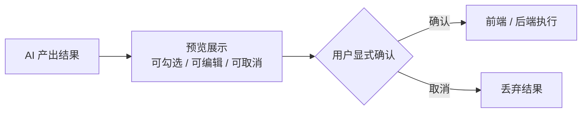

# 软件测试平台——（总览分册）

**文档版本**：V1.0  
**日期**：2026-09-23  
**状态**：起草中

> 本分册为《》按功能模块拆分后的总览分册，承载前言、引言、数据设计与公共约定等非模块内容；各功能模块正文见本目录对应分册，原章节编号保持不变，分册-章节对照表见文末。

---

> 本文档为 AI 能力域交互设计的公共基线：第 2 章「AI 通用交互规范」被其余四份 AI 交互设计文档引用，阅读顺序建议先读本文档。  
> 导航框架与色彩体系分别见 `docs/交互设计/全局导航与菜单交互系统设计.md`、`docs/交互设计/视觉设计.md`，本文档只描述 AI 能力域增量。

---

## 1. 概述

AI 智能辅助能力域的交互设计覆盖两部分：

1. **AI 通用交互规范**——所有 AI 功能入口共享的加载、取消、超时、降级、开关显隐、预览-确认-执行、对既有功能零影响等横切交互约定（承接 SRS 4.1/4.3/4.4）。
2. **管理端新增页面**——「AI 配置」页（AdminLayout 左侧菜单新增一项，页内含「AI 配置」「智能体」「调用统计」三个标签页，仅系统管理员可见）。

---


## 2. AI 通用交互规范

### 2.1 AI 入口统一视觉标识

- 所有 AI 功能入口（按钮、菜单项、输入区）统一附加 AI 标识：Element Plus `MagicStick` 图标 + 青色强调色（`--color-ai-badge`，见 `docs/交互设计/视觉设计.md` 第 7 节），用户可一眼识别该操作由 AI 驱动。
- AI 生成的脑图节点持续显示「AI」徽标（复用既有节点徽标体系），落库、进入评审/计划快照后徽标持续可见。
- AI 产出的建议类内容（推荐标签、建议卡片）均带「AI」角标，与人工内容明确区分。

### 2.2 AI 开关显隐

- 前端启动后由 `stores/ai.ts` 缓存 `GET /api/workspace/ai/status` 结果，暴露 `aiEnabled` / `semanticSearch` / `chatModels`（可切换对话模型清单，供 2.8 选择器使用）三个状态。
- `aiEnabled = false` 时：**隐藏全部 AI 功能入口**（工具栏按钮、右键菜单项、表单按钮、悬浮按钮、面板入口等），不做置灰保留。
- **例外**：需求池入口为常规业务功能，不随 AI 开关隐藏；AI 不可用时条目管理照常可用。
- AI 开关由启用转关闭时：进行中的流式生成立即中断并提示用户；进行中的异步任务自动终止并标记「已取消」；此前已产出的结果仍可查看。

### 2.3 三类调用形态的加载与反馈

| 形态 | 适用功能 | 加载反馈 | 取消方式 |
| ---- | ---- | ---- | ---- |
| 同步调用 | 表单建议、优先级推荐、DSL 翻译 | 触发按钮 loading + 禁用，不阻塞页面其他操作 | 不提供取消（超时阈值短，10s 级自动失败） |
| 同步长调用 | 遗漏测试点分析、用例规划智能推荐 | 面板持续加载态（前端超时 70s） | 全程显示 [取消] 按钮，点击即中断请求（abort） |
| 流式调用（SSE） | 用例生成、评审摘要、助手对话 | 输出区逐字渲染增量内容 + 打字光标动效 | 全程显示 [停止] 按钮，点击即断开 SSE |
| 异步任务 | 评审检查、缺陷聚类、向量重建 | 面板内进度条 + 状态文案，前端每 2 秒轮询任务状态 | 面板提供 [取消任务] 按钮 |

流式调用的超时提示（SRS 4.1）：

1. 首内容 3 秒内返回为目标值，此期间显示「AI 思考中…」加载态；
2. 超 10 秒未见首帧：加载态旁追加提示「响应较慢，可取消或重试」，并高亮 [停止] 按钮；
3. 单次生成总时长超 60 秒：允许用户随时取消，取消后已输出内容不保留。

异步任务离开页面后不中断，返回页面时面板依据任务状态接口恢复展示（任务状态即真相源）。

### 2.4 预览-确认-执行模式

所有涉及数据写入的 AI 操作强制遵循三段式：



- 脑图内操作（生成挂载、对话式编辑）：执行后整批作为**单条撤销历史**，可一键撤销；
- 业务对象操作（助手创建缺陷/计划草稿）：执行前展示操作明细确认卡片，执行后附结果跳转链接可追溯；
- 任何写操作不得跳过确认环节。

### 2.5 非侵入式建议

建议类结果（优先级推荐、等级建议、疑似重复缺陷、遗漏测试点）一律以非阻断形式呈现：

- 不弹模态窗、不抢占焦点、不阻塞用户输入与提交；
- 用户可采纳（点击回填）、忽略（不操作）或手工另选；
- 用户已手工完成选择后到达的 AI 结果直接丢弃，不覆盖用户选择。

### 2.6 降级与失败提示

- 语义能力降级（`semanticSearch = degraded/unavailable`）时，相关功能自动切换关键词模式，界面顶部显示浅黄提示条：「语义检索暂不可用，当前为关键词匹配结果」；
- AI 调用失败：建议类功能仅轻提示（Toast），不影响表单/页面操作；生成类功能在输出区展示失败原因 + [重试] 按钮；
- 限流超限（错误码 6004）：Toast 明确提示「AI 调用过于频繁，请稍后再试」；
- 异步任务失败：面板展示明确失败原因，提供 [重试] 按钮。

### 2.7 对既有功能的零影响原则

新增 AI 功能区一律以**增量附加**方式嵌入，不得影响既有功能（承接 SRS 4.4）：

- **布局零侵入**：AI 入口（按钮、菜单项、面板、标签页、悬浮按钮）只在既有布局的空余位置追加，不改变既有控件的位置、尺寸、操作流程与快捷键；AI 附加面板/卡片区在无内容时不占位；
- **关闭即还原**：`aiEnabled = false` 或 AI 服务不可用时，全部 AI 功能区隐藏，页面布局与交互回退到与 V1.0 完全一致的形态（需求池除外，见 2.2）；
- **失败不阻断**：AI 调用失败、超时或降级时，既有功能（表单提交、脑图编辑、评审、计划、缺陷流转等）必须完全不受影响，AI 入口自动降级为不可用提示；
- **数据不越权**：AI 仅通过预览-确认-执行写入数据（2.4），不存在绕过用户确认自动修改既有业务数据的路径。

### 2.8 对话模型选择器

交互式 AI 功能（全局助手输入区、用例生成/步骤补全抽屉、评审摘要生成等用户直接发起的功能）在入口附近提供统一的**对话模型选择器**（公共组件 `AiModelSelect`）：

- 数据源为能力开关接口下发的已启用模型清单（仅显示名与默认标记），默认模型带「默认」徽标；
- 默认选中用户上次选择（浏览器本地记忆，全局一份）；记忆的模型已被停用/删除时静默回退系统默认并清除记忆，不弹提示；
- 切换即生效并写入记忆，作用于本次与后续所有交互式调用；
- 仅一个可用模型时渲染只读标签（展示当前生效模型，不可切换）；无可用模型时不渲染；
- 后台异步任务（评审完整性检查、缺陷聚类）与建议类功能（优先级推荐、缺陷表单建议等）固定使用系统默认模型，**不展示**选择器；
- 选择器为纯附加控件，遵循 2.7 零影响原则，不改变各功能既有操作流程。

### 2.9 AI 功能抽屉统一规格

全部交互式 AI 功能面板（AI 生成/补全、遗漏测试点分析、AI 推荐用例、AI 检查、评审摘要）统一采用右侧滑出抽屉，视觉与交互规格如下：

- **尺寸**：统一 640px；
- **遮罩**：透明遮罩不压暗画布，点击抽屉外空白处或标题栏 ✕ 自动关闭；
- **头部**：`MagicStick` 图标 + 功能标题（2.1 AI 入口统一视觉标识），标题栏不再承载操作按钮；
- **布局骨架**（自上而下）：输入/配置区 → 操作行 → 结果/输出区 → 底部操作；
- **操作行**：置于输入/配置区下方、右侧对齐，内放取消/停止类次按钮与主操作按钮；调用进行中（SSE 流式 / 同步长调用）以**纤细线宽虚假进度条**（`stroke-width: 4px`，动画占位）反馈，异步任务面板用真实批次进度条（同细则宽 4px）；
- **主按钮**：统一「开始 X / 重新 X」文案（首次「开始生成 / 开始分析 / 开始推荐 / 生成摘要 / 开始检查」，再次「重新生成 / 重新分析 / 重新推荐 / 重新生成摘要 / 重新检查」；检查失败态为 [重试]）；
- **底部操作**：结果阶段的操作（查看预览 / 转用例生成 / 加入评审 / 加入计划）统一置于底部右侧，可携带计数；

---


## 3. 管理端菜单增量

AdminLayout 左侧菜单在既有菜单项之后新增一项（沿用既有菜单权限控制，仅系统管理员可见）：

```
┌──────────┐
│ 仪表盘   │
│ 用户管理 │
│ 工作空间 │
│ 角色管理 │
│ AI 配置  │  ← 新增（含智能体 / 调用统计标签页）
└──────────┘
```

---


## 6. 通用交互模式总结

### 6.1 弹窗类型

| 类型 | 使用场景 |
| ---- | ---- |
| 确认弹窗 | 切换供应商、关闭 AI 总开关、开启格式约束段编辑、恢复默认模板、对话模型设为默认/停用/删除 |
| 表单弹窗 | 对话模型新建/编辑（见 4.1） |
| 抽屉 | 智能体模板编辑 |
| 提示条 | 语义降级明示、向量重建进行中 |

### 6.2 加载状态

- **表单提交 / 连通性测试**：按钮 loading + 禁用，完成恢复。
- **统计表格**：首次加载骨架屏，筛选刷新顶部进度条。
- **流式 / 异步反馈**：统一遵循 2.3 节三类调用形态约定。

### 6.3 响应式处理

- 配置页两组表单在小屏幕下由并列改为上下堆叠；
- 智能体编辑抽屉小屏幕下全屏展示。

---

**文档结束**

## 分册-章节对照表

| 分册 | 文件 | 覆盖章节 |
|---|---|---|
| 总览 | `45-ai-infra-ui-overview.md` | 前言、1. 概述、2. AI 通用交互规范、3. 管理端菜单增量、6. 通用交互模式总结 |
| AI 配置页 | `46-ai-infra-ui-config.md` | 4. AI 配置页 |
| 智能体标签页 | `47-ai-infra-ui-agent.md` | 5. 智能体标签页 |
