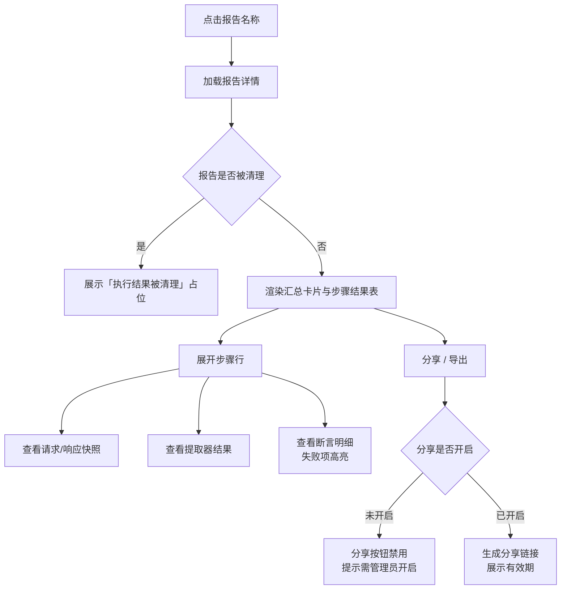

# 软件测试平台——Mock服务与报告页面交互设计

**文档版本**：V1.2  
**日期**：2026-08-17  
**状态**：起草中

> 本文档为 V1.2 接口测试域交互设计的第三部分：Mock 服务管理、Mock 调试与测试报告的前端交互设计。
> 导航框架与色彩体系见 `docs/交互设计/全局导航与菜单交互系统设计.md`、`docs/交互设计/视觉设计.md`。

---

## 1. 概述

V1.2 接口测试域新增 Mock 服务与测试报告能力。本文档覆盖四部分交互设计：

1. **Mock 规则管理页**——Mock 定义 CRUD、启停、命中统计、地址复制（承接 SRS 3.3）；
2. **Mock 调试页**——模拟请求验证匹配与响应是否符合预期（承接 SRS 3.3）；
3. **全局资产管理页**——项目级可复用组件资产库的管理（前置/后置处理器、验证器、提取器，承接 SRS 3.8/3.9）；
4. **测试报告页**——场景执行结果的列表、详情、分享与导出（承接 SRS 3.6）。

### 1.1 菜单与路由

**项目模式**（接口测试侧边栏）新增三项：

```
┌──────────────┐
│ 快速调试      │
│ 接口管理      │
│ 测试场景      │
│ 环境配置      │
│ Mock 服务    │  ← 新增
│ 全局资产      │  ← 新增
│ 测试报告      │  ← 新增
│ 定时任务      │
└──────────────┘
```

| 页面 | 路由 | 模式 | 权限 |
| ---- | ---- | ---- | ---- |
| Mock 规则管理页 | `/project/api/mocks` | 项目模式 | 项目成员查看；项目维护者维护 |
| Mock 调试页 | `/project/api/mock-debug` | 项目模式 | 项目成员 |
| 全局资产管理页 | `/project/api/assets` | 项目模式 | 项目成员查看；项目维护者维护 |
| 测试报告列表页 | `/project/api/reports` | 项目模式 | 执行者本人或项目维护者 |
| 测试报告详情页 | `/project/api/reports/:id` | 项目模式 | 执行者本人或项目维护者 |

> 上表路由为前端路由示意，与后端 API 路径相互独立。

### 1.2 权限边界

- Mock 规则归属项目，按项目隔离；查看/访问 Mock 地址为项目成员权限，创建/编辑/启停/删除为项目维护者权限（SRS 附录 B）；
- 全局资产归属项目，按项目隔离；维护（新建/编辑/删除/启停）为项目维护者权限，项目成员可浏览与复制引入；
- 报告按项目隔离；查看/分享/导出为执行者本人或项目维护者权限，删除为项目维护者权限。

---

## 2. Mock 规则管理页

**路由**：`/project/api/mocks`

### 2.1 页面布局

```
┌──────────────────────────────────────────────────────────────┐
│  Mock 服务                                        [+ 新建 Mock] │
├──────────────────────────────────────────────────────────────┤
│  [搜索名称/路径] [接口筛选 ▾] [状态筛选 ▾]  [批量启用] [批量停用] │
├──────────────────────────────────────────────────────────────┤
│  ☑ │ 名称        │ 路径模式        │方法│状态│命中次数│最后命中│操作│
│  ☑ │ 登录成功 Mock│ /api/auth/login │POST│ ● │ 156   │08-17 │…  │
│  ☑ │ 用户列表 Mock│ /api/users/*    │GET │ ○ │ 0     │  -   │…  │
│  ☑ │ 下单 Mock   │ /api/orders     │POST│ ● │ 89    │08-16 │…  │
│    │（行内操作：调试 / 复制地址 / 编辑 / 复制 / 删除）          │
├──────────────────────────────────────────────────────────────┤
│  已选 3 项  [批量启用] [批量停用]          < 第1页/共3页 >      │
└──────────────────────────────────────────────────────────────┘
```

表格列说明：

| 列 | 内容 |
| ---- | ---- |
| 选择框 | 多选，用于批量启停 |
| 名称 | Mock 名称，点击进入编辑；名称旁展示「跟随 API」标记（开启时） |
| 路径模式 | 匹配路径，支持 `*` 通配符；与真实接口地址同构 |
| 方法 | HTTP 方法徽标（GET/POST/PUT/DELETE 等，颜色区分） |
| 状态 | 启用/停用开关（`el-switch`），切换即时生效 |
| 命中次数 | 命中统计数字，悬停展示最后命中时间 |
| 最后命中 | 最后命中时间，未命中显示「-」 |
| 操作 | 下拉菜单：调试 / 复制地址 / 编辑 / 复制 / 删除 |

### 2.2 新建/编辑 Mock 抽屉

新建与编辑共用右侧滑出抽屉（宽 720px），分「匹配条件」「响应定义」两个区域：

```
┌──────────────────────────────────────────────┐
│  新建 Mock                        [取消] [保存] │
├──────────────────────────────────────────────┤
│  基本信息                                      │
│  名称      [登录成功 Mock                ]     │
│  描述      [模拟登录成功响应              ]     │
│  关联接口  [用户登录 ▾]（可选，从接口定义创建时自动填充）│
│  ── 匹配条件 ──────────────────────────────   │
│  方法      [POST ▾]   路径 [/api/auth/login]  │
│  匹配条件（header / param / body，动态行）      │
│  ┌────────────────────────────────────────┐  │
│  │ 类型 ▾ │ 名称        │ 值/表达式        │ ✕ │
│  │ header │ Content-Type│ application/json│ ✕ │
│  │ body   │ $.username  │ admin           │ ✕ │
│  │ [ + 添加匹配条件 ]                       │  │
│  └────────────────────────────────────────┘  │
│  ── 响应定义 ──────────────────────────────   │
│  状态码  [200]   延迟(ms) [0]                 │
│  响应头（键值对动态行）                        │
│  响应体类型 [JSON ▾]   [格式化] [变量提示]      │
│  [ JSON 代码编辑器（支持 ${uuid()} 等变量） ]  │
│  ☐ 跟随 API（未配置响应体时使用关联接口响应示例） │
└──────────────────────────────────────────────┘
```

**匹配条件行**：

| 类型 | 名称 | 值/表达式 | 说明 |
| ---- | ---- | ---- | ---- |
| header | 请求头名称 | 匹配值（支持正则） | 请求头包含指定 key 且 value 匹配 |
| param | 参数名 | 匹配值 | Query 参数或 REST 参数匹配 |
| body | JSONPath 表达式 | 匹配值 | 请求体 JSON 字段匹配 |

- 匹配条件为空时仅按「方法 + 路径」匹配，命中即返回；
- 同路径同方法存在多条规则时按优先级顺序匹配，取第一条命中规则（见 2.3）；
- 响应体编辑器支持变量引用提示：`${uuid()}`、`${timestamp()}`、`${env:VAR}`，未定义变量保留原文本；
- 保存时校验：名称必填、路径必填且以 `/` 开头、状态码为合法 HTTP 状态码；同项目下同路径同方法已启用 Mock 时保存失败，提示「该路径与方法已存在启用的 Mock，请调整路径或优先级」。

### 2.3 优先级调整

同路径同方法的多条规则按优先级顺序匹配。列表页「路径模式」列相同的方法徽标旁展示优先级序号，行内操作提供 [上移] [下移]：

| 操作 | 触发方式 | 反馈 |
| ---- | ---- | ---- |
| 调整优先级 | 行内 [上移] / [下移] | 序号即时交换，Toast 提示「优先级已更新」；仅同路径同方法组内可调整，跨组按钮置灰 |

### 2.4 交互说明

| 操作 | 触发方式 | 反馈 |
| ---- | ---- | ---- |
| 进入页面 | 侧边栏点击「Mock 服务」 | 拉取 Mock 列表，表格骨架屏加载 |
| 新建 Mock | 点击 [+ 新建 Mock] | 打开抽屉，方法默认 GET，路径默认 `/` |
| 从接口定义创建 | 接口管理页行内 [创建 Mock] | 跳转本页并打开抽屉，自动填充关联接口、方法、路径 |
| 编辑 Mock | 点击名称或行内 [编辑] | 抽屉回显完整配置 |
| 调试 Mock | 行内 [调试] | 跳转 Mock 调试页并预填该 Mock 的匹配信息（见第 3 章） |
| 复制地址 | 行内 [复制地址] | 拉取 Mock 完整访问地址（含平台 Mock 域名），复制到剪贴板，Toast「已复制」 |
| 启用/停用 | 行内开关 | 即时生效，不重启服务；停用时二次确认「停用后依赖方将无法访问该 Mock」 |
| 复制 Mock | 行内 [复制] | 打开抽屉并预填原规则全部配置，名称追加「- 副本」，保存后生成新规则 |
| 删除 Mock | 行内 [删除] | 二次确认（红色警示）「删除后不可恢复」；确认后删除并刷新列表 |
| 重置命中统计 | 行内 [重置统计] | 二次确认 → 命中次数归零，最后命中时间清空 |
| 批量启用/停用 | 勾选后点击工具栏按钮 | 二次确认（含数量）→ 逐条切换，Toast 汇总结果 |
| 搜索 | 工具栏搜索框 | 按名称/路径模糊过滤，防抖 300ms |
| 筛选 | 接口筛选 / 状态筛选 | 按关联接口或启用状态过滤，与搜索叠加生效 |

### 2.5 状态分支

| 状态 | 表现 |
| ---- | ---- |
| 正常态 | 表格展示全部 Mock，启停开关可操作 |
| 空态 | 无任何 Mock：居中插画 + 「暂无 Mock 规则」+ 说明文案「为接口创建 Mock，解除联调依赖」+ [新建 Mock] 按钮；有筛选条件时显示「无匹配结果」+ [清除筛选] |
| 加载态 | 首次进入表格骨架屏；筛选/搜索时顶部细进度条；行内操作按钮 loading |
| 错误态 | 拉取失败：错误提示 + [重试] 按钮；保存失败：抽屉内红字定位首个错误项；地址冲突（错误码 7302）：Toast 明确提示 |

---

## 3. Mock 调试页

**路由**：`/project/api/mock-debug`

### 3.1 页面布局

```
┌──────────────────────────────────────────────────────────────┐
│  Mock 调试                          [Mock 选择 ▾] [清空记录]   │
├──────────────────────────────┬───────────────────────────────┤
│  请求构建                      │  响应结果                      │
│  方法 [POST ▾]                │  状态码  200  OK               │
│  URL  [https://mock.…/login] │  耗时    5 ms                  │
│  ── 请求头 ──                 │  ── 响应头 ──                  │
│  Content-Type: application/json│  Content-Type: application/json│
│  [ + 添加请求头 ]              │  ── 响应体 ──                  │
│  ── 请求体 ──                 │  {                            │
│  [ JSON 编辑器 ]              │    code: 200                  │
│                               │    data: { token: … }         │
│  [发送]                       │  }                            │
│  ── 匹配规则 ──               │                               │
│  ● 命中：登录成功 Mock         │                               │
│  （未命中时：○ 未命中任何规则） │                               │
├──────────────────────────────┴───────────────────────────────┤
│  调试记录（最近 20 条）                                        │
│  10:32  POST /api/auth/login  200  5ms  命中「登录成功 Mock」  │
│  10:28  GET  /api/users/1     404  -    未命中                 │
└──────────────────────────────────────────────────────────────┘
```

### 3.2 交互说明

| 操作 | 触发方式 | 反馈 |
| ---- | ---- | ---- |
| 选择 Mock | 顶部 [Mock 选择 ▾] | 下拉列出当前项目全部 Mock（名称 + 路径），选中后自动填充方法、URL 与匹配条件为请求默认值 |
| 从规则页进入 | Mock 列表行内 [调试] | 自动选中该 Mock 并预填请求 |
| 编辑请求 | 方法下拉 / URL 输入 / 请求头动态行 / 请求体编辑器 | 直接编辑，URL 自动拼接平台 Mock 域名前缀 |
| 发送调试 | 点击 [发送] | 按钮 loading → 调用调试接口（不计入命中统计）→ 右侧渲染响应结果 |
| 查看匹配规则 | 请求区下方匹配指示区 | 命中：绿色标记 + 规则名称；未命中：黄色警告「未命中任何规则，将返回 404」 |
| 查看调试记录 | 底部记录列表 | 每次发送追加一条记录（时间、方法、路径、状态码、耗时、命中规则）；点击记录回填请求并重新渲染响应 |
| 清空记录 | 点击 [清空记录] | 二次确认 → 清空本地调试记录 |

### 3.3 状态分支

| 状态 | 表现 |
| ---- | ---- |
| 正常态 | 左右分栏展示请求与响应，匹配指示区显示命中规则 |
| 空态 | 首次进入未发送过请求：右侧响应区显示「尚未发送请求」占位；无任何 Mock 时 [Mock 选择] 置灰并提示「请先创建 Mock 规则」 |
| 加载态 | [发送] 按钮 loading + 禁用；响应区显示「请求发送中…」 |
| 错误态 | 请求失败：响应区展示错误状态码与原因；网络异常：Toast「请求失败，请检查网络」；限流（429）：Toast「Mock 访问过于频繁，请稍后再试」 |

---

## 4. 全局资产管理页

**路由**：`/admin/global-assets`（管理模式，仅系统管理员可见）

### 4.1 页面布局

```
┌──────────────────────────────────────────────────────────────┐
│  全局资产                                        [+ 新建资产]   │
│  项目级可复用组件资产库，供快速调试与测试场景复制引入              │
├──────────────────────────────────────────────────────────────┤
│  [全部 ▾] [前置处理器] [后置处理器] [验证器] [提取器]  [搜索]   │
├──────────────────────────────────────────────────────────────┤
│  ☑ │ 名称        │ 类型      │ 启用 │ 维护人  │ 更新时间 │ 操作 │
│  ☑ │ 登录获取 Token│ 前置处理器 │ ●   │ 张三   │ 08-15   │ …  │
│  ☑ │ 响应时间校验  │ 验证器    │ ●   │ 李四   │ 08-14   │ …  │
│  ☑ │ 清理测试数据  │ 后置处理器 │ ○   │ 张三   │ 08-10   │ …  │
│    │（行内操作：编辑 / 复制 / 停用 / 删除）                    │
├──────────────────────────────────────────────────────────────┤
│  已选 2 项  [批量停用] [批量删除]          < 第1页/共2页 >      │
└──────────────────────────────────────────────────────────────┘
```

### 4.2 资产编辑器

新建/编辑资产使用抽屉（宽 640px），编辑器与平台内同类型组件编辑器一致：

```
┌──────────────────────────────────────────────┐
│  新建资产                          [取消] [保存] │
│  名称      [登录获取 Token              ]     │
│  类型      [前置处理器 ▾]                    │
│  描述      [登录后提取 token 供后续步骤使用]   │
│  ── 配置（随类型切换）──────────────────────  │
│  处理器类型 [http ▾]   异步 [○]  条件 [○]     │
│  [ 与平台内同类型组件一致的配置表单 ]           │
│  ── 提取器（可选）──────────────────────────  │
│  [ + 添加提取器 ]                            │
└──────────────────────────────────────────────┘
```

### 4.3 交互说明

| 操作 | 触发方式 | 反馈 |
| ---- | ---- | ---- |
| 进入页面 | 项目模式菜单点击「全局资产」 | 拉取当前项目资产列表，默认按类型分组筛选 |
| 新建资产 | 点击 [+ 新建资产] | 打开抽屉，类型默认「前置处理器」 |
| 编辑资产 | 行内 [编辑] | 抽屉回显配置 |
| 复制资产 | 行内 [复制] | 预填原配置，名称追加「- 副本」 |
| 启用/停用 | 行内开关 | 停用后项目内不可再引入，已引入副本不受影响；停用时二次确认 |
| 删除资产 | 行内 [删除] | 二次确认（红色警示）「删除后不可恢复，已引入副本不受影响」 |
| 批量停用/删除 | 勾选后点击工具栏按钮 | 二次确认（含数量） |
| 搜索/筛选 | 搜索框 / 类型标签 | 按名称模糊搜索，类型标签切换过滤 |

### 4.4 项目内引入（复制引入）

全局资产在项目内通过「引入选择器」复制引入，入口位于快速调试面板与测试场景的处理器/验证器/提取器配置处：

| 操作 | 触发方式 | 反馈 |
| ---- | ---- | ---- |
| 打开引入选择器 | 配置区 [从资产库引入] | 弹窗展示可用资产列表（仅启用状态），支持类型筛选与搜索 |
| 引入资产 | 勾选后点击 [引入] | 生成独立副本并回填到当前配置区，Toast「已引入」；副本与源资产无关联 |
| 查看已停用资产 | 引入选择器内 | 停用资产不展示，不提供引入入口 |

### 4.5 状态分支

| 状态 | 表现 |
| ---- | ---- |
| 正常态 | 表格展示全部资产，类型标签高亮当前筛选 |
| 空态 | 无资产：居中插画 + 「暂无全局资产」+ [新建资产] 按钮；筛选无结果时显示「无匹配结果」+ [清除筛选] |
| 加载态 | 首次进入表格骨架屏；保存按钮 loading |
| 错误态 | 拉取失败：错误提示 + [重试]；保存失败：抽屉内红字定位首个错误项 |
| 权限不足 | 非项目维护者访问该路由：403 页面「无权限访问」；项目成员不展示新建/编辑/删除/启停操作 |

---

## 5. 测试报告页

### 5.1 报告列表页

**路由**：`/project/api/reports`

```
┌──────────────────────────────────────────────────────────────┐
│  测试报告                                        [批量导出]     │
├──────────────────────────────────────────────────────────────┤
│  [场景筛选 ▾] [状态筛选 ▾] [执行方式 ▾] [日期范围] [搜索]      │
├──────────────────────────────────────────────────────────────┤
│  ☑ │ 报告名称      │ 场景名称 │ 状态 │ 通过率 │ 耗时 │ 创建时间│操作│
│  ☑ │ 登录流程-08-17│ 登录流程 │ 通过 │ 100%  │ 1.2s │ 08-17 │…  │
│  ☑ │ 下单流程-08-17│ 下单流程 │ 失败 │ 66.7% │ 2.1s │ 08-17 │…  │
│  ☑ │ 支付流程-08-16│ 支付流程 │ 部分 │ 80%   │ 1.8s │ 08-16 │…  │
│    │（行内操作：查看 / 导出 / 删除）                          │
├──────────────────────────────────────────────────────────────┤
│  已选 2 项  [批量导出] [批量删除]          < 第1页/共5页 >      │
└──────────────────────────────────────────────────────────────┘
```

| 列 | 内容 |
| ---- | ---- |
| 报告名称 | 场景名 + 执行时间戳，点击进入详情 |
| 场景名称 | 关联场景 |
| 状态 | 状态徽标：通过（绿）/ 失败（红）/ 部分通过（黄）；仓库流水线执行展示来源标记与流水线链接；结果待同步时展示「结果待同步」+ [刷新] |
| 通过率 | 通过步骤数 / 总步骤数百分比 |
| 耗时 | 总耗时 |
| 创建时间 | 执行完成时间 |
| 操作 | 下拉菜单：查看 / 导出 / 删除 |

**交互说明**：

| 操作 | 触发方式 | 反馈 |
| ---- | ---- | ---- |
| 进入页面 | 侧边栏点击「测试报告」 | 拉取报告列表，表格骨架屏加载 |
| 筛选 | 场景 / 状态 / 执行方式 / 日期范围 | 筛选条件叠加生效，日期范围默认最近 30 天 |
| 查看报告 | 点击报告名称 | 跳转报告详情页 |
| 导出 | 行内 [导出] 或勾选后 [批量导出] | 弹窗选择格式（JSON / HTML）→ 下载文件；批量导出打包下载 |
| 删除 | 行内 [删除] 或勾选后 [批量删除] | 二次确认（红色警示）「删除后不可恢复」 |
| 刷新待同步报告 | 行内 [刷新] | 按钮 loading → 重新拉取流水线状态，成功后更新状态徽标 |

**状态分支**：

| 状态 | 表现 |
| ---- | ---- |
| 正常态 | 表格展示报告列表，筛选可用 |
| 空态 | 无报告：居中插画 + 「暂无测试报告」+ 说明「执行测试场景后生成报告」；筛选无结果时显示「无匹配结果」+ [清除筛选] |
| 加载态 | 首次进入表格骨架屏；筛选时顶部细进度条 |
| 错误态 | 拉取失败：错误提示 + [重试]；导出失败：Toast「导出失败，请稍后重试」 |

### 5.2 报告详情页

**路由**：`/project/api/reports/:id`

```
┌──────────────────────────────────────────────────────────────┐
│  ← 返回列表                                                    │
│  登录流程-08-17  [通过]  场景：登录流程  环境：测试环境          │
│  执行方式：平台内执行  执行时间：2026-08-17 10:30:00            │
│  [分享] [导出 JSON] [导出 HTML]                                │
├──────────────────────────────────────────────────────────────┤
│  ┌────────┐ ┌────────┐ ┌────────┐ ┌────────┐                  │
│  │ 总步骤  │ │ 通过    │ │ 失败    │ │ 跳过    │                  │
│  │  6     │ │  6     │ │  0     │ │  0     │                  │
│  └────────┘ └────────┘ └────────┘ └────────┘                  │
│  通过率 100%   总耗时 1.2s                                     │
├──────────────────────────────────────────────────────────────┤
│  步骤结果                                                      │
│  # │ 步骤名称   │ 接口        │ 状态 │ 耗时 │ 断言 │ 操作      │
│  1 │ 登录       │ POST /login │ 通过 │ 320ms│ 2/2 │ ▸ 展开    │
│  2 │ 获取用户列表│ GET /users  │ 通过 │ 180ms│ 1/1 │ ▸ 展开    │
│  3 │ 创建订单   │ POST /orders│ 失败 │ 500ms│ 1/2 │ ▸ 展开    │
│  （展开行：请求/响应快照、提取器结果、断言明细）                 │
└──────────────────────────────────────────────────────────────┘
```

**报告详情流程**：



**汇总卡片**：

| 卡片 | 内容 |
| ---- | ---- |
| 总步骤 | 启用步骤总数 |
| 通过 | 所有验证器通过的步骤数（绿） |
| 失败 | 任一验证器失败的步骤数（红） |
| 跳过 | 被禁用（disabled）的步骤数（灰） |
| 通过率 | 通过数 / 总步骤数，环形图展示 |
| 总耗时 | 全部步骤耗时合计 |

**步骤结果表**：

| 列 | 内容 |
| ---- | ---- |
| 序号 | 步骤执行顺序 |
| 步骤名称 | 点击展开 |
| 接口 | 方法 + 路径 |
| 状态 | 通过（绿）/ 失败（红）/ 跳过（灰）/ 未执行（灰） |
| 耗时 | 单步耗时 |
| 断言 | 通过数 / 总数，失败时红字 |
| 操作 | 展开/收起 |

**展开行内容**：

- **请求快照**：方法、URL、请求头、请求体（格式化展示）；
- **响应快照**：状态码、响应头、响应体（格式化 JSON）；
- **提取器结果**：提取的变量名与值列表；
- **断言明细**：每条断言的字段、规则、期望值、实际值、结果；失败项红色高亮并展示解析错误提示（断言表达式解析失败按断言失败处理）。

**交互说明**：

| 操作 | 触发方式 | 反馈 |
| ---- | ---- | ---- |
| 进入详情 | 列表页点击报告名称 | 加载详情，头部展示摘要信息 |
| 展开步骤 | 点击步骤行或 [▸ 展开] | 行内展开请求/响应/提取器/断言明细 |
| 分享报告 | 点击 [分享] | 校验项目设置是否开启分享：未开启时按钮禁用，悬停提示「需项目管理员在安全策略中开启」；开启后弹窗展示分享链接与有效期，[复制链接] 一键复制 |
| 导出 | 点击 [导出 JSON] / [导出 HTML] | 下载对应格式文件；HTML 为独立文件（内联样式，可离线打开与打印） |
| 查看被清理报告 | 进入已清理报告 | 详情区展示「执行结果被清理」占位，保留报告元数据 |

**状态分支**：

| 状态 | 表现 |
| ---- | ---- |
| 正常态 | 汇总卡片 + 步骤结果表完整展示 |
| 空态 | 报告无步骤数据：步骤表显示「无步骤数据」；报告被清理：展示「执行结果被清理」占位 |
| 加载态 | 详情骨架屏；展开行内容局部加载 |
| 错误态 | 加载失败：错误提示 + [重试]；分享生成失败：Toast 展示原因；报告不存在（已删除）：404 提示「报告不存在或已被删除」 |
| 权限不足 | 非执行者本人且非项目维护者：403 页面「无权限访问该报告」 |

---

## 6. 通用交互模式

### 6.1 弹窗类型

| 类型 | 使用场景 |
| ---- | ---- |
| 确认弹窗 | 停用 Mock、删除 Mock、重置命中统计、批量启停、删除报告、批量删除、清空调试记录、停用/删除全局资产 |
| 表单抽屉 | Mock 规则新建/编辑（720px）、全局资产新建/编辑（640px） |
| 选择弹窗 | 全局资产引入选择器、导出格式选择 |
| 分享弹窗 | 报告分享链接生成与复制 |

### 6.2 加载与错误状态

- **列表加载**：首次进入表格骨架屏，筛选/搜索时顶部细进度条；
- **表单提交**：按钮 loading + 禁用，完成恢复；
- **行内操作**：操作按钮 loading，防止重复点击；
- **错误提示**：列表/详情加载失败展示错误区 + [重试]；表单校验失败红字定位首个错误项；操作失败 Toast 展示原因；
- **空态统一**：插画 + 主文案 + 说明文案 + 主操作按钮；筛选无结果时提供 [清除筛选]。

### 6.3 状态徽标色彩约定

状态徽标统一使用 `docs/交互设计/视觉设计.md` 定义的语义色：

| 状态 | 色彩 | 使用场景 |
| ---- | ---- | ---- |
| 通过 / 成功 | 绿（`--color-success`） | 报告状态「通过」、步骤状态「通过」、Mock 启用、命中指示 |
| 失败 / 危险 | 红（`--color-danger`） | 报告状态「失败」、步骤状态「失败」、断言失败项、删除操作 |
| 部分通过 / 警告 | 黄（`--color-warning`） | 报告状态「部分通过」、未命中警告 |
| 跳过 / 未执行 | 灰（`--color-neutral-400`） | 步骤状态「跳过」「未执行」、Mock 停用 |
| 进行中 / 待同步 | 蓝（`--color-primary`） | 报告「结果待同步」、加载指示 |

### 6.4 响应式处理

- Mock 调试页左右分栏在小屏幕下改为上下堆叠；
- 报告详情汇总卡片在小屏幕下由四列改为两列；
- 表单抽屉在小屏幕下全屏展示。

---

**文档结束**
