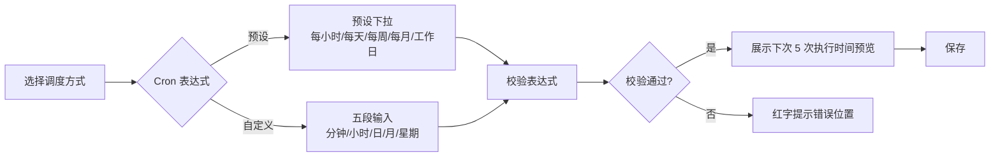

# 软件测试平台——定时任务交互设计

**文档版本**：V1.0  
**日期**：2026-09-23  
**状态**：起草中

> 本文档为接口测试域交互设计的组成部分：定时任务管理（测试计划（场景批量执行）与接口同步的统一 Cron 调度）的前端交互设计。
> 导航框架与色彩体系见 `docs/交互设计/全局导航与菜单交互系统设计.md`、`docs/交互设计/视觉设计.md`。

---

## 1. 概述

### 1.1 模块范围

接口测试业务域新增定时任务能力，本文档覆盖一个页面：

1. **定时任务管理页**——测试计划（场景批量执行）与接口同步的统一 Cron 调度、执行记录与状态管理。

「测试计划」任务按执行方式圈选接口测试场景（全部 / 指定模块（多选）/ 指定场景（多选）），执行需指定目标环境，场景为平台内可执行场景（已发布状态，草稿场景跳过执行并留痕提示）。

### 1.2 项目模式侧边栏

本模块页面位于项目模式侧边栏「接口测试」分组下（项目模式导航框架见 `docs/交互设计/全局导航与菜单交互系统设计.md` 3.3，页面内部采用侧边栏布局组织子模块），「定时任务」为本文档范围：

```
┌──────────────────────────────────┐
│  接口测试（顶部菜单入口）          │
│  ─────────────────────────       │
│  快速调试     /workspace/projects/api-testing?tab=debug
│  接口管理     /workspace/projects/api-testing?tab=interfaces
│  Mock 服务    /workspace/projects/api-testing?tab=mocks
│  测试场景     /workspace/projects/api-testing?tab=scenes
│  接口测试报告 /workspace/projects/api-testing?tab=reports
│  定时任务     /workspace/projects/api-testing?tab=schedules  ← 本文档
│  ═════════════════════════════
│  项目设置（平台级 · 按业务域过滤）
│   ├ 环境管理           /workspace/projects/settings/environments
│   └ 全局资产           /workspace/projects/settings/assets
└──────────────────────────────────┘
```

### 1.3 页面路由

| 页面 | 路由 |
| ---- | ---- |
| 定时任务管理 | `/workspace/projects/api-testing?tab=schedules` |

---

## 2. 定时任务管理页

**路由**：`/workspace/projects/api-testing?tab=schedules`

### 2.1 页面布局

```
┌──────────────────────────────────────────────────────────────┐
│  定时任务                                        [+ 新建任务]  │
│  测试计划（场景批量执行）与接口同步的统一周期调度              │
├──────────────────────────────────────────────────────────────┤
│  任务名称 │ 类型 │ 执行范围 │ 调度 │ 状态 │ 上次执行 │ 下次执行 │ 操作 │
│  每日回归 │ 测试计划 │ 指定模块×2 │ 每天 02:00 │ [已启用] │ [成功] 08-17 │ 08-18 02:00 │ … │
│  订单同步 │ 接口同步 │ https://.../api-docs │ 每小时 │ [已停用] │ [失败] 08-16 │ - │ … │
│  （行内操作：立即执行 / 启停 / 编辑 / 执行记录 / 删除）        │
│  ──────────────────────────────────────────────────────────  │
│  空态：暂无定时任务，点击 [新建任务] 创建第一个任务            │
└──────────────────────────────────────────────────────────────┘

新建/编辑任务弹窗（宽 720px）：
┌──────────────────────────────────────────────────┐
│  新建定时任务                                      │
│  任务名称  [每日回归测试                    ]      │
│  任务描述  [每日凌晨执行回归                  ]      │
│  任务类型  ○ 测试计划  ○ 接口同步                  │
│  ── 当选择「测试计划」 ──────────────────    │
│  执行方式  ○ 全部  ○ 指定模块  ○ 指定场景          │
│  指定模块（多选）  [模块A ☑ 模块B ☑ 模块C]（执行方式=指定模块时）│
│  指定场景（多选）  [选择场景（N 个）…]（执行方式=指定场景时）  │
│  目标环境  [staging ▾]（必选）                    │
│  ── 当选择「接口同步」 ────────────────────    │
│  接口文档 URL  [https://example.com/v3/api-docs]   │
│  ── 调度配置 ──────────────────────────────────  │
│  调度方式  ○ 预设表达式  ○ 自定义 Cron              │
│  预设      [每天凌晨 0 2 * * * ▾]                 │
│  自定义    [0 2 * * *]  [校验]                    │
│  Cron 构建器：分钟[0] 小时[2] 日[*] 月[*] 星期[*]  │
│  下次执行预览：08-18 02:00 · 08-19 02:00 · …（5 次）│
│  ── 通知（预留）───────────────────────────────  │
│  通知时机  ○ 成功时  ○ 失败时  ○ 始终  ○ 不通知     │
│  通知渠道  ☑ 站内消息  ☐ 邮件  ☐ Webhook          │
│  [取消] [保存]                                    │
└──────────────────────────────────────────────────┘
```

> 选择场景时的对话框（点击 [选择场景（N 个）…] 打开）：关键字搜索（按名称）+ 模块筛选 + 分页列表勾选（跨页保留选择），底部展示「已选 N 个」；支持几十上百个场景下按名称精确定位。

### 2.2 Cron 构建器流程



### 2.3 交互说明

| 操作 | 触发方式 | 反馈 |
| ---- | ---- | ---- |
| 新建任务 | 点击 [+ 新建任务] | 打开弹窗；任务类型默认「测试计划」 |
| 选择任务类型 | 单选 | 切换表单：测试计划 → 执行方式+目标环境；接口同步 → URL 输入 |
| 选择执行方式 | 单选 | 全部 / 指定模块（多选）/ 指定场景（多选）；非「全部」时展示对应选择器（模块树 / 场景选择对话框） |
| 选择模块 | 多选 | 模块树，基于项目实时数据；勾选父模块包含其全部子模块 |
| 选择场景 | 打开「选择场景」对话框 | 关键字搜索（按名称）+ 模块筛选 + 分页列表勾选，跨页保留选择；已选场景以标签回填展示并可逐个移除；几十上百个场景下可输入名称精确定位 |
| 选择目标环境 | 下拉 | 测试计划任务必选；环境被删除后任务执行失败并明确提示 |
| 输入接口文档 URL | 文本框 | 接口同步任务必填；保存时校验可达性与合法性 |
| 配置 Cron | 预设下拉或自定义输入 | 预设选中回填表达式；自定义输入实时校验，非法红字提示 |
| 校验表达式 | 点击 [校验] | 调用校验接口，展示表达式描述与下次 5 次执行时间预览 |
| 保存任务 | 点击 [保存] | 前端校验 → 提交；Cron 非法或 URL 无效不可保存；成功 Toast + 列表刷新 |
| 立即执行 | 行内 [立即执行] | 二次确认 → 触发；上一次执行未结束时提示并阻止 |
| 启停任务 | 行内 [启停] | 切换启用状态；停用后不再触发，下次执行列显示「-」 |
| 查看执行记录 | 行内 [执行记录] | 展开子表格或抽屉展示历史执行（触发方式、状态、耗时、关联报告/导入结果链接）；测试计划任务的关联报告为**套件报告**（点击跳转套件报告详情，按「场景 → 步骤」两级展示） |
| 删除任务 | 行内 [删除] | 二次确认（红色警示）；删除不影响已产生的执行记录与报告 |

### 2.4 状态覆盖

| 状态 | 表现 |
| ---- | ---- |
| 正常态 | 任务列表展示调度、状态、上次/下次执行 |
| 空态 | 无任务时展示引导文案与 [新建任务] 主按钮 |
| 加载态 | 列表骨架屏；立即执行按钮 loading |
| 错误态 | 保存失败（Cron 非法 / 绑定对象缺失）定位字段；执行失败在列表标记失败状态，可 [立即执行] 手动补跑 |

---

## 3. 通用交互模式

本文档页面遵循的通用交互模式与 `docs/交互设计/环境管理交互设计.md` 第 4 章一致，此处不重复展开：

- **弹窗类型**（源文档 4.1）：表单弹窗（定时任务新建/编辑）、确认弹窗（删除任务、立即执行、启停任务）、抽屉（执行记录查看）；
- **加载与错误状态**（源文档 4.2）：按钮 loading + 禁用、列表骨架屏、错误 Toast + 错误码、字段红字提示；
- **状态徽标色彩**：统一使用 `docs/交互设计/视觉设计.md` 定义的语义色（成功绿、失败红、进行中蓝、已跳过灰）。

---

**文档结束**