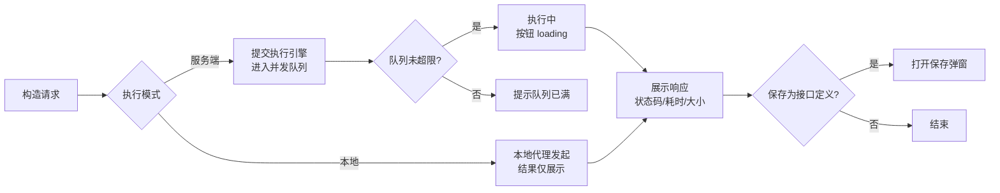
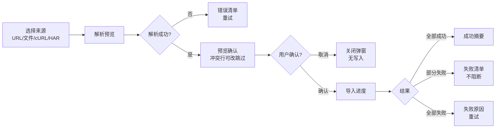

# 软件测试平台——快速调试交互设计

**文档版本**：V1.2  
**日期**：2026-08-17  
**状态**：起草中

> 本文档为 V1.2 接口测试域交互设计分册：快速调试、导入功能的前端交互设计。
> 导航框架与色彩体系见 `docs/交互设计/全局导航与菜单交互系统设计.md`、`docs/交互设计/视觉设计.md`。
> 接口管理与接口定义编辑见 `docs/交互设计/接口管理交互设计.md`。

---

## 1. 概述

### 1.1 模块范围

本文档覆盖 V1.2 接口测试业务域（承接 SRS 3.1 快速调试、3.2 接口管理导入能力）的两大能力：

1. **快速调试**——单请求调试：请求构造、服务端/本地执行、响应查看、调试记录管理、保存为接口定义；
2. **导入功能**——Swagger URL、Swagger 文件、cURL、HAR 四种来源的解析导入与预览确认。

接口管理列表与接口定义编辑见 `docs/交互设计/接口管理交互设计.md`。

接口定义是测试场景与 Mock 服务的数据底座，本域产出的接口资产被 `docs/交互设计/测试场景交互设计.md`、`docs/交互设计/Mock服务交互设计.md` 引用。

### 1.2 侧边栏菜单与路由

V1.2 项目模式顶部菜单在既有「功能测试」「缺陷管理」之外**新增「接口测试」入口**（增量见 `docs/交互设计/全局导航与菜单交互系统设计.md` 3.3）。接口测试页面内部采用侧边栏组织子模块：

```
┌──────────────────────────────────┐
│  接口测试（顶部菜单入口）          │
│  ─────────────────────────       │
│  快速调试     /workspace/projects/api-testing?tab=debug        ← 本文档第 2 章
│  接口管理     /workspace/projects/api-testing?tab=interfaces   ← 见《接口管理交互设计》
│  Mock 服务    /workspace/projects/api-testing?tab=mocks
│  测试场景     /workspace/projects/api-testing?tab=scenes
│  接口测试报告 /workspace/projects/api-testing?tab=reports
│  定时任务     /workspace/projects/api-testing?tab=schedules
│  ═════════════════════════════
│  项目设置（平台级 · 按业务域过滤）
│   ├ 环境管理           /workspace/projects/settings/environments
│   ├ 全局资产           /workspace/projects/settings/assets
│   ├ GitLab 仓库配置    /workspace/projects/settings/gitlab-repos
│   └ 安全策略与应用设置 /workspace/projects/settings/security
└──────────────────────────────────┘
```

> Mock 服务、测试场景、报告、定时任务及接口管理、接口定义编辑的交互设计见接口测试域其余交互设计文档；「项目设置」分组（环境管理、全局资产、GitLab 仓库配置、安全策略与应用设置）见对应分册与《项目设置交互设计》，本文档不重复描述。

### 1.3 业务关系

- **快速调试**是验证入口：调试请求可一键**保存为接口定义**（新建或归属已有接口定义），调试记录仅服务端执行持久化。
- **导入**是资产来源：Swagger/OpenAPI、Postman、HAR、JMeter 文件与 Swagger URL 解析后经**预览确认**写入接口定义，按 `path+method` 或 `source_id` 去重增量更新。
- 变量引用统一 `${变量名}` 语法，支持内置函数（见 `docs/交互设计/环境管理交互设计.md` 第 3 章引用帮助）。
- 接口定义的列表管理与编辑维护见 `docs/交互设计/接口管理交互设计.md`。

---

## 2. 快速调试页

**路由**：`/workspace/projects/api-testing?tab=debug`

### 2.1 页面布局

```
┌──────────────────────────────────────────────────────────────────┐
│  ┌─ 调试标签栏 ────────────────────────────────────────────────┐ │
│  │ [POST 用户登录 ×] [GET 获取用户 ×] [POST 创建订单 ×] [+]    │ │
│  └──────────────────────────────────────────────────────────────┘ │
├──────────────────────────────────┬───────────────────────────────┤
│  请求构造区                      │  响应查看区                    │
│  ┌────────────────────────────┐ │  ┌───────────────────────────┐ │
│  │ [POST ▾] [https://…/api/…]│ │  │ 状态码 [200]  耗时 230ms   │ │
│  │ [发送] [本地执行]          │ │  │ 大小 1.2KB                │ │
│  └────────────────────────────┘ │  └───────────────────────────┘ │
│  [参数] [请求头] [请求体] [认证] │  │  [响应体] [响应头] [提取结果] │ │
│  ┌────────────────────────────┐ │  ┌───────────────────────────┐ │
│  │ 请求头（键值对编辑器）       │ │  │ {                        │ │
│  │ 启用│名称│值│操作           │ │  │   "code": 200,           │ │
│  │ [✓]│Content-Type│…│删除    │ │  │   "data": {              │ │
│  │ [+ 添加]                   │ │  │     "token": "xxx"       │ │
│  │ 认证：[No Auth ▾]          │ │  │   }                      │ │
│  │ 超时 [30000] 跟随重定向 [●] │ │  │ }                        │ │
│  └────────────────────────────┘ │  │  （JSON 格式化 + 语法高亮） │ │
│  ── 调试记录 ────────────────── │  └───────────────────────────┘ │
│  [搜索记录...]                  │  │  [保存为接口定义]            │
│  │ 08-17 10:30 POST 登录 200  │  └───────────────────────────┘ │
│  │ 08-17 09:12 GET  用户 404  │                                │
│  │ （行内：重命名/删除）        │                                │
└──────────────────────────────────┴───────────────────────────────┘
```

- 页面顶部为**调试标签栏**：每个标签代表一个独立调试会话，标签显示请求方法图标 + 简短名称，右侧有关闭按钮；末尾 `+` 按钮新建空白标签。
- 标签栏下方为**请求构造区**（左）与**响应查看区**（右），各标签页独立维护自己的请求/响应状态。
- 执行模式二选一：**[发送]**（服务端执行，默认）与 **[本地执行]**（本地代理发起，结果仅展示不持久化，见需求 3.1）。

### 2.2 标签页管理

| 操作 | 触发方式 | 反馈 |
| ---- | ---- | ---- |
| 新建标签 | 点击标签栏末尾 `[+]` | 新增一个空白标签并自动激活；初始名称为「新建请求」；同时最多 10 个标签 |
| 切换标签 | 点击标签 | 切换到该标签的请求/响应状态；已激活标签高亮，其他标签恢复默认样式 |
| 关闭标签 | 点击标签右侧 `×` | 若该标签有未保存修改（已编辑但未执行/未保存），弹出二次确认「关闭后内容将丢失，是否关闭？」；确认后关闭并切换到相邻标签；最后一个标签关闭后自动创建空白标签 |
| 重命名标签 | 双击标签名称 | 标签名称进入编辑态（行内 input），回车或失焦保存；未命名标签在首次执行后自动以「方法 + URL 路径末段」命名 |
| 标签状态标记 | 有未保存修改时 | 标签名称后显示小圆点（`●`），提示用户有未持久化内容 |
| 从接口定义跳转 | 接口列表行内 [调试] | 新建标签并预填该接口的方法、路径、请求头、请求体、Query、认证 |
| cURL 导入 | 在当前标签内导入 cURL | 解析结果填充当前激活标签的请求构造区 |

### 2.3 请求构造

| 操作 | 触发方式 | 反馈 |
| ---- | ---- | ---- |
| 选择方法 | 方法下拉 | GET/POST/PUT/PATCH/DELETE/OPTIONS/HEAD/CONNECT |
| 输入 URL | URL 输入框 | 支持完整 URL（含域名）或相对路径（使用环境默认 base_url 拼接）；输入 `$` 或 `${` 弹出变量自动补全 |
| 参数页签 | 切换 [参数]/[请求头]/[请求体]/[认证] | 各页签独立编辑，切换保留已填内容；请求体类型互斥（none/json/form-data/raw/binary），切换保留各类型内容 |
| 认证配置 | [认证] 页签 | No Auth / Basic Auth（用户名/密码）/ Digest Auth（用户名/密码）；密码类输入脱敏展示 |
| 设置 | 请求体页签底部 | 连接超时、响应超时、跟随重定向开关 |
| 导入 cURL | 点击 [导入 cURL] | 打开 cURL 粘贴弹窗（见 2.5），解析成功后回填当前激活标签的请求构造区 |

### 2.4 执行与响应查看

| 操作 | 触发方式 | 反馈 |
| ---- | ---- | ---- |
| 发送（服务端） | 点击 [发送] | 按钮 loading + 禁用；执行完成展示响应；结果持久化为调试记录 |
| 本地执行 | 点击 [本地执行] | 提示「本地执行需本地代理客户端支持」；结果仅展示，不写入调试记录（仅浏览器本地缓存） |
| 执行被拒 | 并发队列满 | 弹窗提示「并发队列已满，请稍后重试」（见需求 3.11） |
| 查看响应体 | [响应体] 页签 | 按格式展示（JSON 格式化 + 语法高亮 / XML / HTML / 纯文本）；响应体过大时折叠展示并提示 |
| 查看响应头 | [响应头] 页签 | 键值对表格展示 |
| 查看提取结果 | [提取结果] 页签 | 展示本次执行提取器产出的变量名与值（供后续调试引用） |
| 保存为接口定义 | 点击 [保存为接口定义] | 打开保存弹窗（见 2.6）；仅服务端执行结果可保存，本地执行结果该按钮置灰并提示 |

执行流程：



### 2.5 cURL 导入

```
┌──────────────────────────────────────────────┐
│  导入 cURL                                    │
│  ┌────────────────────────────────────────┐  │
│  │  curl -X POST https://staging.example… │  │
│  │  -H 'Content-Type: application/json'   │  │
│  │  -d '{"username":"admin"}'             │  │
│  └────────────────────────────────────────┘  │
│  （粘贴区，支持从 Chrome/Charles/Fiddler 导出）│
│  [取消]                        [解析并填充]   │
└──────────────────────────────────────────────┘
```

| 操作 | 触发方式 | 反馈 |
| ---- | ---- | ---- |
| 粘贴 cURL | 粘贴区粘贴命令 | 实时识别；解析成功提示「已识别 POST 请求」 |
| 解析并填充 | 点击 [解析并填充] | 解析 method/URL/headers/body/query/auth 并回填当前激活标签的请求构造区（见 `docs/详细设计/快速调试详细设计说明书.md` 4.3）；解析失败弹窗内提示原因 + [重试] |
| 安全说明 | 弹窗底部提示 | 「仅解析请求描述，不执行 cURL 命令本身，不执行其中任何脚本或文件引用」（见需求 3.1） |

### 2.6 保存为接口定义

```
┌──────────────────────────────────────────────┐
│  保存为接口定义                                │
│  接口名称  [用户登录                    ]      │
│  归属方式  (●) 新建接口   ( ) 归属已有接口定义  │
│  所属模块  [用户模块 ▾]                       │
│  （归属已有时：接口选择器 [用户登录 ▾]）        │
│  [取消]                          [保存]       │
└──────────────────────────────────────────────┘
```

| 操作 | 触发方式 | 反馈 |
| ---- | ---- | ---- |
| 选择归属方式 | 单选新建/归属已有 | 新建显示所属模块下拉；归属已有显示接口选择器（按模块树浏览） |
| 保存 | 点击 [保存] | 名称必填校验 → 提交；成功 Toast + 提供 [查看接口] 跳转链接；名称重复（7102）弹窗内提示 |

### 2.7 调试记录管理

历史记录作为页面级固定标签「历史记录」，位于标签栏末尾（`+` 按钮之前），不可关闭。点击标签切换为全宽历史记录视图；再次点击其他调试标签切换回调试视图。

```
标签栏：[用户登录 ×] [获取用户列表 ×] [历史记录] [+]
                                        ^^^^^^^^ 固定标签，不可关闭
```

| 操作 | 触发方式 | 反馈 |
| ---- | ---- | ---- |
| 切换到历史视图 | 点击「历史记录」标签 | 主内容区切换为全宽历史记录视图（搜索 + 按时间分组列表），左侧无模块树，右侧无响应面板 |
| 切换回调试视图 | 点击任意调试标签 | 主内容区恢复为请求构造 + 响应查看双栏布局 |
| 自动保存 | 每次服务端执行完成 | 自动将请求快照与响应结果保存为历史记录，列表顶部新增一条，无需用户操作 |
| 恢复请求 | 点击历史记录条目 | 自动创建新调试标签，回填该次请求的方法、URL、请求头、请求体、认证配置；新标签响应区同时展示该次响应结果；自动切换到新标签 |
| 搜索历史 | 搜索框输入 | 防抖 300ms，按接口名称/路径/方法模糊匹配；搜索框位于视图顶部，全宽展示 |
| 重命名历史 | 行内 [重命名] | 行内输入态，回车保存；自动保存的记录初始名称为「方法 + URL 路径末段」 |
| 删除历史 | 行内 [删除] | 二次确认；删除后不可恢复（错误码 7103 时提示记录不存在） |
| 快捷键 | `Ctrl+Shift+H` | 直接切换到「历史记录」标签（已在历史视图时聚焦搜索框） |
| 记录上限 | 超过 200 条时 | 自动淘汰最旧记录，保留最近 200 条 |

历史记录视图布局：

```
┌─────────────────────────────────────────────────────────────┐
│ [用户登录 ×] [获取用户列表 ×] [●历史记录] [+]              │
├─────────────────────────────────────────────────────────────┤
│ [搜索记录... Ctrl+Shift+H                        ]          │
│                                                             │
│ ── 今天 ──                                                  │
│ 10:30  POST  /api/auth/login         200  A  [重命名] [删除]│
│ 09:12  GET   /api/users?page=1       404  A  [重命名] [删除]│
│ ── 昨天 ──                                                  │
│ 18:45  POST  /api/orders             200  A  [重命名] [删除]│
│ 15:20  GET   /api/products           200  A  [重命名] [删除]│
│                                                             │
└─────────────────────────────────────────────────────────────┘
```

### 2.8 页面状态

| 状态 | 表现 |
| ---- | ---- |
| 正常态 | 标签栏 + 请求构造区 + 响应查看区正常渲染；未执行时响应区为空占位「点击发送执行请求」 |
| 空态 | 无调试记录：记录列表展示「暂无调试记录，执行请求后自动保存」；未执行过：响应区引导占位 |
| 加载态 | 发送/本地执行按钮 loading + 禁用；响应查看区加载中占位；cURL 解析中弹窗 loading |
| 错误态 | 执行失败：响应区展示失败原因（超时/连接失败/4xx/5xx）+ 状态码与耗时；解析失败：弹窗内原因 + [重试]；并发队列满：弹窗提示 |

---

## 3. 导入功能

**入口**：接口管理列表页 [导入] 按钮，打开导入弹窗（宽 720px）。

### 3.1 导入弹窗布局

```
┌──────────────────────────────────────────────────────────────┐
│  导入接口                                                      │
│  [Swagger URL] [Swagger 文件] [cURL] [HAR]                    │
├──────────────────────────────────────────────────────────────┤
│  ┌─ Swagger URL ───────────────────────────────────────────┐ │
│  │  文档地址  [https://petstore.example.com/v2/swagger.json]│ │
│  │  格式      [Swagger/OpenAPI ▾]                          │ │
│  │  （提示：仅支持 http/https，禁止内网地址）                 │ │
│  │  [取消]                              [解析预览]           │ │
│  └─────────────────────────────────────────────────────────┘ │
│  ┌─ 预览确认（解析后展示）──────────────────────────────────┐ │
│  │  接口名称      │方法│路径            │操作      │冲突    │ │
│  │  用户登录      │POST│/api/auth/login │[新建]    │        │ │
│  │  用户注册      │POST│/api/auth/reg   │[更新]    │[冲突]  │ │
│  │  获取用户信息  │GET │/api/users/me   │[新建]    │        │ │
│  │  摘要：将新建 8 个 · 更新 3 个 · 跳过 1 个               │ │
│  │  [取消]                              [确认导入]           │ │
│  └─────────────────────────────────────────────────────────┘ │
│  ┌─ 导入进度（确认后展示）──────────────────────────────────┐ │
│  │  ▓▓▓▓▓▓░░░░ 正在导入… 12/16                              │ │
│  └─────────────────────────────────────────────────────────┘ │
└──────────────────────────────────────────────────────────────┘
```

### 3.2 各来源标签页

| 标签页 | 内容与交互 |
| ---- | ---- |
| Swagger URL | 文档地址输入框 + 格式下拉（Swagger/OpenAPI）；校验协议白名单（仅 http/https）与内网地址黑名单（见 `docs/详细设计/接口管理详细设计说明书.md` 4.2），非法地址即时红字提示；URL 不可达（7012）弹窗内提示 |
| Swagger 文件 | 拖拽上传区（点击选择），支持 `.json` / `.yaml` / `.yml`；格式自动识别或手动下拉选择；文件大小超限（默认 10MB）即时提示 |
| cURL | 多行粘贴区，粘贴 cURL 命令解析为接口定义（单条或多条）；解析失败条目在预览中标记 |
| HAR | 拖拽上传区，支持 `.har` 文件；HAR 无稳定 ID，始终创建新接口（见 `docs/详细设计/接口管理详细设计说明书.md` 4.1） |

### 3.3 预览确认

| 操作 | 触发方式 | 反馈 |
| ---- | ---- | ---- |
| 解析预览 | 点击 [解析预览] | 弹窗内 loading → 展示预览表格（接口名称、方法、路径、操作、冲突标记）与摘要（新建/更新/跳过数量）；解析失败（7011）弹窗内错误清单 + [重试] |
| 冲突处理 | 预览表格 [冲突] 标记 | 冲突行（path+method 已存在）默认操作 [更新]；行内可改为 [跳过]；冲突行高亮并提示「已存在同名接口，将覆盖更新」 |
| 确认导入 | 点击 [确认导入] | 进入导入进度（见 3.4） |
| 取消 | 点击 [取消] | 直接关闭，不产生任何写入 |

### 3.4 导入进度与结果

| 阶段 | 表现 |
| ---- | ---- |
| 导入中 | 弹窗内进度条 + 文案「正在导入… N/M」；不可关闭弹窗（防误操作） |
| 全部成功 | 结果弹窗：绿色成功图标 + 「导入完成：新建 12 · 更新 3 · 跳过 1」+ [查看接口列表] [关闭] |
| 部分失败 | 结果弹窗：黄色警示 + 摘要 + 失败清单表格（条目名、失败原因），提示「格式不兼容的条目已跳过，不阻断整体导入」（见需求 3.2）；[关闭] 后列表刷新 |
| 全部失败 | 结果弹窗：红色失败图标 + 失败原因 + [重试] |

导入流程：



### 3.5 页面状态

| 状态 | 表现 |
| ---- | ---- |
| 正常态 | 弹窗内当前标签页表单正常渲染；预览表格展示解析结果与冲突标记 |
| 空态 | 文件标签页未选择文件时上传区展示引导文案；cURL 标签页粘贴区为空时 [解析预览] 置灰 |
| 加载态 | 解析预览按钮 loading + 禁用；导入进度条实时更新；URL 拉取中弹窗内 loading |
| 错误态 | URL 不可达（7012）、解析失败（7011）、格式不支持（7010）均弹窗内明确中文提示 + [重试]；文件超限即时红字提示 |

---

## 4. 通用交互模式

本部分涉及的通用交互模式遵循 `docs/交互设计/接口管理交互设计.md` 第 4 章的约定：

- **弹窗类型**：表单弹窗用于保存为接口定义、cURL 导入；确认弹窗用于删除调试记录、关闭未保存标签；导入弹窗（含预览确认与进度）用于导入接口；帮助弹窗用于内置函数帮助；
- **加载与错误状态**：发送/本地执行按钮 loading + 禁用，响应查看区加载中占位；导入解析/导入中弹窗内进度条且禁止关闭；校验错误弹窗内红字提示；业务错误码（7010/7011/7012/7013）以中文文案提示；并发队列满弹窗提示「并发队列已满，请稍后重试」；
- **键盘快捷键**：Ctrl+Enter 发送请求、Ctrl+Shift+H 切换历史记录、Ctrl+V 粘贴 cURL、Esc 关闭弹窗；
- **拖拽约定**：请求头/参数键值对行内上下拖拽调整顺序（快速调试页无模块树拖拽）。

---

**文档结束**
