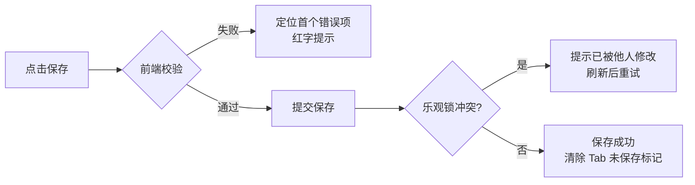

# 软件测试平台——接口管理交互设计

**文档版本**：V1.4  
**日期**：2026-08-31  
**状态**：起草中

> 本文档为 V1.2 接口测试域交互设计分册：接口管理、接口定义编辑的前端交互设计。（V1.3：第 3 章接口定义编辑器按 MeterSphere 参考重设计——多 Tab 并存、请求 Tab 带数量徽标、独立响应区；V1.3 最终仅保留单条响应定义。V1.4：请求体对齐快速调试编辑器；新增接口级验证器、提取器配置 Tab；移除编辑器 card 头部与状态开关。）
> 导航框架与色彩体系见 `docs/交互设计/全局导航与菜单交互系统设计.md`、`docs/交互设计/视觉设计.md`。
> 快速调试与导入功能见 `docs/交互设计/快速调试交互设计.md`。
> 交互原型：`docs/交互设计/接口编辑器原型.html`。

---

## 1. 概述

### 1.1 模块范围

本文档覆盖 V1.2 接口测试业务域（承接 SRS 3.2 接口管理）的两大能力：

1. **接口管理列表**——接口资产的集中管理：模块树组织、列表检索、批量操作、引用关系查看；
2. **接口定义编辑**——接口定义的完整维护：基本信息、请求参数模型（请求头/Query/REST/请求体/认证）、响应示例、提取器与断言。

快速调试（SRS 3.1）与导入功能见 `docs/交互设计/快速调试交互设计.md`。

接口定义是测试场景与 Mock 服务的数据底座，本域产出的接口资产被 `docs/交互设计/测试场景交互设计.md`、`docs/交互设计/环境管理交互设计.md`、`docs/交互设计/Mock服务交互设计.md`、`docs/交互设计/测试报告交互设计.md` 引用。

### 1.2 侧边栏菜单与路由

V1.2 项目模式顶部菜单在既有「功能测试」「缺陷管理」之外**新增「接口测试」入口**（增量见 `docs/交互设计/全局导航与菜单交互系统设计.md` 3.3）。接口测试页面内部采用侧边栏组织子模块：

```
┌──────────────────────────────────┐
│  接口测试（顶部菜单入口）          │
│  ─────────────────────────       │
│  快速调试     /workspace/projects/api-testing?tab=debug        ← 见《快速调试交互设计》
│  接口管理     /workspace/projects/api-testing?tab=interfaces   ← 本文档第 2、3 章
│  Mock 服务    /workspace/projects/api-testing?tab=mocks
│  测试场景     /workspace/projects/api-testing?tab=scenes
│  接口测试报告 /workspace/projects/api-testing?tab=reports
│  定时任务     /workspace/projects/api-testing?tab=schedules
│  ═════════════════════════════
│  项目设置（平台级 · 按业务域过滤）
│   ├ 环境管理           /workspace/projects/settings/environments
│   ├ 全局资产           /workspace/projects/settings/assets
│   └ GitLab 仓库配置    /workspace/projects/settings/gitlab-repos
└──────────────────────────────────┘
```

> Mock 服务、测试场景、报告、定时任务及快速调试、导入功能的交互设计见接口测试域其余交互设计文档；「项目设置」分组（环境管理、全局资产、GitLab 仓库配置）见对应分册与《项目设置交互设计》，本文档不重复描述。

### 1.3 业务关系

- **接口定义**是核心资产：由模块树组织，承载协议、方法、路径与完整请求参数模型，供测试场景复制/链接引用、Mock 服务继承。
- **引用保护**：被场景/Mock 引用的接口禁止删除，需先解除引用（错误码 7103）。
- 变量引用统一 `${变量名}` 语法，支持内置函数（见 `docs/交互设计/环境管理交互设计.md` 第 3 章引用帮助）。
- 变量解析优先级（低→高）：**内置函数 < 环境变量 < 场景参数 < 步骤级变量 < 步骤提取器变量 < 运行时覆盖**（见 `docs/详细设计/测试场景详细设计说明书.md` 4.1）。
- 快速调试（验证入口）与导入（资产来源）见 `docs/交互设计/快速调试交互设计.md`。

---

## 2. 接口管理列表页

**路由**：`/workspace/projects/api-testing?tab=interfaces`

### 2.1 页面布局

```
┌──────────────────────────────────────────────────────────────────┐
│  接口管理                                        [导入] [+ 新建接口] │
├──────────────┬───────────────────────────────────────────────────┤
│  搜索模块/接口 │  [搜索接口名称/路径...] [方法 ▾] [状态 ▾] [刷新 ↺]   │
│  ─────────── │  ┌─────────────────────────────────────────────┐  │
│  ▾ 用户模块   │  │ ☑ 接口名称   │方法│路径          │状态│更新人│  │
│    ▾ 注册     │  │ ☑ 用户登录   │POST│/api/auth/login│启用│张三 │  │
│      ├ 登录   │  │ ☑ 用户注册   │POST│/api/auth/reg  │启用│李四 │  │
│      └ 登出   │  │ ☐ 获取用户信息│GET │/api/users/me  │停用│王五 │  │
│    ▾ 订单     │  │ ☐ 创建订单   │POST│/api/orders    │启用│张三 │  │
│      └ 查询   │  │  （方法徽标：GET 绿 / POST 蓝 / PUT 橙 /        │  │
│  ▾ 支付模块   │  │   DELETE 红，见视觉设计.md 语义色）              │  │
│  ─────────── │  │  更新时间    │操作                              │  │
│  [未分组]     │  │  08-17 10:30│编辑│调试│复制│…                  │  │
│              │  └─────────────────────────────────────────────┘  │
│  [+ 新建模块] │  │  已选 2 项  [批量移动] [批量删除]                │  │
│              │  │              < 第1页/共3页 · 共52条 >            │  │
└──────────────┴───────────────────────────────────────────────────┘
```

- 左侧为**项目统一模块树**（project_module，多级嵌套，支持拖拽排序与右键菜单；详见《项目模块与文档管理详细设计说明书》）；右侧为**接口列表**（按选中模块过滤）。
- 行内操作菜单（点击行尾 […] 展开）：编辑 / 调试 / 复制 / 关注 / 查看引用 / 删除。

### 2.2 模块树操作

| 操作 | 触发方式 | 反馈 |
| ---- | ---- | ---- |
| 新建模块 | 点击 [+ 新建模块] 或树节点右键 [新建子模块] | 行内输入框（默认「新建模块」），回车确认、Esc 取消；名称 ≤100 字符，同级重名校验 |
| 重命名模块 | 树节点右键 [重命名] | 行内变为输入态，回车保存、Esc 取消 |
| 删除模块 | 树节点右键 [删除] | 二次确认弹窗：提示「模块下 N 个接口将移至未分组」；确认后模块删除、接口保留并归入 [未分组] |
| 排序 | 拖拽树节点 | 同级与跨级拖拽均支持；拖拽中节点浮起，松开触发排序保存；跨级拖拽时目标位置高亮 |
| 搜索过滤 | 左侧搜索框输入 | 防抖 300ms，按模块名与接口名称/路径模糊匹配；命中节点高亮，无命中显示「无匹配结果」 |
| 展开/折叠 | 点击节点箭头 | 展开态记忆于本地（浏览器缓存），刷新后保留 |
| 新建接口到模块 | 树节点右键 [新建接口] | 打开接口定义编辑器（内联，见第 3 章）并预填所属模块 |

### 2.3 列表操作

| 操作 | 触发方式 | 反馈 |
| ---- | ---- | ---- |
| 进入页面 | 侧边栏点击「接口管理」 | 加载模块树与接口列表（默认选中根节点，按更新时间倒序），骨架屏加载 |
| 搜索 | 输入框输入关键词 | 防抖 300ms 刷新列表，按接口名称/路径模糊匹配 |
| 筛选方法 | [方法 ▾] 下拉 | 全部/GET/POST/PUT/PATCH/DELETE，切换即时刷新 |
| 筛选状态 | [状态 ▾] 下拉 | 全部/启用/停用，切换即时刷新 |
| 新建接口 | 点击头部 Tab 条最右侧 [+ 新建接口] | 打开接口定义编辑器（内联，见第 3 章），默认归属当前选中模块 |
| 导入 | 点击头部 Tab 条最右侧 [导入] | 先切换回列表 Tab，再打开导入弹窗（导入功能见 `docs/交互设计/快速调试交互设计.md` 第 3 章） |
| 编辑 | 行内 [编辑] | 打开接口定义编辑器（内联，见第 3 章） |
| 调试 | 行内 [调试] | 跳转快速调试页并携带该接口的请求参数（方法、路径、请求头、请求体、Query、认证） |
| 复制 | 行内 [复制] | 弹窗输入副本名称（默认「原名称（副本）」），确认后复制接口，Toast 成功并刷新 |
| 关注/取消关注 | 行内 [关注] | 图标即时切换；关注列表在视图切换「我关注的」中可见 |
| 查看引用 | 行内 [查看引用] | 打开引用关系弹窗：展示引用该接口的场景与 Mock 清单（名称 + 跳转链接），无引用时提示「未被引用」 |
| 删除 | 行内 [删除] | 二次确认弹窗（红色警示）；被场景/Mock 引用时**禁止删除**，弹窗列出引用方清单并提示「请先解除引用」（错误码 7103） |

### 2.4 批量操作

| 操作 | 触发方式 | 反馈 |
| ---- | ---- | ---- |
| 勾选 | 表头全选或行首勾选 | 底部批量操作条浮现：「已选 N 项 [批量移动] [批量删除]」 |
| 批量移动 | 点击 [批量移动] | 打开模块选择弹窗（模块树单选），确认后所选接口移至目标模块，Toast 成功并刷新 |
| 批量删除 | 点击 [批量删除] | 二次确认弹窗（红色警示，列出数量）；含被引用接口时整体拒绝并列出引用清单，提示先解除引用 |

### 2.5 页面状态

| 状态 | 表现 |
| ---- | ---- |
| 正常态 | 模块树 + 接口表格正常渲染；方法徽标按语义色区分（GET 绿 / POST 蓝 / PUT 橙 / DELETE 红）；被引用接口名称旁显示引用计数标签 |
| 空态 | 项目无任何接口：表格区展示引导插图 + 「暂无接口，点击新建或导入」+ [新建接口] [导入] 双按钮；有筛选条件时展示「无匹配结果」+ [清除筛选]；模块树无模块时展示「暂无模块」+ [新建模块] |
| 加载态 | 首次进入骨架屏；筛选/刷新时表格上方细进度条；翻页采用表格局部 loading；模块树与列表并行加载 |
| 错误态 | 列表拉取失败：占位区展示失败原因 + [重试]；模块树拉取失败：左侧错误占位 + [重试]，右侧列表仍可浏览；删除被引用接口被拒：弹窗内明确提示引用方清单 |

---

## 3. 接口定义编辑器

> V1.3 起按 MeterSphere 参考重设计。交互原型见 `docs/交互设计/接口编辑器原型.html`。

编辑器在「接口管理」内以**多 Tab 并存**方式打开，不跳转独立路由页：编辑器 Tab 条头部最右侧固定展示 **[导入] [+ 新建接口]** 按钮；列表页行内 [编辑] / 模块树右键 [新建接口]、以及头部 [+ 新建接口] 会生成**一个新的编辑器 Tab**，可同时打开多个接口定义并在顶部 Tab 条切换（`keep-alive` 保留各 Tab 状态）。[导入] 始终优先切回列表 Tab 再弹出导入弹窗。

**刷新/直链恢复**：以 `?tab=interfaces&interfaceId=<id>`（编辑）或 `?tab=interfaces&action=create`（新建，可附加 `&moduleId=`）恢复并打开对应编辑器 Tab，约定同 `docs/交互设计/测试场景交互设计.md` 场景编辑器。

### 3.1 页面布局

```
┌──────────────────────────────────────────────────────────────────┐
│ [全部接口] │ ▶ 用户登录 × │ ▶ 创建订单(未保存) × │   [导入] [+ 新建接口] │ ← 编辑器 Tab 条
├──────────────────────────────────────────────────────────────────┤
│ http▾ [GET▾] [/api/auth/login      ]  接口名称[用户登录]  [保存]    │ ← 协议+方法+路径+名称+保存
├──────────────────────────────────────────────────────────────────┤
│ 基本信息 │ 请求头(3) │ Query 参数(1) │ 请求体 │ 认证 │ 设置        │ ← 请求 Tab(带徽标)
│ 验证器 │ 提取器                                                  │ ← 配置 Tab
├──────────────────────────────────────────────────────────────────┤
│ 请求内容编辑区（当前激活请求 Tab 的配置）                          │
├──────────────────────────────────────────────────────────────────┤
│ 响应内容/执行结果       [上下 ▤ 布局]            200 · 39ms · 1.2KB │ ← 响应区头部
│ 状态码[200▾]   响应头[+添加]    响应体[JSON|XML|Raw]  ✎格式化 ⧉复制  │
│ ┌──────────────────────────────────────────────────────────────┐ │
│ │ 响应体代码编辑器（JSON/XML/Raw，暗色/浅色，语法高亮）          │ │
│ └──────────────────────────────────────────────────────────────┘ │
└──────────────────────────────────────────────────────────────────┘
```

- **编辑器 Tab 条**：首个固定为「全部接口」列表 Tab；其后为各接口定义编辑 Tab。Tab 名默认为接口名（新建为「新接口」），未保存时 Tab 上显示未保存圆点；Tab 可关闭，关闭未保存 Tab 时弹离开确认。头部**最右侧**固定 [导入] [+ 新建接口]，始终可见（不随激活 Tab 变化）。
- **接口级信息行**：协议、方法、路径、接口名称在同一头部输入行（对齐 MeterSphere），行尾为 [保存] 按钮（新建/编辑共用，见 3.9）；**编辑器不再有 card 头部**（无返回列表 / 关注 / 版本 / 变更历史 / 删除入口，删除/关注移步列表页行内操作）。
- 编辑器内部 **上下分区**：上方请求信息区（请求 Tab + 配置 Tab），下方**独立响应区**。

### 3.2 接口级信息

| 项 | 交互 |
| ---- | ---- |
| 接口名称 | 头部输入框，必填，≤200 字符；失焦校验非空与所属模块内唯一（错误码 7102） |
| 协议 | 头部下拉：**当前版本仅 http 可选**（jdbc 为占位不可选，随场景模块开放后启用）；预留 jdbc 时隐藏方法、路径、请求体等 HTTP 配置，仅保留描述 |
| 方法 | 头部下拉：GET/POST/PUT/PATCH/DELETE（另提供 HEAD/OPTIONS），切换即时生效 |
| 路径 | 头部输入框；输入时校验以 `/` 开头；输入含 `?a=b` 时自动解析到 Query 参数并跳转 Query Tab（对齐 MeterSphere） |
| 所属模块 | 基本信息 Tab 内下拉选择模块树（含 [未分组]），新建时预填来源模块 |
| 描述 | 基本信息 Tab 内多行输入框 |

### 3.3 请求信息区（请求 Tab + 数量徽标）

请求配置按 **Tab 组织**（对齐 MeterSphere），每个 Tab 右侧显示**当前有效条目数量徽标**，为空不显示：

| 请求 Tab | 徽标口径 |
| ---- | ---- |
| 基本信息 | 无徽标；承载所属模块、描述 |
| 请求头 | 有效请求头条数（启用且名称非空） |
| Query 参数 | 有效 Query 条数 |
| 请求体 | 请求体类型非「无」时显示 1 |

- 切换 Tab 即时生效；头部输入框中包含 `?` 的路径会被拆分到 Query 参数并自动跳转 Query Tab。
- 新建接口默认激活请求头 Tab（有已填请求体时激活请求体 Tab）。

请求 Tab 之后为**接口级配置 Tab**（见 §3.6）：`验证器 / 提取器`，配置数据随接口定义整体保存。

### 3.4 请求头与 Query 参数（键值对编辑器）

| 操作 | 触发方式 | 反馈 |
| ---- | ---- | ---- |
| 添加条目 | 点击 [+ 添加] | 表格末尾追加空行进入编辑态；名称下拉自动补全常用请求头（Content-Type、Authorization、Accept 等） |
| 批量添加 | 点击 [批量添加] | 打开文本编辑弹窗，粘贴 `key: value` 多行文本，解析后预览新增清单，确认后追加 |
| 启用/禁用 | 行首开关 | 即时切换；禁用条目置灰、执行时不发送 |
| 删除条目 | 行内 [删除] | 直接删除（无二次确认，可撤销） |
| 排序 | 行内拖拽手柄 | 上下拖拽调整顺序，松开即时保存 |
| 值引用 | 值输入框输入 `$` 或 `${` | 弹出变量自动补全下拉（环境变量/场景参数/步骤级变量/提取器变量，标注来源层级） |

### 3.5 请求体编辑器

请求体编辑器**对齐快速调试**（见 `docs/交互设计/快速调试交互设计.md`），类型互斥为 **none / x-www-form-urlencoded / raw**，切换类型时**保留各类型已填内容**，切回后恢复：

| 类型 | 编辑器形态 |
| ---- | ---- |
| none | 无请求体，仅提示文案「该请求不携带请求体」 |
| x-www-form-urlencoded | 键值对表格（字段名/值）+ 启用开关 |
| raw | 深色代码编辑器（等宽字体、暗色背景、纵向伸缩）；顶部 **subtype** 下拉（text/json/xml/html/javascript）+ JSON 时「格式化」按钮 |

- 后端子域映射（对齐快速调试）：x-www-form-urlencoded → 后端 `{type:'form', content:[k=v…]}`；raw 且 subtype=json → `{type:'json'}`，其余 subtype → `{type:'raw'}`。
- 深色编辑器参考快速调试 `DebugRequestPanel` 的 raw 编辑区（#1e1e1e 背景、等宽字体、resize）。

### 3.6 接口级配置 Tab（验证器、提取器）

接口定义在请求 Tab 之后提供 **接口级配置 Tab**，配置随接口定义整体保存、回显；本期**仅定义存储**，不带入请求执行链路（执行消费留待测试场景模块，边界见 `docs/详细设计/接口管理详细设计说明书.md`）。

**Tab 结构：`验证器 / 提取器`**。

#### 3.6.1 验证器（断言）

**验证器标签**：

| 项 | 交互 |
| ---- | ---- |
| 验证器列表 | 表格：类型（状态码/JSON/响应头/响应体/正则）、字段（JSONPath 等）、运算符、期望值、启用、操作 |
| 添加验证器 | [+ 添加验证器] 打开配置表单（复用 `ValidatorForm`）：类型选择联动字段与运算符候选集（运算符含 相等/包含/正则匹配/非空等） |
| 从全局资产引入 | [从全局资产引入] 打开资产选择器，以**复制**方式引入 |

#### 3.6.2 提取器

**提取器标签**：

| 项 | 交互 |
| ---- | ---- |
| 提取器列表 | 表格：来源（响应体/响应头/响应时间）、类型（JSONPath/正则/响应头/整响应）、表达式、目标变量名、描述、操作 |
| 添加提取器 | [+ 添加提取器] 打开配置表单（复用 `ExtractorForm`/`ExtractorAssetPicker`）：来源选择联动类型候选集；表达式输入框提供语法提示 |
| 从全局资产引入 | [从全局资产引入] 打开资产选择器，以**复制**方式引入 |

- 存储：上述两组配置分别落库为接口的 `validators`、`extractors` 两列 JSONB；可空、默认空数组。

### 3.7 独立响应区（多响应定义）

响应区**独立于请求信息区**（上下分区），仅**单条响应**，存储为接口的 `responseExample`，展示形态与 `docs/交互设计/快速调试交互设计.md` 响应查看器一致：

| 项 | 交互 |
| ---- | ---- |
| 响应内容 / 执行结果 | 响应区头部两态切换：`响应内容`（编辑定义）/ `执行结果`（执行接口后的结果，见 §3.9 调试） |
| 布局切换 | 响应区右上 [上下 ▤] 切换上下 / 左右布局（默认上下） |
| 响应预览 | Pretty / Raw 两态：Pretty 暗色 JSON 树 / Raw 原文编辑，支持格式化与复制 |

响应定义区（单条响应体）：

```
响应内容/执行结果       [上下 ▤ 布局]
[Pretty] [Raw]  ✎格式化 ⧉复制
┌──────────────────────────────────────────────────────────────┐
│ 响应体：Pretty 暗色 JSON 树 / Raw 原文编辑                     │
└──────────────────────────────────────────────────────────────┘
```

### 3.8 保存、取消与执行

| 操作 | 触发方式 | 反馈 |
| ---- | ---- | ---- |
| 关闭 Tab | 点击编辑器 Tab × | 存在未保存修改时弹离开确认「有未保存的修改，确定离开？」 |
| 保存 | 点击 [保存] / Ctrl+S | 前端全量校验（名称非空且模块内唯一、路径格式、请求体/响应体 JSON 合法）→ 提交；成功 Toast + 清除 Tab 未保存标记；乐观锁冲突（409）提示「接口已被他人修改，请刷新后重试」 |
| 执行 | 点击 [▶ 执行] | 将当前请求配置发送调试，结果展示于响应区「执行结果」态（复用 `docs/交互设计/快速调试交互设计.md` 执行链路与结果查看器） |

保存流程：



### 3.10 页面状态

| 状态 | 表现 |
| ---- | ---- |
| 正常态 | 编辑器 Tab 条 + 头部 + 请求 Tab + 独立响应区正常渲染；未保存 Tab 显示圆点；响应默认 Tab 显示默认标记 |
| 空态 | 新建接口：各请求 Tab 为空占位（请求头/Query 展示「暂无配置，点击添加」）；验证器、提取器为空展示「暂无配置，点击添加」 |
| 加载态 | 打开已保存接口编辑器整体骨架屏；保存/执行按钮 loading + 禁用；响应体编辑器加载中占位 |
| 错误态 | 详情加载失败：Tab 内全屏错误占位 + [重试]；保存失败：Toast 明确原因（名称重复 7102、校验错误定位首个错误项红字）；接口不存在（7101）：提示并关闭该 Tab |

---

## 4. 通用交互模式

本部分涉及的通用交互模式遵循 `docs/交互设计/快速调试交互设计.md` 第 4 章的约定：

- **弹窗类型**：表单弹窗用于复制接口命名；确认弹窗用于删除模块/接口、批量删除、离开未保存页面；引用弹窗用于查看引用关系；帮助弹窗用于变量引用帮助；
- **加载与错误状态**：页面/详情首次加载骨架屏，筛选/刷新/翻页时表格细进度条；保存/提交按钮 loading + 禁用；校验错误表单内红字定位首个错误项；业务错误码（7101/7102/7103）以中文文案 Toast 或弹窗提示；乐观锁冲突（409）提示「接口已被他人修改，请刷新后重试」；
- **键盘快捷键**：Ctrl+S 保存、Esc 取消行内编辑、Enter 行内编辑确认、Alt+↑/↓ 键值对辅助排序；
- **拖拽约定**：模块树节点同级/跨级拖拽排序，请求头/参数键值对行内排序。

---

**文档结束**
