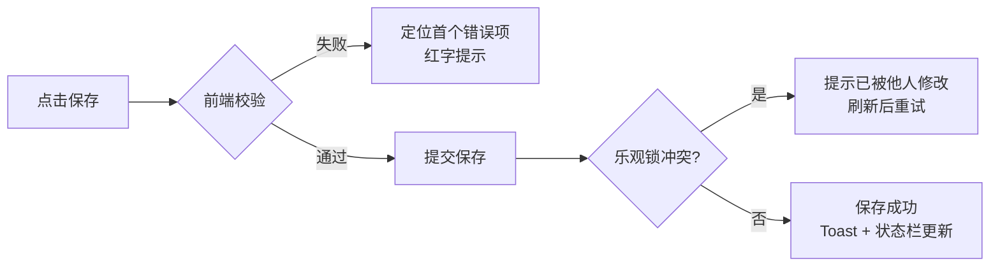

# 软件测试平台——接口管理交互设计

**文档版本**：V1.2  
**日期**：2026-08-17  
**状态**：起草中

> 本文档为 V1.2 接口测试域交互设计分册：接口管理、接口定义编辑的前端交互设计。
> 导航框架与色彩体系见 `docs/交互设计/全局导航与菜单交互系统设计.md`、`docs/交互设计/视觉设计.md`。
> 快速调试与导入功能见 `docs/交互设计/快速调试交互设计.md`。

---

## 1. 概述

### 1.1 模块范围

本文档覆盖 V1.2 接口测试业务域（承接 SRS 3.2 接口管理）的两大能力：

1. **接口管理列表**——接口资产的集中管理：模块树组织、列表检索、批量操作、引用关系查看；
2. **接口定义编辑**——接口定义的完整维护：基本信息、请求参数模型（请求头/Query/REST/请求体/认证）、响应示例、公共步骤、提取器与断言。

快速调试（SRS 3.1）与导入功能见 `docs/交互设计/快速调试交互设计.md`。

接口定义是测试场景与 Mock 服务的数据底座，本域产出的接口资产被 `docs/交互设计/测试场景交互设计.md`、`docs/交互设计/环境管理交互设计.md`、`docs/交互设计/Mock服务交互设计.md`、`docs/交互设计/测试报告交互设计.md` 引用。

### 1.2 侧边栏菜单与路由

V1.2 项目模式顶部菜单在既有「功能测试」「缺陷管理」之外**新增「接口测试」入口**（增量见 `docs/交互设计/全局导航与菜单交互系统设计.md` 3.3）。接口测试页面内部采用侧边栏组织子模块：

```
┌──────────────────────────────────┐
│  接口测试（顶部菜单入口）          │
│  ─────────────────────────       │
│  快速调试     /workspace/projects/api-testing/debug        ← 见《快速调试交互设计》
│  接口管理     /workspace/projects/api-testing/interfaces   ← 本文档第 2、3 章
│  Mock 服务    /workspace/projects/api-testing/mocks
│  测试场景     /workspace/projects/api-testing/scenes
│  接口测试报告 /workspace/projects/api-testing/reports
│  定时任务     /workspace/projects/api-testing/schedules
│  ═════════════════════════════
│  项目设置（平台级 · 按业务域过滤）
│   ├ 环境管理           /workspace/projects/settings/environments
│   ├ 全局资产           /workspace/projects/settings/assets
│   ├ GitLab 仓库配置    /workspace/projects/settings/gitlab-repos
│   └ 安全策略与应用设置 /workspace/projects/settings/security
└──────────────────────────────────┘
```

> Mock 服务、测试场景、报告、定时任务及快速调试、导入功能的交互设计见接口测试域其余交互设计文档；「项目设置」分组（环境管理、全局资产、GitLab 仓库配置、安全策略与应用设置）见对应分册与《项目设置交互设计》，本文档不重复描述。

### 1.3 业务关系

- **接口定义**是核心资产：由模块树组织，承载协议、方法、路径与完整请求参数模型，供测试场景复制/链接引用、Mock 服务继承。
- **引用保护**：被场景/Mock 引用的接口禁止删除，需先解除引用（错误码 7103）。
- 变量引用统一 `${变量名}` 语法，支持内置函数（见 `docs/交互设计/环境管理交互设计.md` 第 3 章引用帮助）。
- 变量解析优先级（低→高）：**内置函数 < 环境变量 < 场景参数 < 步骤级变量 < 步骤提取器变量 < 运行时覆盖**（见 `docs/详细设计/测试场景详细设计说明书.md` 4.1）。
- 快速调试（验证入口）与导入（资产来源）见 `docs/交互设计/快速调试交互设计.md`。

---

## 2. 接口管理列表页

**路由**：`/workspace/projects/api-testing/interfaces`

### 2.1 页面布局

```
┌──────────────────────────────────────────────────────────────────┐
│  接口管理                                        [导入] [+ 新建接口] │
├──────────────┬───────────────────────────────────────────────────┤
│  搜索模块/接口 │  [搜索接口名称/路径...] [方法 ▾] [状态 ▾] [刷新 ↺]   │
│  ─────────── │  ┌─────────────────────────────────────────────┐  │
│  ▾ 用户模块   │  │ ☑ 接口名称   │方法│路径          │状态│更新人│  │
│    ▾ 注册     │  │ ☑ 用户登录   │POST│/api/auth/login│启用│张三 │  │
│      ├ 登录   │  │ ☑ 用户注册   │POST│/api/auth/reg  │启用│李四 │  │
│      └ 登出   │  │ ☐ 获取用户信息│GET │/api/users/me  │停用│王五 │  │
│    ▾ 订单     │  │ ☐ 创建订单   │POST│/api/orders    │启用│张三 │  │
│      └ 查询   │  │  （方法徽标：GET 绿 / POST 蓝 / PUT 橙 /        │  │
│  ▾ 支付模块   │  │   DELETE 红，见视觉设计.md 语义色）              │  │
│  ─────────── │  │  更新时间    │操作                              │  │
│  [未分组]     │  │  08-17 10:30│编辑│调试│复制│…                  │  │
│              │  └─────────────────────────────────────────────┘  │
│  [+ 新建模块] │  │  已选 2 项  [批量移动] [批量删除]                │  │
│              │  │              < 第1页/共3页 · 共52条 >            │  │
└──────────────┴───────────────────────────────────────────────────┘
```

- 左侧为**项目统一模块树**（project_module，多级嵌套，支持拖拽排序与右键菜单；详见《项目模块与文档管理详细设计说明书》）；右侧为**接口列表**（按选中模块过滤）。
- 行内操作菜单（点击行尾 […] 展开）：编辑 / 调试 / 复制 / 关注 / 查看引用 / 删除。

### 2.2 模块树操作

| 操作 | 触发方式 | 反馈 |
| ---- | ---- | ---- |
| 新建模块 | 点击 [+ 新建模块] 或树节点右键 [新建子模块] | 行内输入框（默认「新建模块」），回车确认、Esc 取消；名称 ≤100 字符，同级重名校验 |
| 重命名模块 | 树节点右键 [重命名] | 行内变为输入态，回车保存、Esc 取消 |
| 删除模块 | 树节点右键 [删除] | 二次确认弹窗：提示「模块下 N 个接口将移至未分组」；确认后模块删除、接口保留并归入 [未分组] |
| 排序 | 拖拽树节点 | 同级与跨级拖拽均支持；拖拽中节点浮起，松开触发排序保存；跨级拖拽时目标位置高亮 |
| 搜索过滤 | 左侧搜索框输入 | 防抖 300ms，按模块名与接口名称/路径模糊匹配；命中节点高亮，无命中显示「无匹配结果」 |
| 展开/折叠 | 点击节点箭头 | 展开态记忆于本地（浏览器缓存），刷新后保留 |
| 新建接口到模块 | 树节点右键 [新建接口] | 跳转接口定义编辑页并预填所属模块 |

### 2.3 列表操作

| 操作 | 触发方式 | 反馈 |
| ---- | ---- | ---- |
| 进入页面 | 侧边栏点击「接口管理」 | 加载模块树与接口列表（默认选中根节点，按更新时间倒序），骨架屏加载 |
| 搜索 | 输入框输入关键词 | 防抖 300ms 刷新列表，按接口名称/路径模糊匹配 |
| 筛选方法 | [方法 ▾] 下拉 | 全部/GET/POST/PUT/PATCH/DELETE，切换即时刷新 |
| 筛选状态 | [状态 ▾] 下拉 | 全部/启用/停用，切换即时刷新 |
| 新建接口 | 点击 [+ 新建接口] | 跳转接口定义编辑页（见第 3 章），默认归属当前选中模块 |
| 导入 | 点击 [导入] | 打开导入弹窗（导入功能见 `docs/交互设计/快速调试交互设计.md` 第 3 章） |
| 编辑 | 行内 [编辑] | 跳转接口定义编辑页 `/workspace/projects/api-testing/interfaces/:interfaceId/edit` |
| 调试 | 行内 [调试] | 跳转快速调试页并携带该接口的请求参数（方法、路径、请求头、请求体、Query、认证） |
| 复制 | 行内 [复制] | 弹窗输入副本名称（默认「原名称（副本）」），确认后复制接口及其公共步骤，Toast 成功并刷新 |
| 关注/取消关注 | 行内 [关注] | 图标即时切换；关注列表在视图切换「我关注的」中可见 |
| 查看引用 | 行内 [查看引用] | 打开引用关系弹窗：展示引用该接口的场景与 Mock 清单（名称 + 跳转链接），无引用时提示「未被引用」 |
| 删除 | 行内 [删除] | 二次确认弹窗（红色警示）；被场景/Mock 引用时**禁止删除**，弹窗列出引用方清单并提示「请先解除引用」（错误码 7103） |

### 2.4 批量操作

| 操作 | 触发方式 | 反馈 |
| ---- | ---- | ---- |
| 勾选 | 表头全选或行首勾选 | 底部批量操作条浮现：「已选 N 项 [批量移动] [批量删除]」 |
| 批量移动 | 点击 [批量移动] | 打开模块选择弹窗（模块树单选），确认后所选接口移至目标模块，Toast 成功并刷新 |
| 批量删除 | 点击 [批量删除] | 二次确认弹窗（红色警示，列出数量）；含被引用接口时整体拒绝并列出引用清单，提示先解除引用 |

### 2.5 页面状态

| 状态 | 表现 |
| ---- | ---- |
| 正常态 | 模块树 + 接口表格正常渲染；方法徽标按语义色区分（GET 绿 / POST 蓝 / PUT 橙 / DELETE 红）；被引用接口名称旁显示引用计数标签 |
| 空态 | 项目无任何接口：表格区展示引导插图 + 「暂无接口，点击新建或导入」+ [新建接口] [导入] 双按钮；有筛选条件时展示「无匹配结果」+ [清除筛选]；模块树无模块时展示「暂无模块」+ [新建模块] |
| 加载态 | 首次进入骨架屏；筛选/刷新时表格上方细进度条；翻页采用表格局部 loading；模块树与列表并行加载 |
| 错误态 | 列表拉取失败：占位区展示失败原因 + [重试]；模块树拉取失败：左侧错误占位 + [重试]，右侧列表仍可浏览；删除被引用接口被拒：弹窗内明确提示引用方清单 |

---

## 3. 接口定义编辑页

**路由**：`/workspace/projects/api-testing/interfaces/:interfaceId/edit`（新建时 `/workspace/projects/api-testing/interfaces/new`）

### 3.1 页面布局

```
┌──────────────────────────────────────────────────────────────────┐
│ ← 返回列表  用户登录                    [调试] [取消] [保存]        │
│ 所属模块 [用户模块 ▾]   协议 [http]    方法 [POST ▾]               │
│ 路径 [/api/auth/login]  描述 [用户登录接口]                        │
├──────────────────────────────────────────────────────────────────┤
│  [基本信息] [请求头] [Query 参数] [请求体] [提取器] [断言] [公共步骤] │
├──────────────────────────────────────────────────────────────────┤
│  请求头（键值对编辑器）                                            │
│  ┌────────────────────────────────────────────────────────────┐  │
│  │ 启用│名称              │值                    │操作          │  │
│  │ [✓]│Content-Type     │application/json      │删除          │  │
│  │ [✓]│Authorization    │${token}              │删除          │  │
│  │ [+ 添加请求头]  [批量添加]  （名称下拉自动补全常用头）          │  │
│  └────────────────────────────────────────────────────────────┘  │
│  响应示例（基本信息标签页内折叠区）                                 │
│  状态码 [200]  响应头/响应体（JSON 编辑器，支持格式化）             │
├──────────────────────────────────────────────────────────────────┤
│  底部状态栏：有未保存的修改 · 公共步骤 2 个 · 被引用 3 次            │
└──────────────────────────────────────────────────────────────────┘
```

- 页头承载**名称、所属模块、协议、方法、路径、描述**与 [调试] [取消] [保存] 操作；
- 页头下方为**标签页**：基本信息 / 请求头 / Query 参数 / 请求体 / 提取器 / 断言 / 公共步骤；
- 基本信息标签页内含响应示例折叠区与 REST 参数编辑区。

### 3.2 页头与基本信息

| 项 | 交互 |
| ---- | ---- |
| 接口名称 | 输入框，必填，≤200 字符；失焦校验非空与所属模块内唯一（错误码 7102） |
| 所属模块 | 下拉选择模块树（含 [未分组]），新建时预填来源模块 |
| 协议 | 下拉：http / jdbc（jdbc 时方法、路径、请求体等 HTTP 配置区隐藏，仅保留描述与公共步骤） |
| 方法 | 下拉：GET/POST/PUT/PATCH/DELETE，切换即时生效 |
| 路径 | 输入框，支持路径参数占位 `{id}`；输入时校验以 `/` 开头 |
| 描述 | 多行输入框 |
| REST 参数 | 路径占位符对应值键值对列表；未提供值时按字面 `{id}` 发送并在校验提示中告知（见需求 3.7） |
| 响应示例 | 折叠区：状态码输入 + 响应头键值对 + 响应体 JSON 编辑器（支持格式化与语法高亮） |

### 3.3 请求头与 Query 参数（键值对编辑器）

| 操作 | 触发方式 | 反馈 |
| ---- | ---- | ---- |
| 添加条目 | 点击 [+ 添加] | 表格末尾追加空行进入编辑态；名称下拉自动补全常用请求头（Content-Type、Authorization、Accept 等） |
| 批量添加 | 点击 [批量添加] | 打开文本编辑弹窗，粘贴 `key: value` 多行文本，解析后预览新增清单，确认后追加 |
| 启用/禁用 | 行首开关 | 即时切换；禁用条目置灰、执行时不发送 |
| 删除条目 | 行内 [删除] | 直接删除（无二次确认，可撤销） |
| 排序 | 行内拖拽手柄 | 上下拖拽调整顺序，松开即时保存 |
| 值引用 | 值输入框输入 `$` 或 `${` | 弹出变量自动补全下拉（环境变量/场景参数/步骤级变量/提取器变量，标注来源层级） |

### 3.4 请求体编辑器

请求体类型互斥（none / json / form-data / raw / binary），切换类型时**保留各类型已填内容**，切回后恢复（见需求 3.7）：

| 类型 | 编辑器形态 |
| ---- | ---- |
| none | 无请求体，仅提示文案 |
| json | 代码编辑器（JSON 语法高亮 + 格式化按钮 + 校验提示）；支持变量引用与内置函数 |
| form-data | 键值对表格：字段类型下拉（string/integer/number/array/json/file），file 类型支持本地上传或关联平台文件 |
| x-www-form-urlencoded | 键值对表格 + URL 编码开关 |
| raw | 原始文本编辑器 + Content-Type 自定义输入框 |
| binary | 文件选择区（拖拽上传或点击选择） |

### 3.5 提取器与断言

**提取器标签**：

| 项 | 交互 |
| ---- | ---- |
| 提取器列表 | 表格：来源（响应体/响应头/响应时间）、类型（JSONPath/正则/响应头/整响应）、表达式、目标变量名、描述；行内编辑/删除 |
| 添加提取器 | [+ 添加提取器] 打开配置表单：来源选择联动类型候选集（响应体→JSONPath/正则，响应头→响应头，整响应→整响应）；表达式输入框提供语法提示 |
| 从全局资产引入 | [从全局资产引入] 打开资产选择器，勾选后以**复制**方式引入（见需求 3.8） |

**断言标签**：

| 项 | 交互 |
| ---- | ---- |
| 断言列表 | 表格：类型（状态码/JSON/响应头/响应体/响应时间）、字段、运算符、期望值、描述；行内编辑/删除 |
| 添加断言 | [+ 添加断言] 打开配置表单：类型选择联动字段与运算符候选集（如 JSON 类型提供 JSONPath 输入框，运算符含相等/包含/正则匹配/非空等，见需求 3.9） |
| 从全局资产引入 | 同提取器，复制方式引入（见需求 3.9） |

### 3.6 公共步骤（api_interface_step）

公共步骤为接口定义下维护的可复用请求步骤集合（http/jdbc 取样器），供场景配置时选择添加（见需求 3.2）。

```
┌──────────────────────────────────────────────────────────────────┐
│  公共步骤                                        [+ 添加步骤]      │
│  ┌────────────────────────────────────────────────────────────┐  │
│  │ 排序│启用│步骤名称      │类型 │请求摘要          │操作        │  │
│  │ 1  │[✓]│登录验证      │http │POST /api/auth/…  │编辑│删除   │  │
│  │ 2  │[✓]│清理测试数据  │jdbc │数据源:测试库     │编辑│删除   │  │
│  │ 3  │[ ]│获取用户信息  │http │GET /api/users/me │编辑│删除   │  │
│  │ （拖拽手柄调整顺序；禁用步骤置灰不参与引用）                  │  │
│  └────────────────────────────────────────────────────────────┘  │
│  提示：公共步骤供项目内场景在配置时选择添加（复制或链接引用）        │
└──────────────────────────────────────────────────────────────────┘
```

| 操作 | 触发方式 | 反馈 |
| ---- | ---- | ---- |
| 添加步骤 | 点击 [+ 添加步骤] | 打开步骤配置弹窗：步骤名称、类型（http/jdbc）、请求配置（http：方法/URL/请求头/请求体/Query/认证；jdbc：数据源下拉 + SQL 编辑区 + 查询类型）、提取器、断言、启用开关 |
| 编辑步骤 | 行内 [编辑] | 打开同结构弹窗回显配置 |
| 删除步骤 | 行内 [删除] | 二次确认；被场景链接引用时**禁止删除**，提示先解除引用（错误码 7104） |
| 排序 | 拖拽手柄 | 上下拖拽调整顺序，松开即时保存 |
| 启用/禁用 | 行首开关 | 即时切换；禁用步骤置灰，场景引用时默认不执行 |

### 3.7 保存、取消与调试

| 操作 | 触发方式 | 反馈 |
| ---- | ---- | ---- |
| 返回列表 | 点击 [← 返回列表] | 存在未保存修改时弹离开确认「有未保存的修改，确定离开？」 |
| 保存 | 点击 [保存] | 前端全量校验（名称非空且模块内唯一、路径格式、请求体 JSON 合法）→ 提交；成功 Toast + 底部状态栏「已保存 HH:mm:ss」；乐观锁冲突（409）提示「接口已被他人修改，请刷新后重试」 |
| 取消 | 点击 [取消] | 同返回列表的离开确认 |
| 调试 | 点击 [调试] | 自动保存未保存修改 → 跳转快速调试页并携带本接口的请求参数（反向流程见 `docs/交互设计/快速调试交互设计.md` 2.6 保存为接口定义） |

保存流程：



### 3.8 页面状态

| 状态 | 表现 |
| ---- | ---- |
| 正常态 | 页头 + 标签页正常渲染；底部状态栏实时显示未保存标记、公共步骤数与引用计数 |
| 空态 | 新建接口：各标签页为空占位（请求头/Query/提取器/断言展示「暂无配置，点击添加」）；公共步骤为空展示「暂无公共步骤，点击添加」 |
| 加载态 | 进入页面整体骨架屏；保存/调试按钮 loading + 禁用；响应示例 JSON 编辑器加载中占位 |
| 错误态 | 详情加载失败：全屏错误占位 + [重试]；保存失败：Toast 明确原因（名称重复 7102、校验错误定位首个错误项红字）；接口不存在（7101）：提示并返回列表 |

---

## 4. 通用交互模式

本部分涉及的通用交互模式遵循 `docs/交互设计/快速调试交互设计.md` 第 4 章的约定：

- **弹窗类型**：表单弹窗用于复制接口命名；确认弹窗用于删除模块/接口、批量删除、离开未保存页面；引用弹窗用于查看引用关系；帮助弹窗用于变量引用帮助；
- **加载与错误状态**：页面/详情首次加载骨架屏，筛选/刷新/翻页时表格细进度条；保存/提交按钮 loading + 禁用；校验错误表单内红字定位首个错误项；业务错误码（7101/7102/7103/7104）以中文文案 Toast 或弹窗提示；乐观锁冲突（409）提示「接口已被他人修改，请刷新后重试」；
- **键盘快捷键**：Ctrl+S 保存、Esc 取消行内编辑、Enter 行内编辑确认、Alt+↑/↓ 键值对辅助排序；
- **拖拽约定**：模块树节点同级/跨级拖拽排序，公共步骤列表垂直拖拽排序，请求头/参数键值对行内排序。

---

**文档结束**
