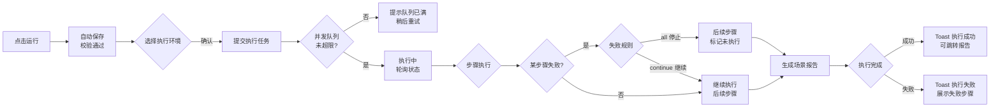
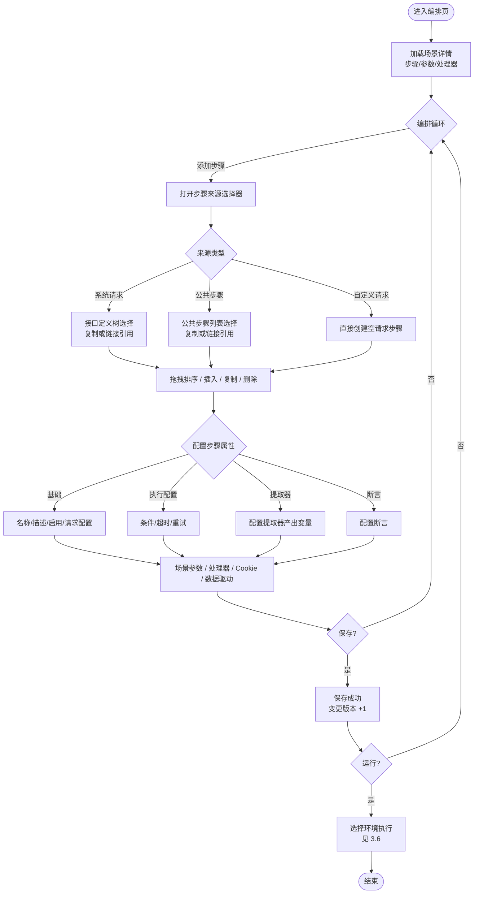

# 软件测试平台——测试场景与环境管理页面交互设计

**文档版本**：V1.2  
**日期**：2026-08-17  
**状态**：起草中

> 本文档为 V1.2 接口测试域交互设计的第二部分：测试场景编排、步骤管理与环境管理的前端交互设计。
> 导航框架与色彩体系见 `docs/交互设计/全局导航与菜单交互系统设计.md`、`docs/交互设计/视觉设计.md`。

---

## 1. 概述

### 1.1 模块范围

本文档覆盖 V1.2 接口测试业务域（承接 SRS 3.4 测试场景、3.5 环境管理）的两大能力：

1. **测试场景**——场景 CRUD、步骤编排（http/jdbc 取样器）、场景参数、场景级处理器、数据驱动配置、场景执行；
2. **环境管理**——环境 CRUD、默认配置（http 默认配置）、环境变量、数据源、全局前置/后置处理器、环境导入导出。

### 1.2 侧边栏菜单与路由

V1.2 项目模式顶部菜单在既有「功能测试」「缺陷管理」之外**新增「接口测试」入口**（增量见 `docs/交互设计/全局导航与菜单交互系统设计.md` 3.3）。接口测试页面内部采用侧边栏组织子模块：

```
┌─────────────────────────────┐
│  接口测试（顶部菜单入口）      │
│  ─────────────────────────   │
│  快速调试     /project/api/debug
│  接口管理     /project/api/interfaces
│  Mock 服务    /project/api/mocks
│  测试场景     /project/api/scenes       ← 本文档第 2、3 章
│  环境管理     /project/api/environments ← 本文档第 4、5 章
│  接口测试报告 /project/api/reports
│  全局资产     /project/api/assets
│  定时任务     /project/api/schedules
└─────────────────────────────┘
```

> 快速调试、接口管理、Mock 服务、报告、全局资产、定时任务的交互设计见接口测试域交互设计第一部分及对应文档，本文档不重复描述。

### 1.3 场景与环境的业务关系

- **场景**是核心执行单元：由**步骤**（http/jdbc 取样器）按顺序编排而成，步骤可来源于接口定义（复制或链接引用）、公共步骤或自定义请求。
- **环境**为执行提供变量、Base URL、默认配置、数据源与全局处理器；场景执行时必须选择目标环境（可配置默认环境）。
- 变量解析优先级（低→高）：**内置函数 < 环境变量 < 场景参数 < 步骤提取器变量 < 运行时覆盖**（见 `docs/详细设计/测试场景与环境管理详细设计说明书.md` 4.1）。
- 配置合并优先级（低→高）：**环境默认配置 < 场景级配置 < 步骤级配置**，同名配置项以高优先级覆盖。

---

## 2. 场景管理列表页

**路由**：`/project/api/scenes`

### 2.1 页面布局

```
┌──────────────────────────────────────────────────────────────┐
│  测试场景                            [+ 新建场景] [导入场景]  │
├──────────────────────────────────────────────────────────────┤
│  [搜索场景名称...        ] [状态 ▾] [模块 ▾]      [刷新 ↺]    │
├──────────────────────────────────────────────────────────────┤
│  场景名称      │描述       │步骤数│最近执行状态│最近执行时间│操作│
│  登录流程测试  │登录并提取…│  5  │ [成功]    │08-17 10:30 │…  │
│  下单流程回归  │下单全链路…│  3  │ [失败]    │08-16 09:12 │…  │
│  支付回调测试  │支付回调验…│  8  │ [执行中]  │08-16 15:40 │…  │
├──────────────────────────────────────────────────────────────┤
│                        < 第1页/共2页 · 共18条 >               │
└──────────────────────────────────────────────────────────────┘
```

行内操作菜单（点击行尾 […] 展开）：编辑 / 执行 / 复制 / 查看报告 / 创建定时任务 / 删除。

### 2.2 交互说明

| 操作 | 触发方式 | 反馈 |
| ---- | ---- | ---- |
| 进入页面 | 侧边栏点击「测试场景」 | 拉取场景列表（默认按更新时间倒序），表格骨架屏加载 |
| 搜索 | 输入框输入关键词 | 防抖 300ms 刷新列表，按场景名称模糊匹配 |
| 筛选 | [状态] 下拉选择 | 支持全部/成功/失败/执行中/未执行；切换即时刷新 |
| 筛选 | [模块] 下拉选择 | 按场景归属模块树筛选；选项来自接口模块树（复用接口管理模块树） |
| 新建场景 | 点击 [+ 新建场景] | 打开新建弹窗（场景名称必填、模块选择、描述），确认后创建并**跳转场景编排页** |
| 导入场景 | 点击 [导入场景] | 打开导入弹窗（从 GitLab 仓库可执行导入，见需求 3.4）；展示解析出的场景清单，支持勾选导入 |
| 编辑 | 行内 [编辑] | 跳转场景编排页 `/project/api/scenes/:sceneId/edit` |
| 执行 | 行内 [执行] | 打开快速执行弹窗（见 2.3） |
| 复制 | 行内 [复制] | 弹窗输入副本名称（默认「原名称（副本）」），确认后复制场景及其全部步骤，Toast 成功并刷新列表 |
| 查看报告 | 行内 [查看报告] | 跳转接口测试报告列表（按该场景筛选），见报告交互设计 |
| 创建定时任务 | 行内 [创建定时任务] | 跳转定时任务页并预填该场景，见定时任务交互设计 |
| 删除 | 行内 [删除] | 二次确认弹窗（红色警示）；被定时任务引用的场景删除被拒并提示原因 |

### 2.3 快速执行

行内 [执行] 打开快速执行弹窗（宽 480px）：

```
┌──────────────────────────────────┐
│  执行场景：登录流程测试            │
│  执行环境  [测试环境 ▾]           │
│            （默认选中场景默认环境）│
│            预发环境               │
│            生产环境（需确认）     │
│  [取消]              [开始执行]   │
└──────────────────────────────────┘
```

| 操作 | 触发方式 | 反馈 |
| ---- | ---- | ---- |
| 选择环境 | 下拉选择 | 默认选中场景默认环境；无默认环境时置灰 [开始执行] 并提示先配置默认环境 |
| 开始执行 | 点击 [开始执行] | 提交执行任务，关闭弹窗；行内状态徽标变更为「执行中」，前端轮询执行状态（2 秒间隔） |
| 执行完成 | 状态轮询返回结果 | 行内徽标更新为成功/失败，Toast 提示结果；点击徽标跳转报告详情 |
| 执行失败 | 任务提交被拒（如并发队列满） | 弹窗内提示失败原因（「并发队列已满，请稍后重试」），[开始执行] 恢复可点 |

### 2.4 页面状态

| 状态 | 表现 |
| ---- | ---- |
| 正常态 | 表格展示场景列表；默认环境场景名称旁显示默认环境名标签 |
| 空态 | 无任何场景时展示引导插图 + 文案「暂无场景，创建第一个测试场景」+ [新建场景] 主按钮；有筛选条件时展示「无匹配结果」+ [清除筛选] |
| 加载态 | 首次进入骨架屏；筛选/刷新时表格上方细进度条；翻页采用表格局部 loading |
| 错误态 | 列表拉取失败：占位区展示失败原因 + [重试] 按钮；执行环境列表拉取失败：弹窗内提示 + [重试]，不阻断浏览列表 |

---

## 3. 场景编排页

**路由**：`/project/api/scenes/:sceneId/edit`

### 3.1 页面布局

```
┌────────────────────────────────────────────────────────────────┐
│ ← 返回列表  登录流程测试                     [保存] [运行]       │
│ 描述：登录并提取 token，访问个人中心                [▾ 更多]     │
├───────────────────────────────┬────────────────────────────────┤
│ [+ 添加步骤] [数据驱动 ▾]     │  [步骤属性][场景参数][处理器]    │
│ ── 数据驱动（展开时显示）───  │  [Cookie]                      │
│ 步骤列表（垂直卡片）          │  基础 │执行配置│提取器│断言│数据 │
│ 1 [▶] 发送登录请求            │  步骤名称  [发送登录请求      ] │
│    POST /api/auth/login [✓]  │  步骤描述  [验证登录成功      ] │
│ 2 [▶] 获取用户信息            │  类型  [http]  来源 [系统请求]  │
│    GET  /api/user/info        │  启用  [●]  （链接引用可独立调  │
│ 3 [▶] 清理测试数据            │  整启用状态与参数值）           │
│    JDBC 数据源:测试库          │  请求配置区（按类型渲染）…      │
│                               │                                │
│  （拖拽手柄调整顺序）          │                                │
│                               │                                │
├───────────────────────────────┴────────────────────────────────┤
│  底部状态栏：共 3 个步骤 · 2 个启用 · 有未保存的修改            │
└────────────────────────────────────────────────────────────────┘
```

- 主区域为**步骤列表**（垂直卡片，拖拽排序）；右侧为**属性面板**，面板顶部标签切换步骤属性 / 场景参数 / 处理器 / Cookie。
- 选中步骤卡片后右侧切换至「步骤属性」标签，内部再分子标签：基础 / 执行配置 / 提取器 / 断言 / 数据绑定。

### 3.2 步骤列表操作

| 操作 | 触发方式 | 反馈 |
| ---- | ---- | ---- |
| 添加步骤 | 点击 [+ 添加步骤] | 打开步骤来源选择器（见 3.3），选择后插入到当前选中步骤之后（无选中时追加到末尾），步骤自动编号 |
| 展开/折叠步骤 | 点击卡片标题左侧 [▶]/[▼] | 展开后展示该步骤概要信息（方法、URL/数据源、断言数、提取器数） |
| 选中步骤 | 点击步骤卡片 | 卡片高亮，右侧面板切换至该步骤的「步骤属性」并回显配置 |
| 编辑步骤属性 | 在右侧面板修改 | 面板内即时校验；修改标记为脏状态，底部状态栏提示「有未保存的修改」 |
| 排序 | 拖动卡片左侧拖拽手柄 | 拖拽过程中卡片浮起，松开后触发重排序，序号即时重排 |
| 插入步骤 | 卡片悬停浮现 [+ 在之前插入] | 打开步骤来源选择器，插入到该步骤之前 |
| 复制步骤 | 卡片悬停 [复制] | 在该步骤之后插入完全相同的副本（复制模式，与原步骤无关联） |
| 启用/禁用 | 卡片左侧启用开关 | 即时切换；禁用步骤置灰、不参与执行，序号保留 |
| 调试单步骤 | 卡片悬停 [执行] | 仅执行该步骤（使用当前环境配置），下方弹出单步骤执行结果浮层 |
| 删除步骤 | 卡片悬停 [删除] | 二次确认（引用源被删除的链接步骤仅提供此操作）；删除后后续步骤序号前移 |

### 3.3 步骤来源选择器（添加步骤弹窗）

```
┌────────────────────────────────────────────────┐
│  添加步骤                                         │
│  ┌──────────┐ ┌──────────┐ ┌──────────┐          │
│  │ 系统请求  │ │ 公共步骤  │ │ 自定义请求 │          │
│  │ 从接口定义│ │ 从公共步骤│ │ 手工构造  │          │
│  └──────────┘ └──────────┘ └──────────┘          │
│  ┌ 接口定义列表（左侧树） ┬ 已选步骤（右侧）────┐  │
│  │ 登录模块               │ [✓] 登录接口          │  │
│  │   ├ 登录接口           │ [✓] 用户信息接口      │  │
│  │   ├ 登出接口           │                       │  │
│  │ 用户模块               │                       │  │
│  │   └ 个人中心           │                       │  │
│  └───────────────────────┴──────────────────────┘  │
│  导入模式   (●) 复制  ( ) 链接引用                  │
│  参数策略   [优先当前场景参数 ▾]                     │
│  环境策略   [使用当前环境 ▾]                        │
│  [取消]                                  [添加]     │
└────────────────────────────────────────────────┘
```

| 操作 | 触发方式 | 反馈 |
| ---- | ---- | ---- |
| 选择来源类型 | 切换顶部三个来源标签 | 「系统请求」展示接口定义树；「公共步骤」展示当前项目所有接口的公共步骤列表；「自定义请求」隐藏选择器，确认后直接创建空请求步骤 |
| 勾选接口/步骤 | 勾选条目 | 实时回显到右侧已选列表，支持批量多选 |
| 选择导入模式 | 单选复制/链接引用 | 链接引用提示「步骤内容将跟随源更新，可独立调整启用状态与参数值」 |
| 选择参数策略 | [优先当前场景参数 ▾] | 下拉选项：优先当前场景参数 / 优先原接口参数 |
| 选择环境策略 | [使用当前环境 ▾] | 下拉选项：使用当前环境 / 使用原接口环境 |
| 添加 | 点击 [添加] | 关闭弹窗，按序插入步骤卡片；链接引用步骤卡片带「链」标识，复制步骤无标识 |
| 链接引用源被删除 | 运行时检测 | 步骤置灰并标注「源已删除，使用快照」，仅保留 [移除] 操作（见 `docs/详细设计/测试场景与环境管理详细设计说明书.md` 4.4） |

### 3.4 步骤属性面板

**基础标签**：

| 项 | 交互 |
| ---- | ---- |
| 步骤名称 | 输入框，必填，≤200 字符，失焦校验非空 |
| 步骤描述 | 多行输入框 |
| 类型与来源 | 只读标识：[http]/[jdbc]、[系统请求]/[公共步骤]/[自定义]/[复制]/[链接引用]；链接引用提供 [查看源] 跳转 |
| 启用开关 | 单步骤启用/禁用 |
| 请求配置区 | 按步骤类型渲染：http 显示方法、URL（支持变量引用）、请求头、Query、REST 参数、请求体、认证（No/Basic/Digest）；jdbc 显示数据源下拉 + SQL 编辑区 + 查询类型。链接引用步骤请求配置只读展示源内容 |

**执行配置标签**：

| 项 | 交互 |
| ---- | ---- |
| 条件表达式 | 输入框，为空表示总是执行；支持变量与内置函数，提供表达式帮助 |
| 请求超时（毫秒） | 数字输入，留空继承环境默认值 |
| 失败重试次数 | 数字输入 0–10，默认 0 |
| 请求级失败规则 | 跟随场景级失败规则，不可单独配置（场景级在「场景参数」标签设置） |

**提取器标签**：

| 项 | 交互 |
| ---- | ---- |
| 提取器列表 | 表格：类型（JSONPath/正则/响应头/整响应）、表达式、目标变量名、描述；行内编辑/删除 |
| 添加提取器 | [+ 添加提取器] 打开配置表单，类型切换联动表达式输入提示 |
| 从全局资产引入 | [从全局资产引入] 打开资产选择器，勾选后以**复制**方式引入（见需求 3.8） |

**断言标签**：

| 项 | 交互 |
| ---- | ---- |
| 断言列表 | 表格：类型（状态码/JSON/响应头/响应体/正则/XPath）、字段、运算符、期望值、描述；行内编辑/删除 |
| 添加断言 | [+ 添加断言] 打开配置表单，类型选择联动字段与运算符候选集（如 JSON 类型提供 JSONPath 输入框） |
| 从全局资产引入 | 同提取器，复制方式引入（见需求 3.9） |

**数据绑定标签**（仅场景启用数据驱动时可见）：

| 项 | 交互 |
| ---- | ---- |
| 变量映射 | 表格：数据文件列名 → 本步骤引用的场景参数；每行提供列下拉与参数下拉 |
| 绑定提示 | 未启用数据驱动时标签隐藏，避免干扰 |

### 3.5 场景级配置（右侧面板标签）

**场景参数标签**：

```
┌──────────────────────────────────────────────┐
│  场景参数                        [+ 添加参数] │
│  参数名       │值            │描述     │操作  │
│  username    │admin         │测试用户名│…    │
│  password    │${env:TEST_…} │密码     │…    │
│  （参数值支持变量引用与内置函数，如 ${random}│
│    、${timestamp()}，见第 5 章引用帮助）      │
│  ── 场景设置 ──────────────────────────────  │
│  失败规则  (●) 任一步骤失败则停止  ( ) 忽略错误│
│  默认环境  [测试环境 ▾]                       │
└──────────────────────────────────────────────┘
```

- 场景参数即步骤间变量传递与数据驱动的数据源，`${参数名}` 引用；
- 失败规则二选一：`all`（停止）/ `continue`（忽略错误继续），切换即时生效；
- 默认环境为执行时预选环境，与列表页快速执行共享。

**处理器标签**：场景级前置/后置处理器列表，分两个子区（前置处理器 / 后置处理器），每条含类型（http/jdbc）、名称、配置摘要、启用开关；支持新增、编辑、删除、排序、从全局资产复制引入。

**Cookie 标签**：Cookie 键值对编辑器，提供「共享 Cookie」启用开关，提示文案说明覆盖关系：共享 Cookie > 环境默认配置 Cookie 与场景变量 Cookie（见需求 3.4）。

### 3.6 保存与运行

| 操作 | 触发方式 | 反馈 |
| ---- | ---- | ---- |
| 返回列表 | 点击 [← 返回列表] | 存在未保存修改时弹离开确认「有未保存的修改，确定离开？」 |
| 保存 | 点击 [保存] | 前端全量校验（步骤名称非空、请求配置完整）→ 提交；成功 Toast + 底部状态栏「已保存 HH:mm:ss」；乐观锁冲突（409）提示「场景已被他人修改，请刷新后重试」 |
| 运行 | 点击 [运行] | 自动保存未保存修改 → 打开环境选择弹窗（同 2.3 快速执行，默认选中场景默认环境）→ [开始执行] 提交任务 |
| 更多 | 点击 [▾ 更多] | 下拉：复制场景、创建定时任务、查看执行历史、查看变更历史、删除场景 |

运行流程：



- 执行任务进入平台执行引擎并发队列（全局并发默认 5，队列上限 100，见需求 3.11）；
- 执行完成后列表页状态徽标同步更新，右侧保留「查看报告」入口（报告页交互见接口测试报告设计）。

### 3.7 步骤编排流程



### 3.8 页面状态

| 状态 | 表现 |
| ---- | ---- |
| 正常态 | 步骤卡片、属性面板、场景级标签正常渲染；底部状态栏实时显示步骤数与未保存标记 |
| 空态 | 场景无步骤：步骤列表区展示引导插图 + 「暂无步骤，点击上方添加步骤」；属性面板为空占位 |
| 加载态 | 进入页面整体骨架屏；保存/运行按钮 loading + 禁用；链接引用步骤刷新源时卡片角标加载动画 |
| 错误态 | 详情加载失败：全屏错误占位 + [重试]；保存失败：Toast 明确原因（校验错误定位首个错误项红字、乐观锁冲突 409）；运行被拒：环境弹窗内提示原因 |

---

## 4. 环境管理页

**路由**：`/project/api/environments`

### 4.1 页面布局

```
┌──────────────────────────────────────────────────────────────┐
│  环境管理                                      [+ 新建环境]    │
│                                           [导入环境] [导出]    │
├──────────────────────────┬───────────────────────────────────┤
│  搜索环境名称...   [+ 新建]│  测试环境              [设为默认]  │
│  ─────────────────────── │  ────────────────────────────────  │
│  测试环境  [项目] 5变量   │  类型 [项目环境]   默认 [★]         │
│  预发环境  [项目] 8变量   │  描述  日常回归测试环境             │
│  （默认环境置顶）        │  排序  [上移] [下移]                │
│  （行内：编辑/复制/删除）│  ── 标签页 ──────────────────────── │
│                          │  [默认配置] [变量] [数据源] [处理器] │
│                          │  Base URL [https://staging…      ] │
│                          │  方法 [GET ▾]   跟随重定向 [●]      │
│                          │  超时 [30000] 验证 SSL [●]          │
│                          │  请求头 [+ 添加]                   │
│                          │  [连接测试]（数据源标签页内）       │
├──────────────────────────┴───────────────────────────────────┤
│  默认环境说明：场景执行未指定环境时使用默认环境                 │
└──────────────────────────────────────────────────────────────┘
```

### 4.2 环境列表交互

| 操作 | 触发方式 | 反馈 |
| ---- | ---- | ---- |
| 进入页面 | 侧边栏点击「环境管理」 | 左侧加载环境列表（默认环境置顶，其余按排序），骨架屏加载 |
| 搜索 | 左侧搜索框输入 | 防抖 300ms 过滤列表 |
| 选中环境 | 点击列表项 | 列表项高亮，右侧加载环境详情（默认配置、变量、数据源、处理器） |
| 新建环境 | 点击 [+ 新建环境] | 新建弹窗（名称、描述、是否设为默认），确认后创建并自动选中，右侧进入编辑态 |
| 设为默认 | 点击 [设为默认] | 二次确认 → 默认标记转移至该环境（项目内唯一），列表排序刷新 |
| 调整排序 | 详情内 [上移]/[下移] | 列表顺序即时更新并保存 |
| 编辑环境 | 行内 [编辑] | 右侧面板进入编辑态，配置修改后 [保存] 生效 |

### 4.3 环境详情编辑

环境详情右侧面板含四个标签页：

| 标签页 | 内容与交互 |
| ---- | ---- |
| 默认配置 | Base URL、默认方法、请求头（键值对编辑器）、超时（响应/连接）、跟随重定向、验证 SSL；修改后 [保存] 生效 |
| 变量 | 环境变量编辑器，完整交互见第 5 章 |
| 数据源 | 数据源列表（名称、驱动、URL、用户名、连接池大小、操作）；新增/编辑弹窗配置驱动下拉（内置常见数据库驱动）、连接 URL、用户名、密码；行内 [连接测试] 验证连接（见 4.5） |
| 处理器 | 全局前置/后置处理器列表，交互同 3.5 场景级处理器，仅作用于该环境下的所有请求 |

### 4.4 环境类型区分

- **项目环境**（V1.2 全部环境均为项目级）：环境归属项目，仅当前项目成员可见可用；列表类型徽标显示「项目」。
- **全局环境**（预留扩展）：平台级环境，由系统管理员在管理端维护，对所有项目共享。V1.2 不提供维护入口，界面为类型徽标预留「全局」样式与展示位，切换逻辑待全局环境能力落地后补充。

### 4.5 复制、导入导出与删除

| 操作 | 触发方式 | 反馈 |
| ---- | ---- | ---- |
| 复制环境 | 行内 [复制] | 弹窗输入副本名称（默认「原名称（副本）」）；复制内容含默认配置与变量（数据源密码与敏感值不复制，需重新填写）；确认后创建并选中 |
| 导入环境 | 点击 [导入环境] | 弹窗选择 JSON 文件 + 「重名处理」开关（开启覆盖 / 关闭跳过）；导入结果弹窗展示新增/覆盖/跳过数量 |
| 导出环境 | 点击 [导出] | 下载当前选中环境的 JSON 配置文件，敏感字段脱敏（见需求 3.5） |
| 测试数据源连接 | 行内 [连接测试] | 按钮 loading → 真实建立 JDBC 连接；成功 Toast「连接成功」+ 数据库版本；失败明确提示原因（错误码 7403） |
| 删除环境 | 行内 [删除] | 二次确认弹窗；若环境被场景引用，**禁止删除**，弹窗列出引用场景清单并提示「请先在场景中解除引用」（错误码 7402）；被定时任务绑定同理 |

### 4.6 页面状态

| 状态 | 表现 |
| ---- | ---- |
| 正常态 | 左侧列表 + 右侧详情；选中环境未保存修改时右侧面板标题旁显示「未保存」标记 |
| 空态 | 无任何环境：左侧空态插图 + 「暂无环境，点击新建」；搜索无结果：「无匹配环境」+ [清除搜索] |
| 加载态 | 列表与详情首次加载骨架屏；数据源连接测试按钮 loading；导入文件解析中弹窗进度提示 |
| 错误态 | 列表拉取失败：占位 + [重试]；详情拉取失败：右侧面板错误占位 + [重试]；保存失败：Toast 明确原因（如环境名称重复，错误码 7401） |

---

## 5. 环境变量编辑器

**位置**：环境管理页详情面板「变量」标签页（复用组件，场景编排页「场景参数」标签使用同结构组件，作用域不同）。

### 5.1 页面布局

```
┌──────────────────────────────────────────────────────────────┐
│  环境变量                                     [+ 添加变量]     │
│                                      [批量导入 JSON] [导出]   │
├──────────────────────────────────────────────────────────────┤
│  变量名     │值            │类型    │作用域│描述    │操作      │
│  BASE_URL  │https://…     │文本    │环境级│默认地址│编辑│删除 │
│  TEST_PASS │••••••••      │敏感值  │环境级│测试密码│显示│编辑│删除│
│  userId    │1001          │数字    │环境级│用户 ID │编辑│删除 │
│  orderNo   │SO-20260817   │文本    │环境级│单号    │编辑│删除 │
├──────────────────────────────────────────────────────────────┤
│  引用语法：${变量名}，如 ${BASE_URL}；支持内置函数，如         │
│  ${random(1,100)}、${timestamp()}。点击 [函数帮助] 查看函数列表│
└──────────────────────────────────────────────────────────────┘
```

### 5.2 交互说明

| 操作 | 触发方式 | 反馈 |
| ---- | ---- | ---- |
| 添加变量 | 点击 [+ 添加变量] | 表格末尾追加空行进入编辑态（变量名、值、类型、描述）；变量名校验：仅字母/数字/下划线，不得与既有变量重名 |
| 编辑变量 | 行内 [编辑] | 行内变为输入态，[保存]/[取消]；失焦保存前校验必填与格式 |
| 选择类型 | 行内类型下拉 | 文本 / 数字 / 敏感值三选一；选「敏感值」后该行值自动脱敏展示 |
| 删除变量 | 行内 [删除] | 二次确认（敏感值删除不提示二次原因，统一确认文案） |
| 批量导入 JSON | 点击 [批量导入 JSON] | 打开文本编辑弹窗，粘贴 `[{name,value,type,description}]`；解析后预览新增/冲突清单，冲突行提示重名，可取消冲突行后导入 |
| 导出变量 | 点击 [导出] | 下载 JSON 文件（敏感值脱敏导出） |
| 查看敏感值 | 行内 [显示] | 点击后临时明文显示 3 秒（期间图标变为 [隐藏]），自动恢复脱敏；密码类字段不提供复制按钮，防止明文泄漏 |

### 5.3 敏感值处理

- 敏感值（`is_secret`）在列表中默认以 `••••••••` 脱敏展示，仅 [显示] 可临时查看；
- 编辑弹窗内敏感值占位符为「已配置（留空不修改）」，不回显明文；
- 环境导入导出、场景执行报告均不输出敏感值明文（见需求 4.2）。

### 5.4 变量引用与快捷使用

- 变量引用统一 `${变量名}` 语法，引用不存在变量时执行保留字面量并在执行日志警告（不阻断执行，见需求 3.10）；
- 变量名输入/表达式编辑输入框（步骤 URL、参数值、断言期望值、处理器配置等）在输入 `$` 或 `${` 时弹出**变量自动补全**下拉：列出当前环境变量、场景参数、步骤提取器变量，标注来源层级（环境/场景/提取器）；
- [函数帮助] 弹窗展示内置函数列表（分组：数据生成、日期时间、数据处理、安全加密），每条含函数签名、参数说明、示例与 [插入] 按钮，点击后插入当前光标位置（见需求 3.10）；
- 从执行结果快速添加：单步骤调试结果浮层或报告详情中，选中响应提取片段 → 右键/操作菜单「添加为环境变量」→ 预填变量名与值，确认后写入当前环境变量表。

### 5.5 页面状态

| 状态 | 表现 |
| ---- | ---- |
| 正常态 | 表格展示变量；变量名按字母序排列（同环境内）；行数超过 10 条时分页展示 |
| 空态 | 无变量：表格区展示「暂无变量，点击右上角添加」+ [批量导入 JSON] 次按钮 |
| 加载态 | 变量列表随环境详情骨架屏加载；批量导入解析中弹窗 loading |
| 错误态 | 变量保存失败：行内红字提示原因（重名/格式非法）；批量导入解析失败：弹窗内错误清单与原因，[重试] |

---

## 6. 通用交互模式

### 6.1 弹窗类型汇总

| 类型 | 使用场景 |
| ---- | ---- |
| 表单弹窗 | 新建场景、新建/编辑环境、新建/编辑数据源、新建/编辑步骤属性、添加断言/提取器、批量导入变量 JSON |
| 选择器弹窗 | 步骤来源选择器（系统请求/公共步骤，见 3.3）、全局资产引入选择器 |
| 确认弹窗 | 删除场景/环境/步骤/变量、设为默认、复制命名、离开未保存页面 |
| 执行弹窗 | 快速执行（列表页 2.3）、场景运行（编排页 3.6）、导入场景/导入环境 |
| 帮助弹窗 | 内置函数帮助、变量引用帮助（第 5 章） |
| 提示条（非阻断） | 保存成功 Toast、执行结果 Toast、来源被删除提示 |

### 6.2 加载状态

| 场景 | 表现 |
| ---- | ---- |
| 页面/详情首次加载 | 骨架屏（表格/面板占位） |
| 筛选、刷新、翻页 | 表格细进度条或局部 loading |
| 保存、提交、连接测试 | 触发按钮 loading + 禁用 |
| 场景执行中 | 行内状态徽标「执行中」+ 轮询（2 秒间隔）；执行弹窗内进度提示 |
| 导入文件解析 | 弹窗内进度提示，完成后展示结果清单 |

### 6.3 错误处理

| 错误类型 | 表现 |
| ---- | ---- |
| 校验错误 | 表单内红字提示，定位首个错误项 |
| 接口失败 | 操作弹窗/行内提示失败原因 + [重试]；列表/详情加载失败提供整区 [重试] |
| 业务错误码 | 场景被引用（7203）、环境被引用（7402）、环境重名（7401）、数据源连接失败（7403）均以明确中文文案 Toast 或弹窗提示，错误码定义见 `docs/详细设计/测试场景与环境管理详细设计说明书.md` 2.2 |
| 乐观锁冲突 | 保存被拒（409）：提示「场景已被他人修改，请刷新后重试」，不覆盖他人修改 |
| 并发队列满 | 执行被拒：弹窗提示「并发队列已满，请稍后重试」 |
| 链接引用源缺失 | 步骤置灰 + 「源已删除，使用快照」标注，执行时降级执行并在结果中注明 |

### 6.4 拖拽约定

| 对象 | 行为 |
| ---- | ---- |
| 场景步骤卡片 | 垂直拖拽排序，拖拽手柄位于卡片左侧；拖拽中卡片浮起加阴影，松开即时重排并触发排序保存 |
| 场景处理器列表 | 同步骤卡片，前置/后置分区内排序 |
| 请求头/参数键值对 | 行内上下拖拽调整顺序 |
| 拖拽限制 | 拖拽期间不触发点击选中；键盘方向键 Alt+↑/↓ 作为辅助排序方式 |

---

**文档结束**
