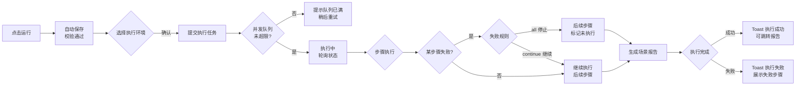
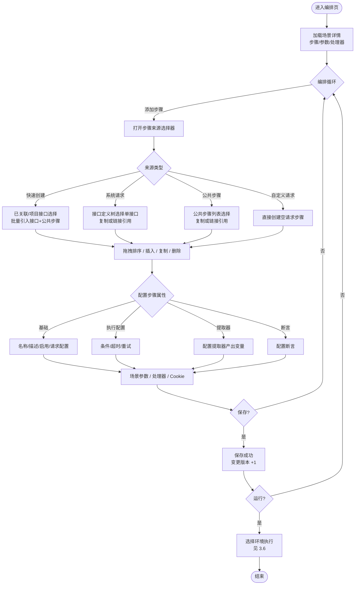

# 软件测试平台——测试场景交互设计

**文档版本**：V1.2  
**日期**：2026-08-17  
**状态**：起草中

> 本文档为 V1.2 接口测试域交互设计的第二部分：测试场景编排与步骤管理的前端交互设计。
> 环境管理交互设计见 `docs/交互设计/环境管理交互设计.md`；导航框架与色彩体系见 `docs/交互设计/全局导航与菜单交互系统设计.md`、`docs/交互设计/视觉设计.md`。

---

## 1. 概述

### 1.1 模块范围

本文档覆盖 V1.2 接口测试业务域（承接 SRS 3.4 测试场景）的测试场景能力：

**测试场景**——场景 CRUD、步骤编排（http/jdbc 取样器）、场景参数、场景级处理器、场景执行。

### 1.2 侧边栏菜单与路由

V1.2 项目模式顶部菜单在既有「功能测试」「缺陷管理」之外**新增「接口测试」入口**（增量见 `docs/交互设计/全局导航与菜单交互系统设计.md` 3.3）。接口测试页面内部采用侧边栏组织子模块：

```
┌──────────────────────────────────┐
│  接口测试（顶部菜单入口）          │
│  ─────────────────────────       │
│  快速调试     /workspace/projects/api-testing/debug
│  接口管理     /workspace/projects/api-testing/interfaces
│  Mock 服务    /workspace/projects/api-testing/mocks
│  测试场景     /workspace/projects/api-testing/scenes       ← 本文档第 2、3 章
│  接口测试报告 /workspace/projects/api-testing/reports
│  定时任务     /workspace/projects/api-testing/schedules
│  ═════════════════════════════
│  项目设置（平台级 · 按业务域过滤）
│   ├ 环境管理           /workspace/projects/settings/environments ← 见《环境管理交互设计》
│   ├ 全局资产           /workspace/projects/settings/assets
│   ├ GitLab 仓库配置    /workspace/projects/settings/gitlab-repos
│   └ 安全策略与应用设置 /workspace/projects/settings/security
└──────────────────────────────────┘
```

> 快速调试、接口管理、Mock 服务、报告、定时任务的交互设计见接口测试域交互设计第一部分及对应文档；「项目设置」分组（环境管理、全局资产、GitLab 仓库配置、安全策略与应用设置）见对应分册与《项目设置交互设计》，本文档不重复描述。

### 1.3 场景与环境的业务关系

- **场景**是核心执行单元：由**步骤**（http/jdbc 取样器）按顺序编排而成，步骤可来源于接口定义（复制或链接引用）、公共步骤或自定义请求。
- **环境**为执行提供变量、Base URL、默认配置、数据源与全局处理器；场景执行时必须选择目标环境（可配置默认环境）。环境管理交互见 `docs/交互设计/环境管理交互设计.md`。
- 变量解析优先级（低→高）：**内置函数 < 环境变量 < 场景参数 < 步骤级变量 < 步骤提取器变量 < 运行时覆盖**（见 `docs/详细设计/测试场景详细设计说明书.md` 4.1）。
- 配置合并优先级（低→高）：**环境默认配置 < 场景级配置 < 步骤级配置**，同名配置项以高优先级覆盖。

---

## 2. 场景管理列表页

**路由**：`/workspace/projects/api-testing/scenes`

### 2.1 页面布局

```
┌──────────────────────────────────────────────────────────────┐
│  测试场景    [+ 新建场景] [导入场景] [元数据同步] [触发流水线]    │
├──────────────────────────────────────────────────────────────┤
│  [搜索场景名称...        ] [状态 ▾] [模块 ▾]      [刷新 ↺]    │
├──────────────────────────────────────────────────────────────┤
│  场景名称      │描述       │步骤数│最近执行状态│最近执行时间│操作│
│  登录流程测试  │登录并提取…│  5  │ [成功]    │08-17 10:30 │…  │
│  下单流程回归  │下单全链路…│  3  │ [失败]    │08-16 09:12 │…  │
│  支付回调测试  │支付回调验…│  8  │ [执行中]  │08-16 15:40 │…  │
├──────────────────────────────────────────────────────────────┤
│                        < 第1页/共2页 · 共18条 >               │
└──────────────────────────────────────────────────────────────┘
```

行内操作菜单（点击行尾 […] 展开）：编辑 / 执行 / 复制 / 查看报告 / 创建定时任务 / 删除。

### 2.2 交互说明

| 操作 | 触发方式 | 反馈 |
| ---- | ---- | ---- |
| 进入页面 | 侧边栏点击「测试场景」 | 拉取场景列表（默认按更新时间倒序），表格骨架屏加载 |
| 搜索 | 输入框输入关键词 | 防抖 300ms 刷新列表，按场景名称模糊匹配 |
| 筛选 | [状态] 下拉选择 | 支持全部/成功/失败/执行中/未执行；切换即时刷新 |
| 筛选 | [模块] 下拉选择 | 按场景归属模块树筛选；选项来自项目级统一模块树（project_module，详见《项目模块与文档管理详细设计说明书》） |
| 新建场景 | 点击 [+ 新建场景] | 打开新建弹窗（场景名称必填、模块选择、描述），确认后创建并**跳转场景编排页** |
| 导入场景 | 点击 [导入场景] | 打开可执行导入向导弹窗（从 GitLab 仓库导入，四步向导，见《GitLab集成交互设计》第 3 章）；完成后刷新列表 |
| 元数据同步 | 点击 [元数据同步] | 打开元数据同步抽屉（扫描仓库测试类元数据，见《GitLab集成交互设计》第 4 章） |
| 触发流水线 | 点击 [触发流水线] | 打开流水线触发弹窗（触发仓库 CI 执行，见《GitLab集成交互设计》第 5 章）；结果进入执行历史与报告 |
| 编辑 | 行内 [编辑] | 跳转场景编排页 `/workspace/projects/api-testing/scenes/:sceneId/edit` |
| 执行 | 行内 [执行] | 打开快速执行弹窗（见 2.3） |
| 复制 | 行内 [复制] | 弹窗输入副本名称（默认「原名称（副本）」），确认后复制场景及其全部步骤，Toast 成功并刷新列表 |
| 查看报告 | 行内 [查看报告] | 跳转接口测试报告列表（按该场景筛选），见报告交互设计 |
| 创建定时任务 | 行内 [创建定时任务] | 跳转定时任务页并预填该场景，见定时任务交互设计 |
| 删除 | 行内 [删除] | 二次确认弹窗（红色警示）；被定时任务引用的场景删除被拒并提示原因 |

### 2.3 快速执行

行内 [执行] 打开快速执行弹窗（宽 480px）：

```
┌──────────────────────────────────┐
│  执行场景：登录流程测试            │
│  执行环境  [测试环境 ▾]           │
│            （默认选中场景默认环境）│
│            预发环境               │
│            生产环境（需确认）     │
│  [取消]              [开始执行]   │
└──────────────────────────────────┘
```

| 操作 | 触发方式 | 反馈 |
| ---- | ---- | ---- |
| 选择环境 | 下拉选择 | 默认选中场景默认环境；无默认环境时置灰 [开始执行] 并提示先配置默认环境 |
| 开始执行 | 点击 [开始执行] | 提交执行任务，关闭弹窗；行内状态徽标变更为「执行中」，前端轮询执行状态（2 秒间隔） |
| 执行完成 | 状态轮询返回结果 | 行内徽标更新为成功/失败，Toast 提示结果；点击徽标跳转报告详情 |
| 执行失败 | 任务提交被拒（如并发队列满） | 弹窗内提示失败原因（「并发队列已满，请稍后重试」），[开始执行] 恢复可点 |

### 2.4 页面状态

| 状态 | 表现 |
| ---- | ---- |
| 正常态 | 表格展示场景列表；默认环境场景名称旁显示默认环境名标签 |
| 空态 | 无任何场景时展示引导插图 + 文案「暂无场景，创建第一个测试场景」+ [新建场景] 主按钮；有筛选条件时展示「无匹配结果」+ [清除筛选] |
| 加载态 | 首次进入骨架屏；筛选/刷新时表格上方细进度条；翻页采用表格局部 loading |
| 错误态 | 列表拉取失败：占位区展示失败原因 + [重试] 按钮；执行环境列表拉取失败：弹窗内提示 + [重试]，不阻断浏览列表 |

---

## 3. 场景编排页

**路由**：`/workspace/projects/api-testing/scenes/:sceneId/edit`

### 3.1 页面布局

```
┌────────────────────────────────────────────────────────────────┐
│ ← 返回列表  登录流程测试                     [保存] [运行]       │
│ 描述：登录并提取 token，访问个人中心                [▾ 更多]     │
├───────────────────────────────┬────────────────────────────────┤
│ [+ 添加步骤]                  │  [步骤属性][场景参数][处理器]    │
│ 步骤列表（垂直卡片）          │  基础 │执行配置│变量│提取器│断言│数据 │
│ 1 [▶] 发送登录请求            │  步骤名称  [发送登录请求      ] │
│    POST /api/auth/login [✓]  │  步骤描述  [验证登录成功      ] │
│ 2 [▶] 获取用户信息            │  类型  [http]  来源 [系统请求]  │
│    GET  /api/user/info        │  启用  [●]  （链接引用可独立调  │
│ 3 [▶] 清理测试数据            │  整启用状态与参数值）           │
│    JDBC 数据源:测试库          │  请求配置区（按类型渲染）…      │
│                               │                                │
│  （拖拽手柄调整顺序）          │                                │
│ ── 已关联接口（2 个 · 可折叠，见 3.9）────                       │
├───────────────────────────────┴────────────────────────────────┤
│  底部状态栏：共 3 个步骤 · 2 个启用 · 有未保存的修改            │
└────────────────────────────────────────────────────────────────┘
```

- 主区域为**步骤列表**（垂直卡片，拖拽排序）；右侧为**属性面板**，面板顶部标签切换步骤属性 / 场景参数 / 处理器 / Cookie；步骤列表下方为**已关联接口**面板（见 3.9）。
- 选中步骤卡片后右侧切换至「步骤属性」标签，内部再分子标签：基础 / 执行配置 / 变量 / 提取器 / 断言 / 数据绑定。

### 3.2 步骤列表操作

| 操作 | 触发方式 | 反馈 |
| ---- | ---- | ---- |
| 添加步骤 | 点击 [+ 添加步骤] | 打开步骤来源选择器（见 3.3），选择后插入到当前选中步骤之后（无选中时追加到末尾），步骤自动编号 |
| 展开/折叠步骤 | 点击卡片标题左侧 [▶]/[▼] | 展开后展示该步骤概要信息（方法、URL/数据源、断言数、提取器数） |
| 选中步骤 | 点击步骤卡片 | 卡片高亮，右侧面板切换至该步骤的「步骤属性」并回显配置 |
| 编辑步骤属性 | 在右侧面板修改 | 面板内即时校验；修改标记为脏状态，底部状态栏提示「有未保存的修改」 |
| 排序 | 拖动卡片左侧拖拽手柄 | 拖拽过程中卡片浮起，松开后触发重排序，序号即时重排 |
| 插入步骤 | 卡片悬停浮现 [+ 在之前插入] | 打开步骤来源选择器，插入到该步骤之前 |
| 复制步骤 | 卡片悬停 [复制] | 在该步骤之后插入完全相同的副本（复制模式，与原步骤无关联） |
| 启用/禁用 | 卡片左侧启用开关 | 即时切换；禁用步骤置灰、不参与执行，序号保留 |
| 调试单步骤 | 卡片悬停 [执行] | 仅执行该步骤（使用当前环境配置），下方弹出单步骤执行结果浮层 |
| 删除步骤 | 卡片悬停 [删除] | 二次确认（引用源被删除的链接步骤仅提供此操作）；删除后后续步骤序号前移 |

### 3.3 步骤来源选择器（添加步骤弹窗）

```
┌──────────────────────────────────────────────────────────────┐
│  添加步骤                                                   │
│  ┌──────────┐ ┌──────────┐ ┌──────────┐ ┌──────────┐           │
│  │ 快速创建  │ │ 系统请求  │ │ 公共步骤  │ │ 自定义请求│           │
│  │ 接口+公共 │ │ 从接口定义│ │ 从公共步骤│ │ 手工构造  │           │
│  └──────────┘ └──────────┘ └──────────┘ └──────────┘           │
│  ┌ 来源列表（随标签切换） ┬ 已选步骤（右侧）───────────────┐     │
│  │ 已关联接口             │ [✓] 用户接口 +2 公共步骤        │     │
│  │   ├ 用户接口           │ [✓] 登录接口 +1 公共步骤        │     │
│  │   ├ 订单接口           │                                 │     │
│  │ 项目接口列表           │                                 │     │
│  │   └ 登录接口           │                                 │     │
│  └───────────────────────┴─────────────────────────────────┘     │
│  导入模式   (●) 复制  ( ) 链接引用                                │
│  参数策略   [优先当前场景参数 ▾]                                  │
│  环境策略   [使用当前环境 ▾]                                     │
│  [取消]                                              [添加]      │
└──────────────────────────────────────────────────────────────┘
```

| 操作 | 触发方式 | 反馈 |
| ---- | ---- | ---- |
| 选择来源类型 | 切换顶部四个来源标签 | 「快速创建」展示已关联接口与项目接口列表，勾选后一键引入接口定义及其全部公共步骤（批量创建）；「系统请求」展示接口定义树，勾选单个接口**仅导入该接口本身为一个步骤**；「公共步骤」展示当前项目所有接口的公共步骤列表；「自定义请求」隐藏选择器，确认后直接创建空请求步骤 |
| 勾选接口/步骤 | 勾选条目 | 实时回显到右侧已选列表，支持批量多选；「快速创建」右侧标注每个接口将引入的公共步骤数 |
| 选择导入模式 | 单选复制/链接引用 | 链接引用提示「步骤内容将跟随源更新，可独立调整启用状态与参数值」 |
| 选择参数策略 | [优先当前场景参数 ▾] | 下拉选项：优先当前场景参数 / 优先原接口参数 |
| 选择环境策略 | [使用当前环境 ▾] | 下拉选项：使用当前环境 / 使用原接口环境 |
| 添加 | 点击 [添加] | 关闭弹窗，按序插入步骤卡片；「快速创建」插入接口步骤 + 公共步骤序列并提示「已添加 N 个步骤」；链接引用步骤卡片带「链」标识，复制步骤无标识 |
| 链接引用源被删除 | 运行时检测 | 步骤置灰并标注「源已删除，使用快照」，仅保留 [移除] 操作（见 `docs/详细设计/测试场景详细设计说明书.md` 4.5） |

### 3.4 步骤属性面板

**基础标签**：

| 项 | 交互 |
| ---- | ---- |
| 步骤名称 | 输入框，必填，≤200 字符，失焦校验非空 |
| 步骤描述 | 多行输入框 |
| 类型与来源 | 只读标识：[http]/[jdbc]、[系统请求]/[公共步骤]/[自定义]/[复制]/[链接引用]；链接引用提供 [查看源] 跳转 |
| 启用开关 | 单步骤启用/禁用 |
| 请求配置区 | 按步骤类型渲染：http 显示方法、URL（支持变量引用）、请求头、Query、REST 参数、请求体、认证（No/Basic/Digest）；jdbc 显示数据源下拉 + SQL 编辑区 + 查询类型。链接引用步骤请求配置只读展示源内容 |

**执行配置标签**：

| 项 | 交互 |
| ---- | ---- |
| 条件表达式 | 输入框，为空表示总是执行；支持变量与内置函数，提供表达式帮助 |
| 请求超时（毫秒） | 数字输入，留空继承环境默认值 |
| 失败重试次数 | 数字输入 0–10，默认 0 |
| 请求级失败规则 | 跟随场景级失败规则，不可单独配置（场景级在「场景参数」标签设置） |

**变量标签**（步骤级变量编辑器）：

| 项 | 交互 |
| ---- | ---- |
| 变量列表 | 表格：变量名、值（支持变量引用与内置函数）、来源（手动/从接口导入）、描述；行内编辑/删除，支持排序 |
| 添加变量 | [+ 添加变量] 打开配置表单（变量名必填、值、描述），确认后加入列表 |
| 从接口导入 | [从接口导入] 打开接口变量选择器，勾选后按合并策略导入（保留已有手动变量），导入项带「接口」来源标识 |
| 提示 | 步骤级变量解析优先级高于场景参数（见 1.3） |

**提取器标签**：

| 项 | 交互 |
| ---- | ---- |
| 提取器列表 | 表格：类型（JSONPath/XPath/正则/边界/响应头/整响应/Groovy 脚本）、表达式、目标变量名、描述；行内编辑/删除 |
| 添加提取器 | [+ 添加提取器] 打开配置表单，类型切换联动表达式输入提示 |
| 从全局资产引入 | [从全局资产引入] 打开资产选择器，勾选后以**复制**方式引入（见需求 3.8） |

**断言标签**：

| 项 | 交互 |
| ---- | ---- |
| 断言列表 | 表格：类型（状态码/JSON/响应头/响应体/正则/XPath/Groovy）、字段、运算符、期望值、描述；行内编辑/删除 |
| 添加断言 | [+ 添加断言] 打开配置表单，类型选择联动字段与运算符候选集（如 JSON 类型提供 JSONPath 输入框） |
| 从全局资产引入 | 同提取器，复制方式引入（见需求 3.9） |

### 3.5 场景级配置（右侧面板标签）

**场景参数标签**：

```
┌──────────────────────────────────────────────┐
│  场景参数                        [+ 添加参数] │
│  参数名       │值            │描述     │操作  │
│  username    │admin         │测试用户名│…    │
│  password    │${env:TEST_…} │密码     │…    │
│  （参数值支持变量引用与内置函数，如 ${random}│
│  、${timestamp()}，见 `docs/交互设计/环境管理交互设计.md` 第 3 章引用帮助）│
│  ── 场景设置 ──────────────────────────────  │
│  失败规则  (●) 任一步骤失败则停止  ( ) 忽略错误│
│  默认环境  [测试环境 ▾]                       │
└──────────────────────────────────────────────┘
```

- 场景参数即步骤间变量传递的数据源，`${参数名}` 引用；
- 失败规则二选一：`all`（停止）/ `continue`（忽略错误继续），切换即时生效；
- 默认环境为执行时预选环境，与列表页快速执行共享。

**处理器标签**：场景级前置/后置处理器列表，分两个子区（前置处理器 / 后置处理器），每条含类型（http/jdbc）、名称、配置摘要、启用开关；支持新增、编辑、删除、排序、从全局资产复制引入。

**Cookie 标签**：Cookie 键值对编辑器，提供「共享 Cookie」启用开关，提示文案说明覆盖关系：共享 Cookie > 环境默认配置 Cookie 与场景变量 Cookie（见需求 3.4）。

### 3.6 保存与运行

| 操作 | 触发方式 | 反馈 |
| ---- | ---- | ---- |
| 返回列表 | 点击 [← 返回列表] | 存在未保存修改时弹离开确认「有未保存的修改，确定离开？」 |
| 保存 | 点击 [保存] | 前端全量校验（步骤名称非空、请求配置完整）→ 提交；成功 Toast + 底部状态栏「已保存 HH:mm:ss」；乐观锁冲突（409）提示「场景已被他人修改，请刷新后重试」 |
| 运行 | 点击 [运行] | 自动保存未保存修改 → 打开环境选择弹窗（同 2.3 快速执行，默认选中场景默认环境）→ [开始执行] 提交任务 |
| 更多 | 点击 [▾ 更多] | 下拉：复制场景、创建定时任务、查看执行历史、查看变更历史、删除场景 |

运行流程：



- 执行任务进入平台执行引擎并发队列（全局并发默认 5，队列上限 100，见需求 3.11）；
- 执行完成后列表页状态徽标同步更新，右侧保留「查看报告」入口（报告页交互见接口测试报告设计）。

### 3.7 步骤编排流程



### 3.8 页面状态

| 状态 | 表现 |
| ---- | ---- |
| 正常态 | 步骤卡片、属性面板、场景级标签正常渲染；底部状态栏实时显示步骤数与未保存标记 |
| 空态 | 场景无步骤：步骤列表区展示引导插图 + 「暂无步骤，点击上方添加步骤」；属性面板为空占位 |
| 加载态 | 进入页面整体骨架屏；保存/运行按钮 loading + 禁用；链接引用步骤刷新源时卡片角标加载动画 |
| 错误态 | 详情加载失败：全屏错误占位 + [重试]；保存失败：Toast 明确原因（校验错误定位首个错误项红字、乐观锁冲突 409）；运行被拒：环境弹窗内提示原因 |

### 3.9 已关联接口面板

场景编排页提供「已关联接口」面板（位于步骤画布下方，可折叠），管理场景依赖的接口集合，同时是「快速创建」步骤的来源入口之一。

| 操作 | 触发方式 | 反馈 |
| ---- | ---- | ---- |
| 查看列表 | 展开面板 | 展示接口名称、HTTP 方法、路径、同步模式（copy/link 标签）、公共步骤数、关联时间 |
| 关联接口 | 点击 [关联接口] | 打开接口选择器，批量勾选后关联；同一接口不可重复关联（错误码 7208） |
| 切换同步模式 | 行内切换 copy/link | 切为 link 提示「步骤内容将跟随源更新，可独立调整启用状态与参数值」；切为 copy 后步骤独立 |
| 立即同步 | 行内 [立即同步]（link 模式） | 拉取接口定义及其公共步骤最新内容并更新场景步骤，Toast 同步结果 |
| 取消关联 | 行内 [取消关联] | 二次确认；仅移除关联关系，已导入步骤不受影响 |
| 跳转详情 | 点击接口名称 | 跳转接口定义详情页 |

- 空态：未关联接口时展示引导文案「关联接口后可快速创建步骤」；
- 同步范围与不同步内容、执行前自动同步机制见 `docs/详细设计/测试场景详细设计说明书.md` 4.7。

---

## 4. 通用交互模式

弹窗类型、加载状态、错误处理与拖拽约定等通用交互模式与《环境管理交互设计》第 4 章一致，本文档不重复描述：

- 弹窗类型汇总（表单 / 选择器 / 确认 / 执行 / 帮助 / 提示条）见 `docs/交互设计/环境管理交互设计.md` 4.1；
- 加载状态（骨架屏、细进度条、按钮 loading、执行轮询、导入解析进度）见 4.2；
- 错误处理（校验错误、接口失败、业务错误码 7203/7401/7402/7403、乐观锁冲突 409、并发队列满、链接引用源缺失）见 4.3；
- 拖拽约定（步骤卡片、处理器列表、键值对排序、拖拽限制）见 4.4。

---

**文档结束**
