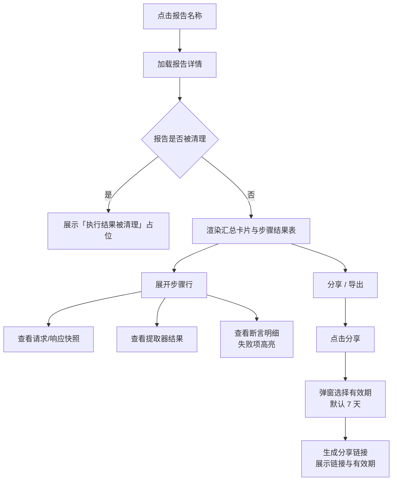

# 软件测试平台——测试报告交互设计

**文档版本**：V1.2  
**日期**：2026-08-17  
**状态**：起草中

> 本文档为 V1.2 接口测试域交互设计分册：测试报告（列表、详情、分享与导出）的前端交互设计。
> 导航框架与色彩体系见 `docs/交互设计/全局导航与菜单交互系统设计.md`、`docs/交互设计/视觉设计.md`。

---

## 1. 概述

V1.2 接口测试域新增测试报告能力。本文档覆盖测试报告页的交互设计：

1. **测试报告页**——场景执行结果的列表、详情、分享与导出（承接 SRS 3.5）。

### 1.1 菜单与路由

**项目模式**（接口测试侧边栏）新增「测试报告」：

```
┌──────────────────────────────────┐
│  接口测试（顶部菜单入口）          │
│  ─────────────────────────       │
│  快速调试     /workspace/projects/api-testing?tab=debug
│  接口管理     /workspace/projects/api-testing?tab=interfaces
│  Mock 服务    /workspace/projects/api-testing?tab=mocks
│  测试场景     /workspace/projects/api-testing?tab=scenes
│  接口测试报告 /workspace/projects/api-testing?tab=reports   ← 本文档
│  定时任务     /workspace/projects/api-testing?tab=schedules
│  ───────────────────────────────
│  项目设置（平台级 · 按业务域过滤）
│   ├ 环境管理           /workspace/projects/settings/environments
│   ├ 全局资产           /workspace/projects/settings/assets
│   └ GitLab 仓库配置    /workspace/projects/settings/gitlab-repos
└──────────────────────────────────┘
```

| 页面 | 路由 | 模式 | 权限 |
| ---- | ---- | ---- | ---- |
| 测试报告列表页 | `/workspace/projects/api-testing?tab=reports` | 项目模式 | 执行者本人或项目维护者 |
| 测试报告详情页 | `/workspace/projects/reports/:id` | 项目模式 | 执行者本人或项目维护者 |

> 上表路由为前端路由示意，与后端 API 路径相互独立。

### 1.2 权限边界

- 报告按项目隔离；查看/分享/导出为执行者本人或项目维护者权限，删除为项目维护者权限。

---

## 2. 测试报告页

### 2.1 报告列表页

**路由**：`/workspace/projects/api-testing?tab=reports`

```
┌──────────────────────────────────────────────────────────────┐
│  测试报告                                        [批量导出]     │
├──────────────────────────────────────────────────────────────┤
│  [场景筛选 ▾] [状态筛选 ▾] [执行方式 ▾] [日期范围] [搜索]      │
├──────────────────────────────────────────────────────────────┤
│  ☑ │ 报告名称      │ 场景名称 │ 状态 │ 通过率 │ 耗时 │ 创建时间│操作│
│  ☑ │ 登录流程-08-17│ 登录流程 │ 通过 │ 100%  │ 1.2s │ 08-17 │…  │
│  ☑ │ 下单流程-08-17│ 下单流程 │ 失败 │ 66.7% │ 2.1s │ 08-17 │…  │
│  ☑ │ 支付流程-08-16│ 支付流程 │ 部分 │ 80%   │ 1.8s │ 08-16 │…  │
│    │（行内操作：查看 / 导出 / 删除）                          │
├──────────────────────────────────────────────────────────────┤
│  已选 2 项  [批量导出] [批量删除]          < 第1页/共5页 >      │
└──────────────────────────────────────────────────────────────┘
```

| 列 | 内容 |
| ---- | ---- |
| 报告名称 | 场景名 + 执行时间戳，点击进入详情 |
| 场景名称 | 关联场景 |
| 状态 | 状态徽标：通过（绿）/ 失败（红）/ 部分通过（黄）；仓库流水线执行展示来源标记与流水线链接；结果待同步时展示「结果待同步」+ [刷新] |
| 通过率 | 通过步骤数 / 总步骤数百分比 |
| 耗时 | 总耗时 |
| 创建时间 | 执行完成时间 |
| 操作 | 下拉菜单：查看 / 导出 / 删除 |

**交互说明**：

| 操作 | 触发方式 | 反馈 |
| ---- | ---- | ---- |
| 进入页面 | 侧边栏点击「测试报告」 | 拉取报告列表，表格骨架屏加载 |
| 筛选 | 场景 / 状态 / 执行方式 / 日期范围 | 筛选条件叠加生效，日期范围默认最近 30 天 |
| 查看报告 | 点击报告名称 | 跳转报告详情页 |
| 导出 | 行内 [导出] 或勾选后 [批量导出] | 弹窗选择格式（JSON / HTML）→ 下载文件；批量导出打包下载 |
| 删除 | 行内 [删除] 或勾选后 [批量删除] | 二次确认（红色警示）「删除后不可恢复」 |
| 刷新待同步报告 | 行内 [刷新] | 按钮 loading → 重新拉取流水线状态，成功后更新状态徽标 |

**状态分支**：

| 状态 | 表现 |
| ---- | ---- |
| 正常态 | 表格展示报告列表，筛选可用 |
| 空态 | 无报告：居中插画 + 「暂无测试报告」+ 说明「执行测试场景后生成报告」；筛选无结果时显示「无匹配结果」+ [清除筛选] |
| 加载态 | 首次进入表格骨架屏；筛选时顶部细进度条 |
| 错误态 | 拉取失败：错误提示 + [重试]；导出失败：Toast「导出失败，请稍后重试」 |

### 2.2 报告详情页

**路由**：`/workspace/projects/reports/:id`

```
┌──────────────────────────────────────────────────────────────┐
│  ← 返回列表                                                    │
│  登录流程-08-17  [通过]  场景：登录流程  环境：测试环境          │
│  执行方式：平台内执行  执行时间：2026-08-17 10:30:00            │
│  [分享] [导出 JSON] [导出 HTML]                                │
├──────────────────────────────────────────────────────────────┤
│  ┌────────┐ ┌────────┐ ┌────────┐ ┌────────┐                  │
│  │ 总步骤  │ │ 通过    │ │ 失败    │ │ 跳过    │                  │
│  │  6     │ │  6     │ │  0     │ │  0     │                  │
│  └────────┘ └────────┘ └────────┘ └────────┘                  │
│  通过率 100%   总耗时 1.2s                                     │
├──────────────────────────────────────────────────────────────┤
│  步骤结果                                                      │
│  # │ 步骤名称   │ 接口        │ 状态 │ 耗时 │ 断言 │ 操作      │
│  1 │ 登录       │ POST /login │ 通过 │ 320ms│ 2/2 │ ▸ 展开    │
│  2 │ 获取用户列表│ GET /users  │ 通过 │ 180ms│ 1/1 │ ▸ 展开    │
│  3 │ 创建订单   │ POST /orders│ 失败 │ 500ms│ 1/2 │ ▸ 展开    │
│  （展开行：请求/响应快照、提取器结果、断言明细）                 │
└──────────────────────────────────────────────────────────────┘
```

**报告详情流程**：



**汇总卡片**：

| 卡片 | 内容 |
| ---- | ---- |
| 总步骤 | 启用步骤总数 |
| 通过 | 所有验证器通过的步骤数（绿） |
| 失败 | 任一验证器失败的步骤数（红） |
| 跳过 | 被禁用（disabled）的步骤数（灰） |
| 通过率 | 通过数 / 总步骤数，环形图展示 |
| 总耗时 | 全部步骤耗时合计 |

**步骤结果表**：

| 列 | 内容 |
| ---- | ---- |
| 序号 | 步骤执行顺序 |
| 步骤名称 | 点击展开 |
| 接口 | 方法 + 路径 |
| 状态 | 通过（绿）/ 失败（红）/ 跳过（灰）/ 未执行（灰） |
| 耗时 | 单步耗时 |
| 断言 | 通过数 / 总数，失败时红字 |
| 操作 | 展开/收起 |

**展开行内容**：

- **请求快照**：方法、URL、请求头、请求体（格式化展示）；
- **响应快照**：状态码、响应头、响应体（格式化 JSON）；
- **提取器结果**：提取的变量名与值列表；
- **断言明细**：每条断言的字段、规则、期望值、实际值、结果；失败项红色高亮并展示解析错误提示（断言表达式解析失败按断言失败处理）。

**交互说明**：

| 操作 | 触发方式 | 反馈 |
| ---- | ---- | ---- |
| 进入详情 | 列表页点击报告名称 | 加载详情，头部展示摘要信息 |
| 展开步骤 | 点击步骤行或 [▸ 展开] | 行内展开请求/响应/提取器/断言明细 |
| 分享报告 | 点击 [分享] | 弹窗选择有效期（默认 7 天，选项 1 / 7 / 30 / 90 天）→ [生成链接] → 同弹窗展示分享链接与「有效期至」，[复制链接] 一键复制（参照邀请链接创建流程，无全局开关） |
| 导出 | 点击 [导出 JSON] / [导出 HTML] | 下载对应格式文件；HTML 为独立文件（内联样式，可离线打开与打印） |
| 查看被清理报告 | 进入已清理报告 | 详情区展示「执行结果被清理」占位，保留报告元数据 |

**状态分支**：

| 状态 | 表现 |
| ---- | ---- |
| 正常态 | 汇总卡片 + 步骤结果表完整展示 |
| 空态 | 报告无步骤数据：步骤表显示「无步骤数据」；报告被清理：展示「执行结果被清理」占位 |
| 加载态 | 详情骨架屏；展开行内容局部加载 |
| 错误态 | 加载失败：错误提示 + [重试]；分享生成失败：Toast 展示原因；报告不存在（已删除）：404 提示「报告不存在或已被删除」 |
| 权限不足 | 非执行者本人且非项目维护者：403 页面「无权限访问该报告」 |

### 2.3 分享访问页（免登录）

**路由**：`/share/api-report/:id?token=xxx`（独立于项目模式，无需登录）

```
┌──────────────────────────────────────────────────────────────┐
│  登录流程-08-17  [通过]  场景：登录流程  环境：测试环境          │
│  执行方式：平台内执行  执行时间：2026-08-17 10:30:00            │
├──────────────────────────────────────────────────────────────┤
│  ┌────────┐ ┌────────┐ ┌────────┐ ┌────────┐                  │
│  │ 总步骤  │ │ 通过    │ │ 失败    │ │ 跳过    │                  │
│  │  6     │ │  6     │ │  0     │ │  0     │                  │
│  └────────┘ └────────┘ └────────┘ └────────┘                  │
│  通过率 100%   总耗时 1.2s                                     │
├──────────────────────────────────────────────────────────────┤
│  步骤结果（只读，无操作列）                                     │
│  # │ 步骤名称   │ 接口        │ 状态 │ 耗时 │ 断言             │
│  1 │ 登录       │ POST /login │ 通过 │ 320ms│ 2/2             │
│  （展开行：请求/响应快照、提取器结果、断言明细）                 │
└──────────────────────────────────────────────────────────────┘
```

**交互说明**：

| 操作 | 触发方式 | 反馈 |
| ---- | ---- | ---- |
| 访问分享页 | 打开分享链接 | 免登录加载报告只读内容；token 无效或过期：403 提示「分享链接无效或已过期」 |
| 展开步骤 | 点击步骤行 | 行内展开请求/响应/提取器/断言明细（只读） |

**状态分支**：

| 状态 | 表现 |
| ---- | ---- |
| 正常态 | 汇总卡片 + 步骤结果表只读展示 |
| 加载态 | 详情骨架屏 |
| 错误态 | token 无效或过期：403 提示「分享链接无效或已过期」；报告已删除：提示「报告不存在或已被删除」 |

> 分享访问页仅提供只读查看，不展示分享/删除等操作入口。

---

## 3. 通用交互模式

本页涉及的通用交互模式遵循 `docs/交互设计/Mock服务交互设计.md` 第 4 章的约定：

- **弹窗类型**：确认弹窗用于删除报告、批量删除、清空操作；分享弹窗用于报告分享链接生成与复制；选择弹窗用于导出格式选择；
- **加载与错误状态**：列表首次进入表格骨架屏，筛选/搜索时顶部细进度条；表单提交按钮 loading + 禁用；加载失败展示错误区 + [重试]；空态统一为插画 + 主文案 + 说明文案 + 主操作按钮，筛选无结果时提供 [清除筛选]；
- **状态徽标色彩**：统一使用 `docs/交互设计/视觉设计.md` 定义的语义色（通过/成功绿、失败/危险红、部分通过/警告黄、跳过/未执行灰、进行中/待同步蓝）；
- **响应式处理**：报告详情汇总卡片在小屏幕下由四列改为两列；表单抽屉在小屏幕下全屏展示。

---

**文档结束**
