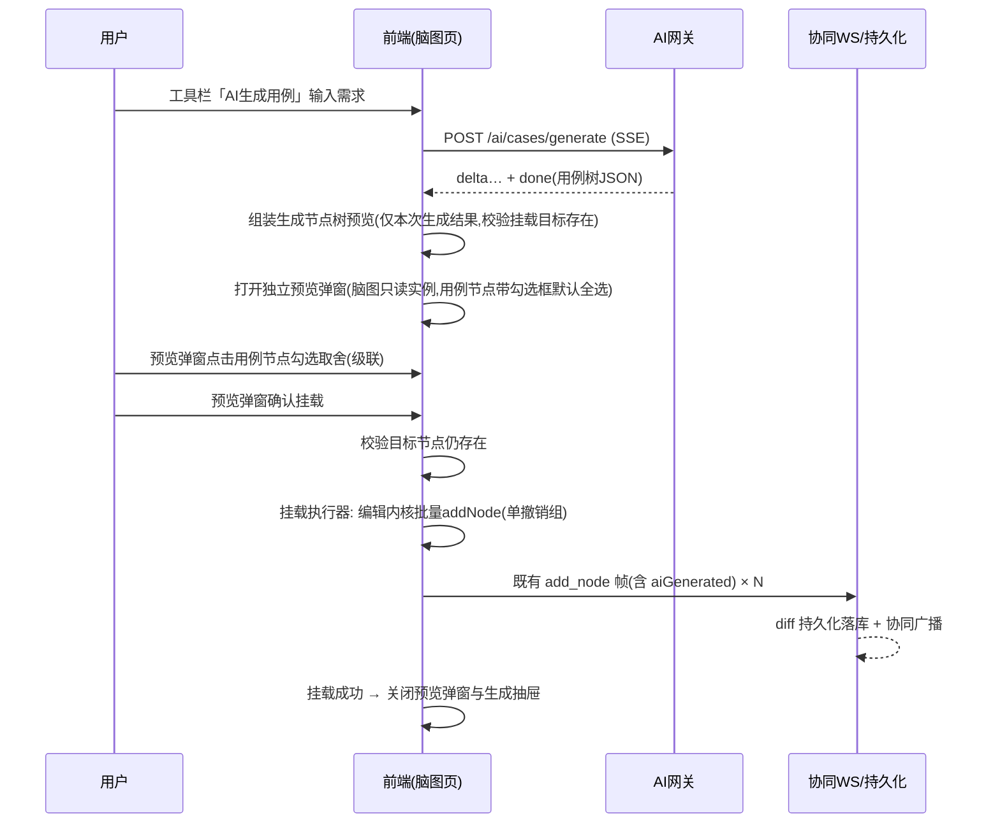

# 软件测试平台——（分册：AI 生成用例）

**文档版本**：V1.0
**日期**：2026-09-23
**状态**：起草中

> 本分册由《》按功能模块拆分而来。前言、引言、数据设计与公共约定见总览分册 `58-ai-case-generation-overview.md`；原章节编号保持不变，分册-章节对照见总览分册。

---

### 3.2 AI 生成类接口（SSE）

#### 3.2.1 生成用例子树

- **路径**：`POST /api/project/ai/cases/generate`（`text/event-stream`）
- **请求体**：

```json
{
  "documentId": "0198…",
  "targetNodeId": "0198…",
  "requirementText": "手动粘贴的需求文本，可空",
  "requirementIds": ["0198…"],
  "modelId": null
}
```

- `modelId`：可选，用户选择的对话模型标识（交互式功能通用约定，缺省或失效回退系统默认模型，见基础设施 3.1 / 4.11）；本节 3.2.2 与 3.3.2 的请求体同样支持该字段，不再逐一标注。
- **校验**：`requirementText` 与 `requirementIds` 至少一项非空；`targetNodeId` 必填——生成入口固定传入文档根节点 ID（SRS 3.4.1：挂载节点固定为文档根节点）；文档编辑权限。
- **流式响应**：`delta` 帧透传生成文本；`done` 帧为 2.2 结构 + `"warnings": []`（截断等提示）。
- **说明**：`targetNodeId` 固定为文档根节点 ID，仅用于生成上下文（根节点标题 + 其直接子节点标题——作为新子树的同级参照，见 4.6），挂载由前端执行；生成期间文档可继续编辑。

#### 3.2.2 补全步骤

- **路径**：`POST /api/project/ai/cases/complete-steps`（SSE）
- **请求体**：`{ "documentId", "nodeId", "extraText": "临时补充上下文，可空", "requirementIds": [] }`
- **校验**：`nodeId` 必须为 case 类型节点；文档编辑权限。
- **上下文取材**：节点标题 + 祖先路径 + 同级节点标题（SRS 3.4.2，≤ 50 条）+ 既有子节点（去重参考，提示"已有前置/步骤/预期不重复输出"）+ 需求条目/临时文本。
- **done 帧**：`{ "nodes": [ {type: "precondition"|"step"|"expected", title, children: []} ] }`（扁平数组，见 2.2 校验）。

#### 3.2.3 需求文档拆分（US-AI-019）

- **路径**：`POST /api/project/ai/requirements/split`（SSE）
- **请求体**：`{ "text": "整份需求文档（Markdown）", "modelId": null }`
- **校验**：`text` 非空；长度上限复用 `importTextMaxLength`（默认 20000 字符，定义见基础设施文档 2.2），超限**截断 + warning 提示，不拒绝**；需求池创建权限（与 3.1.3 一致）。
- **拆分粒度**：固定细粒度——一个需求点 = 一个可测试功能行为（如「用户管理」拆为新增/编辑/删除/查询用户四条），模块仅作归属分组，不提供粗/细切换（SRS 3.4.4）。
- **done 帧**：

```json
{
  "modules": [
    {
      "module": "用户管理",
      "items": [
        { "title": "新增用户", "content": "……（Markdown）" },
        { "title": "编辑用户", "content": "……" }
      ]
    }
  ],
  "warnings": ["文档超出输入预算，已截断"]
}
```

- **结构化输出校验**（AiOutputValidator 复用，见基础设施文档 4.4）：`modules` 非空且 ≤ 50；`module` 非空且 ≤ 100；`items` 非空且每模块 ≤ 50；`title` 非空且 ≤ 200；`content` 非空；超长字段截断并计入 `warnings`；结构不合规整体返回 error 帧，不产出部分结果。
- **说明**：拆分结果为纯预览，**不落库**；勾选入库走 3.1.7 批量接口。模块名不入库为独立字段，由前端拼接为标题前缀（「用户管理 · 新增用户」）。


### 4.1 生成-预览-挂载总链路



- 预览为**纯前端本地快照**（仅本次生成结果组装，文档既有数据不并入预览），不写编辑内核、不产生撤销历史、不广播、不落库；预览弹窗内勾选状态（`aiSelected`）仅存于该弹窗的只读 Minder 实例内存，关闭预览弹窗即丢弃；挂载确认后才经编辑内核写入（纯预览约束，见 `docs/交互设计/README.md` §2.2）；
- 挂载前目标节点已被协同用户删除 → 提示重选挂载位置（弹出节点选择器），不丢弃预览结果；
- 生成抽屉在生成过程中仅以操作行内虚假进度条占位（流式原文与提示文字均不显示），`done` 后输出区显示完成提示文字、底部变为 [重新生成]（次要按钮样式，无主按钮底色）[查看预览]（主按钮、位于 [重新生成] 右侧）；点击 [查看预览] 打开独立预览弹窗（两窗并存、预览置顶）；关闭预览弹窗仅关预览、生成抽屉保留「完成」态；
- **会话生命周期**（`docs/交互设计/README.md` §2.2）：生成/补全面板常驻（非 v-if 销毁），关闭抽屉仅隐藏，**不中断进行中的 SSE、不丢弃已完成结果**；同一文档内重新打开恢复上次会话；`AiGeneratePanel` watch `docId`，仅切换文档时 `controller.cancel()` 断开 SSE 并全量重置（生成绑定文档生命周期）；补全步骤（complete 模式）另按「目标节点变化 → 重置」处理（右键新节点即重置）。


### 4.2 挂载执行器（前端 `aiMount.ts`）

「生成子树」「补全步骤」「对话式编辑新增节点」共用同一执行器：

- 入参：目标节点 ID + 2.2 结构的节点数组（经用户勾选过滤后）；
- 执行：`history.ts` 开启批量事务 → 深度优先逐个经编辑内核 `createNode` 创建，同步写入节点属性 `type / priority / aiGenerated: true` → 提交事务，**整批作为单条撤销历史**；
- 每个新节点触发既有 `add_node` WS 帧，帧内节点数据携带 `aiGenerated` 字段（协议扩展见 4.5）；
- 预览阶段（`buildPreviewTree`）仅组装本次生成节点树，可勾选节点按模式区分：**生成模式仅用例（case）节点可勾选**（`aiSelected: true` 默认选中），其 precondition/step/expected 内部结构随所属用例节点级联挂载，孤立的非用例节点（分组等）不可勾选、不参与挂载；**补全模式全部生成节点可勾选**（`aiSelectable: true` 且默认选中，逐项取舍无级联）；**预览纯本地组装，不调用编辑内核**，勾选过滤（`filterCheckedTree`）仅提取 `aiGenerated && aiSelected` 的节点，仅确认挂载后才执行本节的批量写入；
- 勾选取舍规则：生成模式仅 case 节点可勾选，取消用例则其整棵内部结构（precondition/step/expected）一并排除，恢复勾选时整组恢复，非用例节点无勾选框、点击无效；补全模式全部生成节点可勾选（默认全选），逐项独立取舍无级联；可勾选性由 `AiPreviewNode.aiSelectable` 标记（生成=仅 case，补全=全部），勾选框渲染与点击响应均以该标记为准；
- 目标节点缺失处理按场景区分：生成子树（挂载目标固定为文档根节点，根节点被协同删除时）→ 提示重选挂载位置（4.1，弹出节点选择器）；补全步骤的挂载目标只能是原 case 节点，该节点已被协同删除时提示"节点已被删除，无法挂载"，不提供重选。


### 4.3 优先级推荐（规则前置 + LLM 兜底）

- **规则表**：内置于后端常量（关键词 → 优先级），首发版本：

| 优先级 | 命中关键词（标题含任一） |
| ---- | ---- |
| P0 | 登录、支付、下单、密码、权限、安全、数据丢失、崩溃 |
| P1 | 提交、保存、删除、审核、导出、同步 |
| P3 | 提示文案、样式、排版、颜色、占位符 |

规则按 P0 → P1 → P3 顺序短路匹配，其余不命中（规则表不产出 P2，P2 仅来自 LLM；规则未命中且 LLM 失败/超时时无推荐，属预期行为）；
- **触发时机**：前端在节点被**手工单节点**标记为用例类型时调用接口（含手工标记与既有节点重标记）；触发判定基于标记面板的用户操作事件而非编辑内核数据变更事件，因此撤销/重做的事件重放不触发；AI 生成的节点已带优先级，不触发；DSL 批量 `mark_type` 不触发（见 4.4.2，避免瞬时批量请求冲击 suggestion 限流）；
- **前端呈现**：标记面板优先级按钮区上方显示推荐标签（如「推荐 P0」），点击即完成标记；用户已手工选择后到达的 LLM 结果直接丢弃；推荐请求进行中不阻塞任何操作。


### 4.6 生成类 Prompt 上下文组装

| 要素 | 内容 | 裁剪策略 |
| ---- | ---- | ---- |
| 需求上下文 | 需求条目内容（多条拼接，每条带标题定界）+ 临时文本 | 单条目截断至 8000 token，总预算超限时按选取顺序保留、丢弃部分并在 done 帧 warning 提示 |
| 结构上下文 | 目标节点祖先路径标题链 + 目标节点直接子节点标题（作为新增节点的同级参照，≤ 50 条）；补全步骤场景另含该 case 的同级节点标题（≤ 50 条） | 超出取前 50 |
| 去重参考 | 补全步骤场景：该 case 已有前置/步骤/预期标题 | 全量（单用例子节点有限） |

---


