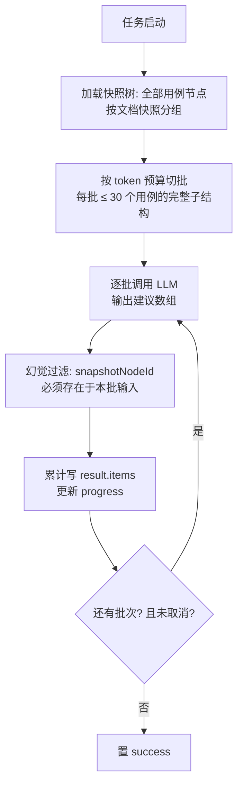

# 软件测试平台——AI 评审与测试计划辅助详细设计说明书

**文档版本**：V1.1
**日期**：2026-07-31
**作者**：[填写]
**状态**：起草中

---

## 1. 引言

### 1.1 编写目的

本文档对 V1.1 AI 能力域中的**评审辅助与测试计划辅助功能**进行详细设计：评审一键检查、评审摘要生成、遗漏测试点分析、执行顺序推荐、回归测试用例子集推荐，为开发实现提供完整依据。

### 1.2 范围

覆盖 SRS 3.3（AI 辅助评审与覆盖度分析）与 3.7（测试计划与风险评估）。依赖的向量基建（case_embedding 表、写入与重建机制）见《缺陷智能分析与向量检索详细设计说明书》；异步任务框架、SSE 帧格式、错误码见《AI 基础设施详细设计说明书》。

### 1.3 参考资料

- 《软件测试平台需求规格说明书 V1.1》（3.3、3.7、附录 B）
- 《软件测试平台概要设计说明书 V1.1》（3.2、4.5、4.6）
- 《AI 基础设施详细设计说明书 V1.1》
- 《项目工作区详细设计说明书 V1.0》（归档，评审/计划快照模型）

---

## 2. 数据设计

### 2.1 数据库表变更

**无新增表**。全部结果持久化复用 `ai_analysis_task.result`（JSONB）快照；涉及两处既有结构变更：

1. `ai_analysis_task.type` 枚举扩展一项：

| type | 说明 | target_id |
| ---- | ---- | ---- |
| plan_order_recommend | 执行顺序推荐结果快照（同步计算，创建即终态） | 计划 ID |

（该枚举扩展同步回补至《AI 基础设施详细设计说明书》2.1.3。）

2. `test_plan` 表增列 `snapshot_synced_at`（TIMESTAMP，NULL，默认空）：记录计划快照最近一次同步成功时间，由既有的计划同步接口（`POST /api/project/plans/:id/sync`）在同步事务内写入当前时间；创建计划关联快照时同样写入。该列仅服务于 4.4 失效判定，不建索引（仅按主键单行读取）。

### 2.2 任务结果结构定义（ai_analysis_task.result）

#### 2.2.1 评审检查（type=review_check，target=评审 ID）

```json
{
  "checkedCaseCount": 120,
  "totalCaseCount": 200,
  "skippedBatches": 0,
  "items": [
    {
      "snapshotNodeId": "0198…",
      "dimension": "missing_precondition",
      "suggestion": "该用例缺少前置条件，建议补充账号状态与入口页面"
    }
  ]
}
```

`dimension` ∈ `missing_precondition`（缺前置）/ `vague_step`（步骤笼统）/ `missing_expected`（缺预期）/ `priority_conflict`（相似用例优先级冲突）。`skippedBatches` 为重试后仍失败被跳过的批次数（见 4.1），前端非 0 时提示「部分用例未完成检查」。分批执行中**每批完成即累计写入** items 与 checkedCaseCount——任务被取消时已产出部分仍可查看（SRS 3.3.1；基础设施 3.5.2 已为 review_check 定义取消保留豁免）。

#### 2.2.2 评审摘要（type=review_summary，target=评审 ID）

```json
{
  "statistics": {
    "totalCases": 200, "passCount": 150, "failCount": 30, "pendingCount": 20,
    "passRate": 75.0,
    "dimensionDist": { "missing_precondition": 3, "vague_step": 8 },
    "failByDocument": [ { "documentName": "登录用例集", "failCount": 12 } ]
  },
  "summaryMarkdown": "## 评审总结\n……"
}
```

statistics 由 SQL 精确计算（不依赖 LLM）；重复生成覆盖本记录（同一评审仅保留最新一条 success 记录，旧记录逻辑删除）。

#### 2.2.3 执行顺序推荐（type=plan_order_recommend，target=计划 ID）

```json
{
  "planSyncedAt": "2026-07-30T09:00:00Z",
  "weights": { "w1": 0.5, "w2": 0.3, "w3": 0.2 },
  "items": [
    {
      "snapshotNodeId": "0198…",
      "order": 1,
      "score": 0.87,
      "factors": { "relatedBugCount": 5, "priorityWeight": 1.0, "moduleBugDensity": 0.42 },
      "reason": null
    }
  ]
}
```

`planSyncedAt` 记录计算时刻 `test_plan.snapshot_synced_at` 的值（2.1 增列），用于失效判定（见 4.4）；`reason` 按需生成后回填。

---

## 3. 接口详细设计

均为项目级接口。

### 3.1 评审一键检查

#### 3.1.1 发起检查

- **路径**：`POST /api/project/ai/reviews/:id/check`
- **响应**：`{ "taskId": "0198…" }`
- **校验**：仅评审发起人（2001）；评审状态必须为 `in_progress`（6012）；同评审无进行中检查任务（6005）。

#### 3.1.2 查询检查结果

- **路径**：`GET /api/project/ai/reviews/:id/check-result`
- **响应**：该评审最近一次 review_check 任务（含 status/progress/result，result 结构见 2.2.1）；无记录返回 `null`。
- **权限**：仅评审发起人可查看（与发起权限一致）。

### 3.2 评审摘要

#### 3.2.1 生成摘要

- **路径**：`POST /api/project/ai/reviews/:id/summary`（SSE，`review_summary`）
- **校验**：仅评审发起人（2001）；评审状态必须为 `completed`（6012）；同评审已有进行中的摘要生成返回 6005。
- **流式响应**：首帧 `event: statistics`（基础设施 3.1 允许的扩展事件类型，data 为 2.2.2 的 statistics 对象，SQL 计算即刻返回）→ `delta` 帧流式输出文字总结 → `done` 帧携带完整 2.2.2 结构。
- **落库与生命周期**：请求通过校验后创建 `running` 状态的同步落库任务记录（不进 `aiTaskExecutor` 队列）；`done` 前写入完整结果并置 `success`，同时逻辑删除上一份 success 记录（覆盖语义）。异常路径：LLM 调用失败置 `failed`（error 帧 6002/6003，不保留部分文本）；客户端断开置 `cancelled`（基础设施 3.1 断开即取消上游调用）。非 success 记录不参与 3.2.2 查询。生成期间每 60 秒刷新一次任务 `updated_at` 作为心跳，避免被基础设施 4.6 孤儿回收（10 分钟无推进判失联）误杀。

#### 3.2.2 查询摘要

- **路径**：`GET /api/project/ai/reviews/:id/summary`
- **响应**：最近一次成功摘要（2.2.2 结构 + generatedAt）；无则 `null`。摘要不回写评审记录、不影响快照冻结。

### 3.3 遗漏测试点分析

- **路径**：`POST /api/project/ai/cases/missing-points`（同步，`missing_point_analysis`）
- **请求体**：

```json
{
  "keywords": ["登录", "验证码"],
  "text": "直接粘贴的需求文本，可空",
  "requirementIds": ["0198…"],
  "saveAsRequirement": { "title": "临时需求另存标题" }
}
```

三种输入（keywords / text / requirementIds）至少一项非空。`saveAsRequirement` 可选：非空时先将 `text` 存为需求池条目（与《智能用例生成》3.2.1 同一约定，失败不阻断分析）。

- **权限**：项目成员即可（附录 B 覆盖度分析无额外角色限定）。
- **响应**：

```json
{
  "semanticDegraded": false,
  "points": [
    {
      "title": "短信验证码超时后重新发送",
      "description": "需求提及验证码有效期5分钟，现有用例未覆盖超时重发场景",
      "suggestedModulePath": "登录模块/验证码登录",
      "relatedCaseTitles": ["验证码登录成功", "验证码错误提示"]
    }
  ]
}
```

- **说明**：分析范围限当前项目；不自动创建任何用例；「一键转生成」由前端将勾选的 points 拼接为需求文本，跳转脑图页并携带至《智能用例生成》3.2.1 入口。勾选点可能归属不同模块：面板「转用例生成」时要求用户选择一个目标文档（默认预选勾选点中出现次数最多的 `suggestedModulePath` 所对应文档；路径无法匹配到现有文档时不预选），全部勾选点文本拼接后透传至该文档脑图页。

### 3.4 执行顺序推荐

#### 3.4.1 计算推荐

- **路径**：`POST /api/project/ai/plans/:id/order-recommend`
- **响应**：`{ "taskId": "0198…", "result": { …2.2.3 结构… } }`（同步计算，立即返回结果）
- **校验**：仅计划负责人或计划执行人（附录 B，其余角色 2001）；计划需已关联快照（6012）。重复计算覆盖旧记录。

#### 3.4.2 查询推荐结果

- **路径**：`GET /api/project/ai/plans/:id/order-recommend`
- **响应**：`{ "stale": false, "result": { … } }`；`stale = true` 表示计划快照在计算后重新同步过，需重算（见 4.4）；权限同 3.4.1，其余角色返回 2001。

#### 3.4.3 生成推荐理由

- **路径**：`POST /api/project/ai/plans/:id/order-reason`（同步，`plan_order_reason`）
- **请求体**：`{ "snapshotNodeId": "0198…" }`
- **响应**：`{ "reason": "该用例历史关联5个缺陷且属于缺陷密度最高的支付模块，建议优先执行" }`
- **处理**：LLM 基于该条 factors 数据生成文字理由并回填 result 对应 item（缓存复用，重复请求直接返回已生成理由）；LLM 不参与排序。

### 3.5 回归测试用例子集推荐

- **路径**：`POST /api/project/ai/plans/regression-recommend`（同步，`regression_recommendation`）
- **权限**：项目成员即可（附录 B 覆盖度分析无额外角色限定）。
- **请求体**：`{ "modules": ["登录模块", "支付模块"], "text": "变更说明文本，可空", "requirementIds": [], "saveAsRequirement": null }`（modules / text / requirementIds 三者至少一项；`saveAsRequirement` 可选，非空时先将 `text` 存为需求池条目，约定同 3.3）
- **响应**：

```json
{
  "semanticDegraded": false,
  "items": [
    {
      "caseNodeId": "0198…",
      "title": "支付失败后订单状态回滚",
      "modulePath": "订单模块/支付流程",
      "matchType": "semantic",
      "score": 0.81,
      "reason": "变更涉及支付回调逻辑，该用例覆盖回调失败分支"
    }
  ]
}
```

- `matchType` ∈ `module`（模块名匹配）/ `semantic`（语义匹配）/ `both`；结果上限 50 条按 score 降序；
- 「带入计划」由前端将勾选的 `caseNodeId` 集合传入既有计划用例关联流程，最终关联以用户在既有流程中的确认为准。

### 3.6 错误码补充

本文档新增一个 AI 段错误码（已回补至基础设施 3.6 总表）：

| 错误码 | 说明 | HTTP 状态 |
| ---- | ---- | ---- |
| 6012 | 目标对象状态不允许该 AI 操作（评审非「评审中」发起检查、评审未「已完成」生成摘要、计划未关联快照发起顺序推荐；基础设施总表语义另含缺陷聚类的「项目无可分析缺陷」场景，见《缺陷智能分析与向量检索详细设计说明书》3.3.1） | 409 |

> 不复用 6006——其语义限定为「**任务**不存在或任务状态不允许」，本码面向评审/计划等业务对象状态校验。其余错误沿用基础设施 3.6（2001 无权限、6005 同类任务进行中等）。

---

## 4. 业务逻辑设计

### 4.1 评审检查任务（分批执行）



- 批输入为用例节点及其 precondition/step/expected 子节点标题 + 同批相似标题分组（供优先级冲突判断）；`priority_conflict` 维度只在同批内比较（跨批冲突不检测，属已知精度取舍）；
- 单批 LLM 失败重试 1 次，仍失败跳过该批并在 result 记录 `skippedBatches`，不整体失败；全部批次跳过才置 failed；
- **联动取消**：评审离开 `in_progress` 的全部路径均须在事务提交后调用 `AiTaskService.cancelByTypeAndTarget(review_check, reviewId)`（基础设施 4.6 协作式取消）。现行评审状态机为 `new / in_progress / completed`，出口共两条：① 完成评审（`in_progress → completed` 的既有 Service 方法）；② 删除评审（既有 `deleteReview` 方法，实体级出口）。SRS 3.3.1「完成或结束」在现行模型中即上述两条；后续若评审新增其他终态，须同步挂接本钩子；
- 前端结果面板按 dimension 过滤，点击建议项经 `jumping.ts` 定位并高亮对应快照节点。

### 4.2 评审摘要生成

- **统计段**：复用既有评审统计 SQL（通过率、待评审数）+ 新增按文档的 fail 分布聚合，随 `statistics` 帧即刻返回（不等 LLM）；
- **总结段**：LLM 输入 = 统计 JSON + fail 节点采样（标题 + 最近一条 fail 评论，最多 60 条，超出按评论长度降序采样）+ 评审基本信息；输出 Markdown（提示词约束章节结构：主要问题归纳 / 改进建议 / 风险提示）；
- 输出为自由 Markdown 文本，不做结构化 Schema 校验，这是生成类中唯一的非 JSON 输出场景；长度上限 8000 字符：超限部分截断落库（提示词已约束篇幅，超限属防御性处理），并在文末追加一行「（内容超长已截断）」，不判失败；
- 摘要可复制（前端提供复制按钮），不回写评审记录。

### 4.3 遗漏测试点分析（关键词版 → 语义升级）

两阶段检索 + LLM 比对：

1. **需求输入归一**：keywords / text / 需求条目内容合并为需求描述块；text 与条目内容超预算时截断（同生成类裁剪规则）；
2. **候选用例检索**：
   - 关键词模式（梯队二 / 降级态）：按 keywords（text 场景由 LLM 先抽取 ≤ 10 个关键词，一次同步调用）对 case 节点标题 `ILIKE` 匹配，每词取前 30 条；
   - 语义模式（梯队三，`semanticSearch = available`）：需求描述块整体向量化 → case_embedding TopK（K = `missingPoint.topK`，默认 100，基础设施 2.2 配置键；`project_id` 前置过滤）；
3. **LLM 比对**：输入 = 需求描述块 + 候选用例（标题 + 模块路径清单）→ 输出遗漏点数组（结构校验：title ≤ 200、suggestedModulePath 须为输入中出现过的模块路径或空、points ≤ 30）；候选集大、输出较长，该调用读超时按功能级覆盖为 60s（网关同步调用默认 15s 不足，覆盖机制同《智能用例生成》3.3.1 优先级推荐的功能级覆盖先例）；
4. `relatedCaseTitles` 由 LLM 标注后与候选清单比对过滤（防幻觉）。

### 4.4 执行顺序推荐评分（确定性计算）

**评分模型**（权重取 `settings` 键 `planOrder.weights`，默认 `{w1:0.5, w2:0.3, w3:0.2}`）：

```
score(case) = w1 · norm(relatedBugCount) + w2 · priorityWeight + w3 · norm(moduleBugDensity)
```

| 因子 | 计算 |
| ---- | ---- |
| relatedBugCount | `bug.related_case_id = 快照节点.original_node_id`（计划快照节点表既有字段）的未删除缺陷数（SQL 聚合） |
| priorityWeight | P0=1.0 / P1=0.75 / P2=0.5 / P3=0.25 / 无=0.25 |
| moduleBugDensity | 快照节点所属文档对应模块的缺陷数 ÷ 该模块用例数；分子 = `bug.module_id` 属该模块（含子孙模块）的未删除缺陷数，分母 = 该模块（含子孙模块）下现势未删除 `type=case` 节点数；分子分母均取**现势口径**，同一次计算内一次性查询取数，保证结果可复现 |

- `norm()` 为项目内 min-max 归一化（全 0 时取 0）；纯 SQL + 内存计算，结果确定可复现；
- 同分并列按 priorityWeight、relatedBugCount 依次决胜，仍并列按快照 sort_order；
- **失效判定**：读取时比较 `result.planSyncedAt` 与 `test_plan.snapshot_synced_at`（2.1 增列；计算时将当时的列值——含 NULL——记入 planSyncedAt），二者不相等返回 `stale: true`，前端提示重算；不做自动重算；
- **脑图标注**：计划详情脑图以徽标渲染推荐序号（badges.ts 扩展序号徽标，数据来自 result.items 的 snapshotNodeId → order 映射，仅前端渲染态，不写入节点数据）。

### 4.5 回归子集推荐检索

1. **模块名匹配**：`modules` 输入对模块树名称精确 + `ILIKE` 模糊匹配，命中模块（含子孙目录）下全部 case 节点，`matchType = module`，score = 精确 1.0 / 模糊 0.9；
2. **语义匹配**（可用时）：text / 需求条目合并向量化 → case_embedding TopK（K = `regression.topK` 默认 50，阈值 = `regression.similarityThreshold` 默认 0.7，均为基础设施 2.2 配置键），`matchType = semantic`，score = 相似度；降级态改为 LLM 抽取关键词 + 标题 ILIKE（score = 0.6，代码内置常量，仅作展示排序用）；
3. 合并去重（both 取高分 + matchType 合并），截断 50 条；
4. **理由生成**：一次 LLM 调用为全部结果批量生成一句话 reason（输入变更描述 + 用例标题清单，输出与输入等长的 reason 数组，长度不匹配时该字段整体置空——理由缺失不影响清单可用；最多 50 条输出较长，读超时功能级覆盖为 60s，同 4.3）。

---

## 5. 前端设计

### 5.1 文件与组件

| 文件 | 说明 |
| ---- | ---- |
| `components/project/ReviewAiCheckPanel.vue` | 评审详情「AI 检查」侧面板：发起按钮（仅发起人+评审中）、进度条、建议列表（维度过滤、点击定位高亮）、取消任务 |
| `components/project/ReviewAiSummary.vue` | 摘要视图：statistics 卡片区（即时渲染）+ 流式 Markdown 总结（MarkdownView 复用）+ 复制/重新生成 |
| `components/project/MissingPointsPanel.vue` | 用例模块页「遗漏测试点分析」抽屉：三态输入（关键词/文本/条目选择器复用 RequirementSelector）+ 结果清单（勾选）+「转用例生成」按钮（含目标文档选择，规则见 3.3） |
| `components/project/PlanOrderRecommend.vue` | 计划详情「执行顺序推荐」标签页：按指数排序列表（分值、因子明细展开、按需生成理由）+ stale 重算提示 + 脑图序号徽标联动 |
| `components/project/RegressionRecommendDialog.vue` | 回归子集推荐弹窗：变更输入 + 结果勾选清单 +「带入计划关联」（调用既有关联流程） |
| `services/project.ts` / `types/index.ts` | 3.1–3.5 接口封装与类型 |

### 5.2 交互要点

- 检查/摘要入口仅评审发起人可见（前端按当前用户 = initiator 判断，后端强校验兜底）；顺序推荐入口仅计划负责人/执行人可见；
- 检查任务进行中允许离开页面，返回后面板轮询恢复展示（任务状态即真相源）；
- 遗漏分析「转用例生成」：勾选 points 拼接为需求文本（title + description 列表），按 3.3 说明的目标文档选择规则确定跳转目标，路由跳转至该文档脑图页并透传文本预填生成面板；
- 遗漏分析（3.3）与回归推荐（3.5）为同步长调用（后端 LLM 读超时功能级放宽至 60s，见 4.3/4.5），`services/project.ts` 中这两个接口的请求超时单独配置为 70s（默认超时不足会先于后端中断），调用期间面板展示持续加载态并提供取消（abort）按钮；
- 顺序推荐序号徽标与列表视图双向联动（点击列表项脑图定位；`semanticDegraded` / stale 状态均以顶部提示条呈现）。

### 5.3 单元测试点（C8）

- 评分归一化与决胜规则纯函数（后端单测：全 0 边界、并列决胜）；
- 检查结果幻觉过滤（后端：不存在的 snapshotNodeId 被剔除）；
- 前端：遗漏点转生成的文本拼接与目标文档预选规则（3.3）、推荐列表因子展开渲染、stale 提示分支。

---

## 6. 实施说明

- **数据库迁移**：无新表；`test_plan` 增列 `snapshot_synced_at`（见 2.1，ALTER 语句写入 `v1.1.sql`，遵循基础设施文档第 6 章脚本版本化约定；存量行保持 NULL，无回填）；其余依赖基础设施四表与向量表已就绪；
- **实施梯队**：评审摘要属梯队一；一键检查、遗漏分析（关键词版）属梯队二；遗漏分析语义升级、顺序推荐、回归推荐属梯队三；
- **依赖**：无新增依赖。

---

**文档结束**
