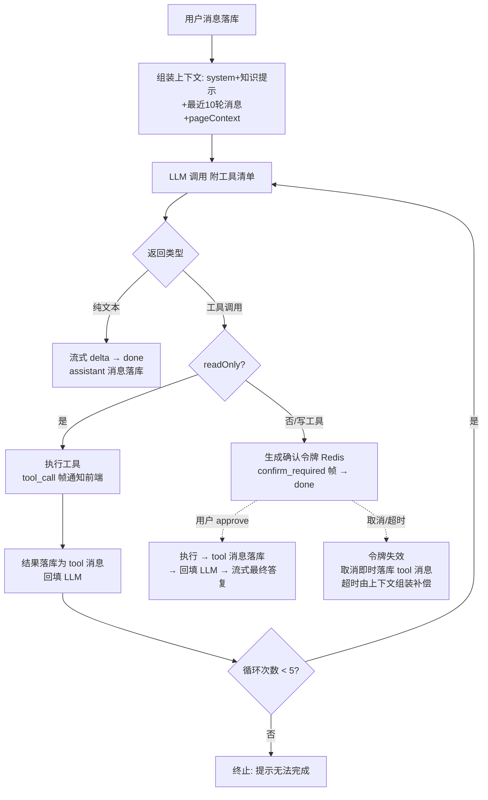

# 软件测试平台——全局智能助手详细设计说明书

**文档版本**：V1.1
**日期**：2026-07-31
**作者**：[填写]
**状态**：起草中

---

## 1. 引言

### 1.1 编写目的

本文档对 V1.1 AI 能力域中的**全局智能助手（ChatBot）**进行详细设计：会话管理、自然语言查询（只读工具）、快捷操作执行（写工具 + 确认机制）、对话式脑图编辑、平台使用指引，为开发实现提供完整依据。

### 1.2 范围

覆盖 SRS 3.5。助手为**工作空间级**能力（查询范围 = 当前工作空间内用户可见数据）；对话式脑图编辑的 DSL 定义与前端执行器复用《智能用例生成与脑图智能编辑详细设计说明书》4.4；网关、SSE、限流审计见《AI 基础设施详细设计说明书》。

### 1.3 参考资料

- 《软件测试平台需求规格说明书 V1.1》（3.5、4.2）
- 《软件测试平台概要设计说明书 V1.1》（4.4、8）
- 《AI 基础设施详细设计说明书 V1.1》
- 《智能用例生成与脑图智能编辑详细设计说明书 V1.1》（DSL 与挂载执行器）

---

## 2. 数据设计

### 2.1 数据库表设计

全部新表遵循平台规范：`id`（UUID v7，应用层生成）、`created_at`、`updated_at`、`is_deleted`，禁止物理外键（C5）；索引遵循 C9。

#### 2.1.1 助手会话表（ai_conversation）

| 字段 | 类型 | 约束 | 说明 |
| ---- | ---- | ---- | ---- |
| id | UUID | PK | 会话 ID |
| user_id | UUID | NOT NULL | 归属用户（仅本人可见） |
| workspace_id | UUID | NOT NULL | 归属工作空间（跨空间隔离） |
| title | VARCHAR(100) | NOT NULL | 会话标题（首条用户消息前 30 字自动生成） |
| last_active_at | TIMESTAMP | NOT NULL | 最后活跃时间（列表排序） |
| is_deleted | BOOLEAN | NOT NULL DEFAULT FALSE | 是否删除 |
| created_at | TIMESTAMP | NOT NULL DEFAULT CURRENT_TIMESTAMP | 创建时间 |
| updated_at | TIMESTAMP | NOT NULL DEFAULT CURRENT_TIMESTAMP | 更新时间 |

**索引**：`idx_conv_user_ws` (user_id, workspace_id, last_active_at DESC)

#### 2.1.2 助手消息表（ai_message）

| 字段 | 类型 | 约束 | 说明 |
| ---- | ---- | ---- | ---- |
| id | UUID | PK | 消息 ID |
| conversation_id | UUID | NOT NULL | 所属会话 |
| role | VARCHAR(10) | NOT NULL | user / assistant / tool |
| content | TEXT | NULL | 文本内容（tool 消息为工具执行结果 JSON 文本） |
| tool_calls | JSONB | NULL | assistant 消息发起的工具调用载荷（name/arguments/callId 数组） |
| tool_call_id | VARCHAR(64) | NULL | tool 消息对应的调用 ID |
| is_deleted | BOOLEAN | NOT NULL DEFAULT FALSE | 是否删除 |
| created_at | TIMESTAMP | NOT NULL DEFAULT CURRENT_TIMESTAMP | 创建时间 |
| updated_at | TIMESTAMP | NOT NULL DEFAULT CURRENT_TIMESTAMP | 更新时间 |

**索引**：`idx_msg_conversation_id` (conversation_id)

> 会话与消息内容仅本人可见；审计权限用户只能经 `ai_invocation_log` 查看调用元数据（SRS 4.2）。保留期清理按 `conversationRetentionDays` 执行（同基础设施审计清理任务）。

### 2.2 写操作确认令牌（Redis，不落库）

```
key:   ai:confirm:{token}          # token = UUID
value: { userId, workspaceId, conversationId, assistantMessageId, toolCallId, toolName, arguments, createdAt }
TTL:   assistantConfirmTimeoutSeconds（默认 300 秒）
```

- 一次性消费：approve / cancel / 超时任一发生即删除；令牌不存在或已消费返回 6011（基础设施 3.6 增补）；
- `assistantMessageId` / `toolCallId` 标识令牌对应的 assistant 消息与工具调用，approve / cancel 落库 tool 消息时据此回填 `tool_call_id`，保证会话历史回填 LLM 时消息序列完整；
- `workspaceId` 供确认时的空间上下文校验（见 3.3.1）。

---

## 3. 接口详细设计

均为工作空间级接口（`/api/workspace/ai/**`，头 `Authorization` + `X-Active-Workspace`）。

### 3.1 会话管理

| 接口 | 路径 | 说明 |
| ---- | ---- | ---- |
| 会话列表 | `GET /api/workspace/ai/conversations` | 当前用户 + 当前空间，按 last_active_at 降序，**游标分页**（见下），返回 `{ "items": [{id, title, lastActiveAt}], "nextCursor": "…" }` |
| 新建会话 | `POST /api/workspace/ai/conversations` | 空会话，title = "新会话"，首条消息后自动更名 |
| 删除会话 | `DELETE /api/workspace/ai/conversations/:id` | 逻辑删除（级联逻辑删除消息） |
| 清空会话 | `DELETE /api/workspace/ai/conversations` | 清空当前用户当前空间全部会话 |
| 消息历史 | `GET /api/workspace/ai/conversations/:id/messages` | 按时间升序全量返回（role=tool 的消息前端渲染为工具调用卡片） |

**会话列表分页规则**：不设总量上限，游标分页滚动获取——参数 `cursor`（不透明游标，可空表示首页）+ `size`（默认 20，上限 50）；排序与游标锚点为 `(last_active_at DESC, id DESC)`（id 决胜，UUID v7 时序性保证稳定），实现为键集查询 `WHERE (last_active_at, id) < (:cursorTime, :cursorId)`，命中既有索引 `idx_conv_user_ws`（2.1.1）。`nextCursor` 为空表示无更多。选择键集而非页码/偏移：排序键 `last_active_at` 随会话活跃动态前移，偏移分页在滚动加载过程中会产生重复与漏项；键集分页仅可能漏掉「加载期间被顶到列表头部的旧会话」，该场景由前端本地置顶补偿（见 5.2），无一致性问题。

会话归属校验：非本人会话，或会话 `workspace_id` 与 `X-Active-Workspace` 不一致时，一律按会话不存在处理，返回 3001（资源不存在段，不暴露存在性）。

### 3.2 发送消息（SSE）

- **路径**：`POST /api/workspace/ai/conversations/:id/messages`（`text/event-stream`，`assistant_chat`）
- **请求体**：

```json
{
  "content": "帮我在项目X创建一个P1缺陷，标题为登录超时",
  "pageContext": {
    "projectId": "0198…",
    "documentId": "0198…",
    "selectedNodeId": "0198…"
  },
  "modelId": null
}
```

`pageContext` 可空；脑图编辑页发送时由前端上下文桥自动注入。`modelId` 可选：用户在助手输入区选择的对话模型标识（交互式功能通用约定，缺省或失效回退系统默认模型，见基础设施 3.1 / 4.11）；同一会话内允许逐条消息切换模型，Function Calling 循环内的多次上游调用使用同一模型。

- **SSE 事件**（在基础设施统一帧格式上扩展事件类型）：

| event | data | 说明 |
| ---- | ---- | ---- |
| delta | `{"content": "…"}` | 回复文本增量 |
| tool_call | `{"toolName": "query_bugs", "summary": "查询未关闭的致命缺陷"}` | 只读工具执行通知（前端渲染过程卡片） |
| confirm_required | `{"confirmToken": "…", "toolName": "create_bug", "preview": {…}, "expiresAt": "…"}` | 写操作确认请求，**本轮 SSE 随即以 done 结束** |
| minder_commands | `{"commands": […], "documentId": "…"}` | 对话式编辑翻译结果（DSL），交前端预览执行 |
| done | `{"messageId": "…"}` | 本轮回复完成 |
| error | `{"code": 6002, "message": "…"}` | 失败 |

> 扩展事件类型遵循基础设施 3.1 的自定义帧约定：`useAiStream()` 对未识别事件原样透传，由 `useAssistantStream.ts` 负责解析（见 5.1）。

### 3.3 写操作确认 / 取消

#### 3.3.1 确认执行

- **路径**：`POST /api/workspace/ai/confirmations/approve`（SSE），请求体 `{"confirmToken": "…"}`——令牌经请求体传递，不入 URL（避免进入网关/反向代理访问日志）。
- **处理**：校验 token 存在（不存在/超时/已消费返回 6011）、归属当前用户，且令牌 `workspaceId` 与 `X-Active-Workspace` 一致（用户切换空间后不可确认，同样返回 6011）→ 以当前 LoginUser 执行工具（既有 Service 方法）→ 结果作为 tool 消息落库（`tool_call_id` 取令牌中的 `toolCallId`）并回填 LLM → 流式生成最终答复（帧同 3.2）；执行结果含平台内跳转链接（如新建缺陷详情路由）。
- 确认动作本身写入平台 audit_log（操作类型 ai_tool_confirm）。

#### 3.3.2 取消

- **路径**：`POST /api/workspace/ai/confirmations/cancel`，请求体 `{"confirmToken": "…"}`
- **处理**：删除令牌，落一条 tool 消息（`tool_call_id` 取令牌中的 `toolCallId`，内容为"用户已取消该操作"）供后续上下文感知；返回 200。

---

## 4. 业务逻辑设计

### 4.1 工具注册表

```java
record ToolDefinition(
    String name,             // 唯一名，snake_case
    String description,      // 供 LLM 理解的用途描述
    Map<String, Object> paramsSchema,  // OpenAI tools 参数 JSON Schema（手写常量）
    boolean readOnly,
    String requiredPermission // 平台权限码，null 表示仅需登录
)
```

**首期工具清单**：

| 工具 | 读/写 | 参数（摘要） | 实现（复用既有 Service） |
| ---- | ---- | ---- | ---- |
| query_reviews | 只读 | status? / participatedByMe? / dateRange? | 评审列表查询（空间内全项目聚合） |
| query_plans | 只读 | status? / ownedByMe? | 计划列表查询 |
| query_bugs | 只读 | status? / severity? / assigneeIsMe? / keyword? / countOnly? | 缺陷列表/计数查询 |
| query_cases | 只读 | keyword / projectId? | 用例节点标题检索 |
| get_platform_guide | 只读 | topic | 使用指引知识片段检索（4.5） |
| translate_minder_command | 只读 | instruction（需 pageContext.documentId） | DSL 翻译（同 dsl_translation 链路），结果经 minder_commands 帧交前端 |
| create_bug | **写** | projectId / title / severity / priority / reproSteps? | 缺陷创建 Service |
| create_plan_draft | **写** | projectId / name / description? | 计划创建 Service（status=new） |

- 写工具实际可用集 = 注册表 ∩ `assistantWriteToolWhitelist`（系统配置，默认即上表两项）；白名单外的写工具不进入 LLM 工具清单；
- 跨项目查询：只读查询工具在空间内聚合时，逐项目按用户成员身份过滤（复用既有数据隔离查询），无权项目自然不可见；
- 工具执行以当前 LoginUser 走 Service 层——权限校验、业务规则、审计与人工操作完全一致（AD-6）；权限不足时工具返回错误文本（"无权执行"），由 LLM 转述，不抛异常中断会话。

### 4.2 Function Calling 执行循环



- 上下文窗口：最近 10 轮（user+assistant 对），tool 消息随所属轮次带入；超预算从最旧轮次丢弃；
- 工具调用上限 5 次/轮（防死循环），达到上限时的"无法完成"提示同样作为 assistant 消息落库并以 done 帧结束；LLM 单次返回多个工具调用时串行执行；串行途中遇到写工具即触发确认中断，同批剩余未执行的调用直接丢弃（已执行的只读结果照常落库，approve 后由 LLM 在新一轮自行决策是否重新调用）；
- **写工具中断语义**：`confirm_required` 后本轮 SSE 结束，助手状态由前端维持"等待确认"卡片；approve 开启新 SSE 流继续；同一 assistant 轮次的 tool_calls 载荷在两段间经数据库消息记录衔接（无内存态依赖，实例重启不影响待确认操作——令牌在 Redis）；
- **超时悬空补偿**：令牌超时是 Redis TTL 静默过期，不产生回调，不即时落库消息。组装上下文时检测带 `tool_calls` 但缺少对应 tool 消息的 assistant 消息，为其补一条"操作已超时未执行"的 tool 消息落库后再回填——保证送入 LLM 的消息序列始终满足 tool_calls 后必跟 tool 消息的协议约束；
- **防虚构**：system 指令强制"数据必须来自工具结果，工具查不到必须明确告知查询不到"；回复中的实体链接由工具结果携带的路由数据生成（4.6），不允许 LLM 自造 URL。

### 4.3 对话式脑图编辑

- 触发条件：`pageContext.documentId` 非空且用户消息为编辑意图（LLM 决策调用 `translate_minder_command`）；无文档上下文时 LLM 告知"请在脑图编辑页使用该能力"；
- 后端校验用户对该文档的编辑权限（无权则工具返回错误文本）；
- 翻译复用 `dsl_translation` 的提示词模板、文档骨架上下文与结构校验链路，但作为 `assistant_chat` 会话内的一次工具调用，审计与限流仅按 assistant_chat 记一次，不另计 dsl_translation；回填 LLM 的 tool 消息内容为翻译结果摘要（命令条数与动作类型清单，不含全量 JSON，控制 token），循环继续以生成收尾答复（如"已为你准备好编辑预览，请确认"）；
- 翻译结果经 `minder_commands` 帧下发，**前端复用 DSL 执行链路**（命中预览 → 确认 → 编辑内核批量执行 → 单撤销组，新增节点带 AI 标识）；执行/取消结果由前端追加一条本地提示消息（不回传后端，编辑效果本身经协同通道同步）；
- 指令歧义时 LLM 直接以文本追问（`ambiguous` 结果转化为澄清问题），不做模糊执行。

### 4.4 页面上下文桥（前端）

- `stores/assistantContext.ts`：脑图编辑页 `onMounted/onUnmounted` 注册/注销当前 `{projectId, documentId, selectedNodeId}`，选中节点变化时更新；
- 助手面板发送消息时读取该 store 注入 `pageContext`；非脑图页仅注入当前 projectId（若在项目内）；
- system 提示中声明上下文含义（"用户当前正在编辑文档 X，选中节点 Y"），供 LLM 消歧（如"当前用例"指代）。

### 4.5 平台使用指引知识库

- **形态**：`server/src/main/resources/ai/guide/*.md` 静态知识片段，每片段头部 YAML 元数据：`topic`（主题词数组）、`route`（平台路由模板）、`roles`（适用角色，可空）；启动时加载内存；
- **检索**：`get_platform_guide` 先按 `roles` 过滤（该字段非空时仅保留包含当前用户在本空间角色的片段，为空表示全员适用），再按 topic 关键词匹配取 Top 3 片段注入 Prompt；LLM 基于片段作答并附 `route` 生成跳转链接；
- **拒答**：无命中片段时工具返回空，system 指令要求明确回答"该问题超出使用指引范围"，不杜撰功能；
- 首发片段覆盖：评审发起/参与、计划创建与执行、缺陷提交与流转、用例脑图编辑、空间与成员管理（≈ 15 片段，随功能演进维护）。

### 4.6 回复链接安全

- 工具结果中的实体统一携带 `routePath` 字段（后端由路由模板生成，如 `/project/bugs/{id}`）；
- system 约束 LLM 仅使用工具提供的 routePath 组装 Markdown 链接；
- **前端兜底**：消息 Markdown 渲染时链接白名单过滤——仅渲染站内相对路径（`/` 开头且匹配已注册路由前缀），外部 URL 一律降级为纯文本（概要 8 输出防护）。

---

## 5. 前端设计

### 5.1 文件与组件

| 文件 | 说明 |
| ---- | ---- |
| `components/assistant/AssistantFab.vue` | 右下角悬浮按钮（BusinessLayout 挂载，`aiEnabled` 控制显隐；管理端布局不挂载；`aiEnabled` 为全局开关，未选择工作空间时按钮仍显示） |
| `components/assistant/AssistantPanel.vue` | 对话面板（抽屉式）：会话列表侧栏 + 消息流 + 输入区；支持最小化保持会话 |
| `components/assistant/MessageItem.vue` | 消息渲染：Markdown（链接白名单过滤）、工具过程卡片、确认卡片（操作明细表格 + 确认/取消 + 倒计时）、DSL 预览执行入口 |
| `components/assistant/useAssistantStream.ts` | 基于 `useAiStream()` 扩展多事件解析（tool_call / confirm_required / minder_commands） |
| `components/assistant/useConversationList.ts` | 会话列表游标分页组合式函数（触底加载、`nextCursor` 终止、id 去重、本地置顶、空间切换重置，见 5.2/5.3） |
| `stores/assistantContext.ts` | 页面上下文桥（4.4） |
| `services/workspace.ts` / `types/index.ts` | 3.1–3.3 接口封装与类型 |

### 5.2 交互要点

- 面板随工作空间切换重置会话列表（会话按空间隔离）；流式回复期间输入框禁用并显示停止按钮（中断即断开 SSE，服务端取消上游）；
- **未选择工作空间**（如 `/workspaces` 空间列表页）：`aiEnabled` 为全局开关（`GET /api/workspace/ai/status` 不依赖工作空间上下文），悬浮按钮仍显示；打开面板时无会话上下文，渲染「请先选择工作空间」引导态，会话列表与输入区禁用，不发起会话/消息请求；
- **模型选择器**：输入区工具条内嵌公共组件 `AiModelSelect`（对话模型选择器，基础设施 5.1 / 交互设计 2.8），所选 `modelId` 随 3.2 发送消息请求提交；切换即时生效于后续消息，不影响历史消息；
- **会话列表滚动加载**：侧栏滚动至底部自动携带 `nextCursor` 拉取下一页追加渲染（加载中显示骨架条，`nextCursor` 为空后不再触发）；面板打开与空间切换时从首页重载；发送消息、新建会话时前端**本地置顶**对应会话（不重拉列表），与键集分页的漂移补偿约定一致（3.1）；追加渲染按会话 id 去重防御；
- 确认卡片倒计时（expiresAt）归零后置为"已超时"不可操作；approve 后卡片状态更新为执行结果 + 跳转链接；
- `minder_commands` 收到时若用户已离开对应文档页，提示"请回到文档后重试"，丢弃指令（不缓存执行）；
- 消息历史按会话惰性拉取（打开会话时一次性获取该会话全量消息），50 条以上启用虚拟滚动（复用 Element Plus 虚拟化原语）。

### 5.3 单元测试点（C8）

- `useAssistantStream.ts` 多事件解析与异常帧容错；
- 会话列表游标分页组合式函数：滚动触底加载、`nextCursor` 终止、id 去重、本地置顶、空间切换重置；
- 链接白名单过滤纯函数（站内/站外/伪协议用例）；
- 确认卡片状态机（待确认/倒计时归零/已执行/已取消）渲染分支；
- 后端：令牌一次性消费与归属/空间校验、超时悬空 tool_calls 的补偿 tool 消息合成、循环上限终止、白名单过滤后的工具清单组装、会话列表键集分页（游标编解码、同 `last_active_at` 并列时 id 决胜、非法游标按首页处理）。

---

## 6. 实施说明

- **数据库迁移**：新增 2.1 两张表（DDL 写入 `v1.1.sql`，遵循《AI 基础设施详细设计说明书》第 6 章脚本版本化约定）；
- **实施梯队**：使用指引属梯队二（只读首发）；自然语言查询属梯队三；快捷操作（写工具）与对话式脑图编辑属梯队四；
- **依赖**：无新增依赖（确认令牌用既有 Redis；知识片段为静态资源）。

---

**文档结束**
