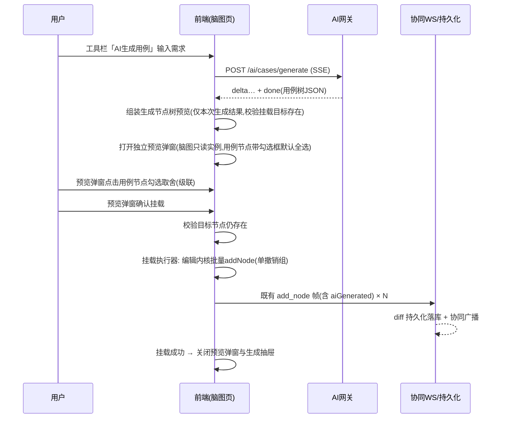

# 软件测试平台——智能用例生成与脑图智能编辑详细设计说明书

**文档版本**：V1.1
**日期**：2026-07-31
**作者**：[填写]
**状态**：起草中

---

## 1. 引言

### 1.1 编写目的

本文档对 V1.1 AI 能力域中**围绕脑图编辑器的 AI 功能**进行详细设计：用例子树生成、步骤补全、优先级推荐、轻量需求池，为开发实现提供完整依据。

### 1.2 范围

覆盖 SRS 3.2（智能测试用例生成），含配套的需求池实体模块。公共基础（AI 网关、SSE 帧格式、限流审计、错误码 6001–6012）见《AI 基础设施详细设计说明书》，本文档不重复。

核心机制约束（概要 AD-3 / 4.2）：**AI 产出进入脑图一律经前端编辑内核挂载**，复用协同广播、diff 持久化与撤销链路，后端不提供批量写节点接口。

### 1.3 参考资料

- 《软件测试平台需求规格说明书 V1.1》（3.2）
- 《软件测试平台概要设计说明书 V1.1》（4.2、4.3）
- 《AI 基础设施详细设计说明书 V1.1》
- 《脑图组件详细设计 V1.0》（`docs/详细设计/脑图组件详细设计.md`）
- 《项目工作区详细设计说明书 V1.0》（归档，节点模型与 WS 协议）

---

## 2. 数据设计

### 2.1 数据库表设计

新表遵循平台规范（同基础设施文档 2.1）：`id` 为 UUID v7（应用层生成）、`created_at`、`updated_at`、`is_deleted`，禁止物理外键（C5）；索引遵循 C9。

#### 2.1.1 需求池条目表（requirement_pool_item）

| 字段 | 类型 | 约束 | 说明 |
| ---- | ---- | ---- | ---- |
| id | UUID | PK | 条目 ID |
| project_id | UUID | NOT NULL | 归属项目 |
| title | VARCHAR(200) | NOT NULL | 条目标题 |
| content | TEXT | NOT NULL | 需求文本（Markdown，长度上限见 `requirementContentMaxLength` 配置键） |
| source_url | VARCHAR(500) | NULL | 来源 URL（仅记录出处，平台不抓取） |
| created_by | UUID | NOT NULL | 创建人（编辑/删除权限判定依据） |
| updated_by | UUID | NOT NULL | 最后更新人 |
| is_deleted | BOOLEAN | NOT NULL DEFAULT FALSE | 是否删除 |
| created_at | TIMESTAMP | NOT NULL DEFAULT CURRENT_TIMESTAMP | 创建时间 |
| updated_at | TIMESTAMP | NOT NULL DEFAULT CURRENT_TIMESTAMP | 更新时间 |

**索引**：`idx_rpi_project_id` (project_id)

> 标题关键字检索用 `title ILIKE '%kw%'`（项目内条目量级小，不建全文索引）；条目不建向量索引（AD-5）。

#### 2.1.2 文档需求关联表（requirement_document_rel）

| 字段 | 类型 | 约束 | 说明 |
| ---- | ---- | ---- | ---- |
| id | UUID | PK | 主键 |
| document_id | UUID | NOT NULL | 脑图文档（test_case_module，type=document） |
| requirement_id | UUID | NOT NULL | 需求池条目 |
| is_deleted | BOOLEAN | NOT NULL DEFAULT FALSE | 是否删除 |
| created_at | TIMESTAMP | NOT NULL DEFAULT CURRENT_TIMESTAMP | 创建时间 |
| updated_at | TIMESTAMP | NOT NULL DEFAULT CURRENT_TIMESTAMP | 更新时间 |

**索引**：`uk_requirement_document_rel` UNIQUE (document_id, requirement_id) WHERE is_deleted = false，`idx_requirement_document_rel_requirement_id` (requirement_id)

#### 2.1.3 既有表变更（AI 标识字段）

AI 标识是节点数据的一部分（SRS 3.2.1 业务规则），随快照继承：

| 表 | 变更 | 说明 |
| ---- | ---- | ---- |
| test_case_node | `ADD COLUMN ai_generated BOOLEAN NOT NULL DEFAULT FALSE` | AI 生成标识 |
| test_review_node_snapshot | 同上 | 评审快照继承 |
| test_plan_node_snapshot | 同上 | 计划快照继承 |

不新增索引（该字段仅用于渲染，不作为独立查询条件）。快照创建逻辑（评审/计划的既有拷贝 SQL）同步增加该列的复制。

### 2.2 结构化输出数据结构（AI 生成用例树）

用例子树生成、步骤补全共用同一输出结构（网关侧按下述规则校验，见基础设施文档 4.4）：

```json
{
  "nodes": [
    {
      "type": "case",
      "title": "邮箱登录成功",
      "priority": "P1",
      "children": [
        { "type": "precondition", "title": "用户已注册且处于登录页", "children": [] },
        { "type": "step", "title": "输入正确邮箱和密码，点击登录", "children": [] },
        { "type": "expected", "title": "跳转到首页，显示用户昵称", "children": [] }
      ]
    }
  ]
}
```

**校验规则**（Bean Validation + 自定义结构断言）：

- `type` ∈ `case / normal / precondition / step / expected`（`@InEnum`，与 V1.0 节点模型一致）；
- `title` 非空且 ≤ 200 字符；超长在 Schema 校验**前**的宽容规整步骤中截断（与基础设施 4.4 的剥离 think 段/代码围栏同层处理），截断计入 warnings，不触发校验失败与带错重试；
- `priority` 仅允许出现在 `case` 节点，∈ P0–P3；非 case 节点出现 priority 视为校验失败；
- 父子合法性：`precondition / step / expected` 只能是 `case` 的直接子节点且自身无子节点；`case` 下不得再嵌套 `case`（与既有编辑器约束一致）；`normal` 可嵌套 `normal / case`；
- 树深度 ≤ 5、单次节点总数 ≤ 200，超限校验失败（防失控输出）；
- 步骤补全场景额外约束：`nodes` 仅允许 `step / expected` 类型的扁平数组。

---

## 3. 接口详细设计

通用约定、SSE 帧格式、错误码见《AI 基础设施详细设计说明书》3.1 / 3.6。本章接口均为项目级（`/api/project/**`，头 `Authorization` + `X-Active-Workspace` + `X-Active-Project`）。

### 3.1 需求池接口（常规业务，不经 AI 网关、不受 AI 开关影响）

#### 3.1.1 条目列表

- **路径**：`GET /api/project/requirements`
- **参数**：`keyword`（可选，标题模糊）、`page`、`pageSize`
- **响应**：`{ "records": [{ "id", "title", "sourceUrl", "createdBy", "creatorName", "updatedAt" }], "total": 12 }`

#### 3.1.2 条目详情

- **路径**：`GET /api/project/requirements/:id`
- **响应**：含 `content`（Markdown 全文）的完整对象。

#### 3.1.3 创建条目

- **路径**：`POST /api/project/requirements`
- **请求体**：`{ "title": "登录模块需求", "content": "……", "sourceUrl": null }`
- **校验**：`title` ≤ 200；`content` 长度 ≤ `requirementContentMaxLength`（默认 20000 字符，定义见基础设施文档 2.2 settings 键清单；需求池不受 AI 开关影响，AI 配置记录不存在时取代码内置默认值），超限返回 1001 并明确提示；`sourceUrl` 仅格式校验，不访问。
- **响应**：创建后的条目，201。

#### 3.1.4 更新 / 删除条目

- **路径**：`PUT / DELETE /api/project/requirements/:id`
- **权限**：仅条目创建人或具备项目管理权限的成员，违规返回 2001。
- **删除处理**：逻辑删除条目，同事务解除其全部文档关联（requirement_document_rel 逻辑删除）；不影响已生成的用例。

#### 3.1.5 文档关联查询 / 设置

- **路径**：`GET / PUT /api/project/documents/:docId/requirements`
- **PUT 请求体**：`{ "requirementIds": ["0198…", "0199…"] }`（全量设置，差量增删关联记录）
- **归属校验**：`:docId` 必须属于 `X-Active-Project` 对应项目（联表 test_case_module 校验），不一致返回 3001；`requirementIds` 中的条目须属于同一项目。
- **说明**：文档编辑权限即可维护关联；GET 返回关联条目摘要列表，供脑图 AI 入口默认带入。

### 3.2 AI 生成类接口（SSE）

#### 3.2.1 生成用例子树

- **路径**：`POST /api/project/ai/cases/generate`（`text/event-stream`）
- **请求体**：

```json
{
  "documentId": "0198…",
  "targetNodeId": "0198…",
  "requirementText": "手动粘贴的需求文本，可空",
  "requirementIds": ["0198…"],
  "modelId": null
}
```

- `modelId`：可选，用户选择的对话模型标识（交互式功能通用约定，缺省或失效回退系统默认模型，见基础设施 3.1 / 4.11）；本节 3.2.2 与 3.3.2 的请求体同样支持该字段，不再逐一标注。
- **校验**：`requirementText` 与 `requirementIds` 至少一项非空；`targetNodeId` 必填——用户未选中节点时由前端传入文档根节点 ID（SRS 3.2.1：默认挂载根节点）；文档编辑权限。
- **流式响应**：`delta` 帧透传生成文本；`done` 帧为 2.2 结构 + `"warnings": []`（截断等提示）。
- **说明**：`targetNodeId` 仅用于生成上下文（祖先路径标题链 + 目标节点直接子节点标题——作为新子树的同级参照，见 4.6），挂载由前端执行；生成期间文档可继续编辑。

#### 3.2.2 补全步骤

- **路径**：`POST /api/project/ai/cases/complete-steps`（SSE）
- **请求体**：`{ "documentId", "nodeId", "extraText": "临时补充上下文，可空", "requirementIds": [] }`
- **校验**：`nodeId` 必须为 case 类型节点；文档编辑权限。
- **上下文取材**：节点标题 + 祖先路径 + 同级节点标题（SRS 3.2.2，≤ 50 条）+ 既有子节点（去重参考，提示"已有步骤不重复输出"）+ 需求条目/临时文本。
- **done 帧**：`{ "nodes": [ {type: "step"|"expected", title, children: []} ] }`（扁平数组，见 2.2 校验）。

### 3.3 同步建议类接口

#### 3.3.1 优先级推荐

- **路径**：`POST /api/project/ai/cases/priority-recommend`
- **请求体**：`{ "title": "支付失败重试", "ancestorTitles": ["订单模块", "支付流程"] }`
- **响应**：`{ "priority": "P0", "source": "rule" }` 或 `{ "priority": "P2", "source": "llm" }`
- **处理**：关键词规则命中直接返回（不经 LLM、不计限流）；未命中发起 LLM 同步调用（超时 5s，功能级覆盖网关同步调用默认读超时 15s——推荐场景时效价值高于成功率），失败返回 `{ "priority": null }`——前端静默忽略，不提示错误（非侵入原则）。

#### 3.3.2 脑图指令翻译（DSL）

- **路径**：`POST /api/project/ai/minder/dsl-translate`
- **请求体**：`{ "documentId", "instruction": "把所有P2以下的登录相关用例标为高亮", "selectedNodeId": null }`
- **响应**：

```json
{
  "commands": [
    { "selector": { "types": ["case"], "priorities": ["P3"], "keyword": "登录" },
      "action": { "type": "highlight", "params": {} } }
  ],
  "ambiguous": false,
  "clarification": null
}
```

- `ambiguous = true` 时 `commands` 为空，`clarification` 为需用户改写的原因说明（LLM 声明歧义或输出未过校验时统一走此分支，不做模糊执行）。

---

## 4. 业务逻辑设计

### 4.1 生成-预览-挂载总链路



- 预览为**纯前端本地快照**（仅本次生成结果组装，文档既有数据不并入预览），不写编辑内核、不产生撤销历史、不广播、不落库；预览弹窗内勾选状态（`aiSelected`）仅存于该弹窗的只读 Minder 实例内存，关闭预览弹窗即丢弃；挂载确认后才经编辑内核写入（纯预览约束，见交互设计 2.2）；
- 挂载前目标节点已被协同用户删除 → 提示重选挂载位置（弹出节点选择器），不丢弃预览结果；
- 生成抽屉在生成过程中随 `delta` 帧显示原始流式文本，`done` 后底部变为 [重新生成] [查看预览]；点击 [查看预览] 打开独立预览弹窗（两窗并存、预览置顶）；关闭预览弹窗仅关预览、生成抽屉保留「完成」态。

### 4.2 挂载执行器（前端 `aiMount.ts`）

「生成子树」「补全步骤」「对话式编辑新增节点」共用同一执行器：

- 入参：目标节点 ID + 2.2 结构的节点数组（经用户勾选过滤后）；
- 执行：`history.ts` 开启批量事务 → 深度优先逐个经编辑内核 `createNode` 创建，同步写入节点属性 `type / priority / aiGenerated: true` → 提交事务，**整批作为单条撤销历史**；
- 每个新节点触发既有 `add_node` WS 帧，帧内节点数据携带 `aiGenerated` 字段（协议扩展见 4.5）；
- 预览阶段（`buildPreviewTree`）仅组装本次生成节点树：**只有用例（case）节点可勾选**（`aiSelected: true` 默认选中），其 precondition/step/expected 内部结构随所属用例节点级联挂载；孤立的非用例节点（分组等）不可勾选、不参与挂载；**预览纯本地组装，不调用编辑内核**，勾选过滤（`filterCheckedTree`）仅提取 `aiGenerated && aiSelected` 的节点，仅确认挂载后才执行本节的批量写入；
- 勾选取舍规则：仅 case 节点可勾选；取消用例则其整棵内部结构（precondition/step/expected）一并排除，恢复勾选时整组恢复；非用例节点无勾选框、点击无效；
- 目标节点缺失处理按场景区分：生成子树 → 提示重选挂载位置（4.1，弹出节点选择器）；补全步骤的挂载目标只能是原 case 节点，该节点已被协同删除时提示"节点已被删除，无法挂载"，不提供重选。

### 4.3 优先级推荐（规则前置 + LLM 兜底）

- **规则表**：内置于后端常量（关键词 → 优先级），首发版本：

| 优先级 | 命中关键词（标题含任一） |
| ---- | ---- |
| P0 | 登录、支付、下单、密码、权限、安全、数据丢失、崩溃 |
| P1 | 提交、保存、删除、审核、导出、同步 |
| P3 | 提示文案、样式、排版、颜色、占位符 |

规则按 P0 → P1 → P3 顺序短路匹配，其余不命中（规则表不产出 P2，P2 仅来自 LLM；规则未命中且 LLM 失败/超时时无推荐，属预期行为）；
- **触发时机**：前端在节点被**手工单节点**标记为用例类型时调用接口（含手工标记与既有节点重标记）；触发判定基于标记面板的用户操作事件而非编辑内核数据变更事件，因此撤销/重做的事件重放不触发；AI 生成的节点已带优先级，不触发；DSL 批量 `mark_type` 不触发（见 4.4.2，避免瞬时批量请求冲击 suggestion 限流）；
- **前端呈现**：标记面板优先级按钮区上方显示推荐标签（如「推荐 P0」），点击即完成标记；用户已手工选择后到达的 LLM 结果直接丢弃；推荐请求进行中不阻塞任何操作。

### 4.4 脑图操作指令集（DSL）完整定义

#### 4.4.1 结构

```typescript
interface MinderCommand {
  selector: {
    types?: NodeType[]        // case/normal/precondition/step/expected
    priorities?: Priority[]   // P0-P3，仅对 case 生效
    keyword?: string          // 标题包含（忽略大小写）
    subtreeRootTitle?: string // 以标题引用限定子树范围（默认全文档），解析规则见下
    aiGenerated?: boolean     // 按 AI 标识筛选
  }
  action:
    | { type: 'mark_type'; params: { nodeType: NodeType } }
    | { type: 'mark_priority'; params: { priority: Priority } }
    | { type: 'highlight'; params: {} }
    | { type: 'move'; params: { targetParentTitle: string } }  // 仅文档内，标题引用
    | { type: 'add_child'; params: { nodes: AiNodeTree[] } }   // 结构同 2.2
}
```

- selector 各条件为 AND 关系；`commands` 数组按序执行，上限 10 条；
- **节点引用解析规则**：LLM 不接触节点 ID（翻译上下文仅含骨架统计与一级标题清单），`subtreeRootTitle` / `targetParentTitle` 由 `dslRunner.ts` 在当前树内按标题精确匹配（忽略首尾空白）解析；指令含「当前/选中节点」语义时 LLM 输出保留值 `@selected`——该保留值仅允许作为 `subtreeRootTitle` / `targetParentTitle` 的取值出现（提示词模板中声明此约定，后端结构校验对其显式放行，不当作真实标题），前端替换为请求随附的 `selectedNodeId` 对应节点；
- **解析中止粒度**：全部标题引用（含 `@selected`）在**预览阶段一次性解析**：唯一命中则使用；任一命令出现零命中、多义或 `@selected` 无对应选中节点，则**整批不进入预览**、直接提示改写（前端本地等同 `clarification` 分支），不做部分执行；
- V1.1 不支持跨文档操作：标题引用只在当前文档树内解析，跨文档语义的指令由 LLM 按歧义处理（`ambiguous = true`）。

#### 4.4.2 分工与执行

- **LLM 只做翻译**（`dsl_translation`，同步调用 + 结构校验：action 枚举、selector 字段类型、优先级枚举、`add_child.nodes` 套用 2.2 结构断言、标题引用字段放行保留值 `@selected`）；后端翻译时附带文档骨架上下文（模块下节点类型/优先级分布统计与一级标题清单，不传全量节点，控制 token）；
- **前端确定性执行**：`dslRunner.ts` 遍历当前 minder 树计算命中集合 → 弹出**影响范围预览**（命中数量 + 节点标题清单，可展开；含「将跳过」清单，见下）→ 用户确认 → 经编辑内核批量执行（单撤销组，同 4.2）；`add_child` 新增节点写 `aiGenerated: true`；
- **mark_type 合法性联动**：执行前逐节点校验类型变更的父子合法性（2.2 约束）：变更导致自身或子孙节点关系非法的节点（如把带 step 子节点的 case 改为 step、把父节点为 case 的节点标为 case）跳过执行，在预览弹窗中单列「将跳过」清单及原因；case 改为非用例类型时复用编辑内核既有联动清除优先级；DSL 批量 `mark_type` 标记为 case **不触发** 4.3 的优先级推荐（推荐仅由手工单节点标记触发）；
- **move 合法性联动**：执行前对每个命中节点校验移动后的父子合法性（2.2 约束）并做环检测（目标父节点不得位于被移动节点自身子树内），非法者跳过并进「将跳过」清单；
- **add_child 多目标语义**：selector 命中多个节点时，`params.nodes` 为**每个**命中节点各挂载一份独立副本（节点 ID 各异，均写 `aiGenerated: true`）；命中节点为 precondition / step / expected（自身不得有子节点）或挂载后违反 2.2 父子约束的跳过并进「将跳过」清单；
- **highlight 语义**：本地临时视觉态——仅当前用户视图内高亮呈现（样式复用搜索命中态），不写节点数据、不广播、不产生撤销历史，刷新或执行下一次 DSL 后清除；其余 action 均为编辑操作，参与单撤销组；
- 命中为空 → 提示"未找到匹配节点"；`ambiguous` → 展示 `clarification` 要求改写。

### 4.5 AI 标识（aiGenerated）全链路

- **协议**：WS `add_node` / `update_attrs` 帧的节点属性集扩展 `aiGenerated`（布尔，缺省 false）；后端 diff 持久化写入 `test_case_node.ai_generated`；Yjs 协同帧为二进制透传，无需变更；
- **渲染**：`badges.ts` 徽标体系新增「AI」徽标（注册规则同既有类型徽标，读取节点 data 的 `aiGenerated`）；
- **移除**：节点标记面板（右键菜单标记域）增加「移除 AI 标识」操作，仅当 `aiGenerated = true` 时显示；执行 `update_attrs` 置 false；**前端任何入口不提供置 true 的操作**（仅挂载执行器写入），移除后不可恢复（撤销操作除外——撤销属于编辑历史回退，不视为"重新添加"）；服务端对 `update_attrs` 不校验 `aiGenerated` 的变更方向——绕过前端置 true 属编辑权限内的低危伪造（不影响任何业务规则），接受该风险，不做后端拦截；
- **复制/粘贴**：`clipboard.ts` 既有实现复制节点全部 data，`aiGenerated` 随之保留到副本（SRS 数据继承规则），无需改动，补充单测断言；
- **快照继承**：评审/计划创建快照的字段拷贝清单加入 `ai_generated`。

### 4.6 生成类 Prompt 上下文组装

| 要素 | 内容 | 裁剪策略 |
| ---- | ---- | ---- |
| 需求上下文 | 需求条目内容（多条拼接，每条带标题定界）+ 临时文本 | 单条目截断至 8000 token，总预算超限时按选取顺序保留、丢弃部分并在 done 帧 warning 提示 |
| 结构上下文 | 目标节点祖先路径标题链 + 目标节点直接子节点标题（作为新增节点的同级参照，≤ 50 条）；补全步骤场景另含该 case 的同级节点标题（≤ 50 条） | 超出取前 50 |
| 去重参考 | 补全步骤场景：该 case 已有步骤/预期标题 | 全量（单用例子节点有限） |

---

## 5. 前端设计

### 5.1 文件与组件

| 文件 | 说明 |
| ---- | ---- |
| `pages/project/RequirementPoolPage.vue` | 需求池管理页（列表 + 关键字搜索 + 新建/编辑抽屉，MarkdownEditor 复用）；项目工作区侧边菜单新增入口，**不受 AI 开关控制** |
| `components/project/RequirementSelector.vue` | 条目选取器弹窗（多选 + 关键字过滤），供各 AI 入口复用 |
| `components/project/minder/ai/AiGeneratePanel.vue` | 「AI 生成用例」抽屉（右侧滑出约 720px、透明遮罩不压暗画布）：需求文本域 / 条目选择 / 流式输出区；done 后提供 [重新生成] [查看预览]，不再内嵌预览树 |
| `components/project/minder/ai/AiPreviewDialog.vue` | 独立预览弹窗（宽 70% × 高 80%（视口））：弹窗内创建 kityminder 只读实例渲染生成节点树快照，仅用例节点带勾选框（点击切换，随用例级联内部结构），底部 [确认挂载] [关闭]；两窗并存、预览置顶 |
| `components/project/minder/ai/aiPreviewRender.ts` | 预览脑图渲染支撑：`AiPreviewNode[]` → kityminder `importJson` 结构转换；勾选框渲染器注册（仿 `badges.ts` 的 `defineBadgeRenderer`，读取节点 `data.aiSelected` 绘制 ☑/☐）；仅预览弹窗内实例可见 |
| `components/project/minder/ai/aiMount.ts` | 挂载执行器（4.2）：`AiPreviewNode` 携带 `aiSelected`；`buildPreviewTree`（仅 case 子树默认勾选）/ `filterCheckedTree` 按勾选状态过滤 |
| `components/project/minder/ai/dslRunner.ts` | DSL 标题引用解析、命中计算与合法性过滤（4.4.2，纯函数便于单测）；highlight 视觉态与预览弹窗由调用方组件维护 |
| `components/project/minder/badges.ts` | 扩展 AI 徽标 |
| `services/project.ts` / `types/index.ts` | 3.1–3.3 接口封装与类型（无 `any`） |

### 5.2 交互要点

- 脑图工具栏新增「AI 生成用例」按钮（`stores/ai.ts` 的 `aiEnabled` 控制显隐）；右键菜单在 case 节点上显示「AI 补全步骤」；
- 生成/补全为交互式功能：`AiGeneratePanel` 内嵌公共组件 `AiModelSelect`（对话模型选择器，基础设施 5.1 / 交互设计 2.8），所选 `modelId` 随 3.2 请求提交；
- 全部 SSE 消费走基础设施的 `useAiStream()`（支持取消按钮、超 10 秒未见首帧提示可取消重试）；
- 预览-确认阶段：生成抽屉保持打开（右侧滑出，透明遮罩）；done 后点击 [查看预览] 打开独立预览弹窗（两窗并存、预览置顶）；预览弹窗内为 kityminder 只读实例渲染的本地快照（`buildPreviewTree`，仅生成节点树，文档既有数据不并入预览），不落库、不产生撤销历史；确认挂载成功 → 关闭预览弹窗与生成抽屉；未确认挂载（仅关闭预览弹窗）→ 生成抽屉保留「完成」态、快照可重新预览；
- 挂载确认时执行目标节点存在性校验；预览弹窗勾选状态（`aiSelected`）随预览弹窗销毁即丢弃，仅勾选过滤结果进入挂载执行器；
- DSL 执行预览用独立确认弹窗（命中数量醒目 + 清单折叠 + 「将跳过」清单及原因），确认后关闭并聚焦首个受影响节点。

---

## 6. 测试设计（C8）

### 6.1 前端单元测试

- `dslRunner.ts`：selector 组合命中、空命中、标题引用解析（唯一命中/零命中/多义/`@selected` 替换/解析失败整批中止）、mark_type 非法变更跳过与优先级清除联动、move 非法移动与环检测跳过、add_child 多目标挂载与非法目标跳过、执行为单撤销组；
- `aiMount.ts`：勾选过滤规则（`aiSelected` 父子联动、仅 case 子树默认勾选）、aiGenerated 写入、目标节点缺失分支（生成重选与补全不可挂载两种场景）；
- `badges.ts`：AI 徽标注册与移除后消失；`clipboard` 断言 aiGenerated 随复制保留。

### 6.2 后端单元测试

- 需求池 Service：创建/更新的长度校验分支、非创建人且无项目管理权限的 2001 分支、删除条目联动解除文档关联；
- 文档关联：`:docId` 跨项目归属校验的 3001 分支、全量设置的差量增删；
- 结构化输出校验：2.2 断言（父子合法性、深度 ≤ 5、总数 ≤ 200、非 case 节点带 priority 失败、title 超长截断计入 warnings）；
- DSL 翻译结构校验：action / selector 枚举断言、`add_child.nodes` 套用 2.2 断言、`@selected` 保留值放行。

---

## 7. 实施说明

- **数据库迁移**：遵循脚本版本化约定（基础设施文档第 6 章）：2.1.1 / 2.1.2 两张新表 DDL 与 2.1.3 的三条 `ALTER TABLE … ADD COLUMN ai_generated`（默认 false，存量数据零影响）均写入 `v1.1.sql`——`v1.sql`（V1.0 基线）内容保持不变，不改动其中的建表语句；首次建库按 `v1.sql` → `v1.1.sql` 顺序执行后自动包含该列；
- **实施梯队**：子树生成 / 补全属梯队一（此时需求条目选取降级为仅手动输入）；需求池属梯队二；优先级推荐、对话式脑图编辑（DSL）属梯队四；
- **依赖**：无新增前后端依赖。

---

**文档结束**
