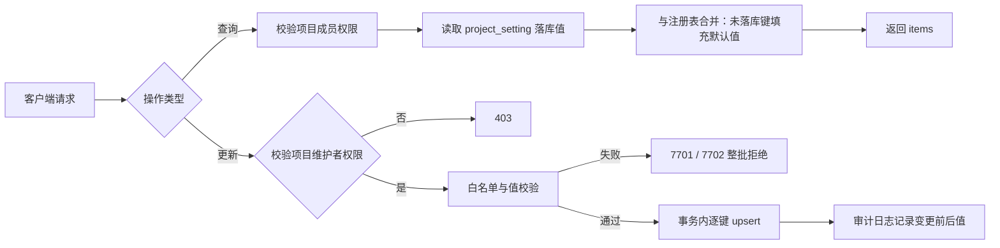

# 软件测试平台——项目设置详细设计说明书

**文档版本**：V1.2  
**日期**：2026-08-21  
**状态**：起草中

---

## 1. 引言

### 1.1 编写目的

本文档对软件测试平台 V1.2 **平台级项目设置**进行详细设计，定义安全策略与应用设置的数据结构、接口规范与业务逻辑，为开发实现提供依据。环境管理、全局资产、GitLab 仓库配置的详细设计分别见对应独立文档，它们在需求层面归属 SRS「项目设置」模块（3.7），在设计层面保持按业务能力分册组织。

### 1.2 范围

覆盖 SRS 3.7 项目设置中的**安全策略与应用设置**（SRS 3.7.4）及项目设置的通用机制：

- **配置存储模型**：项目级设置项的统一存储表与键注册表（域归属标注）；
- **设置读写接口**：按业务域查询、批量更新；
- **权限与校验逻辑**：维护者可写、成员只读；键白名单与值格式校验；
- **与报告分享流程的衔接**：分享开关与有效期的消费点。

### 1.3 参考资料

- 《接口测试需求规格说明书 V1.2》（`docs/需求/接口测试需求规格说明书.md`，3.7、3.7.4）
- 《概要设计说明书 V1.2》（`docs/概要/概要设计说明书.md`）
- 《API 测试基础设施详细设计说明书》（`docs/详细设计/API测试基础设施详细设计说明书.md`，通用约定与错误码）
- 《项目设置交互设计》（`docs/交互设计/项目设置交互设计.md`）
- 《测试报告详细设计说明书》（`docs/详细设计/测试报告详细设计说明书.md`，分享链接生成与访问校验）

---

## 2. 数据设计

### 2.1 数据表

#### 2.1.1 项目设置表（project_setting）

项目级设置项统一存储。采用「域 + 键」模型支撑平台级框架：每个设置项显式标注业务域归属，新业务域接入时扩展注册表即可，不改表结构。

| 字段 | 类型 | 约束 | 说明 |
| ---- | ---- | ---- | ---- |
| id | UUID | PK | 主键 |
| project_id | UUID | NOT NULL | 归属项目 |
| domain | VARCHAR(20) | NOT NULL | 业务域归属：common / api_test / func_test |
| setting_key | VARCHAR(100) | NOT NULL | 设置项标识（如 report.share.enabled） |
| setting_value | VARCHAR(500) | NOT NULL | 设置值（字符串化存储，语义由注册表定义） |
| updated_by | UUID | NOT NULL | 最后维护人 |
| is_deleted | BOOLEAN | NOT NULL DEFAULT FALSE | 是否删除 |
| created_at | TIMESTAMP | NOT NULL DEFAULT CURRENT_TIMESTAMP | 创建时间 |
| updated_at | TIMESTAMP | NOT NULL DEFAULT CURRENT_TIMESTAMP | 更新时间 |

**索引**：`uk_project_setting` UNIQUE (project_id, domain, setting_key) WHERE is_deleted = false

> 未落库的键视为未配置，读取时返回注册表默认值；默认值在代码注册表中定义，不写入数据库。

#### 2.1.2 设置项注册表（代码常量，非数据库表）

| domain | setting_key | 默认值 | 说明 | 值校验 |
| ------ | ----------- | ------ | ---- | ------ |
| api_test | report.share.enabled | false | 允许分享接口测试报告（SRS 3.7.4） | boolean：true / false |
| api_test | report.share.expire-days | 7 | 分享链接有效期（天），用于生成链接时计算过期时间 | 整数，取值 1 / 7 / 30 / 90 |

> V1.2 无 `common` 域落库项，域值预留；`func_test` 域由功能测试域后续迭代扩展注册，本表结构不感知具体键。

### 2.2 错误码定义

使用接口测试业务域新增号段 **7701–7799**（在《API 测试基础设施详细设计说明书》2.2 错误码表登记）：

| 错误码 | 常量名 | 说明 |
| ------ | ------ | ---- |
| **7701** | API_SETTING_KEY_INVALID | 设置项标识非法（不在注册表白名单） |
| **7702** | API_SETTING_VALUE_INVALID | 设置值非法（格式或取值范围不满足注册表约束） |

---

## 3. 接口详细设计

### 3.1 通用约定

遵循《API 测试基础设施详细设计说明书》3.1：项目级路径 `/api/project/**`，请求头 `Authorization` + `X-Active-Workspace` + `X-Active-Project`（C4）；响应 `{ "code": 200, "message": "success", "data": {} }`，下文示例仅展示 `data` 字段内容。

### 3.2 查询项目设置

- **路径**：`GET /api/project/settings?domain=api_test`
- **说明**：查询当前项目指定域（含 `common`）的设置项。未显式配置的键一并返回注册表默认值。项目成员可调用。
- **请求参数**：`domain`（必填，当前仅支持 `api_test`）
- **响应示例**（data）：

```json
{
  "items": [
    { "domain": "api_test", "settingKey": "report.share.enabled", "settingValue": "false", "defaultValue": "false", "explicit": false },
    { "domain": "api_test", "settingKey": "report.share.expire-days", "settingValue": "7", "defaultValue": "7", "explicit": true }
  ]
}
```

### 3.3 批量更新项目设置

- **路径**：`PUT /api/project/settings`
- **说明**：批量更新设置项，逐键 upsert。仅项目维护者可调用（非维护者返回 403）。
- **请求体**：

```json
{
  "items": [
    { "domain": "api_test", "settingKey": "report.share.enabled", "settingValue": "true" },
    { "domain": "api_test", "settingKey": "report.share.expire-days", "settingValue": "30" }
  ]
}
```

- **校验规则**：
  - `domain + settingKey` 必须在注册表白名单内，否则整批拒绝并返回 7701；
  - `settingValue` 按注册表校验规则校验，任一键非法则整批拒绝并返回 7702（错误信息中指明非法键）；
  - 校验通过后事务内逐键 upsert，记录 `updated_by`。
- **响应示例**（data）：

```json
{
  "updated": 2
}
```

---

## 4. 业务逻辑设计

### 4.1 读写流程



### 4.2 与报告分享流程的衔接

- **开关消费点**：生成分享链接时（`POST /api/project/reports/:id/share`，见《测试报告详细设计说明书》）读取 `report.share.enabled`；为 `false` 时返回 7008（API_SHARE_NOT_ENABLED）。关闭开关不影响已生成链接的有效性判定。
- **有效期消费点**：生成分享链接时按当时 `report.share.expire-days` 计算 `share_expires_at` 写入报告表；后续修改有效期**仅影响新生成的链接**，已生成链接按其自身 `share_expires_at` 判定过期（7009）。
- **匿名访问**：分享链接访问不要求登录态，不走本模块接口；开关与有效期均为服务端判定，前端禁用态仅为交互提示。

### 4.3 权限模型

- 查询：项目成员（沿用平台既有项目角色判定）；
- 更新：项目维护者；权限判定复用平台既有注解/拦截器，不在本模块内重复实现。

---

## 5. 前端设计

页面布局、交互说明与状态分支见《项目设置交互设计》（`docs/交互设计/项目设置交互设计.md`）第 2、3 章。要点：

- 安全策略与应用设置页路由 `/workspace/projects/settings/security`，挂载于侧边栏「项目设置」分组；
- 维护控件按角色渲染可用/禁用态；保存失败时控件回滚并 Toast 错误码对应文案。

---

## 6. 实施说明

- **数据库变更**：新增表 `project_setting`（DDL 见 2.1.1）；无物理外键（`project_id` 为逻辑关联），符合 C5；索引符合 C9（唯一约束覆盖高频查询路径 project_id + domain + setting_key）。
- **错误码登记**：7701 / 7702 需同步登记至《API 测试基础设施详细设计说明书》2.2 错误码表。
- **扩展约定**：新业务域接入时仅在注册表追加 `(domain, key)` 定义与校验规则，不修改表结构与既有接口契约。

---

**文档结束**
