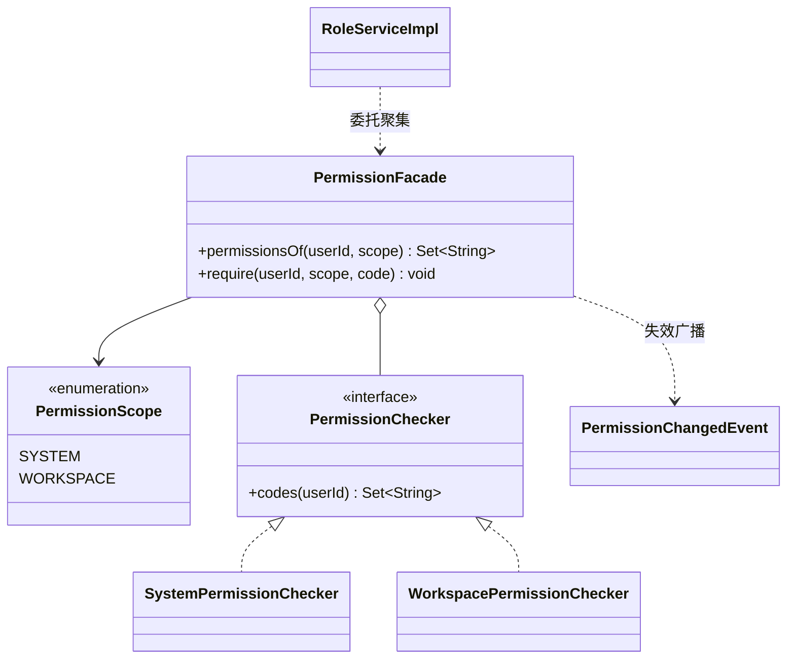
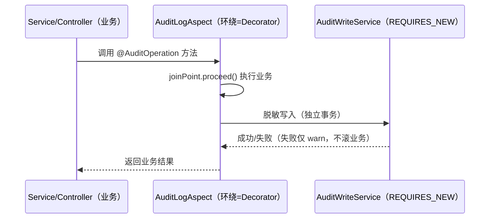

# 软件测试平台——系统管理模块重构方案

**文档版本**：V1.0
**日期**：2026-09-12
**状态**：起草中

---

## 1. 引言

### 1.1 范围

系统管理域覆盖：用户管理、角色与权限、工作区管理（管理侧）、操作审计、AI 配置管理（管理侧）。
本方案以总体计划 `docs/重构方案/00-总体重构计划.md` 为约束，聚焦该域的**读绩效**、**权限模型一致性**与**页面可维护性**。

### 1.2 与既有文档关系

业务行为以 `docs/详细设计/` 系统管理相关文档为准；本方案为重构规划，仅当改造改变行为/接口时先回写设计文档。

---

## 2. 现状与问题

### 2.1 规模事实

| 层 | 文件 | 说明 |
| --- | --- | --- |
| Controller | `AdminUserController`、`AdminRoleController`、`AdminWorkspaceController`、`AiAgentController`、`AiConfigController` | 5 个，位于 `controller/admin/` |
| Service | `UserServiceImpl`(257)、`RoleServiceImpl`(292)、`MyWorkspaceServiceImpl` | 6 文件 |
| Entity | `SysUser`、`SysRole`、`SysUserRole`、`SysPermission` | 4 实体 |
| 审计 | `AuditLog` + `AuditLogAspect`（AOP 注解 `AuditOperation`） | `framework/audit/` |
| 前端 | `admin/UserListPage.vue`、`UserFormPage.vue`、`RolePage.vue`、`WorkspaceListPage.vue`、`WorkspaceDetailPage.vue`、`DashboardPage.vue`、`AiConfigPage.vue`(1360 行) | 7 个页面 |

### 2.2 问题清单

| 编号 | 问题 | 证据/风险 |
| --- | --- | --- |
| S1 | 权限模型三表（`SysRole`/`SysUserRole`/`SysPermission`）+ 权限点分散维护，授权一致性靠业务校验，缺乏集中式校验 | 权限归属/变更易漂移，C4 上下文校验不一致 |
| S2 | 审计用 AOP 拦截，但埋点分散、无查询聚合（`AuditLog` 仅有写入思路） | 审计可观测性弱 |
| S3 | `AiConfigPage` 1360 行（含配置分组/模型/密钥/测试），与 `AiAgentController` 职责耦合 | 页面不可维护、密钥管理风险（与 `07` Security 关联） |
| S4 | 系统管理前端列表页（User/Workspace/Role）重复实现搜索、分页、批量操作 | 三处重复，低于预判 3 次阈值、需观望 |
| S5 | 工作区管理在管理端（`AdminWorkspaceController`）与运营端（`WorkspaceController`）双入口，职责边界未写死 | 越权/重复逻辑风险 |
| S6 | 本域测试覆盖 ≈ 0 | 不可安全拆分（受 Phase 0 约束） |

---

## 3. 目标结构

```
service/admin/
  user/        UserService(port), UserServiceImpl, UserPwdService(密码/密钥)
  role/        RoleService(port), RoleServiceImpl, PermissionRepository
  workspace/   MyWorkspaceService, AdminWorkspaceQuery
  audit/       AuditService(port) ← AuditLogAspect 落地为预置实现
controller/admin/   保持现结构，仅按 C2 瘦身（无业务逻辑）
web/src/pages/admin/ 页面抽 composables（usePermissionEditor/useWorkspaceTable）
```

权限校验集中化：新增 `PermissionProvider`（域入口）+ 单测锁定的"角色-权限-工作区归属"矩阵测试。

### 3.1 设计模式应用（骨架级）

> 本模块把 **权限裁决集中（Facade + Strategy）** 作为完整落点（类图 + 接口骨架），审计以 **Decorator（已存在）→ 补 Observer 消费** 显式化。骨架均基于现状代码（`RoleServiceImpl.getUserPermissionCodes` 已是权限点聚集点；`AuditLogAspect` 已是装饰已成样板）。

#### 3.1.1 权限裁决集中 → Facade + Strategy（完整骨架）

**现状（破）**：权限点散落三表（`SysRole.permissions` 为 JSON `List<String>`（`Jackson3TypeHandler`）→ `SysPermission` 种子数据（`code`=`父模块:操作`、`scope`=全局/工作区）→ `SysUserRole`），聚集已有单点 `getUserPermissionCodes(userId)`：`user_role → roles → flatMap(permissions) → distinct`（`RoleServiceImpl`）；运行期由 `WorkspaceRoleInterceptor` 把权限码注入 `LoginUser.workspaceAuthorities` 供 `@PreAuthorize`。**缺口**：无"当前用户 × scope"的集中裁决入口，C4 上下文校验各处自行校验；无变更失效（改角色权限后授权状态可能滞后会话）。

**目标（立）**：



**接口骨架**：
```java
public interface PermissionFacade {                     // 唯一裁决入口（兼容现有 @PreAuthorize 语义）
    Set<String> permissionsOf(UUID userId, PermissionScope scope);      // ≡ getUserPermissionCodes + 工作区 authorities
    void require(UUID userId, PermissionScope scope, String code);      // 无权抛 BusinessException(403)
}
public interface PermissionChecker {                    // Strategy：按 scope 取码
    Set<String> codes(UUID userId);
}
public record PermissionChangedEvent(UUID userId, PermissionScope scope) {} // Observer：使 authority 缓存失效
```

> 关键对齐：`require`/`permissionsOf` 结果必须与 `WorkspaceRoleInterceptor` 注入的 `workspaceAuthorities` 一致（单一裁决契约，冲突先走文档闸门）；不改权限点数据与 `@PreAuthorize` 注解用法。

**ArchUnit 断言**：`controller/admin`/`service/admin` 中不得再自行 `flatMap(permissions)`（`PermissionFacade` 唯一聚集点）；`PermissionChangedEvent` 消费幂等。

#### 3.1.2 审计 → Decorator（已有）+ Observer 消费（骨架）

**现状（已具备，认可为样板）**：`@AuditOperation{operation=CREATE/UPDATE/DELETE/EXPORT, entityType, logParams}` + `AuditLogAspect`（`@Around` 自定义注解、`PROPAGATION_REQUIRES_NEW` 独立事务、自动 operator/IP、首个 UUID 参数即 entityId、`SENSITIVE_FIELDS` 自动脱敏含 `password/secret/token`）——**Decorator 已落地**。

**差距**：只写不读。补消费端（Observer）：
```java
public interface AuditQueryService {           // 新 Port：查询/聚合
    PageResult<AuditLogRespDTO> page(AuditQueryParam param);
    Map<String, Object> aggregate(String entityType, LocalDate from);
}
// 消费者：AuditWriteService(现有) → publish AuditRecordedEvent；AuditQueryService 聚合展示（管理端审计页）
```



> 护栏：审计语义（REQUIRES_NEW + 脱敏 + UUID 参数推断）不变，只新增查询消费；新增查询 API 若改变接口先行文档闸门。

#### 3.1.3 其余落点（接口签名级）

| 模式 | 目标落点 | 骨架/约定 |
| --- | --- | --- |
| Hook + Compound Components | `AiConfigPage`(1360) 拆分 | `useAiConfigPage` + `useAiChatModels`（分组/模型/密钥读写/自动保存，密钥走密文规范）+ 6 个子组件（`AiMasterSwitchCard`/`AiChatModelTable`/`AiModelFormDialog`/`AiEmbeddingForm`/`AiSettingsSection`/`AiStatisticsTab`，props/emits，与 `06` 配置权威联动） |
| Strategy | 密码/密钥算法切换 | `PwdEncoderPolicy`（哈希算法族；现状仅一种则先不抽象，YAGNI，≥3 种算法再立） |

## 4. 重构步骤

1. **P0 特征测试**（系统管理）：用户 CRUD、角色授权、工作区归属、审计写入各 ≥5 条主路径，冻结现状。
2. **权限模型核查**（先于拆分）：核对 `SysPermission` 与权限点（`api-gitlab:view` 等已清理的点需同步核对），输出权限矩阵文档；若发现与 C4 上下文不符则**先走文档闸门**。
3. **Controller 瘦身（C2）**：删除迁移至 Service 的业务片段，Controller 仅路由+校验。
4. **审计消费化**：`AuditService` 端口 + 查询接口（若涉及新 API 则先更新详细设计）。
5. **`AiConfigPage` 拆分**：抽 `useAiConfigPage` + `useAiChatModels`（分组/模型/密钥读写/自动保存）+ 6 个子组件（props/emits），密钥展示走 `07` 的密文规范。
6. **域化落位**：`service/admin` 按上结构分包；ArchUnit 断言 `admin` 不依赖 `project`/`apitest` 业务实现。

## 5. 验收标准

- [ ] P0 特征测试全绿；重构 diff 与基线一致
- [ ] `controller/admin` 无业务逻辑（C2 自检通过）
- [ ] 权限矩阵文档存在且与权限点一致
- [ ] `AiConfigPage` ≤ 600 行，`AiConfigController` 与页面职责分离
- [ ] ArchUnit：admin → project/apitest 实现依赖为 0

## 6. 风险与依赖

| 风险 | 缓解 |
| --- | --- |
| 权限模型调整引发越权风险 | 拆分不改变权限语义；语义调整必须先走文档闸门与安全评审（`docs/spec/security.md`） |
| 审计量级放大 | 审计承接现有 AOP 语义，不新增埋点范围 |
| 与 AI 配置（`06`）交叉 | `AiConfig` 重构与 `06` 方案同步排期 |

## 7. 工作量粗估

| 活动 | 估值 |
| --- | --- |
| P0 特征测试 | 2–3 人日 |
| 权限矩阵 + 集中校验 | 3–4 人日 |
| 审计消费化 + 审计页面 | 2–3 人日 |
| `AiConfigPage` 拆分 | 2–3 人日 |
| 域化落位 + ArchUnit | 1–2 人日 |

---

**文档结束**