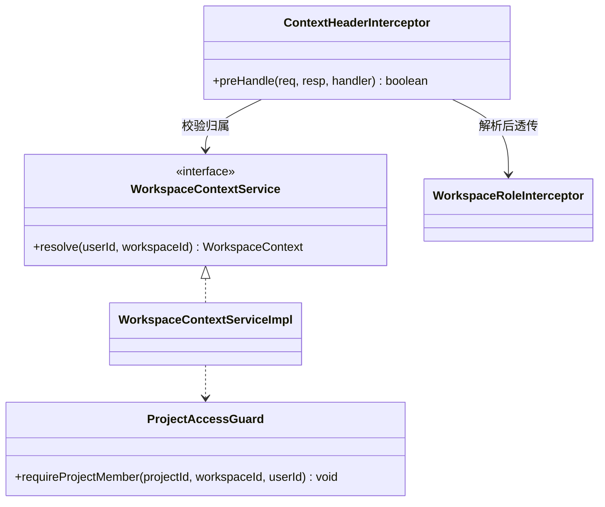
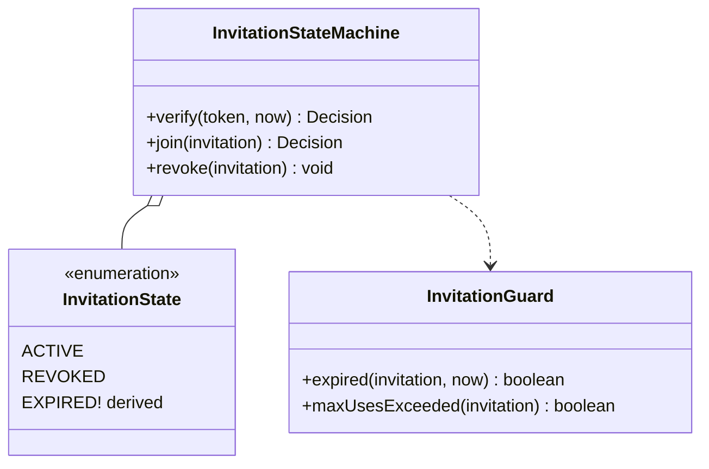

# 软件测试平台——空间管理模块重构方案

**文档版本**：V1.0
**日期**：2026-09-12
**状态**：起草中

---

## 1. 引言

### 1.1 范围

空间管理域覆盖：空间生命周期、成员与角色、邀请、**上下文解析（C4）**、项目归属。
本方案以 `docs/重构方案/00-总体重构计划.md` 为约束，核心关注 **C4 上下文头的权威位置**与成员/邀请状态机。

### 1.2 与既有文档关系

行为以 `docs/详细设计/` 空间管理文档为准；本方案仅在改变行为/接口时回写设计文档。

---

## 2. 现状与问题

### 2.1 规模事实

| 层 | 文件 | 说明 |
| --- | --- | --- |
| Controller | `WorkspaceController`、`WorkspaceMemberController`、`WorkspaceInvitationController`、`WorkspaceContextController`、`ProjectController` + 4 个 AI 会话 Controller | `controller/workspace/` 9 个 |
| Service | `WorkspaceServiceImpl`、`WorkspaceMemberServiceImpl`、`WorkspaceInvitationServiceImpl`、`WorkspaceContextServiceImpl` | 8 文件 |
| 前端 | `workspace/WorkspaceListPage.vue`、`ProjectListPage.vue`、`MemberListPage.vue`、`WorkspaceInfoPage.vue`、`JoinPage.vue` | 5 页面 |

### 2.2 问题清单

| 编号 | 问题 | 证据/风险 |
| --- | --- | --- |
| W1 | **上下文权威位置漂移**：`WorkspaceContextServiceImpl` 负责 C4 头解析，但各 Controller/Service 仍可能各自读取上下文头 | 违反 C4"仅请求头传递"的统一口径；`ProjectAccessGuard` 与之并存需核查是否双层校验 |
| W2 | 邀请状态（落库 `active/revoked` + 过期/超用为运行期推演）散落在 `WorkspaceInvitationServiceImpl`，无显式状态机 | 状态流转边界难测 |
| W3 | 管理端（`AdminWorkspaceController`）与运营端（`workspace/*`）双入口并存 | S5 同类问题：职责边界未冻结 |
| W4 | 前端工作区/项目列表页与系统管理列表页重复（搜索/分页） | 低于 3 次复制的观望项 |
| W5 | 本域测试覆盖 ≈ 0 | 需 P0 特征先行 |

---

## 3. 目标结构

```
service/workspace/
  context/     WorkspaceContextService(port, 唯一 C4 头解析点)
  member/      WorkspaceMemberService + InvitationStateMachine(邀请状态机)
  lifecycle/   WorkspaceService(生命周期) + AdminWorkspaceQuery(管理端查询)
controller/workspace/ 仅路由，无上下文读取逻辑（统一走 context 端口）
web/src/pages/workspace/ 抽 useWorkspaceTable/useInvitation 等 composable
```

关键点：**C4 头解析收敛为唯一 Port**——`controller`/`service` 一律注入 `WorkspaceContextService`，禁止自行 `getHeader`。

### 3.1 设计模式应用（骨架级）

> 本模块把 **C4 上下文收敛（Interceptor + Facade）** 与 **邀请状态机（State，真实三态）** 作为完整落点。现状事实：头解析点分散在 `WorkspaceContextController`（`@RequestHeader("X-Active-Workspace")`，3 端点）与 `WorkspaceRoleInterceptor`；`WorkspaceContextServiceImpl` 入参已是 `(userId, workspaceId)` 不读头；邀请 `status` 实际只有 `ACTIVE/REVOKED` 两值，过期是在运行期推演（`expiresAt < now`）。

#### 3.1.1 C4 上下文收敛 → Interceptor + Facade（完整骨架）

**现状（破）**：`WorkspaceContextController` 直接 `@RequestHeader`（3 端点）→ 头解析点 = Controller + `WorkspaceRoleInterceptor`（读头拼权限）双处；`ProjectAccessGuard.requireProjectMember(projectId, workspaceId, userId)` 以头为准做归属校验（防跨空间越权，已存在）。

**目标（立）**：新增 `ContextHeaderInterceptor` 为**唯一头解析点**（与 `07` 协同，C4 门禁处），`WorkspaceContextService` 为唯一上下文访问 Facade，Controller 禁止 `@RequestHeader`。



**接口骨架**：
```java
public interface ContextHeaderInterceptor { }      // 新：解析 X-Active-Workspace → LoginUser.activeWorkspaceId；缺失/非法按 C4 门禁拒绝（与 07 Interceptor 规则一致）
public interface WorkspaceContextService {         // 唯一上下文 Facade（沿用现有方法签名，不再由 Controller 读头）
    WorkspaceContextRespDTO getWorkspaceContext(UUID userId, UUID workspaceId);
    WorkspaceContextRespDTO updateWorkspace(UUID userId, UUID workspaceId, WorkspaceUpdateReqDTO reqDTO);
    WorkspaceContextRespDTO setDefaultProject(UUID userId, UUID workspaceId, WorkspaceDefaultProjectReqDTO reqDTO);
}
```

**ArchUnit 断言**：`controller/workspace` 无 `@RequestHeader("X-Active-Workspace")`（C4 门禁）；`WorkspaceContextService` 为唯一读上下文入口。

#### 3.1.2 邀请生命周期 → State（真实三态骨架）

**现状（破）**：`WorkspaceInvitation.status` 仅 `ACTIVE/REVOKED`（`:99` 撤销置 `REVOKED`，创建置 `ACTIVE`）；过期是**运行时推演**（`isValidInvitation`:181/`validateAndGetInvitation`:191 判 `expiresAt` 与 `maxUses`，非落库）；`joinByInvitation` 原子 `incrementUseCount`。**无 pending/accepted/expired 落库值**（此前方案的"pending/accepted/expired "状态集合为虚构）。

**目标（立）**：三态 = `ACTIVE` / `REVOKED`（落库）+ `EXPIRED`（派生，不落库）。



**迁移表**（源自 `WorkspaceInvitationServiceImpl`）：EXPIRED 派生不落库，仅在 `verify/join` 时计算。

| 事件 | ACTIVE | REVOKED | EXPIRED（派生） |
| --- | --- | --- | --- |
| `revokeInvitation` | → `REVOKED`（:99） | 拒绝（已撤销） | — |
| `verifyInvitation` | 未过期且 `useCount<maxUses` → 通过；过期 → `isValid=false`（:181） | ✗ 拒绝 | ✗ 拒绝 |
| `joinByInvitation` | 原子 `incrementUseCount`（:191）；超用 → `INVITATION_MAX_USES` | ✗ `INVITATION_REVOKED` | ✗ `INVITATION_EXPIRED` |

**接口骨架**：
```java
public interface InvitationStateMachine {          // 纯函数，可单测
    Decision verify(String token, Instant now);    // 状态值 + guard 组合出 joinable/拒绝原因
    Decision join(WorkspaceInvitation inv, Instant now);
    boolean canRevoke(WorkspaceInvitation inv);
}
```

> 护栏：`EXPIRED` 为派生态不落库（保持 C5 免迁移）；全 9 个格子转单测；与 `WorkspaceRoleInterceptor` 角色权限的联动保持现状不变。

#### 3.1.3 其余落点（接口签名级）

| 模式 | 目标落点 | 骨架/约定 |
| --- | --- | --- |
| Observer（事件） | 成员变更联动 | `MembershipChangedEvent(userId, workspaceId)` → 清除上下文快照缓存/通知协作层（现有 `WorkspaceMemberServiceImpl` 增删处发布） |
| CQRS 读模型 | 管理端只读（W3） | `AdminWorkspaceQuery` 独立只读查询模型，写操作留在运营端 Service（现状已分 Admin/运营 Controller，仅接查询收口） |

## 4. 重构步骤

1. **P0 特征测试**：工作区 CRUD、成员增删、邀请全生命周期（含过期/撤回）、上下文解析各 ≥5 条路径。
2. **C4 收敛审查**：全量 grep 上下文头读取点，归并为 context 端口，URL/请求体不得出现 workspaceId（C4 门禁）。
3. **邀请状态机显式化**：抽 `InvitationStateMachine`，状态表（pending/accepted/expired/revoked）可测。
4. **Controller 瘦身（C2）**：删除直接操作上下文头的 Controller 片段。
5. **请求体上下文去重**：若发现请求体重置 workspaceId 之处，按 C4 改为仅头传递（改动 API 则先走文档闸门）。
6. **域名检查**：`WorkspaceContext` 与安全层（`07`）的关系写成依赖文档，避免"双层上下文"。

## 5. 验收标准

- [ ] P0 特征测试全绿；上下文解析单测覆盖全部入口 Controller
- [ ] 全仓库 grep 无 Controller/Service 绕过 context 端口读取上下文头
- [ ] 邀请状态机覆盖过期/撤回/重发分支
- [ ] ArchUnit：workspace 不依赖 project/apitest 业务实现

## 6. 风险与依赖

| 风险 | 缓解 |
| --- | --- |
| 双入口管理（W3）职责重叠 | 收口为"运营端写、管理端只读查询"，若确需管理端写操作则先走文档闸门 |
| C4 收敛破坏现有调用 | 以 P0 上下文解析测试为回归基准逐 Controller 替换 |
| 与安全层双层守卫冲突 | 与 `07` Security 章节联合核查，明确单一裁决点 |

## 7. 工作量粗估

| 活动 | 估值 |
| --- | --- |
| P0 特征测试 | 2 人日 |
| C4 收敛 + 上下文端口化 | 2–3 人日 |
| 邀请状态机 | 1–2 人日 |
| 域化落位 + 前端 composables | 2 人日 |

---

**文档结束**