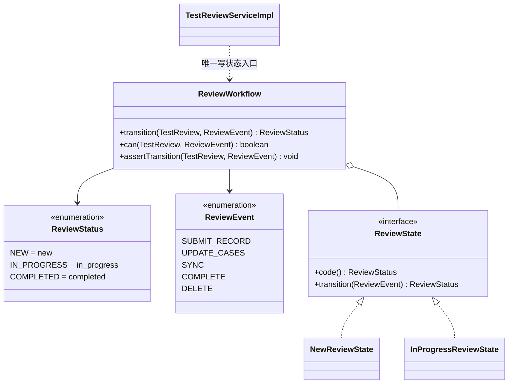
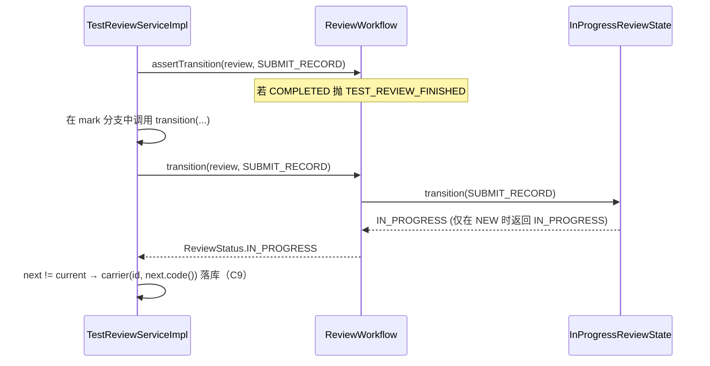

# 软件测试平台——功能测试域重构方案

**文档版本**：V1.0
**日期**：2026-09-12
**状态**：起草中

---

## 1. 引言

### 1.1 范围

功能测试域覆盖：用例文档与节点（`tcasedoc`）、用例模块（`ProjectModule`）、测试计划（`TestPlan` 及其执行/快照）、测试评审（`TestReview` 及快照记录）、需求池（`RequirementPoolItem`）。
本方案是总体计划 Phase 3（试点B）的实施细则，目标是把 `service/project/` 单包拆为自治域包，并切断已证实的 ai/apitest 横穿耦合。

### 1.2 与既有文档关系

行为以 `docs/详细设计/` 功能测试文档为准。评审/计划状态机语义若调整必须**先走文档闸门**。

---

## 2. 现状与问题

### 2.1 规模事实

| 类/包 | 行数/数量 | 说明 |
| --- | --- | --- |
| `TestReviewServiceImpl` | 860 | 评审流转 + 模块/节点快照 + 记录 |
| `TestPlanServiceImpl` | 857 | 计划生命周期 + 执行 + 快照 |
| `RequirementServiceImpl` | 318 | 需求池与关联 |
| `TestCaseNodeServiceImpl`/`TestCaseDocumentServiceImpl` | — | 用例树与文档 |
| `ProjectModuleServiceImpl` | — | 模块管理 |
| Entity | review 5 / plan 4 / requirement 2 / tcase 3 / `ProjectModule` | 15 |
| 测试覆盖 | `TestReviewServiceImplTest`（958 行/38 例）、`TestPlanServiceImplTest`（859 行）已冻结主线行为；状态机格子未全断言 | 状态机为 P0 冻结对象 |

### 2.2 已证实耦合（2026-09-12 grep 复核）

| 源 | 目标包 | 性质（实证） |
| --- | --- | --- |
| `AiReviewCheckServiceImpl`/`AiReviewCheckTaskHandler` | `repository.review` | AI 域直接持有评审仓储：持 `TestReviewMapper` 判任务可执行态、持快照 Mapper 读评审内容喂 LLM（写 AI `AiAnalysisTask` 结果，不写评审域表） |
| `TestReviewServiceImpl` | `service.ai` | 评审离开 in_progress/删除后 `cancelByTypeAndTarget` 联动取消 `review_check` 任务（反向取消，非 AI 结论写回） |
| `RequirementServiceImpl` | `service.ai` | AI 建议（`AiConfigService` 读配置） |
| `ProjectModuleServiceImpl` | `service.apitest` | 模块 ↔ 接口/场景共用（`TestPlanSceneGuard`） |

> 复核修正（2026-09-12）：原稿 `TestReviewServiceImpl → service.apitest` 与该文件实际 import 不符（未发现 apitest 引用）；AI 结论不写回评审域表。这些耦合导致：改用例/评审/计划域会静默波及 AI 与接口测试链路。

### 2.3 问题清单

| 编号 | 问题 | 风险 |
| --- | --- | --- |
| T1 | `service/project/` 单包承载 5+ 业态，域边界不表达在包上 | 依赖不可控、并行冲突 |
| T2 | 评审/计划为复杂状态机且无测试（P0 冻结对象） | 不可安全拆分 |
| T3 | AI 以"过程调用"内嵌（评审结论、计划建议），域内逻辑被 AI 结果直接改写 | 耦合 + 不可审计 |
| T4 | `TestCaseNode`/`TestCaseDocument` 与 `tcase` 命名未被 package 表达（实体在 `model/entity/tcase/`，逻辑在 `service/project/`） | 命名漂移（R8） |

---

## 3. 目标结构

```
service/project/ → 拆为自治域包（Controller 同步重组签，保持 URL 不变）

service/domain/tcasedoc/    TestCaseNodeService, TestCaseDocumentService, ProjectModuleService
service/domain/plan/        TestPlanService, PlanExecution...
service/domain/review/      TestReviewService, ReviewWorkflow(状态机), ReviewSnapshotService
service/domain/requirement/ RequirementService, RequirementPoolQuery
service/domain/bug/         → 现有 `service/project/Bug*` 迁往（与 `05` 同一包）
```
域间协作原则：**端口 + 领域事件**，禁止跨域 import 实现类。

### 3.1 设计模式应用（骨架级）

> 本模块样板把 **评审状态机** 作为 State 模式的完整落点（类图 + 迁移矩阵 + 接口骨架 + 时序），其余模式给到接口签名级；全部落点以 P0 特征测试为行为冻结前提（见 `00` §3.1）。

#### 3.1.1 评审状态机 → State（完整骨架）

**现状（破）**：`TestReview.status` 为 `String`，取值 `Constants.Status.{NEW,IN_PROGRESS,COMPLETED}`（落库小写 `new/in_progress/completed`，`TestReview.java:29`）；流转散在 `TestReviewServiceImpl` 的 `if (COMPLETED.equals(...))` 判断中（`:267/:411/:590`），非法跃迁只显式表达了"已完成禁写"一条边界，其余靠方法调用顺序隐式成立。

**目标（立）**：`ReviewStatus` 枚举 + `ReviewWorkflow` 上下文 + `ReviewState` 状态实现（State 模式）；枚举值对齐全现状 `Constants.Status` 字符串，**落库格式不变**（C5 免数据库迁移）。职责边界：状态合法性与迁移计算在 `ReviewWorkflow`；业务守卫（项目权限、发起人、快照完整性）仍由 `TestReviewServiceImpl` 保留（遵循 C2，避免把非状态逻辑混入状态机）。



> 注：`ReviewState` 不承载项目权限/快照完整性断言（仍由 `TestReviewServiceImpl` 中 `projectAccessGuard`/发起人校验保障）；非法跃迁（仅 `COMPLETED × 非 COMPLETE/DELETE`）统一在 `ReviewWorkflow` 内抛 `BusinessException`（C3）。

**迁移矩阵**（源自 `TestReviewServiceImpl` :159 创建=NEW / :443 首次记录→IN_PROGRESS / :502 完成=COMPLETED / :267·:411·:590 COMPLETED 禁写；缺失证据的格子以 P0 特征测试冻结为最终口径）：

| from \\ event | SUBMIT_RECORD | UPDATE_CASES | SYNC | COMPLETE | DELETE |
| --- | --- | --- | --- | --- | --- |
| `NEW` | → `IN_PROGRESS`（:443 仅 mark 触发） | 不变 | 不变 | → `COMPLETED` | 不变（允许软删） |
| `IN_PROGRESS` | 不变 | 不变 | 不变 | → `COMPLETED` | 不变（允许软删） |
| `COMPLETED` | ✗ 抛 `TEST_REVIEW_FINISHED`（:411） | ✗ 抛 `TEST_REVIEW_FINISHED`（:267） | ✗ 抛（:590） | 幂等（返回 `COMPLETED`） | 不变（允许软删） |

> ✗ 单元格即非法跃迁，逐格转单测。状态机化的收益：先前仅 __1__ 条显式指令，重构后每个格子都有可断言的边界。
> DELETE 列为允许操作（无状态变化），`ReviewWorkflow.transition` 返回当前状态，由 ServiceImpl 执行软删。
> SUBMIT_RECORD 的 NEW→IN_PROGRESS 变化仅在 `operationType=mark` 时触发，现有实现与迁移矩阵按事件粒度保持一致。

**接口骨架**：
```java
public interface ReviewWorkflow {                    // 域服务，唯一写 status 的入口
    ReviewStatus transition(TestReview review, ReviewEvent event);
    boolean can(TestReview review, ReviewEvent event);
    void assertTransition(TestReview review, ReviewEvent event); // 非法跃迁抛 BusinessException（C3）
}
public interface ReviewState {                       // 每个非终态一个实现
    ReviewStatus code();
    ReviewStatus transition(ReviewEvent event);       // 无变化返回当前 code
}
```

**调用时序**（以 `submitReviewRecord` 为例，方法签名对齐现状 `submitReviewRecord(reviewId, userId, reqDTO)`）：



**ArchUnit 断言**（切片6，不引入 ArchUnit 依赖，用纯 JUnit 源码结构断言）：
- `domain/review` 中 `.setStatus(...)` 的状态值只能来自 `ReviewWorkflow.transition` 返回值（`next.getCode()`）或 `ReviewStatus` 枚举（`ReviewStatus.X.getCode()`），禁止硬编码状态字符串。落库 carrier 在 ServiceImpl（见上方时序图），状态**判定**收敛在状态机。
- `domain/*` 不得 import `service.ai`/`service.apitest` 的**实现类**（*Impl）；对外仅依赖服务窗口接口（如 `AiEmbeddingWriteService`/`AiConfigService` 接口、`ModuleReferencedGuard` 端口）。
- 非法跃迁仲裁统一抛 `BusinessException`（C3）：review 域异常一律经 `ServiceExceptionUtil.get(...)`。

#### 3.1.2 其余模式落点（接口签名级）

| 模式 | 目标落点 | 接口骨架 / 行为约定 |
| --- | --- | --- |
| Observer（领域事件） | 评审内容变更 → AI 评审任务消费者（见 `06`） | 目标是解除 `TestReviewServiceImpl → AiTaskService` 的反向直接调用（§4④）；评审 AI 结果本就落 `AiAnalysisTask` 字段、不写评审域表，事件化仅迁移"取消任务"触发点。事件语义（用户已确认合并）：`ReviewLifecycleEvent`（评审完成/删除 → AI 域取消 review_check）＋ `ReviewConclusionEvent`（completeReview 发布 → AI 域生成 review 级 AI 结论，接线见 `06` §5.2） |
| Builder | `ReviewSnapshotBuilder`（模块+节点快照落库） | `build(reviewId, moduleTree)` → `(TestReviewModuleSnapshot, List<TestReviewNodeSnapshot>)`，分步可测，黄金文件锁快照字节 |
| Composite | `TestCaseNode` 用例树 | 容器/叶子统一 `mapChildren()`，支撑 `getReviewSnapshotTree`/`getReviewModuleTree` 同构遍历 |
| Command | `PlanExecutionCommand`（计划切片） | `execute()` 幂等（executionId 为幂等键），供计划执行触发 |
| Facade | 域对外仅暴露 `XxxService` 接口 + DTO | 禁止跨域 import 实现类（ArchUnit，见 §5） |

> 对照真实接口 `TestReviewService`（`getReviewPage/createReview/getReviewDetail/getReviewSnapshotTree/getReviewModuleTree/getReviewPlannedCases/updateReviewCases/submitReviewRecord/getNodeReviewRecords/completeReview/deleteReview/getReviewProgress/syncReview`），重构后逐方法核对状态机入口迁移。

## 4. 重构步骤（首个切片：评审 Review）

1. **P0 特征测试（评审）**：创建→邀请→意见提交→结论判定→快照生成，全部现存分支录制 ≥10 条。
2. **抽 `ReviewWorkflow` 状态机**：按 §3.1.1 迁移矩阵（`new/in_progress/completed`）把 `TestReviewServiceImpl` 的流转逻辑内聚为 `ReviewStatus` + `ReviewState`，纯函数可单测，逐格断言非法跃迁；`TestReviewServiceImpl` 仅保留业务守卫并委托状态决策。切片边界：状态机类落位 `service/project/review/`（与 `TestReviewServiceImpl` 同模块，不做包迁移，域包落地见步骤 5），六处状态操作（:159/:267/:411/:443/:502/:590）迁入 `ReviewWorkflow`，行为不变。
3. **快照服务化**：模块/节点快照独立 `ReviewSnapshotService`（评审快照与 `04` 的报告快照不混）。
4. **AI 解耦试点**：将 `TestReviewServiceImpl` 对 `service.ai` 的调用改为发布领域事件 → AI 评审任务消费者（见 `06`）；仅迁移"离开 in_progress/删除时取消 `review_check` 任务"这一反向耦合点（评审结论不写评审域表，见 D3）。事件集（用户已确认合并）：`ReviewLifecycleEvent(reviewId)` 由评审域发布（completeReview/deleteReview），AI 域消费者订阅后调用 `AiTaskService.cancelByTypeAndTarget(REVIEW_CHECK, reviewId)`；`ReviewConclusionEvent(reviewId, verdict, reason)`（接线：completeReview 按 `06` §5.2 判定 verdict 发布，AI 域生成结论落 `AiAnalysisTask`，见 `06` §5.2）。
5. **域包落地**：按 §3 结构移动类；`ProjectModuleServiceImpl` 对 `apitest` 的依赖收敛为端口（模块信息查询）。
6. **边界断言（纯 JUnit，不引入 ArchUnit）**：源码结构断言（`server/src/main/java` 相对日志定位），读 `service/domain/*` 的 `.java` 源码文本，断言 §3.1.1 三条规则：①`domain/review` 的 `setStatus` 值仅来自 `transition` 返回值或 `ReviewStatus` 枚举；②`domain/*` 无 `service.ai`/`service.apitest` 实现类 import；③review 域非法跃迁统一 `ServiceExceptionUtil`。既有 `BugServiceImpl → AiEmbeddingWriteService`、`RequirementServiceImpl → AiConfigService` 为服务窗口接口（允许，非实现类）。

## 5. 验收标准

- [ ] P0 评审特征测试全绿（重构前后行为一致）
- [ ] `ReviewWorkflow` 状态机单测覆盖所有分支；迁移矩阵（§3.1.1）每一格有对应断言，非法跃迁抛 BusinessException（C3）
- [ ] `domain/review` 对 ai/apitest 的 import 为 0
- [ ] `service/project/` 中功能测试业务类迁完，仅存跨域缝合层
- [ ] `domain/*` 边界断言（§3.1.1）0 违反

## 6. 风险与依赖

| 风险 | 缓解 |
| --- | --- |
| 评审 AI 撰写结论结果落库偏移 | AI 检查结果目前写 `AiAnalysisTask` 结果字段，不写评审域表；事件化切片（§4④）不改变该落点，仅解除 `TestReviewServiceImpl → AiTaskService` 的反向直接调用 |
| 计划执行与 `ScheduledTaskRunner`(551) 纠缠 | 计划切片的执行迁移到 `06/07` 对齐的调度抽象 |
| 跨 5 域大动作失控 | 单切片（Review）完成后评审再推进 plan/bug/requirement |

## 7. 工作量粗估

| 活动 | 估值 |
| --- | --- |
| P0 特征测试（评审/计划/需求） | 4–6 人日 |
| Review 切片（状态机+快照+AI 事件化） | 5–7 人日 |
| Plan 切片 + 调度对齐 | 4–6 人日 |
| 需求/用例文档/模块域化 | 3–5 人日 |

---

**文档结束**