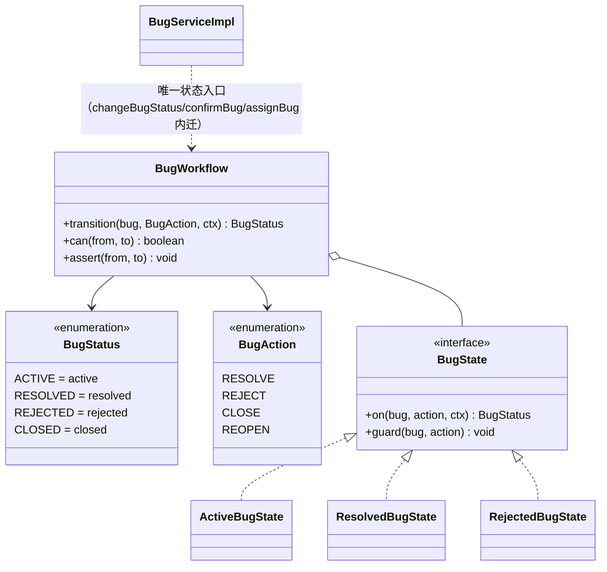

# 软件测试平台——缺陷管理模块重构方案

**文档版本**：V1.0
**日期**：2026-09-12
**状态**：起草中

---

## 1. 引言

### 1.1 范围

缺陷管理域覆盖：缺陷生命周期与状态流转、附件、操作日志、缺陷聚类（AI）、看板/列表/详情。
本方案与 `03-功能测试域重构方案` 的域化共用包结构，与 `06-AI 能力域` 共同处理 AI 聚类解耦。

### 1.2 与既有文档关系

缺陷状态机语义以 `docs/详细设计/` 缺陷管理文档为准；调整状态机必须先走文档闸门。

---

## 2. 现状与问题

### 2.1 规模事实

| 层 | 文件/行数 | 说明 |
| --- | --- | --- |
| Service | `BugServiceImpl`(557)、`BugAttachmentService(Impl)` | 状态流转/查询/附件/日志 |
| Entity | `Bug`、`BugAttachment`、`BugLog` | 3 |
| 前端 | `BugListPage.vue`(914)、`BugDetailPage.vue`(955)、`BugCreatePage.vue`(662)、`BugClusterPanel.vue`(798)、`bugClusterChart` | 大型页面 |
| AI | `AiBugClusteringTaskHandler`(508) | 聚类任务处理 |
| 测试 | ≈0 | 暗区 |

### 2.2 已证实耦合

`BugServiceImpl` 直接 import `service.ai` 与 `service.apitest`（与 `03` 同源）。缺陷状态流转与 AI 聚类结果之间存在隐式写回。

### 2.3 问题清单

| 编号 | 问题 | 风险 |
| --- | --- | --- |
| B1 | 缺陷状态机（`active/resolved/rejected/closed` 四态）只有 `isValidTransition` 布尔方法（`BugServiceImpl`:268），散在方法内 if 拦截 | 边界/回归不可测 |
| B2 | AI 聚类以过程调用内嵌，聚类结果如何映射到缺陷不确定/不可审计 | 与 `06` 联动 |
| B3 | 三个大型页面（列表/详情/创建）共 2500+ 行，逻辑重复（状态渲染、附件、日志） | 可维护性 |
| B4 | `BugClusterPanel`(798) 与 `CaseMindMap` 等图谱类组件疑似共享画布逻辑未抽象 | 重复 |
| B5 | 本域测试 ≈0 | 需 P0 特征先行 |

---

## 3. 目标结构

```
service/domain/bug/
  BugService(port)
  BugWorkflow            # 状态机（open→processing→resolved→reopened→closed）
  BugAttachmentService / BugLogService
  BugQueryService        # 列表/看板查询
service/domain/bug/ai/   # 仅端口消费：订阅 BugClusteredEvent（实现移入/依赖 ai 端口）
web/src/pages/project/bug/   # 列表/详情/创建页抽 composables + 子组件
```

### 3.1 设计模式应用（骨架级）

> 本模块把 **缺陷状态机（State，真实四态）** 作为完整落点。真实事实：`Constants.BugStatus` 为 `active/resolved/rejected/closed` 四态（注释口径「ACTIVE → RESOLVED → CLOSED，重开：RESOLVED/CLOSED → ACTIVE」；旧模型的 `processing/reopened` 仅 `status_change` 日志兼容）；`BugServiceImpl` 已有一张 `isValidTransition` 四态表（:268/:517-527）——**状态机雏形已存在，重构把它从"布尔方法"提升为"可单测状态集合"**。

#### 3.1.1 缺陷状态机 → State（完整骨架）

**现状（破）**：`isValidTransition(from,to)` 布尔方法 + 各处 `if (CLOSED.equals(...))` 拦截（编辑 :188、确认前置需 `ACTIVE` :405、改派拒 `CLOSED` :429）；迁移合法性只以"布尔返回值"表达，无法逐边断言、无法编排动作副作用（确认/改派/重开）。

**目标（立）**：



**迁移矩阵**（初稿表源自 `isValidTransition` 现状（`BugServiceImpl`:268·:517-527），**逐格以 P0 特征测试冻结为最终口径**）：

| from \ to | RESOLVED | REJECTED | CLOSED | ACTIVE |
| --- | --- | --- | --- | --- |
| `ACTIVE` | ✓（resolve） | ✓（reject） | ?（P0 冻结） | — |
| `RESOLVED` | — | ?（P0） | ✓（默认闭环） | ✓（重开，注释口径） |
| `REJECTED` | — | — | ?（P0） | ✓（重新激活，P0） |
| `CLOSED` | — | — | — | ✓（重开，注释口径） |

**接口骨架**：
```java
public interface BugWorkflow {
    BugStatus transition(Bug bug, BugAction action, ActionContext ctx);   // 值班守卫+副作用回调
    boolean can(BugStatus from, BugStatus to);                             // 迁移矩阵查询
    void assertTransition(BugStatus from, BugStatus to);                   // 非法跃迁抛 BusinessException（C3）
}
public interface BugState {
    BugStatus on(Bug bug, BugAction action, ActionContext ctx);
    void guard(Bug bug, BugAction action);   // 确认/改派/编辑的权限与前置断言
}
```

> 对齐：`BugStatus` 枚举值=落库串（`active/resolved/rejected/closed`），**不改存储格式**（C5）；`status_change` 日志兼容旧值不回归。

**ArchUnit 断言**：`domain/bug` 中 `setStatus(...)`/`changeBugStatus` 分支仅存在于 `BugWorkflow` 及其状态实现。

#### 3.1.2 AI 解耦 → Observer（事件）+ 端口（骨架）

**现状耦合点（真实）**：`BugServiceImpl` import `service.ai.vector.AiEmbeddingWriteService`（:26），在 `afterCommit` 回调 `handleBugChanged(bug)`（:174 创建/:244 更新/:285 关闭删向量）——向量写侧以**事务提交后直连**方式挂在缺陷域上（`service.apitest` 无依赖）。

**目标（立）**：缺陷域只发布事件，AI 侧订阅消费。
```java
public record BugChangedEvent(UUID bugId, BugChangeOp op) {}   // op = CREATED|UPDATED|CLOSED
// 发布端：BugServiceImpl afterCommit → publish(BugChangedEvent)
// 消费端：service/ai（或 domain/bug/ai）订阅 → AiEmbeddingWriteService.handleBugChanged（语义与现状一字不差）
```
> 事件化保持"事务提交后"时序（`afterCommit`），黄金测试锁 `handleBugChanged` 输入/输出字节；与 `06` 共用事件规范同一试点。

#### 3.1.3 其余落点（接口签名级）

| 模式 | 目标落点 | 骨架/约定 |
| --- | --- | --- |
| Decorator（现有） | `BugLog` 操作日志 | 沿用 `@AuditOperation`（`entityType="Bug"`）或现有 `BugLogService`，不新增；
| Command | AI 聚类任务（`AiBugClusteringTaskHandler` 实施 `AiTaskHandler`） | 沿用 `AiTaskHandler{type(), execute(task)}`（Command+Registry 已存在于 `06`），不另造；补幂等键 |
| CQRS 读模型 | 列表/看板查询 | `BugQueryService` 只读查询 + 过滤规格参数（现状 `getBugPage(...)` 已扁平，仅域化落位） |
| Hook + Compound Components | 前端 `BugListPage`(914)/`BugDetailPage`(955) | `useBugForm`/`useBugAttachments` + `BugStatusTag`（复用状态映射，与 `08` 协同） |
| 复合组件/插槽 | `BugClusterPanel`(798) 画布 | 3 次复制达标再抽 `CanvasShell`（与 `08` 一致，不提预设） |

## 4. 重构步骤

1. **P0 特征测试**：创建→指派→解决→重开→关闭、附件上传/删除、日志写入，≥10 条分支开启基线。
2. **抽 `BugWorkflow`**：状态机纯函数化，覆盖非法跃迁与权限分支。
3. **AI 解耦**：`BugServiceImpl` 对 `service.ai` 的直接调用改为 `BugClusteredEvent` 订阅（写回语义保持不变），与 `06` 试点共用事件规范。
4. **apitest 依赖收敛**：对 `ProjectModule`/接口引用的依赖走端口。
5. **域包落位**：`service/project/Bug*` → `service/domain/bug/`（与 `03` 同步迁移）。
6. **前端拆分**：`BugListPage`/`BugDetailPage`/`BugCreatePage` 抽 `useBugForm`/`useBugAttachments`/`BugStatusTag` 等；`BugClusterPanel` 与图谱画布评估合并（≥3 处复用再抽）。

## 5. 验收标准

- [ ] P0 缺陷特征测试全绿；`BugWorkflow` 分支全覆盖
- [ ] `domain/bug` 对 `service.ai`/`service.apitest` 实现 import 为 0
- [ ] `BugServiceImpl` ≤ 250 行；三个页面各自 ≤ 500 行
- [ ] 聚类结果映射路径可审计（事件 + 日志）

## 6. 风险与依赖

| 风险 | 缓解 |
| --- | --- |
| 状态机语义与产品预期不符 | 先特征冻结现状，语义调整走文档闸门+产品确认 |
| 聚类事件化导致结果延迟可见 | 保持同步写回或短补偿，黄金测试锁定 |
| 与 `03` 域化并行冲突 | 与 `03` 同一 migration 分支，按 bug→review 顺序 |

## 7. 工作量粗估

| 活动 | 估值 |
| --- | --- |
| P0 特征测试 | 2–3 人日 |
| `BugWorkflow` + 服务拆分 | 3–4 人日 |
| AI 聚类解耦（与 `06` 分摊） | 2–3 人日 |
| 前端页面拆分（与 `08` 分摊） | 4–5 人日 |

---

**文档结束**