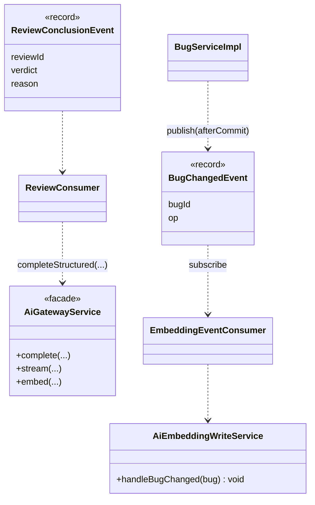

# 软件测试平台——AI 能力域重构方案

**文档版本**：V1.0
**日期**：2026-09-12
**状态**：起草中

---

## 1. 引言

### 1.1 范围

AI 能力域覆盖：助手会话（assistant/chat）、模型网关与 Provider、配置中心、向量检索、任务调度、各业务域的 AI 能力（用例生成、需求分析、评审、聚类、推荐）与统计/支撑能力。
本方案的目标是**把"横向侵入各域的过程调用"改为"以端口/事件接入的横向能力"**，AI 自身按子域内聚。

### 1.2 与既有文档关系

AI 行为（提示词、模型参数、SSE 帧、向量维度）以 `docs/详细设计/` AI 相关文档为准；调整协议/模型配置必须先走文档闸门。

---

## 2. 现状与问题

### 2.1 规模事实（实测）

| 子包 | 文件数 | 说明 |
| --- | --- | --- |
| `assistant` | 16 | 助手编排、SSE 流 |
| `support` | 15 | 支撑能力（工具/函数注册、上下文、白名单等，需进一步盘点） |
| `gateway` | 9 | 网关与配置（`AiGatewayServiceImpl`、`AiConfigServiceImpl` 416） |
| `bug` | 7 | 缺陷聚类（`AiBugClusteringTaskHandler` 508） |
| `recommend` | 7 | 计划/用例推荐（`AiPlanOrderRecommendServiceImpl` 413 等） |
| `provider` | 6 | `OpenAiCompatProvider`(428) 等 |
| `chat` | 6 | `AiAssistantChatServiceImpl`(502) |
| `review` | 5 | 评审 AI |
| `vector` | 5 | `AiVectorSearchServiceImpl`(406) |
| `casegen`/`task` | 4 + 4 | 用例生成 / 任务框架 |
| `requirement` | 2 | 需求 AI |
| `stats`/`model` | 1 + 1 | 统计 / 模型 |
| Controller | 9 | 散布在 `controller/admin|workspace|project` |

### 2.2 问题清单

| 编号 | 问题 | 风险 |
| --- | --- | --- |
| G1 | **横向侵入**：`RequirementServiceImpl`/`BugServiceImpl`/`TestReviewServiceImpl` 直接 import `service.ai` | 域改动波及 AI（R2） |
| G2 | **Provider/模型配置在页面与网关双重表达**：`AiConfigPage`(1360) + `AiConfigServiceImpl`(416) | 配置漂移、密钥暴露面（与 `01`/`07`） |
| G3 | **任务处理线程模型不透明**：`AiBugClusteringTaskHandler`(508)/`AiReviewCheckTaskHandler`(349)/`task` 框架，异步边界与失败补偿不明确 | 结果丢失/重复 |
| G4 | `support` 15 文件职责未文档化 | 认知成本 |
| G5 | 会话/SSE 与 WebSocket 协同（`useAiStream`）与商务域生命周期无关联 | 扩展不稳 |
| G6 | 测试较多（30+）但集中在基础组件，跨域集成路径缺覆盖 | 解耦后需集成回归 |

---

## 3. 目标结构

```
service/ai/
  port/            AiInference(port) / AiEmbedding(port) / AiTaskDispatcher(port)
  gateway/         AiGateway + ProviderRegistry + AiConfigService(唯一配置权威)
  provider/        内置 Provider 适配（openai-compat…）
  assistant/       会话编排 + SSE
  vector/          向量检索
  support/         工具注册/上下文/白名单（补文档）
各业务域：
  domain/*/ai/     仅依赖 service/ai/port + 订阅领域事件（不改写域核心）
```

规则：**业务域不得 import `service.ai` 具体实现类，只可依赖 `service.ai.port` 与事件。**

### 3.1 设计模式应用（骨架级）

> 本模块与 01–05 不同：**多处模式已真实存在**（`AiGatewayService`=Facade、`OpenAiCompatProvider`=唯一 Adapter、`ProviderPresetRegistry`=元数据 Registry、`AiTaskHandler`=Command 分发）。本节原则是**显式化认领已有形状 + 只补齐真实缺口**，禁止再造第二套（YAGNI）。

#### 3.1.1 域解耦 → Observer（领域事件）+ 端口（完整骨架）

**现状耦合点（真实）**：`BugServiceImpl` 直接 import 并 `afterCommit` 调用 `AiEmbeddingWriteService`（`05` §3.1.2 同源）；`TestReviewServiceImpl`/`RequirementServiceImpl` 对 `service.ai` 的点状直连（`00` §2.2 R2 证据）。AI 的运行期抽象已健壮（网关/Provider/任务），问题只在"业务域→ai 实现"的砖墙。

**目标（立）**：



**接口骨架**：
```java
public record BugChangedEvent(UUID bugId, BugChangeOp op) {}         // 与 05 共用
// 消费规则：事件只在 service.ai 内部订阅；域代码只 publish，不引用 AiEmbeddingWriteService
// 反向调用：AI 需要读业务数据时经 AiInference(port) 之外，一律注入既有领域 Service 端口（不 import 实现）
```

**ArchUnit**：业务域对 `service.ai` 除 `port` 外实现类 import = 0；`service.ai` 对业务域实现 import = 0（只允许事件/端口）。

#### 3.1.2 网关 / Provider：既有模式显式化（不新造）

| 现状类 | 已承担模式 | 真实缺口 | 落点 |
| --- | --- | --- | --- |
| `AiGatewayService`（`complete/completeStructured/stream/embed`，"限流→Prompt→Provider→校验→审计"） | **Facade 已存在** | 调用审计未见汇聚 | 保留；补网关侧审计埋点（贯通 `01` 审计消费） |
| `OpenAiCompatProvider`（唯一 Provider，"供应商差异只体现在配置层"） | **Adapter（唯一）已存在** | 无——多 Provider Strategy 与实际"唯一实现+配置驱动"不符 | **明确不抽象多 Provider**（YAGNI 护栏） |
| `ProviderPresetRegistry`（JSON 预置 + `supports(key,scope)` + 参数白名单） | **Registry（元数据）已存在** | 无 | 保留 |
| `AiChatModelService.resolve(modelId)`（回退系统默认、密钥缺失返回 null） | **Strategy（回退）已存在** | 回退链隐式（规则散在方法内） | 抽 `ModelFallbackPolicy`（chat/embedding 各一）显式化回退/降级 |
| `AiChatModelService.list()`（脱敏） | — | `AiConfigPage`(1360) 配置大页面 + 密钥回显风险 | 密钥输入/回显走 `07` 密文规范；页面侧 `useAiConfig`（与 `01` 协同） |

**接口骨架（仅 Fallback 一处）**：
```java
public interface ModelFallbackPolicy {          // Strategy：显式化 resolve() 内的回退/降级链
    ResolvedChatModel resolve(ChatScope scope, UUID modelId);   // 命中启用→使用；缺省/失效→默认；无可用→null
}
```

#### 3.1.3 任务 → Command + Template Method（对齐 `07`，不新造第二套）

**现状**：`AiTaskHandler{type(), execute(task)}`（Command+Registry，`AiTaskService` 按 type 分发）+ `AiAnalysisTask` 实体 + `AiTaskScheduler`（3 处 `@Scheduled`）——**命令/分发已存在**；`AiBugClusteringTaskHandler` 内 `execute()` 按向量/关键词可用性分发（:91）。

**目标（立）**：把 `ApiTestTaskScheduler`（`ScheduledTaskRunner`）+ `AiTaskService` 两套分发统一为**同一 Registry 语义**（`07` §3.1.4），每个任务带幂等键与进度心跳：
```java
public interface DispatchableTask {              // 统一执行入口（与 07 对齐，ScheduledTaskRunner/AiTaskHandler 迁为实现）
    String type();
    Map<String, Object> execute(DispatchContext ctx);
    default String idempotencyKey(DispatchContext ctx) { return ctx.taskId().toString(); }
}
```
> 只做"分发收口"，不改各 handler 业务语义（`AiBugClusteringTaskHandler` 向量/关键词分支保持）。

#### 3.1.4 其余落点（接口签名级）

| 模式 | 目标落点 | 骨架/约定 |
| --- | --- | --- |
| Builder | 会话上下文（`AiModels.AiCallContext`/工具/历史组装） | `ContextBuilder` 组合角色/函数/历史；SSE 流沿用现有 `stream()` 帧协议（delta/done/error + ping） |
| Chain of Responsibility | `support` 工具链 | assistant 工具按职责链（解析→校验→调用→回写），可插拔注册（现状 `support` 15 文件职责盘点后决定是否提取） |
| Proxy | 密钥防护 | `SecretMaskingProxy`/输入项 `type=password`，回显掩码、日志脱敏（已含 `secret` 于脱敏清单） |

> 护栏汇总：多 Provider 不抽象（与唯一实现冲突）；回退逻辑唯一归属 `ModelFallbackPolicy`；业务域 0 依赖 `service.ai` 实现；事件消费幂等并保 `afterCommit` 语义。

## 4. 重构步骤

1. **盘支撑**：为 `support` 15 文件与 `task` 框架补齐职责说明；输出 AI 子域依赖图。
2. **试点解耦（与 `03` Review 切片共用）**：定义 `ReviewConclusionEvent`，`TestReviewServiceImpl` 只发布事件；AI 消费者订阅并调用 `AiInference(port)`，写回经既有 Service 端口，行为不变。
3. **配置权威收敛（与 `01` 联动）**：`AiConfigService` 作为唯一配置读写入口，`AiConfigPage` 仅可视化；密钥走 `07` 密文/掩码规范，禁止前端明文回显。
4. **Provider 注册表**：`ProviderRegistry` 接管 Provider 选择/降级/超时，`OpenAiCompatProvider` 等适配统一注册。
5. **任务调度对齐（与 `07`）**：`AiTaskDispatcher` 统一异步提交、重试与幂等键，`AiBugClusteringTaskHandler`/`AiReviewCheckTaskHandler` 迁为 Handler。
6. **ArchUnit**：业务域 → `service.ai` 实现依赖为 0；`service.ai` → 业务域实现依赖为 0（只允许事件/端口）。

## 5. 验收标准

- [ ] 业务域对 `service.ai` 实现类 import 为 0（ArchUnit 断言）
- [ ] Review 解耦试点行为字节一致（P0 基线回归）
- [ ] `AiConfigService` 为唯一配置权威；密钥无明文回显/日志
- [ ] 任务 Handler 均有幂等键与失败补偿测试
- [ ] `support`/`task` 依赖图文档产出

## 6. 风险与依赖

| 风险 | 缓解 |
| --- | --- |
| 事件化导致写回时序变化 | 试点先在 Review 单点、保持同事务；黄金测试锁定结论 |
| Provider 抽象破坏现有模型 | `ProviderRegistry` 仅收口选择逻辑，不改请求体 |
| 与系统管理/安全交叉（配置、密钥） | 与 `01`、`07` 联合排期，安全评审前置 |
| 范围过大 | 只做"端口 + 单点试点"，不重构全部 AI 业务逻辑 |

## 7. 工作量粗估

| 活动 | 估值 |
| --- | --- |
| 子域盘点 + 依赖图 | 2–3 人日 |
| Review 解耦试点（与 `03` 分摊） | 3–4 人日 |
| 配置权威收敛 + 页面拆分（与 `01` 分摊） | 3–4 人日 |
| Provider 注册表 + 任务调度对齐 | 4–6 人日 |

---

**文档结束**