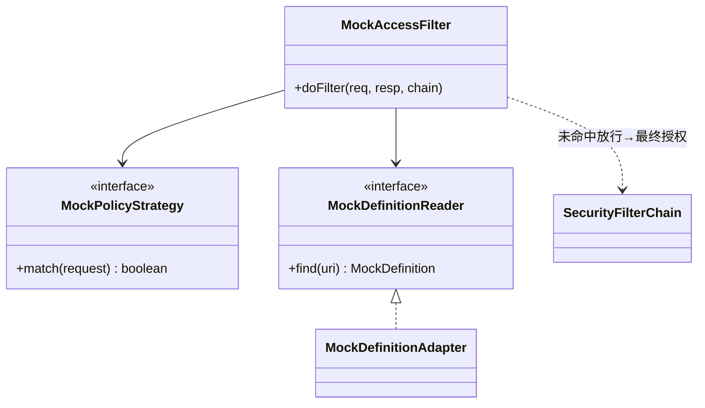

# 软件测试平台——基础设施与框架层重构方案

**文档版本**：V1.0
**日期**：2026-09-12
**状态**：起草中

---

## 1. 引言

### 1.1 范围

本方案覆盖非业务的基础设施：migoo-* 基础框架集成点、安全（JWT/上下文头 C4）、审计、Mock 子系统、WebSocket（Yjs 协同）、调度执行、工程门禁（契约/依赖规则/覆盖率）、DDL 管理。

### 1.2 与既有文档关系

安全与部署以 `docs/spec/security.md`、`docs/spec/deploy.md` 为准。

---

## 2. 现状与问题

### 2.1 规模事实

| 层 | 说明 |
| --- | --- |
| `framework/`（2370 行） | `common`/`config`/`convert`/`interceptor`/`mock`(726)/`security`/`util`/`audit` + `ApiErrorLogFrameworkServiceImpl` |
| Migoo | `migoo-spring-boot-starter-{common,web,security,mybatis,redis,websocket}` 全部继承 |
| 执行引擎 | `ryze`（外部，见 `04`） |
| WebSocket | `service/websocket/DocumentHandler`（Yjs 文档协同） |
| 调度 | `ScheduledTaskRunner`(551)、`Ai*TaskHandler` |
| DDL | 单一 `schema.sql` 2010 行，无版本化迁移 |
| 门禁 | 后端无 checkstyle/spotbugs/jacoco；`scripts/validate.sh` 仅前端较全 |

### 2.2 问题清单

| 编号 | 问题 | 风险 |
| --- | --- | --- |
| I1 | **后端无质量门禁**：无静态检查/Jacoco；`validate.sh --backend` 仅跑测试 | C8"覆盖率达标"在后端不可执行 |
| I2 | **DDL 无版本化**：单 `schema.sql`，多分支并行必漂移 | C5/C9 履行不可追溯 |
| I3 | **Mock 双轨**：`framework/mock/MockAccessFilter`(726) 与主 Security 链并行 | 权限/免登口径割裂 |
| I4 | **上下文头一致性无自动化**：C4 依靠代码审查 | 违规无法拦截 |
| I5 | **单实例内存态假设未显式化**：cancelFlags、草稿态、Yjs 房间 | 部署语义不明（R5） |
| I6 | **审计埋点分散**：`AuditLogAspect` 但无查询消费 | 可观测性弱 |
| I7 | 调度双轨：接口测试定时 + 功能测试计划 + AI 任务三种执行入口 | 重复/不一致（`03`/`04`/`06` 依赖） |
| I8 | Yjs 协同房间生命周期与业务域无关联、无测试覆盖 | 协同故障定位难 |

---

## 3. 目标结构（工程底座）

```
server/
  resources/db/migration/   # V1..Vn 版本化（Flyway 或等价），保留 C5/C9 约束
  archunit/                 # DomainDependencyTest 等依赖断言测试
  jacoco/                   # 聚合报告 + 按域维度展示
framework/
  mock/                     # 保留但收敛：仅表达"免登路径"，权限裁决单一化（security）
  audit/                    # AuditLogAspect 落座 AuditService(port)，增加查询消费
service/websocket/          # 房间生命周期管理 + 文档化
scripts/validate.sh         # 加入：契约 diff、后端静态、ArchUnit
```

### 3.1 设计模式应用（骨架级）

> 本模块把 **Mock 免登链（CoR + 端口防腐）** 与 **调度统一（Command + Registry）** 作为完整落点。骨架锚定现状：`MockAccessFilter implements Filter` 注册于安全链之前（`HIGHEST_PRECEDENCE+100`，命中短路）；调度现实是**两套分发**（`ApiTestTaskScheduler`+`ScheduledTaskRunner` 与 `AiTaskService`+`AiTaskHandler`）——统一 = 收口不重写。

#### 3.1.1 Mock 免登链 → 端口 + 单一裁决（完整骨架）

**现状（破）**：`MockAccessFilter`（`implements Filter`，`order=HIGHEST+100`，匹配命中即短路）构造器直连**业务 Mapper**（`ApiMockDefinitionMapper`/`ApiMockAccessLogMapper`/`ApiInterfaceMapper`）→ `framework/mock` 反向依赖业务域（I3 双重表现：链 + 依赖方向）。

**目标（立）**：mock 命中判定抽为 `MockDefinitionReader` 端口（定义在 `framework/mock` 内，业务侧适配实现）；职责链语义保持 servlet Filter chain（免登首环、命中短路、未命中放行 → **security 链最终裁决**）。



**接口骨架**：
```java
public interface MockDefinitionReader {          // framework/mock 内定义（防腐层）
    MockDefinition find(URI uri);                // 命中返回定义（含免登标识），未命中 null
}
// MockDefinitionAdapter：在 apitest/mock 业务侧实现，注入 ApiMockDefinitionMapper（依赖方向反转：framework ←业务）
public interface MockPolicyStrategy {            // 命中/白名单策略（默认单策略先行）
    boolean apply(HttpServletRequest request);
}
```

**ArchUnit**：`framework/mock` 不 import `service/**`、`repository/**`、`model/**` 业务包（仅经 `MockDefinitionReader` 端口）。

#### 3.1.2 C4 单点 + 调度统一 → Interceptor / Command（骨架）

**C4（I4）**：新增 `ContextHeaderInterceptor` 为**唯一** `X-Active-Workspace` 解析点（`WorkspaceRoleInterceptor` 现状职责并入，避免双读），控制器 JSON 用 URL 上下文参数即门禁拒绝（与 `02` §3.1.1 同一骨架，`07` 提供门禁基线，不重复落类）。

**调度（I7）**：
```java
public interface DispatchableTask {              // Command + 幂等键（06 共用；ScheduledTaskRunner/AiTaskHandler 迁为实现）
    String type();
    Map<String, Object> execute(DispatchContext ctx);
    default String idempotencyKey(DispatchContext ctx) { return ctx.taskId().toString(); }
}
public interface TaskExecutorRegistry {          // Strategy：按 type 注册/分发（收口 ApiTestTaskScheduler 与 AiTaskService 两套）
    void register(DispatchableTask task);
    DispatchOutcome executeByType(String type, DispatchContext ctx);
}
```
> 只收口分发语义，不改既有 `ScheduledTaskRunner` 行为（以特征测试为基线逐个迁出，见 §4 步骤 4）。Progress 心跳与取消检查沿用 `AiTaskHandler` 约定。

#### 3.1.3 审计 / DDL / WS → 显式化与模板化

| 模式 | 现状事实 | 落点 |
| --- | --- | --- |
| Decorator（已有） | `AuditLogAspect`（`@Around` 自定义注解 + `REQUIRES_NEW` 独立事务 + 脱敏） | 认可为样板；补消费端 `AuditQueryService`/`AuditEventConsumer`（`01` §3.1.2 共享） |
| Template Method | `schema.sql`（142KB 单文件，无迁移目录） | DDL MigrationTemplate：迁移脚本统一骨架（up/down 说明、破坏性变更标注、回滚说明）；`db/migration/V{n}__*.sql` 分域 |
| Registry + Observer | WS 房间由 migoo 框架 `WebSocketSessionManager` 管理（握手/token 在框架侧 `/ws/documents/{docId}?token=`） | **不另造房间管理**；`RoomRegistry`（应用侧）仅在需业务事件时登记（加入/离开/离线快照 → `RoomLifecycleEvent`），单实例约束文档化 |
| Facade | migoo-* starter 扩展点 | 业务层统一经现有 `framework/config` 门面接线，禁止直连框架 API |

> 单实例约束（R5）：`ExecutionCancelRegistry`、`RoomRegistry` 类内存态显式标注，见 `docs/架构/` 总述（`00` §3.6 收尾项 R5 显式化）。

#### 3.1.4 反模式对照（护栏汇总）

| 反模式（现状可替换） | 模式落点 | 校验 |
| --- | --- | --- |
| `framework/mock` 依赖业务 Mapper | Port（`MockDefinitionReader`）+ Adapter | ArchUnit 方向断言 |
| 两套调度分发 | Registry 收口 + 幂等键 | 3 个执行入口均有幂等键 |
| 头解析在 Controller + Interceptor 双处 | `ContextHeaderInterceptor` 单点 | C4 门禁拦截 URL 上下文参数 |
| WS 房间生命周期无人记录 | `RoomLifecycleEvent`（Observer，可选增） | 基础测试 + 架构文档声明 |

## 4. 重构步骤

1. **门禁就位（M1）**：
   - `server/pom.xml` 引入 ArchUnit（测试）+ JaCoCo（聚合）；`mvn verify` 集成。
   - `web/` 引入 `openapi-typescript` 生成类型 + CI diff（先"可发现"再"阻断"）。
   - `validate.sh` 串联合并行阶段（契约 diff / 后端静态 / 前端门禁）。
2. **可靠点注入到门禁**：把 C4 上下文头的一致性问题设为 ArchUnit/interceptor 的强制检查点位（新增 `ContextHeaderInterceptor` 断言无 URL 上下文参数）。
3. **DDL 版本化**：`schema.sql` → `db/migration/V1__base.sql`（按域分节），启动迁移；多分支改造冲突后用 `git merge` 时以迁移文件为准。C5/C9 守则不变。
4. **调度统一抽象（配合 `03`/`04`/`06`）**：定义 `DispatchableTask` + `TaskExecutor` 端口，`ScheduledTaskRunner`/`Ai*TaskHandler`/计划执行迁为 Handler，幂等键与重试统一。
5. **单实例假设文档化**：在 `docs/架构/` 总述 + `docs/详细设计/` 对应章节标注内存态边界，Code LV 不隐式扩展。
6. **WebSocket 房间管理**：房间注册/释放、心跳、离线快照策略文档化并补基础测试；与业务文档无关的协议细节留在 `07` 基线。
7. **基建反查 API 清单（springdoc）**：对照 `docs/详细设计/` 已发布接口，把响应结构漂移固定为契约基线。

## 5. 验收标准

- [ ] `mvn verify` 含 ArchUnit + JaCoCo；`validate.sh` 含契约 diff
- [ ] C4 违规（URL/请求体出现上下文 ID）被门禁拦截
- [ ] DDL 迁移脚本就位且破坏性变更走迁移说明（C5）
- [ ] 调度统一端口在 3 个执行入口落地，均有幂等键
- [ ] 单实例内存态在架构文档显式声明
- [ ] 契约基线 diff 检查上线且为 0 漂移

## 6. 风险与依赖

| 风险 | 缓解 |
| --- | --- |
| Flyway 迁移引入部署风险 | 先以只读基线比对（V0 作为 seed），再启用阻塞迁移；`docs/spec/deploy.md` 对齐 |
| Mock 链收敛破坏免登 | 免登路径以测试锁定（现状 golden），权限裁决权单一化 |
| 调度统一影响现有定时任务 | 以既有 `ScheduledTaskRunner` 行为特征测试为基准逐个迁入 |
| 契约 CI 前期噪声大 | 先接"报告"模式（diff 仅提醒）再转"阻断" |

## 7. 工作量粗估

| 活动 | 估值 |
| --- | --- |
| 门禁（ArchUnit/JaCoCo/契约 CI） | 3–5 人日 |
| DDL 迁移化 | 2–4 人日 |
| C4 门禁点位 | 1–2 人日 |
| 调度统一抽象 | 4–6 人日 |
| Mock/审计/WS 收敛 | 4–6 人日 |

---

**文档结束**