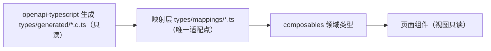
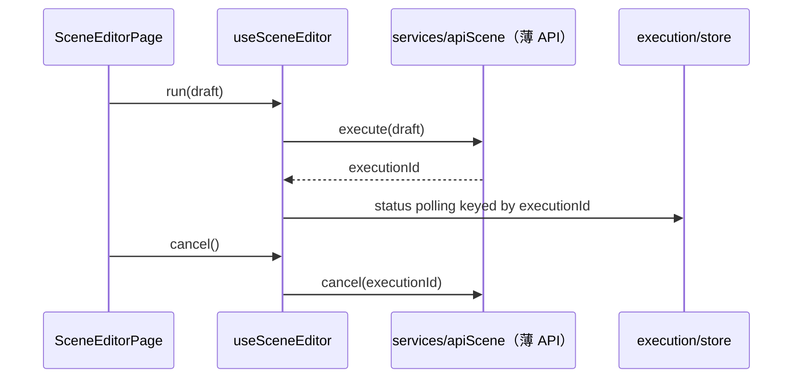

# 软件测试平台——前端工程重构方案

**文档版本**：V1.0
**日期**：2026-09-12
**状态**：起草中

---

## 1. 引言

### 1.1 范围

前端工程覆盖：类型体系、页面级组件结构、组合式逻辑复用、目录归位、前后端契约、状态持久化与构建。目标为 **C1（无 any）/C6（注释只写 why）/C8（覆盖率）** 的可执行落地。

### 1.2 与既有文档关系

页面行为以 `docs/交互设计/`、`docs/详细设计/` 前端章节为准；交互/行为变化先走文档闸门。

---

## 2. 现状与问题

### 2.1 规模事实

| 项 | 事实 |
| --- | --- |
| 类型 | `web/src/types/index.ts` **2403 行**单文件，无 codegen |
| 巨大页面 | `SceneEditorPage` 1846、`AiConfigPage` 1360、`EnvironmentDetailPanel` 1330、`CaseMindMap` 1318、`InterfaceEditorPage` 999、`BugDetailPage` 955、`BugListPage` 914、`DebugResponseViewer` 818、`BugClusterPanel` 798、`AssistantPanel` 792、`SchedulesPage` 770、`FunctionPage` 761、`ReportProcessorsTabs` 706 等 |
| 页面模型 | `pages/project/*.ts` 15 个（debugModel/functionModel/scenesModel/interfacesModel/schedulesModel…） |
| Stores | 5（auth/workspace/project/ai/apiTestingUi/nav…） |
| services | 18 个（薄封装，纯 API） |
| composables | 少量（`useAiStream` 等），未成规模 |
| 契约 | springdoc 在前端无自动生成，类型手工维护 |

### 2.2 问题清单

| 编号 | 问题 | 风险 |
| --- | --- | --- |
| F1 | `types/index.ts` 2403 行 + 手工维护 | 契约漂移（R4）、新页引入错误类型 |
| F2 | 巨大页面内聚 UI/数据/状态/路由编排 | 可读性、并行冲突、测试难（`08` 主要目标） |
| F3 | 页面内 `.ts` 模型（15 个）本质是"页面级 store/logic"却无统一载体 | 与 composables/store 边界不清 |
| F4 | 目录未按子域归位（`pages/project/` 混排） | 检索成本 |
| F5 | 部分组件重复（图谱画布/列表分页/状态渲染） | 低于 3 次规则观望 |
| F6 | 既有 3 处 TS7006 隐式 any（`SceneEditorPage.vue` 1164/1284、`StepEditorDrawer.vue` 277） | C1 红线内欠账 |

---

## 3. 目标结构

```
web/src/
  types/
    index.ts          # 仅重导出
    apitest.ts / bug.ts / plan.ts / review.ts / requirement.ts / workspace.ts / admin.ts / ai.ts / common.ts
  composables/          # 每重要页面级逻辑 1 个 composable（userForm/useTable/useDraft…）
  pages/project/
    interfaces/ scenes/ schedules/ reports/ debug/ environment/ bug/ review/ plan/ requirement/
  components/project/   # 现有公共 UI 继续收敛（满足 3 次规则才抽）
  services/ stores/ utils/ # 维持现有职责边界（不越界）
```

### 3.1 设计模式应用（骨架级）

> 本模块把 **契约防腐断层（Adapter）** 与 **页面逻辑分层（Hook + Compound Components）** 作为完整落点。前端现状事实：`types/index.ts` 2403 行（227 接口 + 40 类型、扁平无 import、DTO 用 `Api*` 前缀）；composables 已有函数式先例（`useAiStream`：`parseSseFrame` 纯函数 + 返回 controller 带 `cancel()`）；页面模型 `pages/project/*.ts` 已是纯模块+常量+工厂风格（如 `debugModel.createTab()`）且多带 `*.spec`；store 为 option 风格；`openapi-typescript` 未安装。

#### 3.1.1 契约防腐 → Adapter（完整骨架）

**现状（破）**：类型全手写且与 springdoc 无生成链路（R4）。**目标（立）**：`openapi-typescript` 生成 `types/generated/`（只读真相源）→ 映射层适配为领域展示类型；生成的 `Api*` 请求 DTO 为传输边界，页面仅消费领域类型。



**骨架**：
```ts
// types/mappings/debug.ts —— 契约漂移的唯一显式适配点（C1 类型安全）
export function toDebugExecReq(d: DebugDraft): ApiDebugExecuteReq {
  return { ...d, variableOverrides: toApiVariables(d.variables) }; // 结构与字段变更在此显式处理
}
```
> 护栏：`types/generated/` 只生成不手改；映射层类型齐全（无 `any`，C1）；契约失败先"可发现"（diff 提醒）再"阻断"。

#### 3.1.2 页面逻辑分层 → Hook + Compound Components（完整骨架）

**现状（破）**：`SceneEditorPage`(1846)/`AiConfigPage`(1360)/`EnvironmentDetailPanel`(1330) 等 god page 将 UI/数据/路由编排/跨组件上下文混写；`useAiStream` 的函数式 controller 先例未被推广。

**目标（立）**：每个重要页面一个 composable（自定义 Hook），返回**只读 controller**（`{ state, actions, dispose }`），子组件以主动注入（`provide/inject`）共享上下文（Compound Components）。

**骨架**（对照 `SceneEditorPage`，与 `04` `useSceneDraft/useSceneEditor/useSceneProcessors` 对齐）：
```ts
export function useSceneEditor(sceneId: Ref<string | undefined>) {
  const draft = ref<SceneDraft>(createSceneDraft());           // 沿用 pages/project 工厂纯函数
  const processors = useSceneProcessors(draft);                // composable 组合 composable
  let disposeFn: () => void
  const { run, cancel } = useExecutionController()
  return readonly({                                           // 组件只读派生，禁止直接 write
    draft, processors, run, cancel, dispose: () => disposeFn?.()
  })
}
```
> 不变式：组件从 composable 取整包状态与动作，仅做视图渲染；逻辑全部可单测（C8）。

**时序（执行→取消）**（对齐 `04` Command）：



#### 3.1.3 页面模型 → Hook 迁移（保留纯函数）

页面内 `pages/project/*.ts`（已有 spec 的纯工厂）**不揉进组件**，转为 composables 的底层纯函数层（如 `debugModel.createTab()` 继续可单测），页面直接消费 `useDebug()`/`useScenes()` 等组合（F3）。

#### 3.1.4 Store 边界审计（Observer 单例边界）

现状 5 store：`auth`/`nav`（全局态，保留）、`ai`/`assistantContext`（会话态，保留）、`apiTestingUi.pendingDebugRequest`（一次性一次性消费，典型**页面态** → 迁 `useDebug`。规则：store 仅保留跨页共享；页面态用 composable（`08` §4.2 步骤 6 不变）。

#### 3.1.5 列表收敛 + 画布复用决策

| 模式 | 落点 | 触发与骨架 |
| --- | --- | --- |
| Hook + Strategy | `useTable`（分页/搜索/批量） | 用户/工作区/项目/成员/Bug 等列表页达 3 次复制 → `useTable({ fetcher, columns, batchOp })`，策略化列渲染 |
| 复合组件 + 插槽 | `CanvasShell`（`CaseMindMap`/`BugClusterPanel` 图谱画布） | 达 3 次复制再抽象；未达保持复制（与 `05` 一致，不预设） |
| Factory | 领域类型工厂（空/示例对象） | 已有 `createTab()` 先例 → 各域补齐 `createXxx()` 纯函数，替代组件内散写字面量 |

> 护栏：`types/generated/` 生成层只读；不引入 Service Locator / 全局可变单例（总体计划 §4.4 护栏 5）；映射层零 `any`（C1）。

## 4. 重构步骤

### 4.1 Phase 1（低风险机械，先行）
1. **类型拆分**：`types/index.ts` 按 §3 拆域，`index.ts` 仅 `export *`，全量 `pnpm typecheck` 为 0 改动的兼容门。
2. **目录归位**：`pages/project/*.ts` 与页面随子域目录移动；路由与 import 不变（`vue-tsc` 兜底）。
3. **清零既有 any 欠账**：修复 `SceneEditorPage.vue:1164/1284`、`StepEditorDrawer.vue:277` 三处 `(v)=>` 隐式 any（C1 红线）。

### 4.2 Phase 4（配合后端，见 `00` Phase 4）
4. **契约生成**：接 `openapi-typescript`，以生成的 `types/generated/` 为事实源，手工类型收敛为领域展示类型（映射层）。
5. **god page 拆分**：
   - `SceneEditorPage`(1846)→ `useSceneDraft`/`useSceneEditor`/`useSceneProcessors`（与 `04` 协同）＋子组件；目标 ≤600 行。
   - `AiConfigPage`(1360)→ `useAiConfig`＋`AiProviderForm`/`AiModelTable`（与 `01`/`06` 协同）。
   - `EnvironmentDetailPanel`/`InterfaceEditorPage`/`BugListPage`/`BugDetailPage` 同法（与 `04`/`05` 协同）。
6. **5 个 store 职责审计**：区分全局态 vs 页面态；页面态迁 composables，store 只保留跨页共享（auth/workspace/project/ai 会话）。
7. **重复组件决策**：图谱画布（`CaseMindMap`/`BugClusterPanel`）、列表 CRUD 基座，按"3 次复制"数据决定是否抽象；不预设。

### 4.3 门禁
8. `pnpm run lint && typecheck && test:unit -- --coverage` 与后端契约 diff 一起进 `validate.sh`；C8 按页面/模型模块维度展示。

## 5. 验收标准

- [ ] `pnpm typecheck` 通过且 `any` 记数 = 0（C1）
- [ ] `types/generated/` 上线，手工类型收敛到映射层；契约 diff CI 为 0 漂移
- [ ] 拆分目标页面 ≤ 600 行；对应 composables 有单测（C8）
- [ ] 目录归位后路由/功能无回归
- [ ] 三个 god page（SceneEditor/AiConfig/EnvironmentDetail）拆分完成并回归

## 6. 风险与依赖

| 风险 | 缓解 |
| --- | --- |
| 类型拆分引发大量 import 改动 | `index.ts` 重导出兼容层先行，`vue-tsc` 门禁 |
| god page 拆分时序长 | 优先拆 3 个目标（SceneEditor/AiConfig/EnvironmentDetail），其余按热度排 |
| 契约生成与现有类型冲突 | 以生成类型为基线，冲突走映射层显式适配（不 waiver） |
| 与后端各 Phase 并行回归 | 前端拆分遵守 API 冻结（后端 Phase 1 契约基线后动） |

## 7. 工作量粗估

| 活动 | 估值 |
| --- | --- |
| 类型拆分 + 目录归位 + any 清零 | 2–3 人日 |
| 契约生成接入 | 2–3 人日 |
| 3 个 god page 拆分 + composables | 8–12 人日 |
| store 审计 + 重复组件决策 | 2–3 人日 |

---

**文档结束**