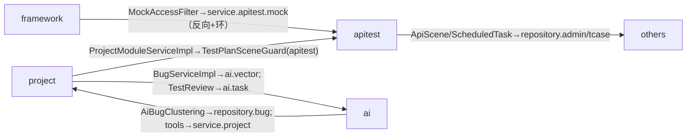

**文档版本**：V1.0
**日期**：2026-09-12
**状态**：起草中

# 软件测试平台——各模块代码问题盘点与实证

> 本篇是 `00-总体重构计划.md` 的**代码实证附录**：以真实代码（文件:行号）为据，逐模块盘点当前结构性问题，并标注"已被对应模块方案覆盖"与"本次探查新发现（方案遗漏）"两类。
> 统计口径：后端 596 个 Java 文件 / 43,157 行；前端 102 个 `.vue` / 41,120 行 + 2403 行 `types/index.ts`。
> 目标读者：重构评审人与各模块方案作者。

---

## 1. 盘点方法与证据规则

- 每条问题附**文件:行号**证据，可 `grep` 复现；不做无证据推断。
- 严重性分级：`高`（架构/耦合/可测性硬伤）｜`中`（规模/重复/一致性）｜`低`（命名/注释漂移）。
- 覆盖标记：`已入方案` = 对应模块方案（`01`–`08`）已列；`新增` = 本次探查新发现，**尚未列入任何方案**。

---

## 2. 全景：跨模块结构性病灶

### 2.1 framework → 业务反向依赖（含环）— 最重缺陷

框架层直接 import 业务层 entity/repository/service，违反"框架与业务无关"分层：

| 位置 | import 证据 |
| --- | --- |
| `framework/mock/MockAccessFilter.java:4-12` | `model.entity.apitest.*`、`repository.apitest.*`、**`service.apitest.mock.*`** |
| `framework/mock/MockAccessConfiguration.java:3-5` | `repository.apitest.*`（3 个 Mapper） |
| `framework/security/UserDetailsBridgeImpl.java:4-12` | `repository.admin.*`、`repository.workspace.*` |
| `framework/interceptor/WorkspaceRoleInterceptor.java:6-9` | `repository.admin.SysRoleMapper`、`repository.workspace.WorkspaceUserMapper` |
| `framework/security/ProjectAccessGuard.java:4-8` | `repository.tcase/workspace.*` |
| `framework/audit/AuditLogAspect.java:5-6` | `model.entity.admin.AuditLog`、`repository.admin.AuditLogMapper` |
| `framework/convert/*.java` | 11 个 `*ConvertMapper` 覆盖 6 域 entity（跨域粘合层） |

其中 `MockAccessFilter → service.apitest.mock.*` 与 `service/apitest 内引用 framework.mock.MockAccessProperties`（`ApiMockServiceImpl.java:3`）构成环：`framework → service/apitest → framework`。

> 严重性：高。已入方案：`07` §3.1.1（Mock 端口化）。**新增**：`framework/convert`、`UserDetailsBridgeImpl`、`ProjectAccessGuard`、`WorkspaceRoleInterceptor` 的反向依赖未入方案。

### 2.2 跨模块依赖方向（实证）

### 2.3 service/project 大包混合 4 域

`service/project`（20 文件/4107 行）同时容纳：项目域（`ProjectServiceImpl`）、模块树域（`ProjectModuleServiceImpl`）、功能测试（`TestCase/Plan/Review/Requirement`）、缺陷管理（`BugServiceImpl` 等）。而 repository/entity/dto 已按 `bug/plan/review/tcase` 拆分，**service 层独独未拆**；`BugController` 在 `controller/project`、`BugServiceImpl` 在 `service/project`、`BugMapper` 在 `repository/bug`，缺陷域从包结构看不到独立边界。

> 严重性：高。已入方案：`00` §2.2 R6；`05`。**变更面**：纯移动包不产生行为差异。

### 2.4 tcase 包被当"模块树"共享承载

`repository/tcase/ProjectModuleMapper.java`（模块树）被 apitest（4 处）、project、bug、websocket 共用；`ProjectModule` 实体本属协作树而非用例域。

> 严重性：中。已入方案：`00` R6 附带。**新增**：无独立归属方案段落。

### 2.5 数据库：单文件 schema.sql、无迁移工具

- migrations 目录不存在；`db/schema.sql` 单文件 **2010 行**（`db/` 下仅此一件）。
- `pom.xml` 无 flyway/liquibase；schema 全量由该文件驱动，无版本化、无增量 DDL、破坏性变更无回滚通道。
- `test_review.status` 有索引（schema.sql:301），评审/缺陷状态**无 CHECK 约束**。

> 严重性：高。已入方案：`07` DDL 迁移（Template）。**新增**：无 CHECK 约束（状态合法性仅靠代码）。

### 2.6 调度双轨

- 5 处 `@Scheduled` 分属 4 类（`AiTaskScheduler` 3 处、`AiEmbeddingWriteServiceImpl:125`、`ApiTestRetentionCleaner:29`）。
- `ApiTestTaskScheduler` 自建 `ScheduledThreadPoolExecutor`（`ApiTestTaskScheduler.java:40-49`）+ cron 解析。
- 按 type 分发**两套**：`ScheduledTaskRunner.java:84-95`（if/else 二分支) vs `AiTaskServiceImpl.java:164-183/201-207`（Map 分发）。

> 严重性：中。已入方案：`07` §3.1.2（`TaskExecutorRegistry`）。

---

## 3. 系统管理（admin / 权限 / 审计）

| # | 问题 | 证据 | 严重性 | 状态 |
| --- | --- | --- | --- | --- |
| A1 | **Controller 直接落库业务**：`SysInitController` 注入 Mapper 并组装实体/加密/插库 | `SysInitController.java:43-63`（`sysUserMapper.insert(admin)` L57） | 高 | 已入方案 C2 |
| A2 | **Controller 做权限过滤业务逻辑** | `AuthController.java:46-50`（authorities stream 过滤） | 中 | 已入方案 C2 |
| A3 | **C4 违例：workspaceId 入 URL** | `AdminRoleController.java:91-95` `@DeleteMapping("/{id}/users/{userId}/workspace/{workspaceId}")` | 中 | **新增**（04/07 只覆盖头解析，未列此违例点） |
| A4 | **审计注释与实现漂移**：`AuditOperation` 注释"第一个 String 参数视为 entityId"，Aspect 实际取"第一个 UUID 参数" | `AuditOperation.java:7` vs `AuditLogAspect.java:76-86` | 中 | **新增** |
| A5 | **审计只写不读**：`@AuditOperation` 14 处引用（`ApiEnvironmentServiceImpl`6/AiChatModel5/…），无查询消费者 | `grep @AuditOperation` | 中 | 已入方案 `01` §3.1.2 |

> 正面证据：系统管理 domain 无 >500 行类（`RoleServiceImpl` 292、`UserServiceImpl` 257），C1 气良好。

---

## 4. 空间管理（workspace）

| # | 问题 | 证据 | 严重性 | 状态 |
| --- | --- | --- | --- | --- |
| W1 | **C4 违例：workspaceId 入请求体** | `WorkspaceController.java:31-37` `setActiveWorkspace(body.workspaceId)`；`WorkspaceDefaultProjectReqDTO.java:10` `projectId` 在 body | 中 | **新增/修正**（`02` 主张拦截 URL 上下文参数，此处为 body，需补） |
| W2 | **C4 死代码 DTO 携带上下文** | `TestCaseCaseListReqDTO.java:16` `projectId` 无任何引用 | 低 | **新增** |
| W3 | **邀请"状态机"无显式对象**：落库仅 `ACTIVE/REVOKED` 两值，过期/超用为运行期推演 | `WorkspaceInvitationServiceImpl.java:65/101` 落库；`:185` `expiresAt.isBefore(now)` 推演；`:247` `incrementUseCount` 原子自增 | 中 | 已入方案 `02` §3.1.2 |
| W4 | 邀请错误码三枚（INVALID/MAX_USES/EXPIRED/REVOKED）语义需与推演逻辑对齐 | `ErrorCodeConstants.java:51-54` | 低 | 已入方案 |

> 正面证据：`X-Active-Workspace` 头传递全库 100+ 处合规（`ApiFunctionController.java:59` 等），违规点集中在收录/成员/默认项目设置，属**稳定性例外**。

---

## 5. 功能测试域（case/plan/review/requirement）

| # | 问题 | 证据 | 严重性 | 状态 |
| --- | --- | --- | --- | --- |
| F1 | **评审巨型类 + 职责混排**（CRUD/快照/记录/AI 联动）：`TestReviewServiceImpl` 860 行/30 方法 | `TestReviewServiceImpl.java:140/679/403/529` | 高 | 已入方案 `03` |
| F2 | **计划巨型类**：`TestPlanServiceImpl` 857 行（CRUD/同步/执行记录/进度） | `TestPlanServiceImpl.java:474/392/578` | 高 | 已入 `00` R7 |
| F3 | **评审状态机无显式对象**：仅 `Constants.Status` 三态 + `COMPLETED` 拦截 | 状态设值 `:159/443-448/500-503`；拦截 `:267/411-413/590-592` | 中 | 已入方案 `03` |
| F4 | **功能测试依赖 apitest 守卫类**（域向反向） | `ProjectModuleServiceImpl.java:14` → `service.apitest.TestPlanSceneGuard` | 中 | **新增**（方案 `03` 未列，`01`/`02` 亦未覆盖跨功能测试域依赖） |
| F5 | **魔法类型字符串未用常量** | `ProjectModuleServiceImpl.java:210` `dto.setType("document")`（已有 `Constants.ModuleType.DOCUMENT`） | 低 | **新增** |

> 测试阶梯：评审三态已确认与落库一致（`new/in_progress/completed`，schema.sql:1577）。

---

## 6. 接口测试域（apitest）

| # | 问题 | 证据 | 严重性 | 状态 |
| --- | --- | --- | --- | --- |
| I1 | **全库最大类四职责混排**：执行+调试+历史+报告 | `SceneExecutionServiceImpl.java` 1205 行/58 方法（`doRun` L175、`debugStep` L696、`pageExecutions` L979、`buildSceneDataset` L551、`cancel` L674） | 高 | 已入方案 `04` §2 R7 |
| I2 | **魔法状态字符串大面积裸写（唯一业务域）**：pending/running/success/failed/error/partial/enabled 无常量 | `SceneExecutionServiceImpl.java:115/154`、`ScheduledTaskRunner.java:100/148/169/218/260/264/330/374/493/497/500/508/510`、`ApiInterfaceServiceImpl.java:151/503`、`ApiScheduleServiceImpl.java:227`、`RyzeResultAdapter.java:29-37` | 中 | **新增/部分**（`04` 未列常量缺失，值域漂移风险） |
| I3 | **循环依赖 framework↔apitest** | 见 2.1（`MockAccessFilter` → `service.apitest.mock`） | 高 | 已入 `07` |
| I4 | **JSON `step` 手工 Map 操作**（类型不安全） | `ApiSceneServiceImpl.java:294/404` `step.put("enabled", ...)` | 中 | **新增** |
| I5 | **api 域反向依赖 admin/tcase repository** | `ApiSceneServiceImpl.java:33-34`、`SceneExecutionServiceImpl.java:23`、`ApiReportServiceImpl.java:11`、`ScheduledTaskRunner.java:17` 等 → `SysUserMapper/ProjectModuleMapper` | 中 | **新增**（依赖方向仅 `08`/`00` 泛化为 R1） |
| I6 | **其他巨型类** | `ApiSceneServiceImpl` 848、`ApiEnvironmentServiceImpl` 764、`ApiInterfaceServiceImpl` 622、`SceneRyzeConverter` 595、`ScheduledTaskRunner` 551、`ApiDebugServiceImpl` 549 | 中 | `00` R7 已列部分 |

> 注意：`Constants.AiTaskStatus`（pending/running/success/failed/cancelled）与 apitest 执行状态**语义混用同一批字符串**（`Constants.java:177-183`），无 apitest 专属常量类——即一处热更可能误伤另一域。

---

## 7. 缺陷管理域（bug）

| # | 问题 | 证据 | 严重性 | 状态 |
| --- | --- | --- | --- | --- |
| B1 | **状态机只有布尔方法**，非法跃迁仅能整体判断、无法逐边断言，且**系统内存在第二张判断表**（编辑/确认/改派三处 if 拦截）与 `isValidTransition` 并行 | `BugServiceImpl.java:517-527` 矩阵；`:188-190/405-407/429-431` 拦截；`BugAttachmentServiceImpl.java:148-149` | 高 | 已入方案 `05` |
| B2 | **状态语义分散三处**：Comment 三态（L25-29）≠ 四态实现 ≠ `STATUS_CHANGE` 可含旧六态（L131-132） | `Constants.java:25-35/131-132` | 中 | **新增**（注释漂移） |
| B3 | **确认前置过严**：仅 `ACTIVE` 可确认；`REJECTED/RESOLVED` 确认被拒（与四态推断相左，需产品确认） | `BugServiceImpl.java:405-407` | 中 | **新增/需 P0 确认** |
| B4 | **AI 向量耦合在业务事务 afterCommit** | import `:26`，`afterCommit` 封装 `:295-306`，调用 `:174/:244/:285`；`AiEmbeddingWriteServiceImpl.java:70-86`（关闭=删向量：`:77-78`） | 高 | 已入方案 `05` §3.1.2 |
| B5 | **`handleBugDeleted` 无调用方**（缺陷无删除入口，向量只能靠 close 删除；与"关闭归档后重开"的死数据风险相关） | `AiEmbeddingWriteServiceImpl.java:89-93`（grep 全仓库仅接口+实现两处） | 中 | **新增** |
| B6 | `BugServiceImpl` 557 行混入 AI/附件/面板职责 | `BugServiceImpl.java` | 中 | 已入 `05`/`00` R7 |
| B7 | **功能测试断言方向与四态矩阵冲突待验证**：`REJECTED→ACTIVE` 在矩阵内（L517-527），但 `confirmBug` 仅收 ACTIVE 前置 → REJECTED 能否重新激活存在**策略与实现二义** | `isValidTransition` 与 `confirmBug` 对照 | 中 | **新增/需 P0 决策** |

> 迁移矩阵（已从 `isValidTransition` 代码确认真实边，替代 `05` §3.1.1 中 `?` 推测格）：

| from \ to | RESOLVED | REJECTED | CLOSED | ACTIVE |
| --- | --- | --- | --- | --- |
| `ACTIVE` | ✓ | ✓ | ✗ | — |
| `RESOLVED` | — | ✗ | ✓ | ✓ |
| `REJECTED` | ✗ | — | ✓ | ✓ |
| `CLOSED` | ✗ | ✗ | — | ✓ |

---

## 8. AI 能力域

| # | 问题 | 证据 | 严重性 | 状态 |
| --- | --- | --- | --- | --- |
| G1 | **业务域 → ai 实现直连**（缺陷/评审/需求三域） | `BugServiceImpl.java:26`、`TestReviewServiceImpl.java:37`、`RequirementServiceImpl.java:23` | 高 | 已入方案 `06` |
| G2 | **ai 域反向直读业务表/服务**：AI 依赖 bug 表、assistant 工具直连各业务 Service | `AiBugClusteringServiceImpl.java:8`、`AiMinderTranslationTool.java:7-8`、`QueryBugsTool.java:6`（及 QueryCases/Plans/Reviews）、`WriteToolExecutor.java:6-7` | 中 | **新增**（`06` 只声明"经 port 反向"，未列工具层 8 条直连点） |
| G3 | **巨型/职能重**：`AiBugClusteringTaskHandler` 508、`AiAssistantChatServiceImpl` 502 | — | 中 | `00` R7 |
| G4 | 评审→AI 任务联动链**只消费不投递**：`TestReviewServiceImpl` 仅 `cancelByTypeAndTarget(REVIEW_CHECK, id)`，CREATE 在 ai 域 | `TestReviewServiceImpl.java:534/538`；grep `createTask` 无命中 | 低 | **新增/待核链路** |
| G5 | 密钥体系健康（AES-256-GCM 加密 + configured/suffix 脱敏回显 + `logParams=false`） | `AiChatModelServiceImpl.java:67-68/253-263`、`AiConfigServiceImpl.java:381-414` | —（正面） | 已入方案 |

---

## 9. 基础设施与跨层框架

| # | 问题 | 证据 | 严重性 | 状态 |
| --- | --- | --- | --- | --- |
| Fw1 | Mock 过滤器巨型 `doFilter`（154 行）+ 直连业务（同 2.1） | `MockAccessFilter.java:64-226` | 高 | 已入 `07` |
| Fw2 | `/ws/**` 列 `permit-all-urls`，握手鉴权全赖外部 `migoo` 框架（`token-header: Authorization` 配置驱动） | `application.yaml:82-89/111`；`DocumentHandler.java:32` `extends MiGooWebSocketHandler` | 中 | 已入 `07`（未列 permit-all 依赖面） |
| Fw3 | WS 业务侧二次鉴权 `projectAccessGuard.isDocumentMember` 手动 `session.close` | `DocumentHandler.java:74-78` | 中 | 已入 `07` |
| Fw4 | `framework/convert` 跨域粘合层积累业务知识 | 11 个 `*ConvertMapper` | 中 | **新增** |
| Fw5 | 审计 Aspect 取参约定注释漂移 | `AuditOperation.java:7` vs `AuditLogAspect.java:76-86` | 低 | **新增** |

---

## 10. 前端工程

| # | 问题 | 证据 | 严重性 | 状态 |
| --- | --- | --- | --- | --- |
| F1 | **9 个 god pages >800 行**（SceneEditorPage 1846 / AiConfigPage 1360 / EnvironmentDetailPanel 1330 / CaseMindMap 1318 / InterfaceEditorPage 999 / BugDetailPage 955 / BugListPage 914 / DebugResponseViewer 818 / BugClusterPanel 798） | `wc -l` 全量 | 高 | 已入方案 `08` |
| F2 | **types/index.ts 2403 行单文件**（227 interface + 41 type，0 enum，无拆分） | `wc -l/grep -c` | 高 | 已入 `08` |
| F3 | **未安装 openapi-typescript**，类型手动维护 | `package.json` devDeps 无 | 中 | 已入 `08` |
| F4 | **列表页模式复制 ≥15 次**（el-table+分页+搜索/批量），无公共 composable | 15 个清单（User/Workspace/Project/Member/Bug/Plan/Review/Reports/Schedules/Requirement/Mocks/Interfaces/Scenarios/Component…） | 高 | 已入 `08`（`useTable` 触发阈值 3 ≪ 15） |
| F5 | **services 各文件复制 get/post/put helper**（14 文件 35 个重复函数） | `services/apiXxx.ts:29-37` 模式 | 中 | **新增**（`08` 未列） |
| F6 | **typecheck 残留 8 处 TS7006**（模板内联回调参数未标类型） | `CasePlanRecommendDialog.vue:219/228`、`MissingPointsPanel.vue:282/291`、`RequirementSelector.vue:120`、`SceneEditorPage.vue:1164/1284`、`StepEditorDrawer.vue:277` | 中 | **扩充**（此前记录 3 处，现 8 处） |
| F7 | **as unknown 断言 322 处**（替代 any，类型安全但断言分散、可读性差） | grep 统计 | 低 | **新增** |
| F8 | **零 provide/inject**，跨组件全 props 层层传递（SceneEditorPage 向 7+ 子组件传 props） | grep `provide/inject` = 0 | 低 | 已入方案 |
| F9 | **页面内 .ts 模型分散 11 个**（scenesModel 342/interfacesModel 305/debugModel 282/aiConfigForm 238…）与对应 vue 紧密耦合 | `pages/**/*.ts` 清单 | 中 | 已入 `08` |
| F10 | composables 仅 4 个（AI 聊天相关为主），无分页/表单/列表通用组合 | `wc -l composables/` | 中 | 已入 `08`；`useTable` 覆盖 F4/F10 |
| F11 | store 5 个中 1 个（`apiTestingUi`）是 option store + 纯页面态（`pendingDebugRequest` 一次性消费） | `stores/apiTestingUi.ts:15` | 低 | 已入 `08` |
| F12 | **三棵树组件结构重复**（ProjectModuleTree 439 / CaseSelectTree 242 / SnapshotModuleTree 101）与三 mindmap 组件（Case 1318/Plan 275/Review 398）相似 | 清单 | 低 | **新增** |

> 正面证据：源码 0 处显式 `any`，C1 执行彻底；API 拦截器统一注入 `X-Active-Workspace/X-Active-Project` 头（`services/index.ts:33-52`），C4 前端合规。

---

## 11. 共性问题汇总与方案覆盖

| 病灶 | 严重性 | 本次新发现点 | 覆盖方案 |
| --- | --- | --- | --- |
| framework→业务反向依赖 + 环 | 高 | `framework/convert`/`UserDetailsBridgeImpl`/`ProjectAccessGuard`/`WorkspaceRoleInterceptor` | `07`（部分）|
| service/project 四域混包 | 高 | — | `00` R6/V `05` |
| 缺数据库迁移 + 无 CHECK 约束 | 高 | 无 CHECK | `07` |
| apitest 超大类与魔法字符串 | 高 | 常量缺失 + AiTaskStatus 串复用 | `04`/`00` R7 |
| 缺陷状态语义三处漂移 | 高 | 注释漂移/confirm 过严/B7 二义 | `05`（补 P0） |
| AI 直连业务（双向） | 高 | 工具层 8 条直连未列 | `06` |
| 前端 god pages/重复列表 | 高 | services helper 35 重复 | `08` |
| typecheck 8 处 TS7006 | 中 | 5 处新增文件 | `08` |
| C4 局部违例（URL/body） | 中 | `AdminRoleController`/`WorkspaceController` | `02`/`07` 增补 |
| 死代码（DTO/方法） | 低 | `handleBugDeleted`/`TestCaseCaseListReqDTO` | 清理项 |

---

## 12. 后续动作建议

1. 将 2–10 各条**新增**项回填对应模块方案（`01`–`08`）问题清单与落点。
2. `05` 迁移矩阵以 §7 表为准（代码实证），并以 P0 特征测试冻结；`B3/B7` 需产品确认（REJECTED/RESOLVED 确认与重启策略）。
3. 常量收敛：为 apitest 建立独立状态常量类，取消与 `AiTaskStatus` 串复用。
4. `pom.xml` 引入 flyway（或等价迁移工具），以 `db/migration` 承载增量 DDL；`schema.sql` 转为初始化一次性脚本。
5. 前端 `services` 的 `get/post/put` helper 收敛到 `index.ts` 统一导出；8 处 TS7006 修复。
6. 死代码清理：`handleBugDeleted`（或补缺陷删除入口）、`TestCaseCaseListReqDTO`。